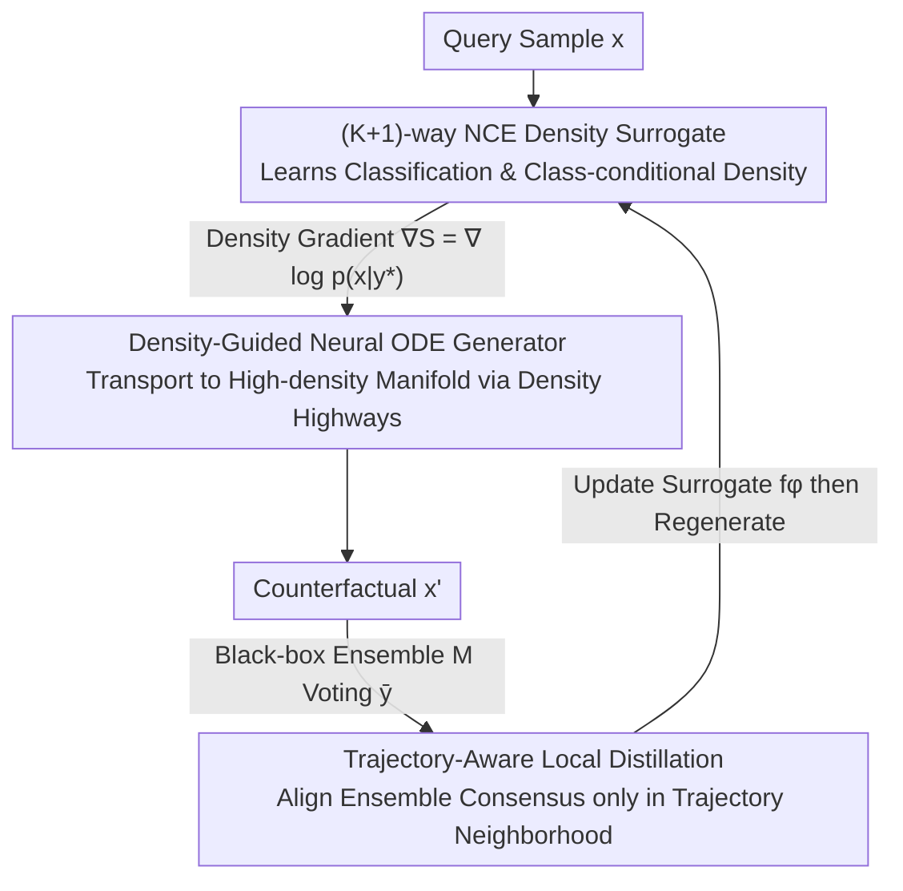

# Density-Guided Robust Counterfactual Explanations on Tabular Data under Model Multiplicity

**Conference**: ICML 2026  
**arXiv**: [2605.30901](https://arxiv.org/abs/2605.30901)  
**Code**: https://github.com/G-AILab/DensityFlow (Available)  
**Area**: Explainability / XAI / Counterfactual Explanations / Tabular Data  
**Keywords**: Counterfactual Explanations, Model Multiplicity, Neural ODE, Noise Contrastive Estimation, Density Guidance

## TL;DR
DensityFlow reformulates "generating Robust Counterfactual Explanations (RCE) under model multiplicity" as an optimal transport problem with density constraints. It uses Noise Contrastive Estimation (NCE) to train a (K+1)-way discriminator that simultaneously learns classification and class-conditional density. It then employs a Neural ODE to transport query samples along density gradients to the high-density manifold of the target class. In black-box scenarios, it aligns the surrogate only via local distillation on generated trajectories, achieving higher cross-model validity with significantly fewer queries than ensemble baselines.

## Background & Motivation

**Background**: Given a query sample and a target class $y^*$, Counterfactual Explanation (CE) seeks the minimum-cost perturbation $x'$ such that $h(x')=y^*$. It is a core tool for algorithmic recourse and high-stakes decision interpretability. Recent trends have shifted from per-sample optimization to generative paradigms, where VAEs, diffusion models, or normalizing flows learn data manifold priors for searching or generating CEs in latent space to ensure feasibility and realism.

**Limitations of Prior Work**: Under Model Multiplicity (MM), multiple "reasonable" classifiers $\{h_j\}$ with similar performance but different decision boundaries lead to the Rashomon effect: a CE valid for one model may fail for another. Generative methods often fail to explicitly distinguish between core high-density regions and long-tail low-density regions. Distance minimization naturally pulls $x'$ toward sparse areas near class boundaries where model disagreement is highest. Conversely, methods that explicitly enforce ensemble consensus (e.g., MILP, rule-based, random retraining) suffer from massive query volumes and poor scalability.

**Key Challenge**: Robustness requires $x'$ to reside in high-density regions of the target class (where model consensus is strong), whereas cost minimization pulls $x'$ toward decision boundaries (which inevitably leads to low-density tails). These objectives are in direct conflict. Furthermore, in black-box scenarios with no gradients, all-space surrogate alignment is impractical.

**Goal**: (i) Explicitly model and utilize the class-conditional density $p(x|y^*)$ to "block" low-density regions within a generative framework; (ii) Achieve boundary alignment between a surrogate and target models using minimal queries under black-box heterogeneous ensembles.

**Key Insight**: Couple "validity + density" into a single surrogate. Use a (K+1)-way NCE to let one network simultaneously perform classification and density ratio estimation, avoiding the overfitting issues of separate density estimators on sparse outliers. Formulate the generation as a Neural ODE where the density signal acts as a potential function within the flow dynamics. Since ODE trajectories are inherently smooth, imposing density constraints at the endpoint is sufficient to pull the entire trajectory.

**Core Idea**: Rewrite robust counterfactuals as density-constrained optimal transport: $\min c(x,x')\ \text{s.t.}\ \mathbb{E}_{\mathcal{M}}[h(x')]=y^*,\ p(x'|y^*)\ge\tau\cdot p_{\text{ref}}$. Use NCE density gradients to guide a Neural ODE along "high-density highways" and perform local distillation only in the trajectory neighborhood for black-box alignment.

## Method

### Overall Architecture
DensityFlow generates a counterfactual $x'$ for a query $x$ that remains valid across a black-box ensemble $\mathcal{M}=\{h_j\}_{j=1}^m$. The core insight is that areas of maximum model disagreement coincide with low-density regions. The system consists of two alternatingly optimized networks: a surrogate network $f_\phi$ that learns both classification and class-conditional density to provide differentiable density signals, and a Neural ODE generator $v_\theta$ that continuously transports $x$ to $x'$ guided by these signals. In black-box settings, an additional local distillation step aligns the surrogate boundary with the ensemble consensus.

### Key Designs

**1. (K+1)-way NCE Density Surrogate: Simultaneous Classification and Density Estimation**

Traditional approaches train a density estimator (VAE/KDE/LOF) separately and "attach" it to the CE optimization. However, sparse outliers can distort density estimates, and density signals may decouple from classification signals. DensityFlow integrates both into a single surrogate $f_\phi:\mathcal{X}\to\mathbb{R}^{K+1}$ trained jointly: the standard $K$ classes use real data $\mathcal{D}_{\text{src}}$, while the $(K+1)$-th class uses "noise samples" sampled from a uniform distribution $p_{\text{noise}}$ (normalized within a $[-C,C]^d$ hypercube). The training objective is $\mathcal{L}_{\text{surrogate}}=-\mathbb{E}_{\mathcal{D}_{\text{src}}}\log\frac{e^{z_y}}{\sum e^{z_j}}-\mathbb{E}_{p_{\text{noise}}}\log\frac{e^{z_{K+1}}}{\sum e^{z_j}}$.

Proposition 4.1 provides the theoretical guarantee: when $p_{\text{noise}}$ is uniform, the optimal solution satisfies $z_k^*(x)-z_{K+1}^*(x)=\log p(x|k)+\text{Const}$. Thus, the logit difference $S(x|y^*)=z_{y^*}(x)-z_{K+1}(x)$ is an unbiased estimate of the class-conditional log-density. Its gradient $\nabla_x S(x|y^*)=\nabla_x\log p(x|y^*)$ serves as the density guidance for the generator. The threshold $\tau$ is controlled by the noise/data sampling ratio $N_{\text{noise}}/N_{\text{data}}$. Since density is learned alongside classification confidence, the surrogate is robust to long tails.

**2. Density-Guided Neural ODE Generator: Natural Avoidance of Low-density Regions**

DensityFlow formulates the generation as a continuous-flow dynamical system rather than performing hard optimization on static constraints. By including the density gradient $\nabla S$ as a drift term in the flow field, the trajectory "naturally avoids" low-density areas. The state is augmented to $\tilde z(t)=[z(t),e(t)]^\top$ with dynamics $d\tilde z/dt=[v_\theta(z,t);\ \|v_\theta(z,t)\|^2]$ and initial value $\tilde z(0)=[x;0]$. Using an adaptive solver like `dopri5`, the endpoint $e(T)=\int_0^T\|v_\theta\|^2dt$ represents the transport kinetic energy, which serves as the proximity cost $\mathcal{L}_{\text{cost}}$.

Due to the inherent smoothness of Neural ODE trajectories, penalizing density only at the endpoint $\mathcal{L}_{\text{den}}(x') = \text{ReLU}(\log\tau-S(x'|y^*))$ is sufficient to keep the entire path within the trust region, saving significant computation. The final objective is $\mathcal{L}(\theta)=\mathcal{L}_{\text{CE}}(f_\phi(x'),y^*)+\lambda_{\text{cost}}c_{\text{cost}}(T)+\lambda_{\text{den}}\mathbb{E}[\mathcal{L}_{\text{den}}(x')]$.

**3. Trajectory-Aware Local Distillation: Minimum Queries for Black-box Alignment**

While the previous steps work in white-box settings, heterogeneous black-box ensembles $\mathcal{M}$ offer no gradients. DensityFlow leverages the fact that trajectories only traverse high-density regions, meaning alignment is only required in these areas. It dynamically samples the generator's endpoint states $\mathcal{D}_\theta=\{(x,\bar y)\mid x\sim z(T)\}$ where $\bar y$ is the ensemble vote, and minimizes a local distillation loss $\mathcal{L}_{\text{dis}}(\phi)=\mathbb{E}_{\mathcal{D}_\theta}[\|\sigma(z_{y^*}(x))-\bar y\|^2]$. This reduces query complexity from the entire space to $O(|\text{trajectory}|)$.

### Loss & Training
The framework uses two-level alternating optimization: the inner loop updates $f_\phi$ (Eq. 3, joint NCE classification and density), and the outer loop updates $v_\theta$ (Eq. 7, validity, cost, and density). In black-box scenarios, local distillation (Eq. 8) is inserted. Hyperparameters: AdamW, $\eta_g=10^{-3}$, $\eta_\phi=10^{-4}$, 800 epochs, batch 64; weights $\lambda_{\text{cost}}\in\{0.2,0.4,0.6\}$, $\lambda_{\text{den}}\in\{0.0,0.1,0.3\}$; noise-to-data ratio $\tau=0.2$; noise hypercube $C=1.2\cdot\max_{\mathcal{D}_{\text{train}}}\|x\|_\infty$.

## Key Experimental Results

### Main Results
Evaluation was performed on 8 datasets (4 synthetic: Moons/Circles/Spirals/Chessboard; 4 real: Adult/Compas/HELOC/Blood) against an ensemble $\mathcal{M}$ of 7 heterogeneous classifiers (KNN, SVM, RF, MLP, XGBoost, CatBoost, TabNet).

| Dataset | Metric | DensityFlow | Strongest Baseline | Gain |
|--------|------|------|----------|------|
| Adult | Validity↑ | 0.901 | 0.752 (BetaRCE) | +0.149 |
| Adult | Cost↓ | 1.597 | 1.916 (Argument) | −0.319 |
| Compas | Validity↑ | 0.729 | 0.610 (Argument) | +0.119 |
| Blood | Validity↑ | 0.662 | 0.509 (Argument) | +0.153 |
| Moons | Validity↑ | 0.997 | 0.991 (CeFlow) | +0.006 |
| Spirals| Validity↑ | 0.972 | 0.943 (Argument) | +0.029 |

Validity is significantly higher on real datasets with lower cost. Synthetic results are nearly saturated, with DensityFlow consistently at the top.

### Ablation Study

| Config | Adult Validity | Blood Validity | Compas Validity | HELOC Validity |
|------|---------------|---------------|----------------|---------------|
| Full DensityFlow | 0.901 | 0.662 | 0.729 | 0.757 |
| w/o Density (No NCE density) | 0.815 | 0.495 | 0.642 | 0.718 |
| w/o Distill (No local distillation)| 0.767 | 0.531 | 0.698 | 0.734 |

### Key Findings
- Removing the density term drops validity by 4–17 percentage points across real datasets, proving NCE density gradients are core to robustness. Small datasets like Blood (748 rows) show the sharpest drop (0.662→0.495).
- Even without local distillation, performance remains superior to most baselines, indicating that NCE guidance alone is highly effective.
- **Query Efficiency**: DensityFlow requires over an order of magnitude fewer queries than Argument or BetaRCE.
- **Threshold Sensitivity**: Low $\tau$ allows the generator to take shortcuts through low-density areas, yielding adversarial-like CEs (low cost, low validity); increasing $\tau$ stabilizes robustness.
- The density score $S(x|y^*)$ shows a clear negative correlation with ensemble uncertainty (Mutual Information), empirically validating the theoretical link in Prop. 4.1.

## Highlights & Insights
- **Unified Classification and Density**: Using (K+1)-way NCE to share a backbone between density estimation and classification is clever. It ensures signals are coupled and avoids the "fragile combination" of separate VAE/KDE estimators.
- **Mutual Synergy**: Density signals refine the search space for distillation, and distillation ensures density gradients point in the correct direction for the black box. This "use cheap signals to narrow expensive budgets" strategy is highly transferable.
- **Leveraging ODE Smoothness**: Using endpoint penalties instead of path integrals leverages the smoothness of Neural ODEs to save computation without sacrificing constraint satisfaction.
- **Reframing Model Multiplicity from Density**: Instead of expensive ensemble consensus checks, the paper insightfully treats "low density = high model disagreement," reducing a multi-model problem to a more efficient single-model density problem.

## Limitations & Future Work
- **Limitations**: (1) Density estimation in very high dimensions is challenging and may conflict with causal feature coupling if features are dropped; (2) Extreme class imbalance or label noise weakens density learning; (3) The focus on "robust explanations" inherently conflicts with "rare case" discovery.
- **Observations**: (1) Experiments are limited to low-to-medium dimensional tabular data (max 23 dimensions); (2) Uniform noise sampling in NCE suffers from the curse of dimensionality; (3) Local distillation assumes ensemble smoothness, which may fail near the non-continuous boundaries of tree-based models like XGBoost.
- **Future Directions**: Apply NCE density to pretrained representation spaces; use adaptive noise generators to handle high dimensions; reverse the "density guidance" to find rare edge cases.

## Related Work & Insights
- **vs CeFlow**: Both use flows, but CeFlow uses Normalizing Flows in latent space without explicit density constraints. DensityFlow uses Neural ODE in the original space with density guidance, improving Adult validity from 0.691 to 0.901.
- **vs Argument**: Argument is a post-hoc selection method that generates multiple candidates and adjudicates consensus. DensityFlow is generative and incorporates robustness into the objective, requiring an order of magnitude fewer queries.
- **Insight**: Many robustness problems (adversarial, OOD, selective classification) can be reduced to "membership in the high-density region of $p(x|y)$." NCE-based differentiable density estimation is an underutilized tool in this regard.

## Rating
- Novelty: ⭐⭐⭐⭐ (NCE + Neural ODE + local distillation for RCE)
- Experimental Thoroughness: ⭐⭐⭐ (Solid comparisons but limited to tabular data)
- Writing Quality: ⭐⭐⭐⭐ (Clear motivation and tight theoretical-empirical coupling)
- Value: ⭐⭐⭐⭐ (Efficient baseline for RCE under MM; open source)

<!-- RELATED:START -->

- **CeFlow**: Duong et al., 2023.
- **Argument**: Jiang et al., 2024a.
- **BetaRCE**: Stępka et al., 2025.

<!-- RELATED:END -->

## Related Papers

- [\[ICLR 2026\] Counterfactual Explanations on Robust Perceptual Geodesics](../../ICLR2026/causal_inference/counterfactual_explanations_on_robust_perceptual_geodesics.md)
- [\[ACL 2025\] Counterfactual Explanations for Aspect-Based Sentiment Analysis](../../ACL2025/causal_inference/counterfactual_explanations_for_aspect-based_sentiment_analysis.md)
- [\[ICLR 2026\] Synthesising Counterfactual Explanations via Label-Conditional Gaussian Mixture Variational Autoencoders](../../ICLR2026/causal_inference/synthesising_counterfactual_explanations_via_label-conditional_gaussian_mixture_.md)
- [\[ICLR 2026\] RFEval: Benchmarking Reasoning Faithfulness under Counterfactual Perturbations](../../ICLR2026/causal_inference/rfeval_benchmarking_reasoning_faithfulness_under_counterfactual_perturbations.md)
- [\[AAAI 2026\] KTCF: Actionable Recourse in Knowledge Tracing via Counterfactual Explanations for Education](../../AAAI2026/causal_inference/ktcf_actionable_recourse_in_knowledge_tracing_via_counterfactual_explanations_fo.md)

<!-- RELATED:END -->
