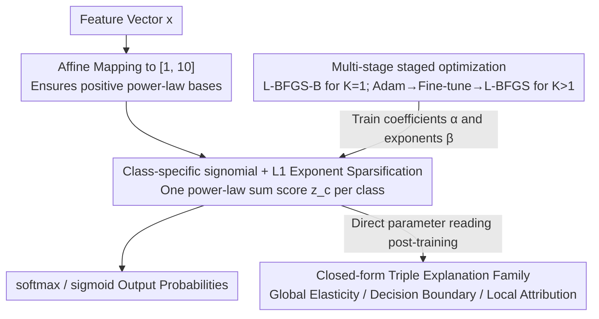

# ECSEL: Explainable Classification via Signomial Equation Learning

**Conference**: ICML 2026  
**arXiv**: [2601.21789](https://arxiv.org/abs/2601.21789)  
**Code**: https://github.com/AdiaLumadjeng/ecsel (Available)  
**Area**: Explainable Machine Learning / Symbolic Regression / Inherently Interpretable Classifier  
**Keywords**: signomial functions, symbolic regression, explainable classification, L1 sparse regularization, closed-form attribution  

## TL;DR
ECSEL employs "one signomial (sum of power-law terms with real exponents) per category + softmax" as a classifier. Combined with L1 sparse regularization and multi-stage optimization, it recovers 95.86% of target equations on symbolic regression benchmarks like AI Feynman with significantly lower compute than SOTA, while achieving parity with XGBoost/MLP on 11 classification datasets. All feature attributions are derived in closed-form from model parameters.

## Background & Motivation

**Background**: Current explainable AI follows two main tracks. One is *post-hoc* explanation (LIME, SHAP, Integrated Gradients), which trains surrogate models to explain black-box predictions. The second is *inherently interpretable* models (decision trees, GAMs, sparse linear models), where the structure itself provides the explanation. Symbolic Regression (SR) represents an extreme form of the second category, directly producing human-readable equations.

**Limitations of Prior Work**: General SR methods (GP, PySR, DGSR, NeSymRes) define the search space as "arbitrary functional forms," leading to two issues: (1) extreme computational cost, with DGSR averaging 612s per equation and frequent timeouts; (2) performance collapse on high-dimensional data. Meanwhile, post-hoc explanations are criticized by researchers like Rudin for being unreliable in high-stakes decision-making.

**Key Challenge**: The expressive power of general SR is *not fully realized by benchmarks*. The authors observed that 45 out of 100 physics equations in AI Feynman are inherently signomials (of the form $\sum_k \alpha_k \prod_j x_j^{\beta_{k,j}}$). Thus, while benchmarks exhibit specific structures, general methods persist in blind searches within an expansive space.

**Goal**: (1) To establish signomials as a formal "model family" rather than just an optimization target; (2) to enable signomials for both SR and classification; and (3) to derive "global/decision boundary/local" explanations *in closed-form* from model parameters without sampling.

**Key Insight**: Signomials are linear functions in log-space ($\log z = \sum_j \beta_j \log x_j + \log\alpha$). Thus, exponents $\beta_{k,j}$ directly encode the "elasticity of features relative to the output" (a concept from economics). This provides a natural "parameters-as-explanation" structure.

**Core Idea**: Replace deep classifiers with "one signomial per class + softmax + L1 regularization," trading training cost for "zero-cost explanations."

## Method

### Overall Architecture

ECSEL addresses the dual tasks of symbolic regression and classification while ensuring that explanations are read directly from parameters rather than through post-hoc sampling. It treats "one signomial function per category + softmax" as the classifier backbone. Given a feature vector $x \in \mathbb{R}^m$, an affine transformation first maps each dimension to $[1, 10]$ (to ensure positive bases for power laws). For each class $c$, the model learns a score function $z_c(x) = \sum_{k=1}^{K} \alpha_{c,k} \prod_{j=1}^{m} x_j^{\beta_{c,k,j}}$ composed of $K$ additive power-law terms. Parameters include coefficients $\alpha_{c,k} \in \mathbb{R}$ and exponents $\beta_{c,k,j} \in \mathbb{R}$, with hyperparameter $K$ controlling complexity. Probabilities are generated via softmax for multi-class or sigmoid for binary problems. For SR, the cross-entropy loss is replaced by MSE. The authors support this structure with the **Signomial Universal Approximation Theorem**: signomials are dense for continuous functions on compact subsets of $\mathbb{R}^m_{>0}$, positioning them as "universal approximators" like neural networks, albeit with a natural bias toward multiplicative power-law relationships.

### Key Designs

**1. Class-specific signomial + L1 Exponent Sparsification: Turning score functions into readable equations with automatic feature selection**

Traditional GAMs and sparse linear models only allow additive combinations, failing to capture multiplicative interactions like PageValue and ExitRate in e-commerce. While black-box models capture these, they require SHAP for explanation. ECSEL gives each class $c$ an independent set of $\{\alpha_{c,k}, \beta_{c,k,j}\}$, making its score function a human-readable "fractional/multiplicative" equation. Significant sparsification is achieved by applying L1 penalties specifically to the *exponents*: the objective $\mathcal{L} = -\frac{1}{N}\sum_i \log p_{y_i}(x_i) + \lambda \sum_{c,k,j} |\beta_{c,k,j}|$ pushes irrelevant feature exponents $\beta$ toward 0. Since $\beta=0$ implies $x_j^0 = 1$, the feature is effectively removed from that term, producing sparse equations. Unlike sparsifying coefficients $\alpha$ (which performs "term selection"), sparsifying $\beta$ enables finer "feature selection" within each term.

**2. Multi-stage staged optimization: Reliable convergence in non-convex exponent space**

While signomials are mathematically elegant, exponents $\beta$ can take any real value, and gradients relative to $\beta$ (of the form $z_{c,k}(x) \cdot \log x_j$) are prone to explosion. Direct optimization with Adam often leads to local minima or divergence. ECSEL uses staged optimization: for $K=1$, the objective is a low-dimensional smooth function solved via L-BFGS-B. For $K>1$, a three-stage strategy is used: (1) Adam with strong L1 for "structure discovery"; (2) reduced L1 for "refinement"; and (3) L-BFGS initialized from the best Adam point for final "polishing," using multi-start with random seeds. Log-domain transformations and feature scaling are applied to ensure numerical stability.

**3. Closed-form Triple Explanation Family: Algebraically deriving global elasticity, decision boundaries, and local attribution**

Methods like SHAP and LIME are slow (KernelSHAP takes 28.5s on OSI) because they use Monte Carlo sampling to approximate quantities that should have analytical forms. ECSEL's log-linear structure allows these to be written in closed-form: (a) **Global Elasticity** $E_{c,j}(x) = \partial \log z_c / \partial \log x_j = \sum_k \frac{z_{c,k}(x)}{z_c(x)} \beta_{c,k,j}$, which simplifies to the constant $\beta_{c,j}$ when $K=1$; (b) **Counterfactuals**—multiplying $x_j$ by $q$ results in a new score $z_c^{\text{new}}(x) = \sum_k q^{\beta_{c,k,j}} z_{c,k}(x)$ without re-prediction; (c) **Decision Boundary Sensitivity** $\partial(z_c - z_{c'})/\partial \log x_j$, which reveals which exponent differences drive inter-class competition; (d) **Local Attribution** leverages the decomposition of $\log z_{c,k}(x)$. The authors formally prove (Theorem 3.2) that ECSEL satisfies seven interpretability properties (G1-G3, D1-D2, L1-L2), elevating "claimed interpretability" to "provable interpretability."

### Loss & Training

Classification uses cross-entropy with exponent L1: $\mathcal{L} = -\frac{1}{N}\sum_i \log p_{y_i}(x_i) + \lambda \sum_{c,k,j} |\beta_{c,k,j}|$. SR uses an MSE version $\mathcal{L}_{\text{SR}} = \frac{1}{N}\sum_i (y_i - z(x_i))^2 + \lambda \sum_{k,j}|\beta_{k,j}|$. $\lambda$ is a critical hyperparameter (e.g., $2 \times 10^4$ for PaySim). Optimization uses L-BFGS-B for $K=1$ and a three-stage Adam/L-BFGS pulse for $K>1$, with hyperparameters tuned via Optuna TPE.

## Key Experimental Results

### Main Results

**Symbolic Regression (45 AI Feynman signomial subsets + Livermore/Jin/Korns/DGSR synthetic sets, 5 random seeds):**

| Method | Symbolic Recovery Rate | Avg Time (s/equation) |
|------|-----------|--------------------|
| NeSymRes | 56% | 126.3 |
| NGGP | 58.54% | 468.7 |
| DGSR (SOTA) | 59.10% | 612.9 |
| **ECSEL** | **95.86%** | **86.4** |

**Classification (11 binary/multi-class benchmarks, 5-fold CV, 3 representative datasets):**

| Dataset | Method | Acc. | F1 | Minority Recall |
|--------|------|------|------|---------------|
| Ilpd | LR | 71.55 | 58.45 | 3.03 |
| Ilpd | XGBoost | 72.41 | 63.03 | 6.06 |
| Ilpd | **ECSEL** | **75.86** | **74.39** | **42.42** |
| Compas | XGBoost | 68.18 | 68.08 | 62.54 |
| Compas | **ECSEL** | **68.47** | **68.36** | **62.82** |
| Transfusion | XGBoost | 80.06 | 78.72 | 38.89 |
| Transfusion | **ECSEL** | 79.33 | 77.95 | **41.67** |

ECSEL ranked first in F1 on 4 out of 11 datasets and maintained a margin of $<1\%$ against the best method on 9 datasets. On ILPD, its F1 was 11.36 higher than XGBoost, with a +36.36 point increase in minority recall.

### Ablation Study / Interpreter Comparison (OSI e-commerce dataset)

| Method | Interpreter | Computation Time (s) | Top-3 Features |
|------|--------|--------------|-----------|
| **ECSEL** | Exact Exponent | **0.1** | PVER, SI, PV |
| LR | LinearSHAP | 0.1 | PVER, Mo, PR |
| LR | LIME | 5.3 | PVER, Mo, PR |
| RF | TreeSHAP | 1.5 | PVER, PV, SI |
| RF | LIME | 32.0 | PVER, PV, ER |
| XGBoost | TreeSHAP | 0.1 | PVER, Mo, SI |
| XGBoost | LIME | 7.7 | PVER, PR, ER |
| MLP | KernelSHAP | 28.5 | PVER, PR, Mo |

### Key Findings

- **Structural Dividend**: While DGSR is SOTA on the AI Feynman subset, its lack of functional constraints limits recovery to 59%. ECSEL’s signomial prior increases recovery by 37 points while reducing time to 1/7.
- **Minority Recall Advantage**: On ILPD, XGBoost's minority recall was only 6%, whereas ECSEL reached 42%. On PaySim (fraud detection), ECSEL’s F1 exceeded the previous DSC SOTA.
- **Zero-cost Explanation**: Increasing training time slightly (5.5s vs 0.1s for LR) eliminates the need for SHAP/LIME inference. While KernelSHAP took 28.5s for test set explanations on MLP, ECSEL took 0.1s.
- **Domain Meaningful Equations**: On PaySim, $\beta_{\text{OBO}} = 1.42$ revealed that fraudsters super-linearly target high-value accounts—an actionable insight unavailable from black-box models.

## Highlights & Insights

- **"Parameters as Explanation"**: Unlike GAMs that require plotting partial dependence, ECSEL converts all explanations into algebraic expressions of $\beta$ and $z_{c,k}$. Theorem 3.2 formalizes this into "provable interpretability."
- **Benchmark Observation to Algorithm Design**: The method was derived from the empirical observation that nearly half of physics benchmark equations are signomials. This suggests that general methods may be "over-generalizing" structured tasks.
- **Exponent-based L1 Regularization**: Applying L1 to exponents rather than coefficients is a critical detail. This allows for feature selection within each power-law term, providing finer granularity than traditional "term selection."

## Limitations & Future Work

- $K$ must be specified in advance, which is a constraint in SR. The model still struggles with high-degree univariate polynomials compared to specialized methods.
- Limitations: (1) Requires features $>0$, necessitating affine mappings; (2) for $K>1$, local attribution reverts to first-order linearization; (3) multi-stage optimization hyperparameters affect equation conciseness; (4) discrete/categorical features are not elegantly handled.
- Future work: Learning $K$ dynamically, constraining exponents to rational subsets for exact SR, and exploring "Mixture-of-signomials."

## Related Work & Insights

- **vs DGSR/NeSymRes/gplearn**: These search vast spaces for arbitrary functions, whereas ECSEL explores the signomial subspace. This trade-off yields a 37 point recovery gain at the cost of excluding non-power-law structures (e.g., $\sin$).
- **vs GAM / Neural Additive Models (NAM)**: GAMs/NAMs are additive and miss multiplicative interactions. ECSEL is multiplicative, naturally handling elasticity in economic or biological features. 
- **vs SHAP/LIME**: Post-hoc methods estimate via sampling; ECSEL provides closed-form identities that are faster, deterministic, and provable.
- **vs KAN (Kolmogorov-Arnold Networks)**: KAN uses learnable splines and symbolification; ECSEL provides a more constrained but naturally closed-form subspace.

## Rating
- Novelty: ⭐⭐⭐⭐ Reframing signomials as a model class is a significant insight, though individual components are known.
- Experimental Thoroughness: ⭐⭐⭐⭐⭐ Comprehensive comparison across 45 SR equations, 11 classification datasets, and multiple interpreters.
- Writing Quality: ⭐⭐⭐⭐ Clear structure with rigorous naming/numbering of properties.
- Value: ⭐⭐⭐⭐⭐ Provides a true inherently interpretable classifier for high-stakes scenarios with practical evidence from PaySim and OSI.

<!-- RELATED:START -->

## Related Papers

- [\[ICML 2026\] Outcome-Aware Spectral Feature Learning for Instrumental Variable Regression](outcome-aware_spectral_feature_learning_for_instrumental_variable_regression.md)
- [\[ACL 2026\] Learning Invariant Modality Representation for Robust Multimodal Learning from a Causal Inference Perspective](../../ACL2026/causal_inference/learning_invariant_modality_representation_for_robust_multimodal_learning_from_a.md)
- [\[ICLR 2026\] Self-Supervised Learning from Structural Invariance](../../ICLR2026/causal_inference/self-supervised_learning_from_structural_invariance.md)
- [\[ICLR 2026\] Learning Robust Intervention Representations with Delta Embeddings](../../ICLR2026/causal_inference/learning_robust_intervention_representations_with_delta_embeddings.md)
- [\[CVPR 2026\] Retrieving Counterfactuals Improves Visual In-Context Learning](../../CVPR2026/causal_inference/retrieving_counterfactuals_improves_visual_in-context_learning.md)

<!-- RELATED:END -->
