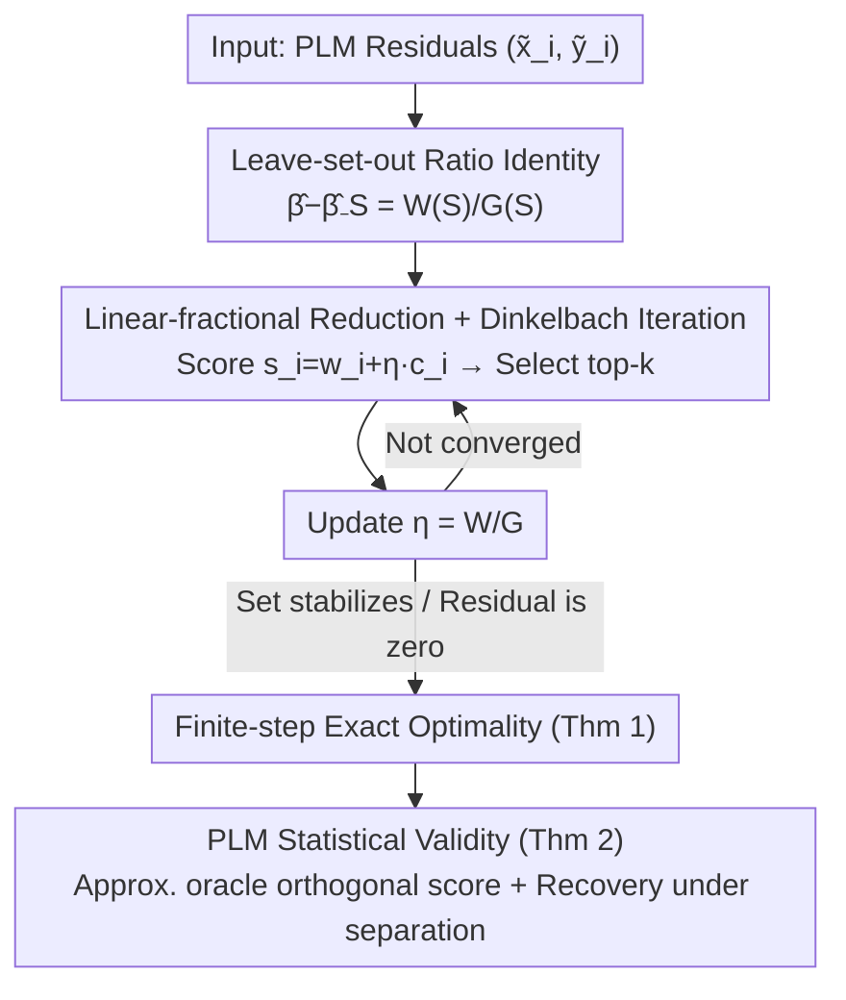

# Finding Most Influential Sets

**Conference**: ICML2026  
**arXiv**: [2606.05919](https://arxiv.org/abs/2606.05919)  
**Code**: https://github.com/nk027/findingMIS  
**Area**: Causal Inference / Data Attribution / Influence Diagnostics / Combinatorial Optimization  
**Keywords**: Most Influential Sets (MIS), Leave-set-out, Linear-fractional Optimization, Dinkelbach’s Method, Partially Linear Models, Neyman Orthogonality  

## TL;DR
Finding the size-$k$ subset whose removal maximizes the change in a specific estimator (Most Influential Set, MIS) originally required exhaustive search over $\binom{n}{k}$ subsets, which is computationally intractable. This paper proves that as long as the leave-set-out effect can be expressed in a **linear-fractional** form, MIS selection collapses into a sequence of "top-$k$ selection" subproblems. Utilizing Dinkelbach’s method, the approach achieves $\mathcal{O}(n)$ per iteration with finite-step termination, providing full theoretical guarantees ranging from "exact optimality for fixed inputs" to "statistical recovery of the oracle set" within partially linear models.

## Background & Motivation
**Background**: Most Influential Sets (MIS) are subsets of training data whose removal causes the maximum change in a target quantity (e.g., regression coefficients, treatment effects, or predictions). They serve as target-specific diagnostic tools for interpretability, accountability, fairness, robustness auditing, and data filtering, revealing which small group of samples drives a particular conclusion.

**Limitations of Prior Work**: Accurately finding an MIS requires finding the maximum over $\binom{n}{k}$ subsets. The combinatorial explosion makes this intractable even for moderate datasets—for instance, evaluating $\binom{100}{10}$ sets at 1 microsecond per set would take approximately 200 days, increasing to 4.5 years for $k{=}11$. Consequently, existing literature either settles for robust estimation to "control" worst-case sensitivity rather than "identifying" it, or relies on first-order approximations (Influence Functions) and greedy heuristics.

**Key Challenge**: Progressive set influence is **fundamentally different** from individual influence because samples interact—some reinforce each other, while others mask each other. Two phenomena arise: **joint influence**, where individual points seem unimportant but their collective removal causes a surge; and **masking**, where certain points appear irrelevant in single-point rankings until other points are removed. Consequently, first-order approximations like Influence Functions miss joint and masking effects; greedy selection (adding the point with the largest marginal gain) implicitly assumes that optimal sets for different $k$ are nested. However, marginal gain depends on both the numerator and denominator of the current set, so early erroneous choices can permanently exclude the optimal size-$k$ set.

**Why Greedy Fails (Counter-example)**: When searching for a 3-MIS with $n{=}5$, point A might have the largest individual influence. A greedy algorithm selects A first, locking the search into sets containing A. However, the true optimal 3-MIS consists of the three leftmost points—individually, they are less influential than A, but their influence is joint and masked. Only when all three are removed do they accumulate enough score and remove sufficient curvature to flatten the fit line. Once greedy picks A, it can never find this optimal set.

**Goal**: To create an efficient and exact size-$k$ MIS selection algorithm for targets where the leave-set-out effect can be written as a ratio, and to bridge the gap from "optimization exactness for fixed inputs" to "statistical recovery of the true oracle influence set."

**Key Insight**: The leave-set-out effect is a **linear-fractional function** of the removed set. Thus, combinatorial search can be transformed into a one-dimensional parameter optimization using Dinkelbach’s method. Each subproblem reduces to "selecting the top-$k$ scores," leading to $\mathcal{O}(n)$ per iteration and finite-step convergence.

## Method

### Overall Architecture
The method is built on the Partially Linear Model (PLM), the standard setting for Debiased Machine Learning (DML): $y_i = x_i\beta_0 + g_0(Z_i) + u_i$, where $x_i$ is the treatment, $\beta_0$ is the parameter of interest, and $g_0$ is an unknown nuisance function of covariates $Z_i$. Using first-stage residualization (Robinson estimator), $y$ and $x$ are subtracted by their fits on $Z$ to obtain residuals $\tilde y_i, \tilde x_i$. The second stage is an OLS of $\tilde y$ on $\tilde x$: $\hat\beta = \sum \tilde x_i\tilde y_i / \sum \tilde x_i^2$. The methodology follows this chain: first, prove that the change in $\hat\beta$ after removing set $\mathbb{S}$ follows an **exact finite-sample ratio identity** (not an Influence Function approximation) where the numerator is the removed score and the denominator is the remaining curvature. This linear-fractional ratio allows the use of Dinkelbach's method to transform the $\binom{n}{k}$ search into an iteration of "selecting top-$k$ scores for a scalar $\eta$ + updating $\eta$". It is then proved that this iteration reaches the global optimum for fixed inputs in finite steps. Finally, for the statistical problem where inputs are estimated, Neyman orthogonality is used to show that the empirical target consistently approximates the oracle orthogonal score target, enabling exact recovery of the oracle set under separation conditions.

### Key Designs

**1. Leave-set-out Ratio Identity: Expressing set change as an exact Score/Curvature ratio**

This is the pivot of the paper. For fixed residualized inputs $(\tilde x_i, \tilde y_i)$, the exact change in the coefficient after removing set $\mathbb{S}$ is:

$$\hat\beta-\hat\beta_{-\mathbb{S}}=\frac{\sum_{s\in\mathbb{S}}\tilde x_s\tilde r_s}{\sum_{t\notin\mathbb{S}}\tilde x_t^2},\qquad \tilde r_s := \tilde y_s-\hat\beta\tilde x_s.$$

Derived directly by subtracting the contribution of $\mathbb{S}$ from the full-sample normal equations, this is an **exact finite-sample deletion identity, not an infinitesimal Influence Function approximation**. This is crucial, as influence functions are inaccurate for extreme or collective influences. The identity decouples two mechanisms: the numerator $W(\mathbb{S})=\sum_{s\in\mathbb{S}}\tilde x_s \tilde r_s$ is the "score" removed from the normal equations, and the denominator $G(\mathbb{S})=\sum_{t\notin\mathbb{S}}\tilde x_t^2$ is the "residual curvature" remaining after deletion. A set is influential either because it removes a large batch of scores with consistent directions or because it removes high-curvature samples, amplifying the remaining score imbalance. While $W$ and $G$ are additive, their ratio is not—this non-additivity explains joint influence and masking mathematically: the marginal gain of removing $i$, $\frac{W+w_i}{G-c_i}-\frac{W}{G}$, depends on the accumulated score of $\mathbb{S}$.

**2. Linear-fractional Reduction + Dinkelbach Iteration: Compressing combinatorial search into "top-$k$ selection"**

Directly maximizing the ratio over $\binom{n}{k}$ is infeasible. The paper maps influence components to weights $w_i:=\tilde x_i \tilde r_i$ and costs $c_i:=\tilde x_i^2$, with $T:=\sum_i c_i$. The objective $\frac{W(\mathbb{S})}{G(\mathbb{S})}=\frac{\sum_{i\in\mathbb{S}}w_i}{T-\sum_{i\in\mathbb{S}}c_i}$ is a standard linear-fractional form (assuming $G(\mathbb{S})>0$). Using Dinkelbach’s method, an auxiliary parameter $\eta$ is introduced to define $F_\eta(\mathbb{S})=W(\mathbb{S})-\eta G(\mathbb{S})=\sum_{i\in\mathbb{S}}(w_i+\eta c_i)-\eta T$. Since $-\eta T$ is independent of $\mathbb{S}$, **maximizing $F_\eta$ for a fixed $\eta$ is equivalent to selecting the top-$k$ samples with the highest scores $s_i(\eta)=w_i+\eta c_i$**. Algorithm 1 alternates between selecting the top-$k$ set $S^{(t+1)}$ based on the current $\eta$ and updating $\eta^{(t+1)}=W(S^{(t+1)})/G(S^{(t+1)})$ until the set stabilizes. Each iteration takes $\mathcal{O}(n)$ time and memory. Algorithm 2 further tracks the entire MIS path for $k=1,\dots,K$, using the previous size’s solution $\eta^\star$ as a warm start.

**3. Finite-step Exact Optimality: Upgrading heuristics to "exact algorithms with global optimality certificates"**

Theorem 1 provides the guarantee: for fixed $n, k\in\{1,\dots,n-1\}$, and assuming $G>0$, Algorithm 1 terminates in at most $M+1$ ratio updates (where $M$ is the number of possible ratio values) and returns the global optimum $\mathbb{S}_k^{\max}\in\arg\max_{|\mathbb{S}|=k} W(\mathbb{S})/G(\mathbb{S})$. Setting $H(\eta)=\max_{|\mathbb{S}|=k}\{W-\eta G\}$, the sign of $H(\eta)$ matches $\eta^\star-\eta$. Each iteration strictly increases the ratio until the Dinkelbach residual is zero, ensuring termination at the global optimum.

**4. Statistical Validity of PLM: Linking "exact input" to "oracle set recovery"**

In reality, $w_i, c_i$ are estimated using nuisance functions. Theorem 2 addresses whether the empirical problem approximates the oracle problem based on true residuals $v_i, u_i$. Defining the oracle first-order orthogonal target $Q_n^{\mathrm{or}}(\mathbb{S})=\sum_{i\in\mathbb{S}}\phi_i$ where $\phi_i=v_iu_i/\mu_v$, and the empirical target $\widehat Q_n(\mathbb{S})=n(\hat\beta-\hat\beta_{-\mathbb{S}})$. Under Assumption 2 (uniform residualization score stability), the paper proves $\sup_{|\mathbb{S}|=k}|\widehat Q_n(\mathbb{S})-Q_n^{\mathrm{or}}(\mathbb{S})|=o_p(1)$. If the oracle maximizer is unique and the separation gap $\Gamma_{n,k}$ is sufficiently large, then $\Pr(\hat{\mathbb{S}}_k^{\max}=\mathbb{S}_k^{\mathrm{or}})\to 1$. Neyman orthogonality is the key, allowing first-stage errors to be "orthogonalized" out.

### Loss & Training
This is not a learning-based method; "optimization" refers to combinatorial ratio maximization. Implementation uses size-$k$ heaps in R + Rcpp. First-stage nuisances are estimated via Gradient Boosting with 5-fold cross-fitting.

## Key Experimental Results

### Main Results
Accuracy and scalability are verified in simulations, and MIS trajectories are used as diagnostic tools in random experiments and penalized regressions.

Accuracy and Scalability (Simulation):

| Evaluation | Setting | Result |
|------|------|------|
| Accuracy vs. Brute-force/Greedy | $n\leq 50, k\leq 3$, various noise designs | Algorithm 1 **always** hits the brute-force optimum; Greedy **sometimes** fails |
| Residualized Recovery | Implanted influence points + masking | Influence values close to oracle; strong sets recovered reliably |
| Runtime | Univariate regression, $n=10^6, k=10^5$ | Median wall-clock <200 ms; Dinkelbach median 3 iterations |

### Runtime and Feasibility Comparison

| Comparison | Scale | Time / Conclusion |
|------|------|------|
| Brute-force | $\binom{100}{10}$ / $\binom{100}{11}$ | ~200 days / ~4.5 years — Infeasible |
| Ours (Alg 1) | $n=10^6, k=10^5$ | <200 ms |
| Greedy (Kuschnig 2021) | $n=10^4, k=50$ | ~200 ms (smaller scale for same time) |
| Influence Functions | Various $(n, k)$ | Ours is typically faster by an order of magnitude |
| Extreme Stress Test | $n=10^9, k=10^8$ | ~15 minutes (memory limited) |

### Key Findings
- **Exact Algorithm wins over Greedy**: In tens of thousands of Monte Carlo trials, Algorithm 1 consistently matched the brute-force optimum, while Greedy failed on joint/masking designs.
- **Feasibility expanded by orders of magnitude**: Exact MIS calculation that previously took months is now done in milliseconds, scaling up to $n=10^9$.
- **Value Consistency ≠ Set Consistency**: Strong influence sets are recovered reliably; weak separation only guarantees approximation of the influence value, not the exact set identity.
- **Warm start + Finite termination** makes tracking the entire MIS path almost free and extremely robust to initial values.

## Highlights & Insights
- **Leveraging an Exact Identity**: The leave-set-out ratio identity is exact for finite samples, allowing the "linear-fractional → Dinkelbach → finite-step optimal" logic to be rigorous.
- **Reducing Combinatorial Search to $\mathcal{O}(n)$**: The realization that the subproblem reduces to a simple top-$k$ selection is the defining insight.
- **Dual Guarantees**: The paper combines combinatorial optimization (Theorem 1) with semi-parametric inference (Theorem 2) via Neyman orthogonality.
- **Migratable Framework**: Any estimator with a leave-set-out effect as a linear-fractional ratio can use this Dinkelbach reduction.

## Limitations & Future Work
- **Dependence on Linear-fractional Structure**: The method requires the target to be a ratio of sums; non-linear targets or complex estimators may lack this structure.
- **Scalar Treatment**: The primary focus is on scalar treatment and single-coefficient targets; multi-dimensional extensions are cited but not fully detailed in the main text.
- **Set Recovery Requires Separation**: If multiple oracle sets have nearly identical values, the identity of the selected set may be unstable.
- **Statistical Dependence on First-stage**: The guarantees rely on the first-stage nuisance functions converging sufficiently fast.

## Related Work & Insights
- **vs. Influence Functions**: Influence functions are first-order approximations that fail for joint/masking effects; **Ours** is exact and often faster.
- **vs. Greedy Selection**: Greedy assumes nested optimal sets; **Ours** proves the MIS path can be non-nested and provides a global optimum.
- **vs. Robust Estimation**: Robust estimation "controls" sensitivity; **Ours** "identifies" specific influential subsets—these are complementary.

## Rating
- Novelty: ⭐⭐⭐⭐⭐ High. Clever use of Dinkelbach's for MIS.
- Experimental Thoroughness: ⭐⭐⭐⭐ Strong. Exhaustive MC trials and extreme scalability.
- Writing Quality: ⭐⭐⭐⭐⭐ Excellent. Logical flow is clear, and counter-examples are intuitive.
- Value: ⭐⭐⭐⭐⭐ Significant. Makes previously impossible exact diagnostics practical.

<!-- RELATED:START -->

## Related Papers

- [\[ICCV 2025\] A Visual Leap in CLIP Compositionality Reasoning through Generation of Counterfactual Sets](../../ICCV2025/causal_inference/a_visual_leap_in_clip_compositionality_reasoning_through_gen.md)
- [\[AAAI 2026\] I-CAM-UV: Integrating Causal Graphs over Non-Identical Variable Sets Using Causal Additive Models with Unobserved Variables](../../AAAI2026/causal_inference/i-cam-uv_integrating_causal_graphs_over_non-identical_variable_sets_using_causal.md)
- [\[ICML 2026\] Density-Guided Robust Counterfactual Explanations on Tabular Data under Model Multiplicity](density-guided_robust_counterfactual_explanations_on_tabular_data_under_model_mu.md)
- [\[ICML 2026\] An Odd Estimator for Shapley Values](an_odd_estimator_for_shapley_values.md)
- [\[ICML 2026\] Investigating Memory in Model-Free RL with POPGym Arcade](investigating_memory_in_model-free_rl_with_popgym_arcade.md)

<!-- RELATED:END -->
