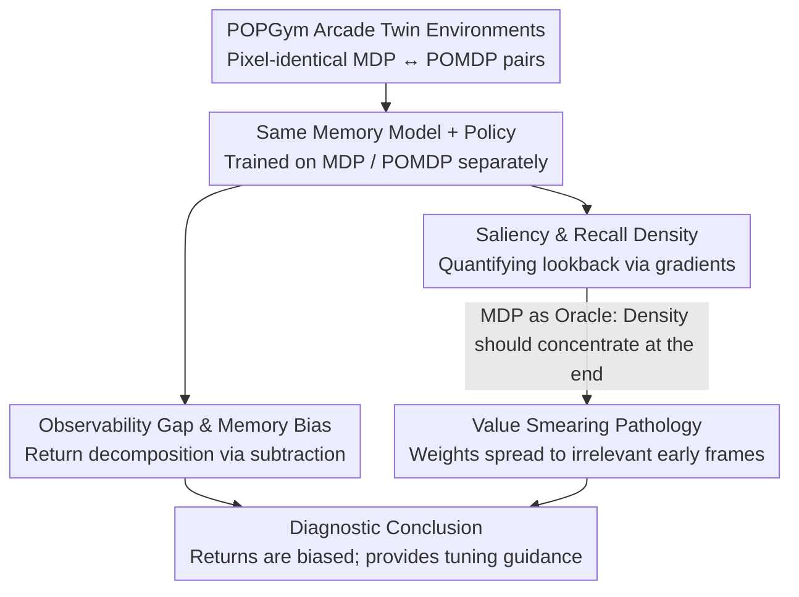

# Investigating Memory in Model-Free RL with POPGym Arcade

**Conference**: ICML2026 Spotlight  
**arXiv**: [2503.01450](https://arxiv.org/abs/2503.01450)  
**Code**: https://github.com/bolt-research/popgym-arcade  
**Area**: Reinforcement Learning / POMDP / Memory Models  
**Keywords**: model-free RL, POMDP, memory models, recurrent state, value smearing  

## TL;DR
This paper argues that comparing RL memory models solely by returns is unreliable. The authors construct a GPU-accelerated MDP/POMDP "twin" benchmark, POPGym Arcade, and propose four diagnostic tools: Observability Gap, Memory Bias, pixel saliency, and Recall Density. These tools reveal a "value smearing" pathology: memory models incorrectly distribute value credit across irrelevant historical observations, causing a single OOD observation to persistently contaminate policies through the recurrent state.

## Background & Motivation

**Background**: In Partially Observable Markov Decision Process (POMDP) scenarios, the standard approach is to prepend a memory model $f$ (RNN/GRU/LRU/Transformer/SSM, etc.) to the policy. This model compresses the historical trajectory $\mathbf{x}_t=(o_0,a_0,\dots,o_t)$ into a fixed-size latent Markov state $\hat{s}_t$, which the policy $\pi(\cdot\mid\hat{s}_t)$ then uses for interaction. The de facto standard for evaluating memory models is comparing average returns across several POMDP tasks.

**Limitations of Prior Work**: Deep RL is extremely sensitive to model scale, observation size, task difficulty, optimizers, and random seeds. Memory models themselves introduce additional parameters, optimization challenges, and regularization effects. Consequently, differences in returns between two memory models on POMDPs often fail to distinguish whether the gain comes from "alleviating partial observability" or from these "irrelevant confounding factors." Literature even shows paradoxical results where adding memory improves MDP performance but hurts POMDP performance.

**Key Challenge**: The scalar return simultaneously carries both "policy capability" and "memory capability," entangling the two. To honestly evaluate memory, one must be able to isolate the impacts of "adding memory" and "changing to partial observability" while keeping other variables constant. This requires a set of **truly homologous** MDP/POMDP twin tasks that share the same observation/action spaces to allow the reuse of the same model.

**Goal**: (1) Construct an MDP/POMDP twin benchmark sharing $(\Omega, A)$; (2) Provide metrics to "decompose" returns into Observability Gap and Memory Bias; (3) Develop tools to visualize and quantify memory usage patterns; (4) Use these tools to diagnose what existing memory models actually learn.

**Key Insight**: By applying an observation function $O$ to an underlying MDP, one can obtain a paired POMDP. If the state/observation spaces are identical at the pixel level, the same network can be trained on both respectively, allowing the "difficulty introduced by partial observability" to be naturally isolated. By calculating gradients of $Q$-values or policies with respect to historical observations, one can quantify "which historical frames influence the current decision."

**Core Idea**: Use MDP/POMDP twin tasks to decompose returns into **Observability Gap** (loss due to partial observability) + **Memory Bias** (side effects of introducing memory). Use **gradient-based Recall Density** to measure which time steps the memory actually "looks back" at, characterizing the "value smearing" pathology.

## Method

### Overall Architecture
The paper addresses "how to honestly evaluate RL memory models." The scalar return merges "capability to infer states" with "side effects of the module itself." POPGym Arcade solves this by creating pixel-identical MDP/POMDP twin environments for each task. The same network can be trained on both, and the difference in returns isolates the "difficulty of partial observability." On this foundation, two sets of diagnostic tools are added: one decomposes returns into Observability Gap and Memory Bias by subtracting paired returns, and the other quantifies which frames are recalled by calculating gradients w.r.t historical observations. The latter reveals "value smearing" when MDP results are used as an oracle.

### Key Designs

**1. POPGym Arcade Twin Environments: Making MDP and POMDP pixel-comparable**

For the first two metrics to be statistically meaningful, the MDP and POMDP must share the same observation/action spaces and optimal return upper bounds. The authors decompose each task state into a low-dimensional hidden Markov state $\tilde{s}\in\tilde{S}$ (e.g., mine locations in MineSweeper) and a pixel Markov state $s\in S$ (e.g., cell pixels with numbers). Both satisfy the Markov property. Applying an observation function $O:\tilde{S}\mapsto\Delta(\Omega)$ generates the POMDP twin. Since all tasks are unified to the same $S=\Omega$ ($128{\times}128{\times}3$ or $256{\times}256{\times}3$ pixels) and a 5-action space, a single network is reusable across tasks. 10 base environments × 12 difficulty/observation combinations provide 120 tasks, categorized by Reward Memory Length as $O(k)$ (solvable by windowing) or $O(n)$ (requiring true memory). The suite is implemented in JAX with a pure GPU pipeline, achieving throughput $\sim 10^4$ times faster than CPU Atari, enabling a full sweep across 7 models × 5 seeds × 120 configurations.

**2. Observability Gap and Memory Bias: Decomposing returns into comparable signals**

When only looking at returns, "GRU outperforming Transformer by 5 points" could be due to better state inference, easier optimization, or better parameter scaling. The authors decompose this via two paired subtractions: Fix model $f$ and policy $\pi$, run on twin MDP and POMDP, subtract to get $\text{Gap}(f,\pi,\mathcal{M},\mathcal{P})=J(f,\pi,\mathcal{M})-J(f,\pi,\mathcal{P})$, which characterizes the loss from $f$ failing to reconstruct Markov states. Then, fix the MDP and compare policies with and without memory to get $\text{Bias}(f,\pi,\mathcal{M})=J(f,\pi,\mathcal{M})-J(\pi,\mathcal{M})$, capturing side effects like optimization difficulty and implicit regularization. In experiments, the Bias difference between MinGRU and GRU (0.05) was comparable to their Gap difference (0.05), meaning return rankings can be completely flipped by Bias.

**3. Pixel Saliency and Recall Density: Quantifying lookbacks**

To see the information flow at the trajectory level, given trajectory $\mathbf{x}_n$, $\hat{s}_0,\dots,\hat{s}_n$ are computed. Gradients of $Q$ (or $\pi$) w.r.t each historical observation frame are taken, passing through the CNN and memory model via the chain rule:

$$\sum_{a_n}\lVert\nabla_{o_t}Q(\hat{s}_n,a_n)\rVert_2^2=\sum_{a_n}\Big\lVert\frac{\partial Q}{\partial \hat{s}_n}\frac{\partial \hat{s}_n}{\partial o_t}\Big\rVert_2^2$$

Stacking these as heatmaps visualizes which frames are "remembered." To avoid "cherry-picking," the authors normalize the $L_1$ gradient norm to get empirical density $\delta_Q(\mathbf{x}_n,t)$, mapping time $t$ to normalized time $\tau=t/n\in[0,1]$. Averaging across trajectories yields Recall Density $\mathbb{E}_{\pi,f}[\delta_Q(\mathbf{x},\tau)]$. Using MDP as an oracle, $V^*(s_t)$ theoretically depends only on the current state; hence density should concentrate at $\tau\to 1$. If significant weight is assigned to early segments ($\tau<0.66$), it provides direct evidence of "value smearing."

### Loss & Training
The primary algorithm is PQN (Gallici et al., 2024), a JAX-based TD($\lambda$) Q-learning implementation, avoiding confounders like target networks and replay buffers. Critical conclusions are verified with PPO and DQN in the appendix. All memory models include a **skip connection** bypassing the memory, allowing the policy to "ignore" memory in MDPs—a design that makes the observed "smearing" more convincing. 7 memory models are tested: Transformer, Recurrent Linear Transformer, Linear TTT, Gated DeltaNet, MinGRU, GRU, and LRU SSM.

## Key Experimental Results

### Main Results

| Evaluation Dimension | Tool | Key Findings |
|----------|------|----------|
| Aggregated across 7 models/all tasks | Return / Gap / Bias Triad (Fig. 5) | Memory Bias varies significantly between models and is consistently negative; the Bias difference between MinGRU/GRU (0.05) is similar in magnitude to the Gap difference (0.05)—rankings can be reversed by Bias. |
| Sweep of Layer $L$ and Hidden $H$ (BattleShip/MineSweeper) | Gap–Bias Pareto Front (Fig. 6) | Increasing Layers $L\uparrow$ usually worsens Bias; increasing Hidden $H\uparrow$ usually improves Gap. These form a Pareto front for capacity selection. |
| Pixel Saliency + Recall Density on MDPs | Fig. 3, Fig. 7 | Theoretically, MDP $V^*(s_t)$ is independent of $s_{t-k}$; density should concentrate at $\tau\in[0.66,1)$. Reality showed significant weights at $\tau<0.66$ across all models/tasks—defining "value smearing." |
| OOD Injection Experiments | Single-frame noise (Fig. 9) + Prefix shuffle (Fig. 10) | A single OOD observation frame significantly disturbs LRU policy $Q$-values and greedy actions. Even with shuffled trajectory prefixes (to exclude CNN confounders), effects persist in BattleShip/MineSweeper (LRU) and CartPole (Transformer). |

### Ablation Study

| Configuration | Key Metric | Description |
|------|---------|------|
| Full GRU / LRU models | Convergence (Fig. 8) | Excludes "value smearing as an artifact of optimization instability." |
| With skip connection | Smear still appears | Shows the policy does not "choose to ignore memory" under MDPs; models truly learn to smear credit to the past. |
| Transformer (No recurrent state) | Affected by prefix shuffle | Illustrates that OOD pollution is not unique to RNNs but a common issue for memory-policy joint solutions under POMDPs. |
| Replication on PPO/DQN | Consistent results | Excludes algorithm-specific effects (on-policy magnitude). |

### Key Findings
- **Value smearing is universal**: In MDPs where $V$ should only depend on current states, all 7 memory models across 10 tasks distributed significant weight to the first 2/3 of the trajectory. This suggests memory-value joint optimization tends to treat "past events fortuitously present in the trajectory" as explanatory variables, overfiting the trajectory distribution.
- **Returns are deceptive; Bias matters**: Relying only on returns leads to contradictory conclusions about whether memory helps or hurts. Bias reveals that memory models carry a net negative effect even without observability issues, implying hidden confounders in prior SOTA comparisons.
- **OOD pollution is the cost of smearing**: Because value is smeared across irrelevant history, a single anomalous observation can alter the policy for a long duration via the recurrent state, posing risks for real-world deployment and offline RL.
- **Interpretable Interventions**: Large Gaps suggest increasing hidden dimension $H$ (reducing state confusion), while highly negative Bias suggests reducing layers $L$ (alleviating optimization difficulty).

## Highlights & Insights
- **"Twins + same-dimension differentials"** is an elegant causal decomposition. It brings confounding factors like parameter count and optimization difficulty to the forefront for quantitative discussion.
- **Using MDP as an oracle** to validate POMDP tools: Validating the expected shape of Recall Density on ground-truth MDPs before defining pathology based on its deviation is a robust experimental paradigm.
- **Transferability to LLMs**: The authors note that if RLHF-tuned LLMs exhibit similar smearing in long-context ICL tasks, it could explain sensitivity to "irrelevant needles." This opens possibilities for using Recall Density tools in LLM diagnostics.

## Limitations & Future Work
- Experiments focus on **pixel model-free RL**. The presence of smearing in model-based RL (e.g., world models) or RL-finetuned LLMs remains to be verified.
- The "best memory model" conclusion depends on the comparison axis (hidden dimension $H$ used here). Switching to parameter count or wall-clock time might change rankings.
- There is no ground-truth credit distribution in POMDPs; currently, smearing is demonstrated via MDP proxies. Future methods to quantify smearing intensity in POMDPs are needed.
- The root cause of value smearing (optimization, overfitting, or capacity) remains a hypothesis.
- Recall Density uses gradient magnitude as a proxy, which might underestimate information flow in models with saturated activations or truncated BPTT.
- POPGym Arcade uses a unified 5-action discrete space; transferability to continuous control (e.g., partial MuJoCo) requires future expansion.

## Related Work & Insights
- **vs Morad et al. (POPGym, 2023)**: POPGym provides CPU POMDP benchmarks and return comparisons. This paper provides GPU twin environments with **paired metrics and gradient-based interpretability tools**, upgrading evaluation from "watching returns" to "causal decomposition."
- **vs Ni et al. (2022, 2024)**: While Ni et al. emphasize controlled experiments, they lack pixel-consistent observation spaces and gradient Recall Density. This work is more systematic in infrastructure.
- **vs Kapturowski et al. (R2D2) & Elelimy et al. (2024)**: These works analyze stale recurrent states or state distributions. Recall Density uniquely provides the direct influence of "input → current decision."

## Rating
- Novelty: ⭐⭐⭐⭐⭐ Upgrades memory evaluation from return-watching to causal decomposition and diagnostic pathology.
- Experimental Thoroughness: ⭐⭐⭐⭐⭐ 7 models × 10 tasks × multiple difficulties × 5 seeds, corroborated across PQN/PPO/DQN.
- Writing Quality: ⭐⭐⭐⭐ Clear logic chain (Benchmark → Metric → Pathology → Consequences), though some figures (Fig. 7) are high-density.
- Value: ⭐⭐⭐⭐⭐ Rewrites the methodology for evaluating memory models and provides a high-throughput JAX twin benchmark.

<!-- RELATED:START -->

<!-- RELATED:END -->

## Related Papers

- [\[CVPR 2025\] Image Quality Assessment: Investigating Causal Perceptual Effects with Abductive Counterfactual Inference](../../CVPR2025/causal_inference/image_quality_assessment_investigating_causal_perceptual_effects_with_abductive_.md)
- [\[ICML 2026\] Density-Guided Robust Counterfactual Explanations on Tabular Data under Model Multiplicity](density-guided_robust_counterfactual_explanations_on_tabular_data_under_model_mu.md)
- [\[AAAI 2026\] Sparse Additive Model Pruning for Order-Based Causal Structure Learning](../../AAAI2026/causal_inference/sparse_additive_model_pruning_for_order-based_causal_structure_learning.md)
- [\[ACL 2026\] Better and Worse with Scale: How Contextual Entrainment Diverges with Model Size](../../ACL2026/causal_inference/better_and_worse_with_scale_how_contextual_entrainment_diverges_with_model_size.md)
- [\[ICLR 2026\] Adjusting Prediction Model Through Wasserstein Geodesic for Causal Inference](../../ICLR2026/causal_inference/adjusting_prediction_model_through_wasserstein_geodesic_for_causal_inference.md)

<!-- RELATED:END -->
