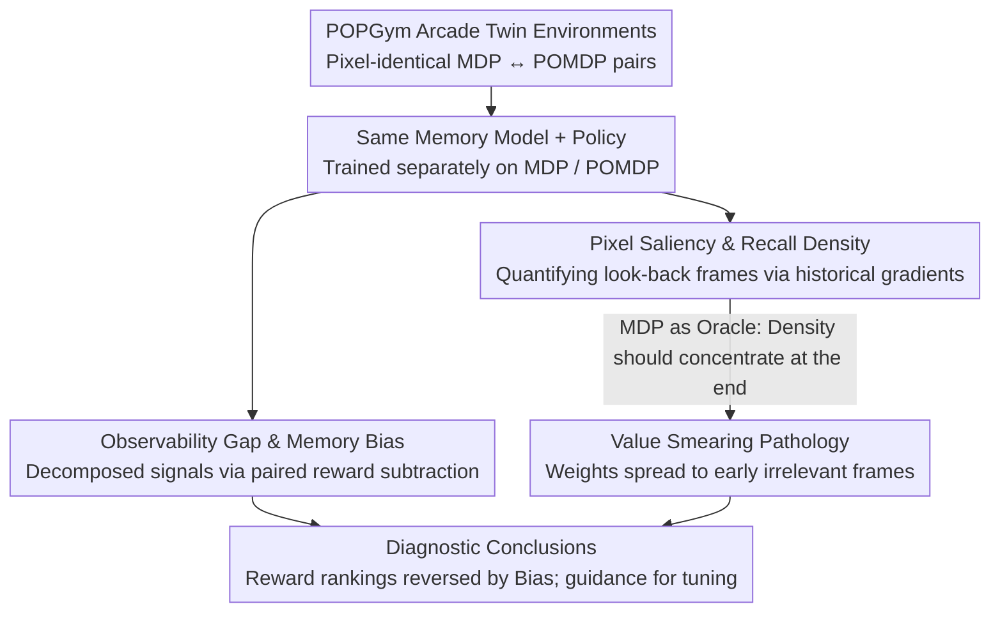

# Investigating Memory in Model-Free RL with POPGym Arcade

**Conference**: ICML2026 Spotlight  
**arXiv**: [2503.01450](https://arxiv.org/abs/2503.01450)  
**Code**: https://github.com/bolt-research/popgym-arcade  
**Area**: Reinforcement Learning / POMDP / Memory Models  
**Keywords**: model-free RL, POMDP, memory models, recurrent state, value smearing

## TL;DR
This paper argues that relying solely on rewards to compare RL memory models is unreliable. The authors construct POPGym Arcade, a GPU-accelerated MDP/POMDP "twin" benchmark, and propose four tools: Observability Gap, Memory Bias, Pixel Saliency, and Recall Density. These reveal a pathology called "value smearing": memory models incorrectly assign credit to irrelevant historical observations, causing a single OOD observation to contaminate policies long-term through the recurrent state.

## Background & Motivation

**Background**: In Partially Observable Markov Decision Process (POMDP) scenarios, the mainstream approach is to prepend a memory model $f$ (RNN, GRU, LRU, Transformer, SSM, etc.) to the policy. This model compresses the historical trajectory $\mathbf{x}_t=(o_0,a_0,\dots,o_t)$ into a fixed-size latent Markov state $\hat{s}_t$, which the policy $\pi(\cdot\mid\hat{s}_t)$ then uses for interaction. The de facto standard for evaluating memory models is comparing average rewards across various POMDP tasks.

**Limitations of Prior Work**: Deep RL is extremely sensitive to model scale, observation size, task difficulty, optimizers, and random seeds. Memory models themselves introduce additional parameters, optimization difficulty, and regularization effects. Consequently, reward differences between two memory models on a POMDP cannot distinguish whether the improvement comes from "mitigating partial observability" or from these "irrelevant confounders." Literature even reports a paradox where adding memory improves MDP performance but degrades POMDP performance.

**Key Challenge**: The reward scalar entangles "policy capability" and "memory capability." To honestly evaluate memory, one must measure the impacts of "adding memory" and "switching to partial observability" independently while keeping other variables constant. This requires a set of **truly homologous** MDP/POMDP twin tasks that share the same observation/action space to reuse the same model.

**Goal**: (1) Construct a dual MDP/POMDP benchmark sharing $(\Omega, A)$; (2) Provide metrics to "decompose" rewards into Observability Gap and Memory Bias; (3) Develop tools to visualize and quantify memory usage patterns; (4) Use these tools to diagnose what existing memory models actually learn.

**Key Insight**: By applying an observation function $O$ to an underlying MDP, one can generate a paired POMDP. If their state/observation spaces are pixel-identical, the same network can be trained on both, naturally isolating the "difficulty caused by partial observability" through the difference in performance. Quantifying which historical frames affect current decisions is then possible via gradients of $Q$-values or policies with respect to historical observations.

**Core Idea**: Use MDP/POMDP twin tasks to decompose returns into **Observability Gap** (loss due to partial observability) + **Memory Bias** (side effects of introducing memory). Use **gradient-based Recall Density** to measure which time steps memory actually "looks back" at, characterizing the "value smearing" pathology.

## Method

### Overall Architecture
This paper addresses the "honest evaluation of RL memory models." The reward scalar entangles "state inference ability" with the "side effects of the module itself." POPGym Arcade solves this by creating pixel-identical MDP/POMDP twin environments for each underlying task. The same network can be trained on both, stripping away the "difficulty of partial observability" via the return difference. On this twin base, the authors overlay two diagnostic tools: one decomposes returns into Observability Gap and Memory Bias by subtracting paired rewards, while the other quantifies "which frames the current decision looks back at" using historical observation gradients. The latter reveals "value smearing" by showing early irrelevant frames receiving high weights in MDPs.

### Key Designs

**1. POPGym Arcade Twins: Making MDP and POMDP Pixel-Comparable**

For decomposition metrics to be statistically meaningful, MDPs and POMDPs must share the same observation/action space and the same optimal reachable reward upper bound. The authors split each task's state into a low-dimensional Markov state $\tilde{s}\in\tilde{S}$ (e.g., mine positions) and a pixel Markov state $s\in S$ (e.g., board pixels with numbers). Applying an observation function $O:\tilde{S}\mapsto\Delta(\Omega)$ generates the POMDP twin. Since all tasks share the same $S=\Omega$ ($128{\times}128{\times}3$ or $256{\times}256{\times}3$ pixels) and action space, a single network can be reused across tasks or even switched between MDP/POMDP modes during training. 120 tasks are provided, implemented as a pure GPU pipeline in JAX, achieving throughput $\sim 10^4$ times faster than CPU-based Atari.

**2. Observability Gap & Memory Bias: Decomposing Returns**

The authors split reward differences into two metrics. Fixing the memory model $f$ and policy $\pi$, the difference between MDP and POMDP returns gives $\text{Gap}(f,\pi,\mathcal{M},\mathcal{P})=J(f,\pi,\mathcal{M})-J(f,\pi,\mathcal{P})$, characterizing the loss from $f$ failing to reconstruct the Markov state. Fixing the underlying MDP, the difference between policies with and without memory gives $\text{Bias}(f,\pi,\mathcal{M})=J(f,\pi,\mathcal{M})-J(\pi,\mathcal{M})$, capturing side effects like parameter count or optimization difficulty. Experiments show that the Bias difference between MinGRU and GRU (0.05) is comparable to their Gap difference (0.05), implying reward rankings can be easily reversed by Bias.

**3. Pixel Saliency & Recall Density: Quantifying Historical Look-back**

To see information flow at the trajectory level, input gradients of $Q$ (or $\pi$) are calculated for each historical frame $o_t$ in a trajectory $\mathbf{x}_n$:

$$\sum_{a_n}\lVert\nabla_{o_t}Q(\hat{s}_n,a_n)\rVert_2^2=\sum_{a_n}\Big\lVert\frac{\partial Q}{\partial \hat{s}_n}\frac{\partial \hat{s}_n}{\partial o_t}\Big\rVert_2^2$$

Stacked pixel heatmaps visualize which frames are remembered. Normalizing the $L_1$ gradient norm across the trajectory gives the empirical density $\delta_Q(\mathbf{x}_n, t)$. Mapping absolute time $t$ to normalized time $\tau = t/n \in [0, 1]$ and averaging across trajectories yields **Recall Density** $\mathbb{E}_{\pi,f}[\delta_Q(\mathbf{x},\tau)]$. In an MDP, $V^*(s_t)$ theoretically depends only on the current state; thus, density should concentrate at $\tau \to 1$. Finding significant weight on early segments ($\tau < 0.66$) provides direct evidence of "value smearing."

### Loss & Training
The primary algorithm is PQN (Gallici et al., 2024), a JAX-native Q-learning with on-chip TD($\lambda$), avoiding confounders like target networks or replay buffers. Results are validated with PPO and DQN. All memory models include a **skip connection** bypassing memory, allowing the policy to ignore history in MDPs—making observed "smearing" more significant. Seven models are tested: Transformer, Recurrent Linear Transformer, Linear TTT, Gated DeltaNet, MinGRU, GRU, and LRU SSM.

## Key Experimental Results

### Main Results

| Evaluation Dimension | Tool | Key Finding |
|----------|------|----------|
| Aggregated over 7 models across all tasks | Return / Gap / Bias Plot (Fig. 5) | Memory Bias varies significantly and is consistently negative; MinGRU vs. GRU ranking is sensitive to Bias. |
| Sweep of layers $L$ and hidden $H$ (BattleShip/MineSweeper) | Gap–Bias Pareto Front (Fig. 6) | $L\uparrow$ usually worsens Bias; $H\uparrow$ improves Gap; models form a Pareto front for capacity selection. |
| Pixel Saliency + Recall Density on MDP | Fig. 3, Fig. 7 | Theoretically, MDP $V^*$ depends only on current state ($\tau \to 1$); however, substantial weight is spread to $\tau < 0.66$ across all models/tasks—confirming "value smearing." |
| OOD Injection Experiments | Single-frame noise (Fig. 9) + Prefix Shuffling (Fig. 10) | One OOD frame significantly perturbs LRU $Q$-values and actions; shuffling prefixes confirms recurrent states propagate OOD contamination long-term. |

### Ablation Study

| Configuration | Metric | Description |
|------|---------|------|
| Full GRU / LRU models | Convergence (Fig. 8) | Rules out optimization instability as the cause for smearing. |
| Added Skip Connection | Smear persists | Policies do not choose to "ignore" memory in MDPs; models learn to smear credit across irrelevant history. |
| Transformer (No recurrent state) | Affected by prefix shuffling | Indicates OOD contamination is not unique to RNNs but a shared issue in memory-policy solutions. |
| PPO/DQN Replication | Consistent findings | Excludes algorithm-specific (on-policy/off-policy) artifacts. |

### Key Findings
- **Value Smearing is Universal**: Across all 7 models and 10 tasks, Recall Density spreads significant weight to the first 2/3 of trajectories in MDPs, where the past should be irrelevant. Memory-value optimization overfits historical distributions.
- **Rewards are Decoupled from Capability**: Higher rewards may stem from lower Bias (easier optimization) rather than better state inference (lower Gap).
- **Practical Cost of OOD**: Because value is smeared over history, a single abnormal observation can perturb the policy long-term via the recurrent state, posing risks for real-world deployment.
- **Interpretable Intervention**: Large Gap suggests increasing $H$ (reducing state confusion), while negative Bias suggests decreasing $L$ (reducing optimization difficulty).

## Highlights & Insights
- **Causal Decomposition**: The "twin + dual difference" approach is an elegant way to isolate confounding factors like model scale and optimization.
- **MDP as Oracle**: Using MDPs to validate tool expectations (density should be at the end) before defining pathologies is a robust experimental paradigm.
- **Potential Transfer to LLMs**: The authors suggest that if RLHF-tuned LLMs exhibit value smearing in long-context ICL, it would explain their sensitivity to "irrelevant insertions," opening avenues for LLM diagnostics.

## Limitations & Future Work
- Analysis is currently limited to **pixel-based model-free RL**. Investigation into model-based RL (world models) or RL-finetuned LLMs is a logical next step.
- Selection of the "best" model depends on the comparison axis (e.g., hidden dimension $H$ vs. parameter count); LRU's "dominance" should be interpreted carefully.
- The root cause of value smearing (optimization difficulty vs. capacity vs. overfitting) remains a hypothesis and requires controlled experiments for causal proof.
- Action spaces are currently restricted to 5 discrete actions; extension to continuous control (e.g., MuJoCo) is needed.

## Related Work & Insights
- **vs. Morad et al. (POPGym, 2023)**: POPGym provides CPU-based benchmarks; this work adds GPU-based twins, **causal metrics**, and gradient-based interpretability.
- **vs. Ni et al. (2022, 2024)**: While Ni also emphasizes controlled experiments, this work provides a unified pixel space and Recall Density for systematic measurement.
- **vs. Kapturowski et al. (R2D2)**: This work provides direct "input $\to$ decision" influence maps via Recall Density, offering a more causal measure than analyzing recurrent state distributions alone.

## Rating
- Novelty: ⭐⭐⭐⭐⭐ Elevates memory evaluation from "reward comparison" to "causal decomposition + diagnostic interpretabilty."
- Experimental Thoroughness: ⭐⭐⭐⭐⭐ Large-scale sweep across models and tasks, validated across multiple RL algorithms.
- Writing Quality: ⭐⭐⭐⭐ Clear logical chain; though some high-density figures (Fig. 7) require effort to parse.
- Value: ⭐⭐⭐⭐⭐ Provides a JAX-native benchmark and redefines the methodology for evaluating memory modules in RL.

<!-- RELATED:START -->

## Related Papers

- [\[ICML 2026\] Density-Guided Robust Counterfactual Explanations on Tabular Data under Model Multiplicity](density-guided_robust_counterfactual_explanations_on_tabular_data_under_model_mu.md)
- [\[CVPR 2025\] Image Quality Assessment: Investigating Causal Perceptual Effects with Abductive Counterfactual Inference](../../CVPR2025/causal_inference/image_quality_assessment_investigating_causal_perceptual_effects_with_abductive_.md)
- [\[AAAI 2026\] Sparse Additive Model Pruning for Order-Based Causal Structure Learning](../../AAAI2026/causal_inference/sparse_additive_model_pruning_for_order-based_causal_structure_learning.md)
- [\[ACL 2026\] Better and Worse with Scale: How Contextual Entrainment Diverges with Model Size](../../ACL2026/causal_inference/better_and_worse_with_scale_how_contextual_entrainment_diverges_with_model_size.md)
- [\[ICML 2025\] Learning Time-Aware Causal Representation for Model Generalization in Evolving Domains](../../ICML2025/causal_inference/learning_time-aware_causal_representation_for_model_generalization_in_evolving_d.md)

<!-- RELATED:END -->
