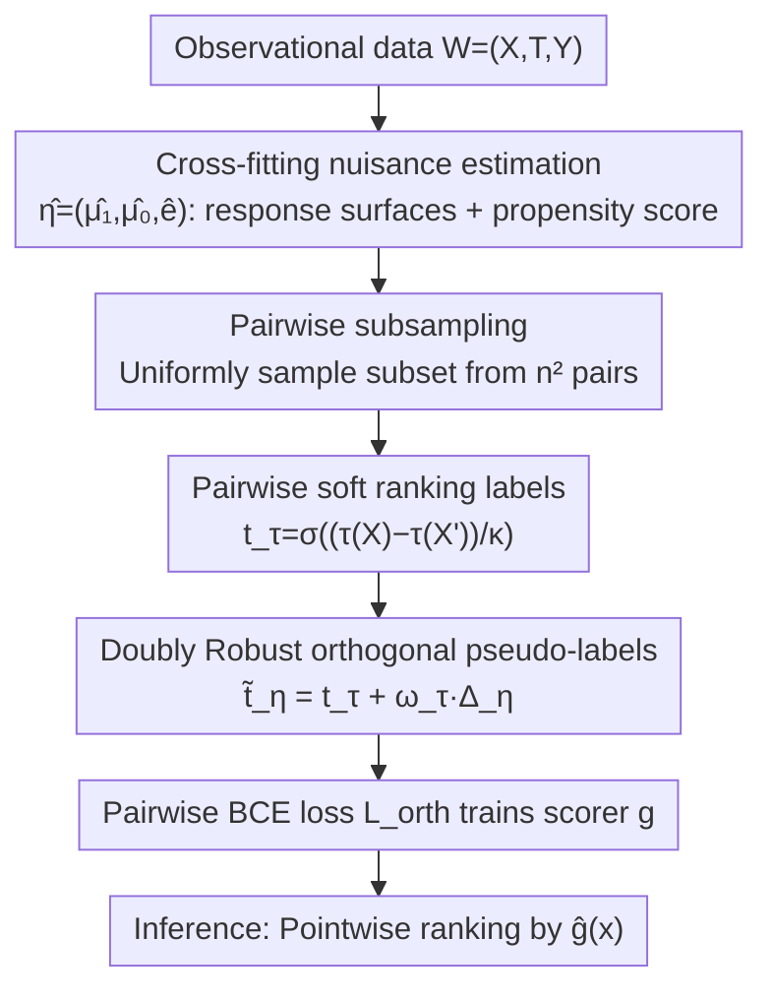

# Rank-Learner: Orthogonal Ranking of Treatment Effects

**Conference**: ICML 2026  
**arXiv**: [2602.03517](https://arxiv.org/abs/2602.03517)  
**Code**: https://github.com/henriarnoUG/rank-learner (Available)  
**Area**: Causal Inference / Treatment Effect Ranking / Orthogonal Learning  
**Keywords**: Treatment Effect Ranking, Neyman Orthogonality, Two-stage Learner, Doubly Robust, Pairwise Loss

## TL;DR
The authors propose Rank-Learner, the first Neyman-orthogonal two-stage treatment effect **ranking** learner for observational data. By replacing the indirect "estimate CATE then rank" approach with pairwise soft labels and a doubly robust correction term, it consistently outperforms T/DR-learners and non-orthogonal plug-in rankers on synthetic, semi-synthetic, and Criteo uplift real-world datasets.

## Background & Motivation

**Background**: In scenarios such as medical triaging, targeted marketing, and public policy, decision-makers do not necessarily need precise CATE numerical values. Instead, they require **ranking individuals based on treatment effects** to allocate limited resources to those who benefit the most. However, most literature focuses on CATE estimation, with very few works dedicated specifically to treatment effect ranking.

**Limitations of Prior Work**: Standard learning-to-rank (LTR) methods (pointwise / pairwise / listwise) require "ranking labels" for supervision, but the counterfactual $Y(1)-Y(0)$ is never observable. Current approaches take two detours: (i) first use T-learner / DR-learner to estimate $\hat\tau(x)$ and then rank by estimates; (ii) use the tree ranker from Kamran et al. 2024 or the plug-in ranker from Vanderschueren et al. 2024 to apply LTR directly. However, none of these are **Neyman-orthogonal**, making them highly sensitive to first-stage nuisance estimation errors.

**Key Challenge**: CATE estimation solves a **harder problem than ranking**—it seeks to identify the full function $g(x)=\tau(x)$; whereas ranking only needs to identify an order-preserving transformation $g(x)=h(\tau(x))$. Directing the error from the "hard problem" as supervision for the "easy problem" is sample-inefficient. Furthermore, non-orthogonal objectives allow nuisance bias to propagate first-order to the scorer, which is fatal in small-sample regimes.

**Goal**: Construct a two-stage learner that **directly targets ranking and is robust to nuisance errors**, satisfying (i) model-agnosticity, (ii) Neyman orthogonality, and (iii) population minimizers that provide the correct ranking.

**Key Insight**: Starting from the pairwise binary cross-entropy loss $\mathcal L^{\text{bin}}$—its population minimizer is any order-preserving transformation $h\circ\tau$, which is exactly what ranking requires. However, $\mathcal L^{\text{bin}}$ uses non-smooth indicator labels $\mathbf 1\{\tau(X)>\tau(X')\}$, preventing orthogonalization via influence functions. By replacing the indicator with a smooth sigmoid soft label $t_\tau$, the orthogonalization channel is opened while preserving ranking semantics.

**Core Idea**: Replace hard indicators with sigmoid soft labels $t_\tau(X,X')=\sigma((\tau(X)-\tau(X'))/\kappa)$, then derive a DR-score correction term $\omega_\tau\cdot\Delta_\eta$ using influence functions. This results in Neyman-orthogonal pseudo-labels $\tilde t_\eta = t_\tau + \omega_\tau\cdot\Delta_\eta$, which are then fed into a standard pairwise BCE.

## Method

### Overall Architecture
Rank-Learner aims to solve the following: given observational data $W=(X,T,Y)$ where $T\in\{0,1\}$ under standard causal assumptions (consistency, positivity, unconfoundedness), learn a scoring function $g:\mathcal X\to\mathbb R$ that is co-monotonic with the treatment effect $\tau(x)=\mathbb E[Y(1)-Y(0)\mid X=x]$, without necessarily estimating the exact value of $\tau(x)$. It follows the classic two-stage orthogonal learning framework: first, use cross-fitting to estimate nuisances (two response surfaces $\mu_t(x)=\mathbb E[Y\mid T=t,X=x]$ and propensity score $e(x)=P(T=1\mid X=x)$, denoted as $\hat\eta=(\hat\mu_1,\hat\mu_0,\hat e)$). Next, sample pairs from the training set to minimize a pairwise ranking loss. The only difference from the "plug-in estimate CATE then rank" approach lies in the **objective construction** of the second stage. The loss form remains standard pairwise binary cross-entropy, with all orthogonality encapsulated within the pseudo-labels. Thus, it is a drop-in replacement for plug-in rankers in engineering; during inference, single-point evaluation $\hat g(x)$ is used for ranking without requiring pairwise comparisons.

### Key Designs

**1. Pairwise Soft Ranking Loss: Downgrading the "Hard Problem" to an "Easy Problem"**

Ranking tasks do not require exact values of $\tau(x)$, only their ordinal relationships. Therefore, instead of fitting CATE, this work changes the objective to pairwise classification. It defines a soft target $t_\tau(X,X')=\sigma((\tau(X)-\tau(X'))/\kappa)$ representing the degree to which "$X$ benefits more than $X'$." The model preference is $p_g(X,X')=\sigma(g(X)-g(X'))$, and the loss $\mathcal L^{\text{soft}}=\mathbb E_{X,X'}[\ell(p_g,t_\tau)]$ (where $\ell$ is binary cross-entropy) is minimized. The population minimizer of this loss is $g(x)=\tau(x)/\kappa+c$, which recovers the treatment effect ranking. In contrast, the CATE regression loss $\mathcal L^{\text{cate}}$ has a unique minimum at $g(x)=\tau(x)$, requiring full reconstruction of the $\tau$ function—a stronger statistical requirement than ranking. $\mathcal L^{\text{soft}}$ imposes only ordinal constraints and is thus easier to learn. Crucially, soft labels are **differentiable with respect to $\tau$** (hard indicator labels $\mathbf 1\{\tau(X)>\tau(X')\}$ are not), opening the path for influence function orthogonalization. The hyperparameter $\kappa>0$ controls the softness: $\kappa\to 0$ approaches the hard indicator loss (where the optimal solution diverges), while larger $\kappa$ behaves like scaled CATE regression, allowing continuous interpolation between these two paradigms.

**2. Neyman-Orthogonal Doubly Robust Pseudo-labels: Encapsulating Orthogonality in Labels**

The soft label $t_\tau$ depends on the unknown $\tau$. Naive plug-in approaches allow first-stage nuisance bias to propagate to the scorer, which is especially problematic in small samples. This work performs a first-order correction on $\mathcal L^{\text{soft}}$ along the influence function, obtaining pseudo-labels $\tilde t_\eta(W,W')=t_\tau(X,X')+\omega_\tau(X,X')\cdot\Delta_\eta(W,W')$. Here, the weight is $\omega_\tau=\tfrac{1}{\kappa}t_\tau(1-t_\tau)$, and the DR-score difference is $\Delta_\eta=(\phi_\eta(W)-\tau(X))-(\phi_\eta(W')-\tau(X'))$. The pointwise DR score is

$$\phi_\eta(W)=\tfrac{T}{e(X)}(Y-\mu_1(X))-\tfrac{1-T}{1-e(X)}(Y-\mu_0(X))+\mu_1(X)-\mu_0(X).$$

Theorem 5.1 proves that the resulting loss $\mathcal L^{\text{orth}}=\mathbb E_{W,W'}[\ell(p_g,\tilde t_\eta)]$ is Neyman-orthogonal with respect to $\eta=(\mu_1,\mu_0,e)$ (insensitive to first-order nuisance perturbations). Theorem 5.2 further proves that under true nuisances, the population minimizer remains $g(x)=\tau^0(x)/\kappa+c$, preserving the ranking. The beauty of this correction is that the weight $\omega_\tau\propto t_\tau(1-t_\tau)$ naturally serves as an "uncertainty gating" mechanism: when the soft target is near $0$ or $1$ (linkage is clear), the weight is small and pseudo-label $\approx$ soft target; when it is near $0.5$ (ambiguous), the weight is amplified, and the DR correction term is activated to push the ambiguous pair toward a more credible pseudo-label. This aligns with hard-sample mining intuition but is derived purely from theory. Since the correction is inside the label, the loss form is unchanged, allowing any pairwise ranking network to use $\tilde t_\eta$ directly.

**3. Cross-fitting + Pairwise Subsampling for Scalable Training**

For orthogonality to hold, the first-stage nuisance estimation must be decoupled from the second-stage data. Thus, sample splitting/cross-fitting is used for $\hat\eta$ to avoid overfitting between nuisances and the scorer. While the second stage theoretically requires iterating over $n^2$ pairs, this work **uniformly samples subsets** $\mathcal P\subset\mathcal P_{\text{all}}$ in each epoch, reducing complexity from $O(n^2)$ to $O(|\mathcal P|)$. Experiments show that AUTOC saturates even at small sampling ratios, indicating that the second-stage cost is not a bottleneck; performance is primarily driven by nuisance quality. The scorer is implemented as a single-hidden-layer FFN with ReLU (same architecture as baselines for fairness), optimized with Adam for up to 50 epochs with early stopping. The hyperparameter $\kappa$ is chosen via unsupervised model selection using an approximate AUTOC estimate (Chernozhukov et al. 2025) on the validation set, capturing the bias-variance trade-off.

### Loss & Training
The final empirical objective is $\mathcal L^{\text{orth}}(g,\hat\eta)=\tfrac{1}{|\mathcal P|}\sum_{(i,j)\in\mathcal P}\ell(p_g(x_i,x_j),\tilde t_{\hat\eta}(w_i,w_j))$. Model selection follows approximate AUTOC to choose $\kappa$ and other hyperparameters; CATE baselines are selected via their respective validation losses. Inference only requires pointwise forward passes.

## Key Experimental Results

### Main Results

Synthetic benchmark (test AUTOC, 5 seeds, higher is better, oracle = 1.40):

| Method | $n=100$ | $n=500$ | $n=1{,}000$ | $n=2{,}000$ |
|------|---------|---------|---------|---------|
| T-learner | 0.88 ± 0.17 | 1.24 ± 0.05 | 1.32 ± 0.02 | 1.36 ± 0.00 |
| DR-learner | 0.80 ± 0.18 | 1.28 ± 0.05 | 1.33 ± 0.02 | 1.36 ± 0.02 |
| Plug-in ranker | 0.69 ± 0.32 | 1.24 ± 0.06 | 1.31 ± 0.02 | 1.36 ± 0.00 |
| **Rank-Learner (Ours)** | **1.00 ± 0.19** | **1.31 ± 0.01** | **1.34 ± 0.01** | **1.37 ± 0.00** |

Semi-synthetic and Criteo real data (test AUTOC / AUUC×10³):

| Dataset | Metric | T-learner | DR-learner | Plug-in ranker | Rank-Learner |
|--------|------|-----------|------------|----------------|--------------|
| MovieLens (n=1k) | AUTOC | 1.31 ± 0.03 | 1.34 ± 0.02 | 1.30 ± 0.03 | **1.35 ± 0.01** |
| MIMIC-III (n=1k) | AUTOC | 1.12 ± 0.05 | 1.17 ± 0.02 | 1.11 ± 0.05 | **1.18 ± 0.02** |
| CPS (n=1k) | AUTOC | 0.87 ± 0.08 | 0.92 ± 0.02 | 0.87 ± 0.08 | **0.95 ± 0.01** |
| Criteo (test 1M) | AUUC×10³ | 5.08 ± 1.62 | 5.17 ± 1.13 | 5.04 ± 1.65 | **5.90 ± 0.40** |

### Ablation Study

| Configuration | Key Metric (Synthetic n=500) | Description |
|------|------------------------|------|
| Full Rank-Learner | AUTOC 1.31 | Complete orthogonal pseudo-labels |
| w/o Orthogonal Correction (= Plug-in ranker) | AUTOC 1.24 | Removed $\omega_\tau\cdot\Delta_\eta$, Gain -0.07 |
| w/o Direct Ranking (= DR-learner) | AUTOC 1.28 | Rank via CATE estimates, Gain -0.03 |
| Pair Subsampling Scanning | AUTOC saturates quickly | At $n=1{,}000$, only a small fraction of $n^2=10^6$ pairs needed |

### Key Findings
- **Orthogonalization is most valuable in small samples**: At $n=100$, Rank-Learner is 0.31 AUTOC higher than the plug-in ranker, but only 0.01 higher at $n=2{,}000$. Smaller samples lead to larger nuisance errors, increasing the marginal benefit of DR correction.
- **Direct Ranking > CATE then Rank**: Although DR-learner is already orthogonal, Rank-Learner consistently dominates across all training scales. This confirms that "solving an easier problem" is a source of gain, and orthogonalization vs. task matching provide independent benefits.
- **Pair Subsampling does not degrade performance**: Performance saturates quickly with the subsampling ratio, proving second-stage cost is not a bottleneck; nuisance quality is the driver.
- **Gains are more pronounced in real scenarios**: On Criteo (confounded training + randomized test), Rank-Learner is 14% higher in AUUC than the next best DR-learner with significantly lower variance (0.40 vs 1.13).

## Highlights & Insights
- **"Problem Dimensionality Reduction" Strategy**: The authors clearly identify CATE estimation as a statistically harder problem than ranking. Using a relaxed objective $\mathcal L^{\text{soft}}$ instead of MSE aligns with the task and is easier to learn. This perspective of "aligning learning objectives with decision objectives" is transferable to any ordinal causal scenario like uplift, policy learning, or ranking-aware fairness.
- **Encapsulating Orthogonality in Labels rather than Loss**: Usually, orthogonal learning requires rewriting the entire loss function. This work packages all nuisance corrections into pseudo-labels $\tilde t_\eta$, keeping the BCE loss standard. This allows for near-zero engineering effort—any pairwise ranking network (RankNet, LambdaMART, etc.) can be integrated just by changing labels.
- **"Gating" Interpretation of $\omega_\tau$**: The $\omega_\tau\propto t_\tau(1-t_\tau)$ weight automatically concentrates correction on "hard pairs," matching the intuition of hard-sample mining. However, this is derived from influence function theory rather than heuristics, representing a nice convergence of theory and practice.
- **$\kappa$ Bridging Two Paradigms**: A single hyperparameter $\kappa$ continuously interpolates between "scaled CATE estimation" and "pure ranking," providing practitioners a clean knob to tune the bias–variance trade-off, with unsupervised model selection via approximate AUTOC.

## Limitations & Future Work
- **Binary Treatment + Single Outcome**: The method currently covers $T\in\{0,1\}$ and continuous/binary $Y$. Scenarios like multi-arm, sequential, or time-varying confounding require re-deriving influence functions and pseudo-labels.
- **Dependence on Causal Assumptions**: Consistency, positivity, and unconfoundedness are all required; propensity estimation noise remains visible in highly imbalanced settings like Criteo (though mitigated by orthogonality).
- **AUTOC Model Selection relies on estimation**: $\kappa$ selection depends on an estimate of AUTOC rather than the oracle. Whether estimation bias leads to incorrect $\kappa$ selection warrants more discussion.
- **Missing main table comparison against Tree Ranker**: Comparison with Kamran et al. is only in Appendix F.4. The gap when compared to other direct non-two-stage ranking methods is not immediately obvious in the main results.
- **Future Directions**: (i) Extend to hybrid backbones of doubly-robust + counterfactual regression; (ii) Orthogonalize listwise / top-k objectives; (iii) Use Rank-Learner as a policy module in sequential decision-making.

## Related Work & Insights
- **vs DR-learner (Kennedy 2023)**: Both use DR score $\phi_\eta$ and cross-fitting, but the DR-learner's second stage is $\mathbb E[(g(X)-\phi_\eta(W))^2]$ (CATE regression). Rank-Learner embeds $\phi_\eta$ into pairwise soft labels, solving a simpler ranking problem.
- **vs Plug-in ranker (Vanderschueren et al. 2024)**: Both losses are based on $\mathcal L^{\text{soft}}$ and share the same form; the only difference is the $\omega_\tau\cdot\Delta_\eta$ correction. The massive gap in small samples (AUTOC 0.69 vs 1.00 at n=100) validates the value of orthogonality in ranking.
- **vs Tree ranker (Kamran et al. 2024)**: Tree ranker directly optimizes non-differentiable ranking criteria using DR pseudo-outcomes, but the model class is fixed and it is not Neyman-orthogonal. Rank-Learner is model-agnostic, orthogonal, and supports neural networks.
- **vs Frauen et al. 2026 (Preference-based LLM eval)**: The same team migrated the orthogonal learning idea from "LLM preference evaluation" to "Treatment effect ranking," showing that influence-function-based orthogonalization is a broadly applicable methodology.
- **Inspiration**: Any task where "the goal is order but the model is forced to learn values" (uplift, personalization, risk stratification, resource allocation) should consider using the "soft labels + influence function correction" recipe.

## Rating
- Novelty: ⭐⭐⭐⭐ First work to extend Neyman-orthogonal learning to treatment effect ranking, successfully bridging soft pairwise loss and DR correction.
- Experimental Thoroughness: ⭐⭐⭐⭐ Coverage of synthetic, semi-synthetic (3 datasets), and Criteo real data, including ablations for scale, subsampling, overlap, and $\kappa$. However, main table only compares 4 baselines; tree rankers are relegated to the appendix.
- Writing Quality: ⭐⭐⭐⭐⭐ Clear motivational progression (CATE→soft→orthogonal). Theoretical statements are well-balanced with intuition. Table 2 aligns objectives, constraints, and orthogonality for four losses, making the core concept easy to grasp.
- Value: ⭐⭐⭐⭐ Provides a theoretically grounded and engineering-simple (drop-in pseudo-label) baseline for ranking-centric scenarios like medical triaging and targeted marketing. Open-source code supports immediate adoption.

<!-- RELATED:START -->

## Related Papers

- [\[ICLR 2026\] Overlap-Weighted Orthogonal Meta-Learner for Treatment Effect Estimation over Time](../../ICLR2026/causal_inference/overlap-weighted_orthogonal_meta-learner_for_treatment_effect_estimation_over_ti.md)
- [\[ICLR 2026\] An Orthogonal Learner for Individualized Outcomes in Markov Decision Processes](../../ICLR2026/causal_inference/an_orthogonal_learner_for_individualized_outcomes_in_markov_decision_processes.md)
- [\[AAAI 2026\] Learning Subgroups with Maximum Treatment Effects without Causal Heuristics](../../AAAI2026/causal_inference/learning_subgroups_with_maximum_treatment_effects_without_causal_heuristics.md)
- [\[ICLR 2026\] GDR-learners: Orthogonal Learning of Generative Models for Potential Outcomes](../../ICLR2026/causal_inference/gdr-learners_orthogonal_learning_of_generative_models_for_potential_outcomes.md)
- [\[AAAI 2026\] Causal Inference Under Threshold Manipulation: Bayesian Mixture Modeling and Heterogeneous Treatment Effects](../../AAAI2026/causal_inference/causal_inference_under_threshold_manipulation_bayesian_mixtu.md)

<!-- RELATED:END -->
