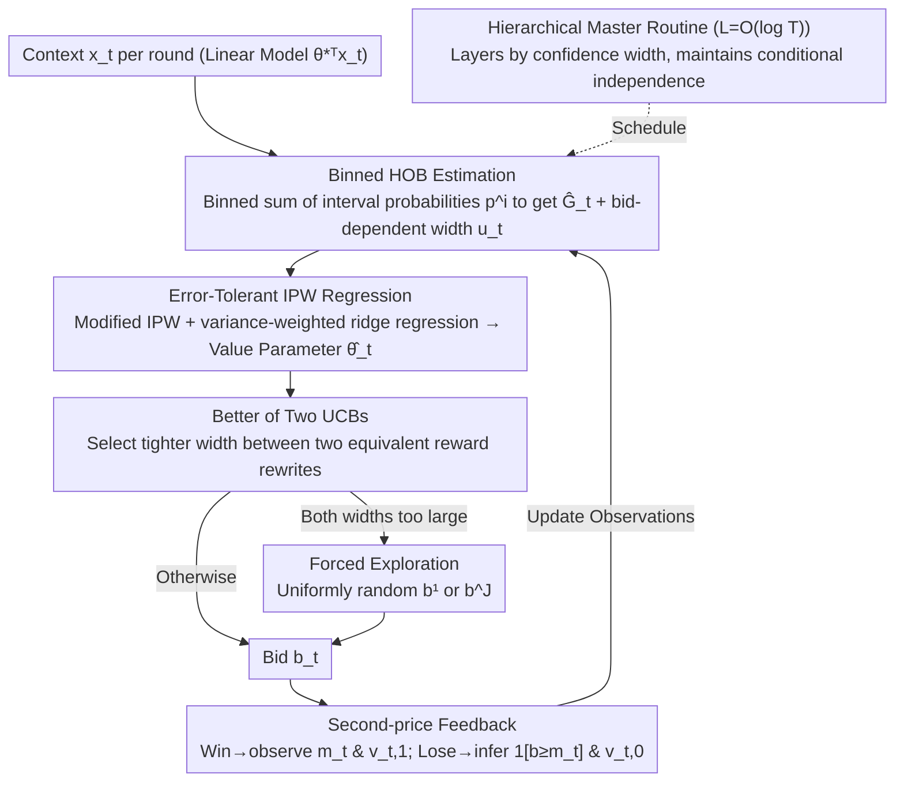

# The (Marginal) Value of a Search Ad: An Online Causal Framework for Repeated Second-price Auctions

**Conference**: ICML 2026  
**arXiv**: [2605.01756](https://arxiv.org/abs/2605.01756)  
**Code**: None  
**Area**: Causal Inference / Online Learning / Auctions & Advertising  
**Keywords**: Second-price auctions, treatment effect, contextual bandit, IPW, UCB

## TL;DR
This paper models the true value of search advertisements as the treatment effect of "winning vs. losing." It designs an online causal learning algorithm that utilizes payment rules under binary feedback in repeated second-price auctions (SPA), achieving a minimax optimal regret of $\widetilde\Theta(\sqrt{dT})$, which is strictly easier to learn than first-price auctions (FPA) under the same setting.

## Background & Motivation

**Background**: Search advertising (sponsored slots on Amazon / Google / Bing) almost exclusively employs second-price (Vickrey) auctions. In terms of bidding strategy, "truthful bidding" is theoretically optimal for SPA; however, advertisers ultimately care about the actual value of an impression (CTR / CVR), which requires online estimation. A recent line of work models "ad value" as a treatment effect: the revenue from a win-induced click $v_{t,1}$ minus the revenue $v_{t,0}$ that the user might have generated from organic search results even if the auction was lost. Wen et al. previously established an optimal regret of $\widetilde\Theta_d(T^{2/3})$ for FPA under binary feedback.

**Limitations of Prior Work**: Existing auto-bidding systems equate value with "revenue after winning," which systematically overestimates the appropriate bid. For brands already ranked highly in organic search results, the marginal revenue brought by winning an auction is nearly zero, yet traditional algorithms still treat these as high-value opportunities. Furthermore, the difference in optimal regret between FPA and SPA has not been systematically characterized.

**Key Challenge**: Causal estimation requires observations of both "win" and "loss" outcomes. However, a regret-minimizing bidder tends to win high-value auctions and lose low-value ones, which violates the propensity overlap condition. Additionally, the asymmetric feedback in SPA—where only the winner observes the Highest Other Bid (HOB)—facilitates learning but makes the design of confidence widths non-trivial.

**Goal**: (i) Extend the treatment-effect perspective to SPA; (ii) Utilize the additional HOB information provided by SPA payment rules to prove that the optimal regret in SPA is $\widetilde\Theta(\sqrt{dT})$ rather than the $\widetilde\Theta_d(T^{2/3})$ found in FPA; (iii) Relax the assumptions on propensity score estimation to allow for arbitrary error forms and HOB distributions with atoms.

**Key Insight**: The authors capture the core information gap in SPA: the higher the bid, the more information obtained regarding the HOB CDF (winning allows precise observation of $m_t$, while losing still permits the inference of $\mathbb{1}[b\geq m_t]$). By utilizing this "one-sided + inference" information structure and decomposing the HOB CDF into interval probabilities $p^i$ for block estimation, one can obtain tighter confidence widths than directly estimating $G(b)$.

**Core Idea**: Translate the "information dividend of second-price payments" into bid-dependent confidence widths for the propensity score. Then, design a "better of two UCBs" decision rule to neutralize the potential high variance of IPW estimation, ultimately pushing the SPA regret under binary feedback from $T^{2/3}$ down to $\sqrt{T}$.

## Method

### Overall Architecture
The algorithm solves an online problem: in each round, it receives a context $x_t\in\mathbb{R}^d$, determines a bid $b_t$ according to a linear value model $\mathbb{E}[\Delta v_t]=\theta_*^\top x_t$, and minimizes cumulative regret under binary feedback (knowing only whether it won or lost, and receiving either $v_{t,1}$ or $v_{t,0}$). The difficulty lies in the fact that causal estimation needs both "win" and "loss" outcomes, whereas a regret-seeking bidder naturally breaks this balance. The authors split this into three modules: first, employing the asymmetric feedback of second-price payments to estimate the CDF of the HOB (highest competing bid); second, using the estimated propensity for a modified IPW regression to solve for the value parameter $\widehat\theta_t$; and finally, choosing the tighter confidence interval between two equivalent reward rewrite forms for UCB bidding. A hierarchical master routine with $L=O(\log T)$ layers maintains the conditional independence of observations and provides periodic exploration.

### Key Designs

**1. Binned HOB Estimation: Releasing the Information Dividend of Second-Price Payments**

The HOB estimation is the bottleneck for regret. In FPA with binary feedback, there is no payment information, and the CDF must be estimated directly, leading to a difficulty of $T^{2/3}$. The key difference in SPA is that payment rules leak the HOB: the winner precisely sees $m_t$, and for losers, the existence of a higher bid allows the inference of $\mathbb{1}[b\geq m_t]$. Instead of estimating $G(b)$ for each bid $b$ individually, the authors discretize bids into $\mathcal{B}=\{b^j=(j-1)/\sqrt{T}\}$ and estimate interval probabilities $p^i=\mathbb{P}(b^{i-1}<m_t\leq b^i)$ in blocks: $\widehat p_t^i=\sum_{\tau\in\Phi_t}\mathbb{1}[b_\tau\geq b^i]\mathbb{1}[b^i<m_\tau\leq b^{i+1}]\,/\,\sum_{\tau\in\Phi_t}\mathbb{1}[b_\tau\geq b^i]$, thus $\widehat G_t(b^j)=\sum_{i\leq j}\widehat p_t^i$. The advantage is that the number of effective observations $n_t^i$ for each interval $p^i$ is proportional to $\sum_\tau\mathbb{1}[b_\tau\geq b^i]$—lower bids accumulate more observations and are estimated more accurately. Lemma 1 provides a bid-dependent confidence width $u_t(b^j)\propto\sqrt{\sum_{k\leq j}(\log T/n_t^k)(\widehat p_0^k+\log T/\sqrt T)}$, which is essentially a Bernstein concentration where "smaller $p^i$ leads to more accurate estimates," fully translating the payment information into tighter uncertainty bounds.

**2. Error-Tolerant IPW Regression: Decoupling Value and HOB Modules**

The error form of the binned HOB estimation does not satisfy the Bernstein assumption (where lower probability regions are tighter) relied upon by previous FPA algorithms. Consequently, the authors design an IPW estimator robust to any error form of $\widehat G_t$: $\widetilde e_t(b)=\mathbb{1}[b\geq m_t]\,v_{t,1}/\widehat G_t(b)-\mathbb{1}[b<m_t]\,v_{t,0}/(1-\widehat G_t(b))$. Its bias and variance are represented by computable proxies $u_t(b)\sigma_t(b)$ and $\sigma_t(b)^2$, where $\sigma_t(b)=1/(\widehat G_t(b)(1-\widehat G_t(b)))$. The value parameter is solved via variance-weighted ridge regression: $\widehat\theta_t=\arg\min_\theta\sum_{\tau\in\Phi_t}\sigma_\tau^{-2}(\widetilde e_\tau-\theta^\top x_\tau)^2+\|\theta\|_2^2$. The closed-form solution is $A_t^{-1}z_t$, and Lemma 3 provides an error bound $|\widehat\theta_t^\top x_t-\theta_*^\top x_t|\leq\gamma\|x_t\|_{A_t^{-1}}$. Notably, this bound can be arbitrarily large; by accepting potentially "poor" value estimates, the HOB and value modules are completely decoupled, allowing the method to be applied to any sponsored auction variant.

**3. Better of Two UCBs: Absorbing Exploding Variance via Decision Structure**

Since value estimation errors can be arbitrarily large, the problem becomes preventing them from propagating to regret. The authors observe that the same expected reward $\bar r_t(b)$ can be written in two equivalent forms: $\bar r_{t,0}(b)=G(b)(\theta_*^\top x_t-b)+\int_0^b G(m)\,\mathrm{d}m$ and $\bar r_{t,1}(b)=-(1-G(b))\theta_*^\top x_t-G(b)b+\int_0^b G(m)\,\mathrm{d}m$. The coefficients of $\theta_*^\top x_t$ in these forms are complementary. When $\widehat G_t(b)$ is small, the width of Form 0 (proportional to $\widehat G_t(b)$) is small; otherwise, Form 1 should be used. Algorithm 2 compares $\widehat G_t(b_L), \widehat G_t(b_R)$ with a threshold $1-\lambda/8$ and selects the UCB with the tighter width, suppressing instantaneous regret to $\min\{w_{t,0}(b_t),w_{t,1}(b_t)\}\propto\sigma_t(b_t)^{-1}$. The elegance lies in the negative correlation between value error and $\sigma_t$ (when error is large, $\sigma_t$ is also large, but the width collapses after taking the minimum). Thus, regret is controlled in most rounds; forced exploration (using $b^1$ or $b^J$) is only triggered in rare rounds (Lemma 6 bound $|\Phi_{\text{exp}}|=O(d\log^5 T)$) where both widths are too large. This is the core mechanism that pushes binary-feedback SPA from $T^{2/3}$ to $\sqrt T$, replacing expensive forced randomization typically used to ensure overlap.

### Loss & Training
The algorithm does not train an ML model but performs online decision-making orchestrated by a hierarchical master routine. It initially collects HOB observations using $b_t=1$ for the first $(L+1)T_0$ rounds. Subsequently, in each round, it checks confidence widths across layers $\ell=1,\ldots,L$, assigning the current round to the first layer satisfying $w_t>2^{-\ell}$. The bid is either calculated using the Better-of-Two UCBs or triggers forced exploration for that layer. The purpose of layering (Lemma 5) is to maintain conditional independence of observations across layers, ensuring the concentration inequalities for HOB and value estimation hold.

## Key Experimental Results

### Main Results

| Setting | Feedback | Upper Bound | Lower Bound | Conclusion |
|------|------|------|------|------|
| SPA + binary feedback (Ours Thm 1+2) | binary | $O(\sqrt{dT}\log^3 T)$ | $\Omega(\sqrt{dT})$ | Strictly better than FPA ($T^{2/3}$) |
| SPA + full-info feedback | full | $\widetilde O(\sqrt{dT})$ | $\Omega(\sqrt{dT})$ | Same order as binary |
| FPA + binary feedback (Wen et al. 2024) | binary | $\widetilde O_d(T^{2/3})$ | $\Omega_d(T^{2/3})$ | Baseline comparison |
| Empirical vs. LinUCB | – | LinUCB linear regret | NFM-style $\sqrt{T}$ convergence | LinUCB overestimates by ignoring $v_{t,0}$ |

### Ablation Study

| Configuration | Phenomenon | Explanation |
|------|------|------|
| Algorithm 4 (Practical variant) vs. Main | Extra $\sqrt d$ factor | Trading stratification for simplicity; standard linear bandit trade-off |
| HOB with atoms (Definition 1) | Regret remains $\sqrt{dT}$ | $(\omega,\lambda)$-locally-bounded assumption generalizes to point masses |
| Forced exploration only (no Better-of-Two UCBs) | Regret degrades to $T^{2/3}$ | Validates Better-of-Two UCBs as key to $\sqrt T$ |
| Empirical LinUCB | Linear regret | Constant overbidding when equating value with $v_{t,1}$ |

### Key Findings
- The payment rules of SPA contribute critical "winner-observes-HOB" information, accelerating causal learning under binary feedback from $T^{2/3}$ to $\sqrt T$. This represents a fundamental complexity difference between SPA and FPA in marginal value bidding.
- Value estimation can be "inherently unreliable": while $\widehat\theta_t$ error can be arbitrarily large, as long as the decision module selects the tighter UCB, overall regret remains controlled. This idea of "using decision structure to absorb estimation error" is rare in causal online learning.
- Forced randomization alone is sub-optimal. Only the combination of binned HOB estimation, Better-of-Two UCBs, and hierarchical independence maintenance can simultaneously achieve the lower bound.

## Highlights & Insights
- Modeling ad value as a treatment effect rather than "winning revenue" has immediate industrial significance: for brands already performing well in organic search, traditional algorithms overbid; the proposed method naturally avoids this waste.
- "Better of two UCBs" is an ingenious technical trick: by rewriting the reward function into two forms whose widths are complementary with respect to $\widehat G_t$, the instantaneous regret collapses to $\sigma_t^{-1}$ even when value estimation is poor.
- Relaxing propensity error to an arbitrary form $u_t$ allows "non-Bernstein" HOB estimation in SPA to be integrated with causal learning modules, a methodological contribution suitable for any sponsored auction variant.

## Limitations & Future Work
- The HOB distribution is assumed to be i.i.d. stationary; in practice, competitors drift with trends. The authors mention contextual HOB extensions in Appendix B but do not explore them deeply.
- The value model is restricted to a linear form $\mathbb{E}[\Delta v_t]=\theta_*^\top x_t$, which is not directly applicable to deep neural network scoring; extensions to kernel or neural representations are open directions.
- The multi-layered structure of Algorithm 3 is complex for engineering. Flattening it (Algorithm 4) adds a $\sqrt d$ factor, requiring a trade-off between performance and complexity in deployment.
- Experiments rely on synthetic data; there is no validation against real search ad platform data. Initial high-bid exploration for $O(\sqrt T\log T)$ rounds may be unacceptable in budget-constrained scenarios.

## Related Work & Insights
- **Vs. Wen et al. (2024, FPA + treatment effect)**: Ours is a natural extension to SPA. The key contribution is using payment rules to push regret from $T^{2/3}$ to $\sqrt T$ and relaxing propensity estimation assumptions.
- **Vs. Han et al. 2020 / interval splitting (FPA)**: Binned HOB estimation takes inspiration from FPA interval splitting but combines it with asymmetric SPA information to derive bid-dependent widths.
- **Vs. incrementality / lift bidding empirical literature**: That line of work primarily runs A/B tests in industry with few theoretical guarantees; this paper provides the first minimax optimal algorithm that does not rely on "overlap" conditions.
- **Vs. linear contextual bandits (LinUCB)**: The proposed method is structurally similar to LinUCB but additionally handles heteroskedasticity from IPW and propensity uncertainty, using Better-of-Two UCBs to resolve the exploding variance of causal estimation.

## Rating
- Novelty: ⭐⭐⭐⭐⭐ First to couple SPA payment rules with treatment-effect causal learning to achieve $\sqrt{dT}$ regret, providing a clean characterization of FPA-SPA complexity differences.
- Experimental Thoroughness: ⭐⭐⭐ The theoretical analysis is extremely comprehensive, but empirical results are limited to synthetic data comparisons against LinUCB.
- Writing Quality: ⭐⭐⭐⭐ Clear mathematical structure; the derivation of Better-of-Two UCBs is intuitive. High notation density suggests a non-trivial entry barrier.
- Value: ⭐⭐⭐⭐ Methodologically significant for "marginal value" bidding in search ads and recommendation systems; offers a guide for industry to upgrade existing auto-bidders.

<!-- RELATED:START -->

## Related Papers

- [\[ICLR 2026\] Efficient Ensemble Conditional Independence Test Framework for Causal Discovery](../../ICLR2026/causal_inference/efficient_ensemble_conditional_independence_test_framework_for_causal_discovery.md)
- [\[CVPR 2026\] A Polynomial Chaos Framework for Causal Discovery in Nonlinear Uncertain Systems](../../CVPR2026/causal_inference/a_polynomial_chaos_framework_for_causal_discovery_in_nonlinear_uncertain_systems.md)
- [\[ACL 2025\] IRIS: An Iterative and Integrated Framework for Verifiable Causal Discovery](../../ACL2025/causal_inference/iris_an_iterative_and_integrated_framework.md)
- [\[NeurIPS 2025\] Counterfactual Reasoning for Steerable Pluralistic Value Alignment of Large Language Models](../../NeurIPS2025/causal_inference/counterfactual_reasoning_for_steerable_pluralistic_value_alignment_of_large_lang.md)
- [\[NeurIPS 2025\] GST-UNet: A Neural Framework for Spatiotemporal Causal Inference with Time-Varying Confounding](../../NeurIPS2025/causal_inference/gst-unet_a_neural_framework_for_spatiotemporal_causal_inference_with_time-varyin.md)

<!-- RELATED:END -->
