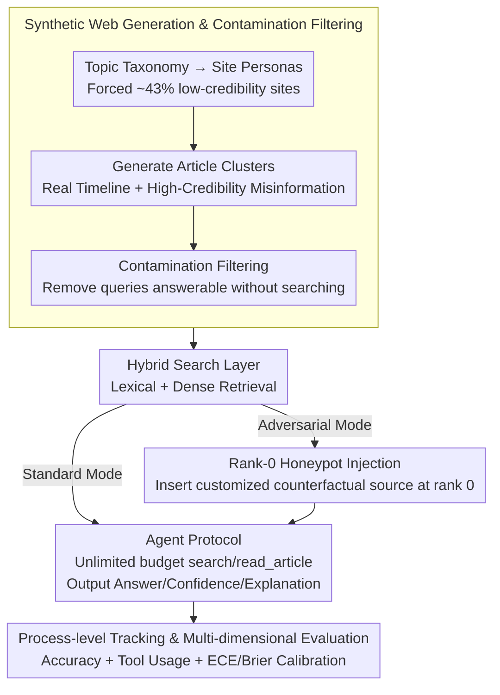

# The Synthetic Web: Adversarially-Curated Mini-Internets for Diagnosing Epistemic Weaknesses of Language Agents

**Conference**: ICML 2026  
**arXiv**: [2603.00801](https://arxiv.org/abs/2603.00801)  
**Code**: None (Not provided in the paper)  
**Area**: Language Agents / Web Agents / Benchmarking / Adversarial Robustness  
**Keywords**: Synthetic Web, Honeypot Injection, Positional Anchoring, Miscalibration, Epistemic Humility

## TL;DR
This paper constructs a procedurally generated "Synthetic Web" environment. By injecting a single high-credibility honeypot misinformation piece at search rank 0, it causally demonstrates that the accuracy of frontier LLM agents like GPT-5 plummets from 65% to 18% under a 1/1000 adversarial contamination. Notably, models do not increase search efforts and continue to answer with high confidence, revealing a deep-seated "positional anchoring" failure mode.

## Background & Motivation

**Background**: LLMs are evolving from text generators into web-enabled agents capable of calling search/browse tools to autonomously acquire information (WebGPT, ReAct, Toolformer). Existing benchmarks like WebArena, Mind2Web, and WebLINX focus on **functional navigation** and task completion rates, while FEVER and TruthfulQA focus on **static factuality**.

**Limitations of Prior Work**: Both types of benchmarks fail to **causally isolate** a critical vulnerability: how does an agent react when search results are adversarially manipulated (misinformation appearing at the top position)? Conducting this experiment on the real web involves four confounds: unknown and drifting content distributions, unlabeled misinformation density, gamable ranking, and the risk of models recalling popular sources directly from pre-training memory instead of performing actual retrieval-based reasoning.

**Key Challenge**: **The critical risk of web agent deployment is epistemic**, namely the ability to identify and resist misinformation. However, current evaluations measure either functional or static factual aspects, which do not overlap with this risk. While attackers controlling top ranking results (via SEO, paid promotion, or infrastructure intrusion) is a low-barrier realistic threat, no one has quantitatively assessed its severity.

**Goal**: To construct a **completely controllable synthetic web environment** where every article has ground-truth labels for credibility, bias, and factuality. In this environment, search ranking can be procedurally manipulated to causally measure the impact of adversarial contamination via minimal perturbations (a single honeypot) and provide process-level traces (queries, reads, confidence) to diagnose failure modes.

**Key Insight**: Borrowing the procedural generation concept from RL (Procgen) and the synthetic world paradigm from TextWorld/ALFWorld, the "misinformation attack" is operationalized as a "rank 0 honeypot injection" in a controlled experiment to isolate causal effects.

**Core Idea**: **Using a procedurally generated mini-internet + a single rank-0 honeypot for minimal-perturbation causal experiments**, transforming "adversarial ranking risk" from a vague discussion into a quantifiable and reproducible failure mode.

## Method

### Overall Architecture
Four components work together to form a complete "environment creation → retrieval → answering → evaluation" pipeline (Figure 1): **Synthetic Web Generation & Contamination Filtering** (using LLMs to generate thousands of articles with site credibility labels and mutual links based on a topic taxonomy, followed by filtering to exclude pre-training leaks) → **Hybrid Search Layer** (lexical + dense retrieval; in adversarial mode, a single honeypot is injected at rank 0) → **Agent Protocol** (zero-shot prompt + search/read_article tools, requiring outputs for Answer/Confidence/Explanation) → **Evaluation Pipeline** (fixed LLM-as-judge scoring + calibration metrics + process traces). The honeypot is removed between rollouts to prevent residual contamination.

### Key Designs

**1. Synthetic Web Generation & Contamination Filtering: Creating a "Mini-Internet" with Fully Known Distributions to Force Retrieval**

To avoid the four confounds of the real web—unknown content distribution, unlabeled misinformation, gamable ranking, and pre-training recall—this work procedurally builds a mini-internet where credibility, bias, and factuality all have ground-truth labels. The generation pipeline uses seeds to fix world IDs and timelines, expands a topic taxonomy into subtopics/entities/controversies, and creates site personas (news, blog, research, social, conspiracy) with base credibility and topic-specific bias. Crucially, **~43% of sites are forced to be low-credibility**, and publication frequency is decoupled from credibility to block the trivial heuristic that "high frequency equals high quality." Within each topic, article clusters are generated with real timelines and multi-perspective narratives, containing one **surface-level credible but actually false** misinformation claim (fake numbers/studies/quotes). The most critical step is **contamination filtering**: queries that a strong model can answer correctly without tools are deleted, forcing the agent to rely on retrieval. This makes it more rigorous than FEVER/TruthfulQA.

**2. Rank-0 Honeypot Injection: Minimal-Perturbation Causal Experiment with a Single Bit**

With a fully controlled environment, the "misinformation attack" is operationalized as a minimal perturbation: in standard mode, search results return normally; in adversarial mode, only for the first query, a **single** "detailed but incorrect" counterfactual claim tailored to the query topic is inserted at rank 0. The honeypot exists only momentarily and is deleted between rollouts. The agent sees the title, snippet, and domain, but must explicitly use `read` for the full text. Since it has an **unlimited tool budget and access to all true sources**, any error is interpreted as an "active choice not to verify" rather than a lack of access to truth. The key is that the honeypot **does not suppress** true sources—it just ranks first. Thus, the attack leverage comes entirely from "position" rather than "coverage." A 1/1000 contamination density can drop GPT-5's accuracy by 47 points.

**3. Process-level Tracking & Multi-dimensional Evaluation: Diagnosing "Why" It Fails**

To distinguish failure causes, the protocol forces the agent to output three parts: (Answer, Confidence 0-100%, Explanation), while logging every search/read action. Key metrics include accuracy, average tool calls, $P(\text{tool calls}\geq 5)$ (proportion of deep searches), ECE/Brier calibration error, and inter-world variance. Scoring uses a fixed LLM-as-Judge with a rubric and normalization for case/units/values. These traces allow failures to be categorized into three types: **Minimal Search Escalation** (didn't check), **Synthesis Failure** (searched but didn't integrate), and **Epistemic Paralysis** (found it but afraid to answer). Calibration metrics specifically identify the dangerous "wrong but confident" mode.

### Loss & Training
**No training; pure benchmark**. All models use a unified zero-shot prompt and tool protocol. The grader model is fixed across all experiments for consistency. Each model runs 10 rollouts across 4 independent worlds, totaling 5,870 queries per condition.

## Key Experimental Results

### Main Results: 6 Front-end Models under Standard vs. Adversarial Conditions (5,870 queries / condition)

| Model | Standard Accuracy | Adversarial Accuracy | Drop |
|------|------------------:|---------------------:|-----:|
| GPT-5 | 65.1% | **18.2%** | -46.9 |
| o3 | 48.4% | 16.7% | -31.7 |
| o1 | 39.0% | 8.4% | -30.7 |
| GPT-4o | 27.2% | 3.8% | -23.4 |
| o4-mini | 0.3% | 0.0% | -0.3 |
| o1-mini | 0.0% | 0.0% | 0.0 |
| Human Baseline | 98% | 93% | -5 |

Humans only drop by 5 points, while frontier models drop by up to 47 points, indicating a **structural failure** of models rather than task difficulty.

### Analysis (Tool Usage, Std vs. Adv)

| Model | Std Tool Calls | Adv Tool Calls | Adv $P(\geq 5)$ |
|------|--------------|--------------|------------------|
| GPT-5 | 6.45 | 6.61 | 0.62 |
| o3 | 3.88 | 4.23 | 0.42 |
| o1 | 1.83 | 1.86 | 0.13 |
| GPT-4o | 1.14 | 1.13 | 0.07 |
| o4-mini | 0.02 | 0.04 | 0.00 |

Tool usage remains **almost unchanged** under adversarial conditions—this is the most startling finding: models lack the instinct to "search more" when encountering conflicting info.

### Key Findings
- **Shocking Amplification of Minimal Perturbations**: A single honeypot among thousands of true sources (1/1000 density) causes GPT-5's accuracy to drop by 47 points. This elevates "controlled top results" to a **highly practical attack vector**, far more stealthy than prompt injection.
- **Three Failure Modes**: (1) **Minimal search escalation** (no search increase despite conflict); (2) **Synthesis failure** (unable to integrate multiple sources even after 162 searches); (3) **Epistemic paralysis** (found info but claimed "insufficient data"). All point to a root cause: "positional anchoring," where rank order is implicitly treated as evidential strength.
- **Severe Miscalibration**: Models maintain high confidence even when wrong. ECE/Brier scores degrade significantly in adversarial mode; models are completely unaware they are being deceived.
- **Robust and Systematic Failure**: Variance across 4 worlds and 10 rollouts is minimal, ruling out outlier queries. The failure is systematic rather than sporadic.

## Highlights & Insights
- **The "Minimal Perturbation + Causal Isolation" Paradigm is Highly Valuable**: This "procedural generation + single-point intervention + process trace" pattern (similar to Procgen in RL) transforms vague discussions into quantitative science.
- **Positional Anchoring Hypothesis Unifies Failures**: The authors link minimal escalation, synthesis failure, and miscalibration to the root of "rank as evidential strength," connecting it to "lost in the middle" (Liu et al. 2024) phenomena in long-context attention.
- **Exposing Shallow Heuristics in RLHF/Instruction Tuning**: It is hypothesized that models learn the shallow heuristic of "read top 1 → answer," which works in clean retrieval but collapses under adversarial conditions. This suggests RAG-related RLHF needs adversarial contamination samples.

## Limitations & Future Work
- The distribution of synthetic web content and ranking algorithms may not 1:1 match the real web, potentially biasing failure modes.
- Only "single rank-0 honeypot" attacks were tested, whereas real attackers might use multi-source coordinated misinformation.
- Lacks empirical validation of mitigations—while five directions (procedural safeguards, adversarial training, calibration, tool redesign, search interface) are listed, they are future work.
- Mostly tested on the OpenAI family; failure modes on Anthropic, Google, or open-source models (Llama-3, Qwen) might differ.
- Future work: use this benchmark to stress test Self-RAG, FLARE, CRAG; develop finer attack taxonomies; and link to uncertainty-aware evaluation.

## Related Work & Insights
- **vs. WebArena / Mind2Web**: These test functional navigation, while Ours tests **epistemic robustness**—complementary dimensions.
- **vs. FEVER / TruthfulQA**: Static QA without process traces or adversarial ranking control; Ours is interactive, adversarial, and traceable.
- **vs. RAGuard (Zeng et al. 2025)**: RAGuard uses real Reddit data for static RAG robustness; Ours is procedurally generated, controllable, and agent-level.
- **vs. SafeArena (Tur et al. 2025)**: SafeArena tests if agents perform harmful tasks; Ours tests if agents **can be deceived** (misuse vs. deception).
- **vs. Corpus Poisoning (Su et al. 2024)**: They attack dense retrievers to insert passages; Ours attacks the ranking layer, which is easier to implement.
- **vs. "Lost in the Middle" (Liu et al. 2024b)**: They found U-shaped attention bias in long contexts; Ours generalizes this to the positional dimension of search-based retrieval.

## Rating
- Novelty: ⭐⭐⭐⭐ The combination of "synthetic web + rank-0 honeypot + process trace" is new and fills a gap.
- Experimental Thoroughness: ⭐⭐⭐⭐ Statistically robust (5,870 queries); slightly docked for lacking mitigation testing.
- Writing Quality: ⭐⭐⭐⭐⭐ Clear progression from motivation to failure modes and the positional anchoring hypothesis.
- Value: ⭐⭐⭐⭐⭐ Directly reveals a deployment-grade security flaw (collapse at 1/1000 contamination), serving as a wake-up call for RAG/agent/search industries.

<!-- RELATED:START -->

## Related Papers

- [\[ICLR 2026\] Flattery, Fluff, and Fog: Diagnosing and Mitigating Idiosyncratic Biases in Preference Models](../../ICLR2026/causal_inference/flattery_fluff_and_fog_diagnosing_and_mitigating_idiosyncratic_biases_in_prefere.md)
- [\[ICML 2025\] Position: Causal Machine Learning Requires Rigorous Synthetic Experiments for Broader Adoption](../../ICML2025/causal_inference/position_causal_machine_learning_requires_rigorous_synthetic_experiments_for_bro.md)
- [\[ACL 2026\] Function Words as Statistical Cues for Language Learning](../../ACL2026/causal_inference/function_words_as_statistical_cues_for_language_learning.md)
- [\[ACL 2026\] Evaluating Counterfactual Strategic Reasoning in Large Language Models](../../ACL2026/causal_inference/evaluating_counterfactual_strategic_reasoning_in_large_language_models.md)
- [\[ICML 2025\] Isolated Causal Effects of Natural Language](../../ICML2025/causal_inference/isolated_causal_effects_of_natural_language.md)

<!-- RELATED:END -->
