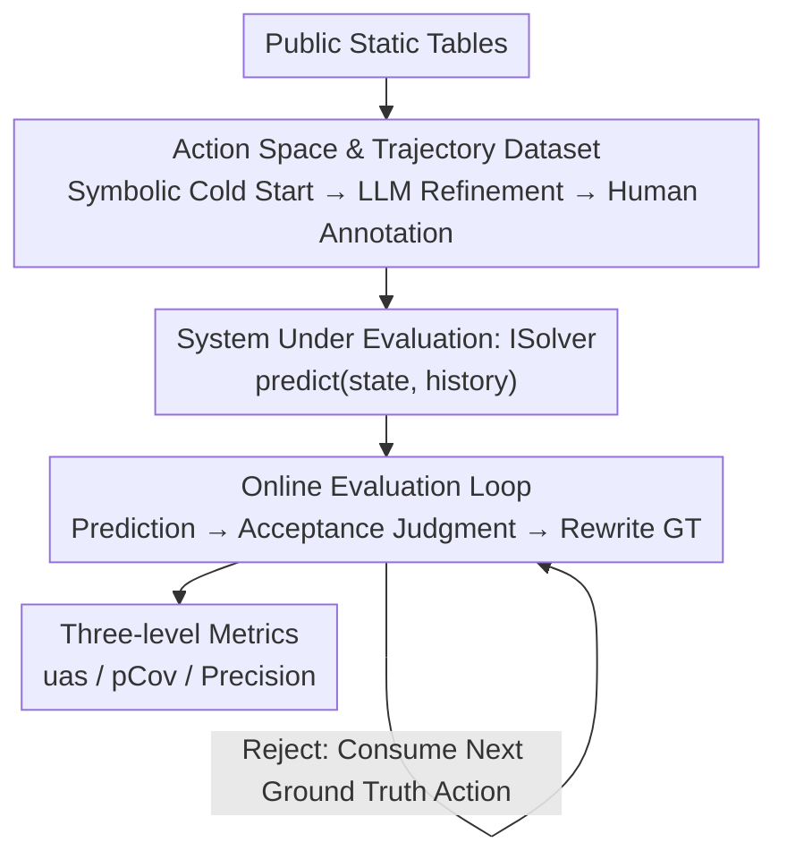

# A Benchmark and Framework for Evaluating Next Action Predictions in Spreadsheets

**Conference**: ICML2026  
**arXiv**: [2606.13802](https://arxiv.org/abs/2606.13802)  
**Code**: https://github.com/Tej-55/NAPE  
**Area**: Code Intelligence / Auto-completion  
**Keywords**: Spreadsheet completion, Action prediction, Online evaluation, User behavior modeling, Benchmark  

## TL;DR
Addressing the gap where spreadsheets lack next-action prediction similar to code completion, this paper constructs NAPE, the first spreadsheet action prediction benchmark (52 human-verified creation trajectories with 11,907 low-level actions). It proposes an **online evaluation** framework: after each action, the system provides predictions, simulates user acceptance/rejection, and dynamically rewrites remaining ground truth actions. Performance is measured by User Action Savings (uas); experiments show that a fine-tuned 360M model matches GPT-5 (both saving 27% of actions).

## Background & Motivation
**Background**: In code editing, predictive completion—ranging from symbolic repeated edits in Blue-Pencil to whole-line completion in IntelliCode and multi-function suggestions in modern assistants—has significantly accelerated development. However, in the more frequently used domain of spreadsheets, such features that observe user operation sequences and suggest the next step are virtually non-existent.

**Limitations of Prior Work**: Existing spreadsheet assistance is limited to narrow scenarios: FlashFill only populates columns derivable from others; formula assistants only intervene when a user explicitly starts a formula; recent trends focus on LLM agents for natural language intent (e.g., SheetCopilot). For daily repetitive formatting or data entry, the cost of invoking an assistant, organizing a prompt, and waiting for a response often exceeds manual effort, leading users to perform tasks entirely manually.

**Key Challenge**: Implementing "general action suggestion" faces severe evaluation difficulties. First, **lack of edit history corpora**: unlike code with fine-grained version histories, spreadsheet corpora typically consist of "evolution over time" snapshots without step-by-step sequences. Second, **complex action space**: individual actions (coloring, adding borders) are simple, but they occur at different locations, affect different ranges, and follow various sequences without clear triggers for prediction. Traditional offline evaluation (teacher-forcing) fails to reflect real usage, as the subsequent tasks change once a user accepts a suggestion.

**Goal**: To solve two sub-problems: (1) creating high-quality trajectory data without historical logs; (2) designing an end-to-end evaluation protocol that reflects how suggestions change future states.

**Core Idea**: A three-stage "symbolic cold start + LLM refinement + human annotation" approach is used to reverse-engineer realistic trajectories from static tables. An **online rolling evaluation** replaces static "given x predict y" setups: each prediction is executed, accepted or rejected based on heuristics, and the remaining ground truth is dynamically rewritten (removing satisfied actions and inserting inverse actions to undo errors) to measure the final proportion of actions saved for the user.

## Method

### Overall Architecture
NAPE consists of two parts. The **offline side is the dataset construction pipeline**: starting from public static tables, it uses "symbolic cold start → LLM refinement → human annotation" to reverse-engineer 52 trajectories from blank to finished products, composed of 9 low-level action types. The **online side is the evaluation loop**: the system is wrapped as an `ISolver` (implementing `predict(state S, history H) → action sequence`). The evaluator maintains "current state S, history H, remaining ground truth F," repeatedly executing the "predict → judge by acceptance heuristic → if accepted, execute prediction and rewrite F → else consume next ground truth action" loop until F is empty or a threshold is met. Metrics are calculated at three granularities (action/prediction/trajectory), with uas as the primary metric.

### Key Designs

**1. Action Space and Trajectory Dataset: Reverse-Engineering "Realistic Creation Processes"**

Training and evaluation require step-by-step sequences, but public data only contains finished tables. The study defines 9 parameterized actions: `input` (values/matrices), `merge`, `format` (numeric), `fill` (background), `font` (bold/italic/size/color/underline/name), `border`, `align`, `paste`, and `autofill`. The reconstruction involves: **Symbolic cold start** which decomposes products into cell-wise actions and merges adjacent identical actions into range actions (e.g., `font(A1:A2, bold)`), while using VLMs to annotate semantic metadata; **LLM refinement** uses a "judge-editor" loop to prune unnatural patterns and adjust sequences; and **Human annotation** serves as the final step to correct remaining unnatural sub-sequences. The authors emphasize the intensity of human involvement: the average normalized edit distance between pre-annotated and final trajectories is 0.69, with 19 out of 52 trajectories nearly rewritten (distance >0.8).

**2. Online Evaluation Loop: Accounting for "Dynamic State Changes"**

Static offline evaluation (teacher-forcing) overestimates systems by allowing models to gain accuracy through simple repetitive suggestions without testing their ability to fix previous errors. This study adopts **on-policy rolling evaluation**: starting from an empty sheet, for each round `solver.predict(S, H)`, an `accept` heuristic decides whether to adopt suggestions. If accepted, `execute` updates state S, and `update` rewrites the remaining ground truth F: deleting satisfied operations and **pre-pending inverse actions** to the head of F to undo "false positive" predictions. A `patch` operation ensures the rewritten F still produces the original target state. This approach prevents models from "gaming" the score with repetitive simple suggestions and tests their ability to revise previous errors.

**3. Three-level Evaluation Metrics: Measuring Utility via "Net Action Savings"**

At the finest **(cell, attribute)** granularity, predicted states are compared with target states, categorizing results into TP (correct prediction), FP (extra edit requiring undo), FN (missed edit requiring manual entry), and MM (mismatched value requiring correction). The **prediction level** provides precision and single-step uas. The **trajectory level** measures overall performance, primarily using the User Action Savings (uas):

$$\text{uas}=\frac{L_{\text{initial}}-L_{\text{final}}}{L_{\text{initial}}}$$

This represents the percentage of actions saved relative to the original manual requirement. Another key metric is **Predictable Coverage (pCov)**—the ratio of correctly predicted actions to an oracle-defined predictable set. This normalizes scores against what is actually learnable from context, preventing dilution by inherently unpredictable edits.

### Mechanism
In a step illustrated in Figure 1: the system predicts three actions—two borders (correct) and one fill (wrong cell). At the (cell, attribute) level, precision is $7/8$. If accepted, the `update` removes the two satisfied border actions from the future ground truth and **pre-pends** a `fill(C4, empty)` action to undo the error. The future action count effectively decreases from 3 to 2, resulting in a **net saving of 1 action**.

## Key Experimental Results

### Main Results
Single-action repredict setting (stride $s{=}1$, context $c{=}32$, greedy acceptance), primary metric uas (%):

| Model | uas↑ | ar↑ | prec↑ | pCov↑ |
|------|------|-----|-------|-------|
| GPT-5-R (High Reasoning) | 32.7 | 29.4 | 41.6 | 24.8 |
| GPT-5-R mini | 28.2 | 25.5 | 37.0 | 20.9 |
| GPT-5 | 27.4 | 30.9 | 44.8 | 20.7 |
| FT-SmolLM2-360M (Fine-tuned) | 26.8 | 26.8 | 33.7 | 13.7 |
| FT-SmolLM2-135M (Fine-tuned) | 23.2 | 23.1 | 30.6 | 13.0 |
| SmolLM2-360M (Raw) | 21.7 | 22.3 | 29.7 | 9.6 |
| GPT-5 mini | 18.0 | 16.8 | 21.9 | 10.7 |
| Online n-gram | 12.0 | 14.7 | 20.4 | 11.1 |
| LSTM | 5.7 | 5.5 | 12.4 | 2.4 |
| Trained n-gram | 3.8 | 3.9 | 11.9 | 0.7 |

Key observation: **The task is learnable**. A fine-tuned 360M small model (uas 26.8) nearly matches GPT-5 (27.4), far exceeding its raw version (21.7), while traditional sequence models (LSTM, n-gram) perform poorly (uas <6).

### Ablation Study
Parameter ablation (single-action repredict, GPT-5, greedy, ∗ denotes default):

| Dimension | Value | uas↑ | ar↑ | prec↑ | pCov↑ |
|------|------|------|-----|-------|-------|
| Stride s | 1∗ | 27.4 | 30.9 | 44.8 | 20.7 |
| Stride s | 2 | 22.6 | 36.5 | 48.4 | 15.9 |
| Stride s | 4 | 16.8 | 42.3 | 53.2 | 9.4 |
| Stride s | 8 | 10.6 | 43.7 | 55.1 | 7.1 |
| Context c | 8 | 19.9 | 24.1 | 39.7 | 13.6 |
| Context c | 32∗ | 27.4 | 30.9 | 44.8 | 20.7 |
| Context c | 128 | 30.0 | 32.5 | 47.8 | 28.5 |
| Context c | 512 | 30.8 | 33.7 | 47.9 | 31.0 |
| repredict | On∗ | 27.4 | 30.9 | 44.8 | 20.7 |
| repredict | Off | 20.3 | 30.6 | 44.1 | 15.2 |

### Key Findings
- **Trigger frequency is crucial**: Predicting at every step ($s{=}1$, uas 27.4) saves more actions than predicting every four steps ($s{=}4$, uas 16.8), despite larger strides showing higher raw precision. Precision can be misleading.
- **Heuristics must consider net gain**: Low-precision heuristics lead to **negative gains (uas −19%)**, proving that abstention mechanisms based on net user benefit are vital.
- **Context length helps but with diminishing returns**: Increasing $c$ from 8 to 512 improves uas from 19.9 to 30.8, though the gain tapers off after 32.
- **Predictable ceiling**: The oracle union covers 68% of ground truth attributes, setting an upper bound for online evaluation.

## Highlights & Insights
- **Standardizing Spreadsheet Completion**: Instead of merely building a model, the authors address evaluation infrastructure first, providing both a dataset and an online protocol. This "benchmark-first" approach is foundational for new domains.
- **Dynamic Ground Truth Rewriting**: The use of `update`/`patch` to delete satisfied actions and insert inverse actions for false positives allows evaluation to reflect real-world utility that offline teacher-forcing ignores.
- **Portability of uas**: The "simulate acceptance → rewrite future work → count net gain" paradigm is applicable to any interactive predictive task (IDE refactoring, design tools, CLI completion).
- **Small Model Efficiency**: The fact that a 360M model matches GPT-5 suggests that high-frequency, low-level pattern completion is better suited for low-latency local deployment.

## Limitations & Future Work
- **Scale**: 52 trajectories (11,907 actions) is relatively small and relies heavily on expensive human annotation.
- **Simulated Behavior**: The evaluation uses a heuristic `accept` rather than real user studies; actual user tolerance for errors might differ.
- **Oracle Dependency**: The 68% pCov ceiling depends on current state-of-the-art models and is not an absolute measure of predictability.
- **Stopping Logic**: Small models struggle with deciding when to stop in multi-action settings; autonomous prediction length control remains a challenge.

## Related Work & Insights
- **vs. Code Completion**: Unlike code which has version histories, spreadsheet histories must be reverse-engineered. This work applies similar predictive ideas to a much lower-level action space.
- **vs. FlashFill / SpreadsheetCoder**: Earlier works target narrow tasks (formulas or column completion); NAPE targets **general low-level actions** covering formatting, entry, and borders.
- **vs. Spreadsheet Agents**: Agents (SheetCopilot) handle complex NL-driven tasks. NAPE targets repetitive, high-frequency micro-edits where the overhead of an agent would be prohibitive.
- **vs. Teacher-forced Evaluation**: Online evaluation corrects for the accumulation of errors and the dynamic nature of user needs.

## Rating
- Novelty: ⭐⭐⭐⭐⭐ First general action benchmark + dynamic online evaluation protocol.
- Experimental Thoroughness: ⭐⭐⭐⭐ Excellent cross-model baselines and ablations, though data scale is limited.
- Writing Quality: ⭐⭐⭐⭐ Clear motivation and effectively illustrated examples.
- Value: ⭐⭐⭐⭐⭐ Establishes a standard for a frequently used but under-researched area.

<!-- RELATED:START -->

## Related Papers

- [\[ACL 2025\] TeXpert: A Multi-Level Benchmark for Evaluating LaTeX Code Generation by LLMs](../../ACL2025/code_intelligence/texpert_a_multi-level_benchmark_for_evaluating_latex_code_generation_by_llms.md)
- [\[ACL 2025\] FEA-Bench: A Benchmark for Evaluating Repository-Level Code Generation for Feature Implementation](../../ACL2025/code_intelligence/feabench_repo_code_gen.md)
- [\[ACL 2026\] LogicEval: A Systematic Framework for Evaluating Automated Repair Techniques for Logical Vulnerabilities in Real-World Software](../../ACL2026/code_intelligence/logiceval_a_systematic_framework_for_evaluating_automated_repair_techniques_for_.md)
- [\[ACL 2025\] SHARE: An SLM-based Hierarchical Action CorREction Assistant for Text-to-SQL](../../ACL2025/code_intelligence/share_text_to_sql_correction.md)
- [\[ACL 2025\] DynaCode: A Dynamic Complexity-Aware Code Benchmark for Evaluating Large Language Models in Code Generation](../../ACL2025/code_intelligence/dynacode_a_dynamic_complexity-aware_code_benchmark_for_evaluating_large_language.md)

<!-- RELATED:END -->
