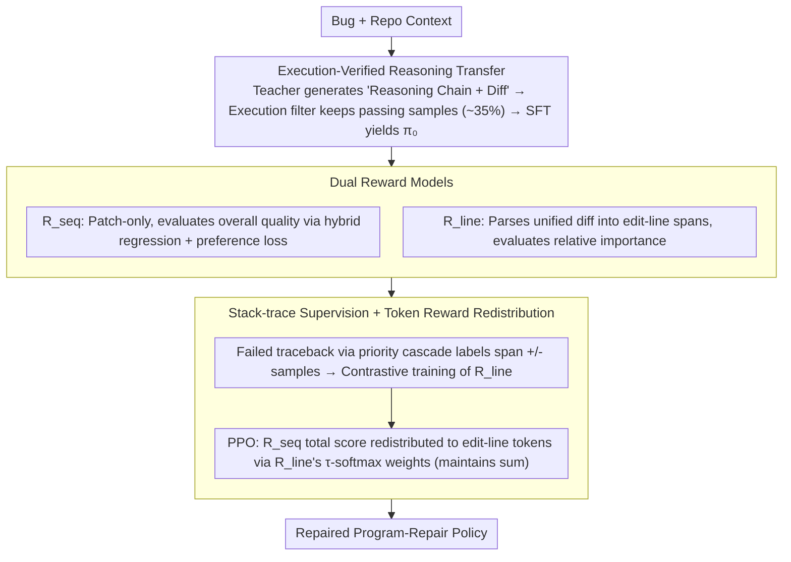

# BoostAPR: Boosting Automated Program Repair via Execution-Grounded Reinforcement Learning with Dual Reward Models

**Conference**: ICML 2026  
**arXiv**: [2605.09134](https://arxiv.org/abs/2605.09134)  
**Code**: https://github.com/yuanhao2023/BoostAPR  
**Area**: Code Intelligence / Automated Program Repair / Reinforcement Learning  
**Keywords**: Automated Program Repair, PPO, Dual Reward Models, Line-level Credit Assignment, SWE-bench

## TL;DR
BoostAPR introduces a three-stage pipeline for training program-repair models via RL: execution-verified SFT → dual rewards (sequence-level + line-level) → PPO where sequence rewards are redistributed to critical edit lines via the line-level model. Based on Qwen2.5-Coder-32B, it improves SWE-bench Verified from 17.8% to 40.7% (+22.9pp) and achieves 24.8% on Defects4J via cross-lingual transfer.

## Background & Motivation
**Background**: LLM-based Automated Program Repair (APR) has evolved from zero-shot prompting (e.g., GPT-4o + Agentless) to fine-tuning (SWE-Llama, Lingma-SWE-GPT, RepairLLaMA) and reinforcement learning (SWE-RL achieving 41% on SWE-bench Verified with 70B parameters). Agentic systems (SWE-agent, AutoCodeRover) achieve competitive results through tool use and fault localization.

**Limitations of Prior Work**: Training APR with RL faces three fundamental difficulties: (1) **Extremely sparse execution feedback**—as binary signals (pass/fail) cannot inform the model how "close" a patch is; (2) **Severe credit assignment issues**—for a 50-line patch, the model cannot distinguish which lines were critical vs. decorative when a patch succeeds or fails, leading to high gradient variance; (3) **Distribution shift**—significant gaps exist between curated training data and real-world repository bug patterns. Token-level reward models (Yoon 2024) are too granular, while process reward models (PRM, Lightman 2024) lack natural "steps" in code edits.

**Key Challenge**: To enable PPO to learn "which lines to fix," reward signals must be finer than sequence-level but more structured than token-level, without relying on expensive counterfactual patch evaluations or non-unique ground-truth matches.

**Goal**: (i) Train an execution-grounded **line-level credit allocator** $R_{\text{line}}$ to learn the importance of edit-line spans without counterfactuals; (ii) Combine $R_{\text{line}}$ with a **sequence-level reward** $R_{\text{seq}}$ for PPO; (iii) Provide a high-quality RL starting point via execution-verified SFT.

**Key Insight**: Unified diffs are parsed into maximal contiguous edit-line spans as "natural code edit units"—finer than hunks but more general than statements. Stack traces from failed executions are used to label spans on the traceback path as negative samples for contrastive supervision, avoiding expensive counterfactual evaluation.

**Core Idea**: Dual rewards = sequence-level (overall quality) + line-level (edit importance). During PPO, the total score from $R_{\text{seq}}$ is redistributed across tokens of edit-line spans based on $R_{\text{line}}$ softmax weights, achieving fine-grained credit redistribution.

## Method

### Overall Architecture
BoostAPR addresses the challenge of sparse, binary execution signals in RL for program repair. The pipeline consists of three stages: high-quality SFT using execution-verified demonstrations, training dual reward models (sequence and line level), and PPO where line-level importance redistributes the sequence reward. All stages are trained on SWE-Gym using Qwen2.5-Coder-32B-Instruct as the base policy and Qwen2.5-Coder-7B-Instruct with a scalar value head for reward models.

### Key Designs

**1. Execution-Verified Reasoning Transfer: Cold Start for RL ($\pi_0$)**

To prevent RL divergence, the first stage utilizes high-quality SFT. The teacher (Claude 3.5 Sonnet) is prompted to produce (reasoning trace, unified diff). Crucially, every patch is executed in the SWE-Gym runner, and **only samples with resolved=True are kept**. This strict filter (~35% pass rate) removes plausible-but-wrong demonstrations. Including reasoning traces allows the student to learn bug diagnosis. Training uses standard next-token loss with prompt masking: $\mathcal{L}_{\text{SFT}}=-\mathbb{E}_{(x,y)}[\sum_t \log \pi_\theta(y_t \mid x, y_{<t})]$.

**2. Dual Rewards (Sequence + Line): Calibration and Credit Assignment**

A single sequence-level reward suffers from credit assignment issues. BoostAPR trains a separate line-level model to learn the importance of edit lines. $R_{\text{seq}}$ evaluates overall patch quality and calibrates the reward scale, while $R_{\text{line}}$ focuses on relative importance.

$R_{\text{seq}}$ is designed as **patch-only**, scoring the unified diff without the bug context to prevent the model from exploiting "task difficulty" shortcuts. It is trained with a hybrid loss:

$$\mathcal{L}_{\text{seq}} = \lambda_{\text{reg}} \mathbb{E}[(R_{\text{seq}}(y;\theta) - r^*(x,y))^2] + \mathbb{E}_{(y^+, y^-)}[-w \log \sigma(R_{\text{seq}}(y^+) - R_{\text{seq}}(y^-))]$$

The calibration target $r^*$ is a composite signal of execution results $r_{\text{env}}$ and a penalty for excessive diff size $r_{\text{diff}}$. $R_{\text{line}}$ scores maximal contiguous edit-line spans. This granularity is semantic enough for credit assignment while remaining language-agnostic and robust to malformed diffs.

**3. Stack-Trace Supervision + Reward Redistribution: Learning Credit without Counterfactuals**

To supervise $R_{\text{line}}$ without expensive counterfactual evaluation, the model uses failed stack traces via a **priority cascade**:
- For passing patches: All edit spans are positive.
- For failed patches: Spans intersecting the stack call chain of a failing assertion are negative; otherwise, if a traceback exists, the edited function is penalized; finally, a uniform fallback is used for apply-failures.

$\mathcal{L}_{\text{line}}$ is a contrastive loss between positive and negative spans. During PPO, token-level reward $r_t$ is defined as $r_t = s \cdot a_t + \mathbb{I}[t=T] \cdot r_{\text{fmt}}(y)$, where $s = R_{\text{seq}}(y)$ and weights $a_t$ are derived from a $\tau$-softmax of line scores: $w_\ell = \exp(s_\ell/\tau)/\sum_j \exp(s_j/\tau)$. This **maintains the total reward sum** equal to $s$ ($\sum_t a_t = 1$), redistributing credit rather than scaling it, which stabilizes PPO advantages.

### Loss & Training
- **SFT**: $\mathcal{L}_{\text{SFT}}$, 3 epochs, lr 2e-5, batch 32.
- **Reward**: Stage II uses SFT policy nucleus sampling ($K=4$). $\mathcal{L}_{\text{seq}}$ (hybrid) and $\mathcal{L}_{\text{line}}$ (contrastive), 5 epochs, lr 1e-5.
- **PPO**: VERL + vLLM, clipped objective ($\epsilon=0.2$), GAE, adaptive KL (target 0.1), 300 steps, batch 64, rollouts/inst 4, LoRA rank 64.
- **Format Penalty**: $r_{\text{fmt}} \in \{0, -0.4, -1.0, -1.5\}$ applied to the final token to enforce valid unified diff format.

## Key Experimental Results

### Main Results
Pass@1 (greedy) under strict evaluation:

| Method | Backbone | SWE-V | D4J v2.0 | HE-Java | QuixBugs |
|--------|----------|-------|----------|---------|----------|
| Agentless | GPT-4o | 38.8 | 12.4* | 71.3* | 87.5* |
| SWE-agent | Claude 3.5 Sonnet | 33.6 | 10.8* | 68.9* | 85.0* |
| AutoCodeRover | GPT-4o | 28.8 | — | — | — |
| Qwen2.5-Coder-32B (base) | — | 17.8 | — | — | — |
| SWE-RL (70B) | — | 41.0 | — | — | — |
| **Ours (BoostAPR)** | Qwen2.5-Coder-32B | **40.7** | **24.8** | **84.5** | **95.0** |

Note: BoostAPR achieves 41% parity with the 70B SWE-RL model using only 32B parameters and significantly outperforms agentic baselines on cross-lingual benchmarks (Java).

### Ablation Study
Incremental gains on SWE-bench Verified:

| Configuration | SWE-V Pass@1 | Description |
|------|--------------|------|
| Base (Qwen2.5-Coder-32B) | 17.8 | Baseline performance |
| + Stage I SFT | ~30 | High-quality verified demonstrations drive initial gains |
| + Stage II + III ($R_{\text{seq}}$ only) | ~37 | PPO with sequence reward significantly improves accuracy |
| + $R_{\text{line}}$ (Full BoostAPR) | **40.7** | Line-level credit provides complementary gains |

### Key Findings
- **SFT + $R_{\text{seq}}$ drive ~60% of total Gain** (17.8 → ~37), acting as the primary engine. $R_{\text{line}}$ provides an additional ~4pp and enhances out-of-distribution generalization.
- **Strong Cross-lingual Transfer**: Training on Python-only data yields 24.8% on Java (Defects4J), suggesting the dual reward captures universal "code edit signals."
- **Patch-only $R_{\text{seq}}$ is critical**: Preventing the reward model from seeing context avoids the task-difficulty shortcut.
- **Stack-trace supervision** effectively replaces expensive counterfactual evaluations, providing cheap and grounded labels for credit assignment.

## Highlights & Insights
- **Mechanism**: The three-stage pipeline clearly separates cold-start, credit assignment, and online improvement.
- **Novelty**: Edit-line spans serve as an optimal intermediate granularity—more semantic than tokens and more structured than sequences.
- **Design Motivation**: By preserving the total reward sum during redistribution, the model ensures PPO advantage scales remain consistent.
- **Value**: BoostAPR demonstrates that smarter credit assignment can outperform pure parameter scaling (32B vs. 70B).

## Limitations & Future Work
- **Teacher Dependency**: Stage I relies on Claude 3.5 Sonnet; performance may degrade with weaker teachers.
- **Label Noise**: Traceback attribution (priority cascade) is still a noisy proxy for ground truth.
- **Edit Omission**: The line-span approach only scores existing edits and cannot identify where an edit *should* have been made but was missing.
- **Format Penalty**: Hard-coded penalties may require task-specific tuning.

## Related Work & Insights
- **vs. SWE-RL (Wei et al. 2025)**: BoostAPR achieves comparable performance with half the parameters by leveraging dual reward models.
- **vs. CodeRL (Le et al. 2022)**: Adds SFT warm-start and finer credit assignment beyond simple execution feedback.
- **Insight**: Intermediate unit credit assignment (edit-line spans) is a robust strategy for RL-for-code, applicable to debugging, refactoring, and test generation.

## Rating
- **Novelty**: ⭐⭐⭐⭐
- **Experimental Thoroughness**: ⭐⭐⭐⭐
- **Writing Quality**: ⭐⭐⭐⭐
- **Value**: ⭐⭐⭐⭐⭐

<!-- RELATED:START -->

## Related Papers

- [\[ICLR 2026\] Execution-Grounded Credit Assignment for GRPO in Code Generation](../../ICLR2026/code_intelligence/execution-grounded_credit_assignment_for_grpo_in_code_generation.md)
- [\[ACL 2026\] QiMeng-PRepair: Precise Code Repair via Edit-Aware Reward Optimization](../../ACL2026/code_intelligence/qimeng-prepair_precise_code_repair_via_edit-aware_reward_optimization.md)
- [\[ACL 2026\] DUET: Dual Execution for Test Output Prediction with Generated Code and Pseudocode](../../ACL2026/code_intelligence/duet_dual_execution_for_test_output_prediction_with_generated_code_and_pseudocod.md)
- [\[ACL 2026\] SOCIA-EVO: Automated Simulator Construction via Dual-Anchored Bi-Level Optimization](../../ACL2026/code_intelligence/socia-evo_automated_simulator_construction_via_dual-anchored_bi-level_optimizati.md)
- [\[ACL 2026\] CodeRL+: Improving Code Generation via Reinforcement with Execution Semantics Alignment](../../ACL2026/code_intelligence/coderl_improving_code_generation_via_reinforcement_with_execution_semantics_alig.md)

<!-- RELATED:END -->
