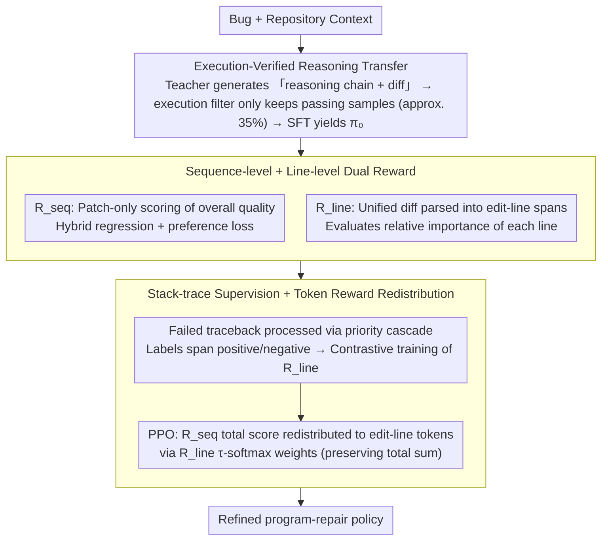

# BoostAPR: Boosting Automated Program Repair via Execution-Grounded Reinforcement Learning with Dual Reward Models

**Conference**: ICML 2026  
**arXiv**: [2605.09134](https://arxiv.org/abs/2605.09134)  
**Code**: https://github.com/yuanhao2023/BoostAPR  
**Area**: Code Intelligence / Automated Program Repair / Reinforcement Learning  
**Keywords**: Automated Program Repair, PPO, Dual Reward Models, Line-level Credit Assignment, SWE-bench

## TL;DR
BoostAPR constructs a three-stage pipeline for training program-repair models via RL: execution-verified SFT → training sequence-level + line-level dual reward models → redistributing sequence rewards to key edit-line spans using the line-level model during PPO. Using Qwen2.5-Coder-32B, it pushes SWE-bench Verified performance from 17.8% to 40.7% (+22.9pp) and achieves 24.8% on Defects4J through cross-lingual transfer.

## Background & Motivation
**Background**: LLM-based Automated Program Repair (APR) has evolved from zero-shot prompting (e.g., GPT-4o + Agentless) to fine-tuning (SWE-Llama, Lingma-SWE-GPT, RepairLLaMA) and recently to RL (SWE-RL attained 41% on SWE-bench Verified, لكن it utilized 70B parameters). Agentic systems (SWE-agent, AutoCodeRover) have achieved competitive results through tool use and fault localization.

**Limitations of Prior Work**: Training APR with RL faces three fundamental difficulties: (1) **Execution feedback is extremely sparse**—a patch either passes all tests or it does not; binary signals cannot inform the model if it was "close." (2) **Sequence-level rewards cause severe credit assignment issues**—for a 50-line patch, the model does not know which lines were critical and which were merely cosmetic, leading to high gradient variance. (3) **Distribution shift**—curated training data often differs significantly from real-world repository bug patterns. Token-level reward models (Yoon 2024) are too fine-grained and lack semantics; process reward models (Lightman 2024) rely on "steps" which work for mathematical reasoning but lack a natural correspondence in code editing.

**Key Challenge**: To enable PPO to learn "which lines to fix," the credit signal must be more granular than sequence-level but more structured than token-level, without relying on expensive counterfactual patch evaluations or unique ground-truth matches (which often do not exist).

**Goal**: (i) Train a **line-level credit allocator** $R_{\text{line}}$ using execution feedback to learn the importance of edit-line spans without counterfactual evaluation; (ii) combine it with a **sequence-level reward** $R_{\text{seq}}$ for PPO; (iii) provide a high-quality starting point for RL via execution-verified SFT.

**Key Insight**: Parse unified diffs into maximal contiguous edit-line spans as "natural code modification units"—finer than hunks but more general than statements (language-independent) and stable for malformed or cross-language diffs. Use stack-traces to label spans on failing traceback paths as negative samples for execution-grounded contrastive supervision, avoiding expensive counterfactual evaluation.

**Core Idea**: Dual reward = sequence-level (evaluating overall patch quality) + line-level (learning edit-line importance). During PPO, the total $R_{\text{seq}}$ score is redistributed to tokens in edit-line spans based on softmax weights from $R_{\text{line}}$, achieving fine-grained credit redistribution.

## Method

### Overall Architecture
BoostAPR addresses the challenge where binary test signals in RL training for program repair are too sparse to identify which lines in a multi-line patch are effective. The pipeline consists of three stages: SFT using high-quality execution-verified demonstrations to provide a stable starting point, training a dual reward model pair (sequence-level and line-level), and finally using PPO where the line-level model redistributes sequence rewards to critical edit lines. All stages are trained on SWE-Gym using Qwen2.5-Coder-32B-Instruct as the base policy and Qwen2.5-Coder-7B-Instruct with a scalar value head for both reward models.

### Key Designs

**1. Execution-Verified Reasoning Transfer: Cold Start for RL ($\pi_0$)**

RL is prone to divergence when starting from a weak policy. Thus, the first stage involves high-quality SFT. Instead of simple imitation, a teacher (Claude 3.5 Sonnet) is forced to output in (reasoning trace, unified diff) format. Each patch is executed in a SWE-Gym runner; **only samples with resolved=True are retained**. This strict filtering (passing only ~35% of generations) eliminates plausible-but-wrong demonstrations. Keeping reasoning traces allows the student to learn "how to diagnose" rather than just "outputting a diff." Training uses standard next-token loss with prompt masking: $\mathcal{L}_{\text{SFT}}=-\mathbb{E}_{(x,y)}[\sum_t \log \pi_\theta(y_t \mid x, y_{<t})]$.

**2. Dual Reward Models: Calibrating Scale and Assigning Credit**

A single sequence-level reward causes credit assignment issues. BoostAPR trains a line-level reward model to learn the importance of edit-lines. $R_{\text{seq}}$ evaluates overall quality and calibrates the PPO reward scale, while $R_{\text{line}}$ learns the relative importance of each edit-line for redistribution.

$R_{\text{seq}}$ uses a **patch-only scoring** design, viewing only the unified diff without bug context. This prevents the model from taking a shortcut by identifying "easy problems" rather than "good patches." Training uses a hybrid loss:

$$\mathcal{L}_{\text{seq}} = \lambda_{\text{reg}} \mathbb{E}[(R_{\text{seq}}(y;\theta) - r^*(x,y))^2] + \mathbb{E}_{(y^+, y^-)}[-w \log \sigma(R_{\text{seq}}(y^+) - R_{\text{seq}}(y^-))]$$

The regression term anchors scores to the execution reward $r^*$ for absolute scale calibration, while the preference term ensures correct relative ranking. $r^* = r_{\text{env}} + \gamma_{\text{diff}} r_{\text{diff}}$, where $r_{\text{env}}$ considers patch applicability and test pass rates, and $r_{\text{diff}}$ penalizes excessively large patches. $R_{\text{line}}$ parses diffs into maximal contiguous edit-line spans and scores them. Using line-spans provides better semantics than tokens and better structure than sequences, without requiring a language parser.

**3. Stack-trace Supervision + Sum-Preserving Token Reward Redistribution**

To avoid expensive counterfactual evaluations, $R_{\text{line}}$ uses failed stack-traces as grounded labels via a **priority cascade**. For passing patches, all edit spans are labeled positive. For failed patches: (1) if a failing assertion is found, the intersection of the stack call chain and edit-line spans is labeled negative (62%); (2) if a traceback exists without an assertion, "edited functions" in the traceback are scored lower (27%); (3) if the patch fails to apply, it falls back to a uniform label (11%).

In PPO, line-level scores are converted to token-level rewards: $r_t = s \cdot a_t + \mathbb{I}[t=T] \cdot r_{\text{fmt}}(y)$, where $s = R_{\text{seq}}(y)$ and $a_t$ is the normalized weight from the line-level span. Weights are calculated via temperature softmax: $w_\ell = \exp(s_\ell/\tau)/\sum_j \exp(s_j/\tau)$ ($\tau=0.5$). This **preserves the total reward $s$** ($\sum_t a_t = 1$), merely redistributing the score based on importance without distorting the advantage scale.

### Loss & Training
- SFT: $\mathcal{L}_{\text{SFT}}$, 3 epochs, lr 2e-5, batch size 32; teacher demonstrations filtered to ~35% pass rate.
- Reward: $\mathcal{L}_{\text{seq}}$ (hybrid regression + preference), $\mathcal{L}_{\text{line}}$ (contrastive), 5 epochs, lr 1e-5, batch size 64.
- PPO: Utilizing VERL + vLLM, clipped objective ($\epsilon=0.2$) + GAE + adaptive KL (target 0.1), 300 steps, batch size 64, 4 rollouts per instance, LoRA rank 64.
- Token reward formula: $r_t = s \cdot a_t + \mathbb{I}[t=T] r_{\text{fmt}}$, with format penalty $\in \{0, -0.4, -1.0, -1.5\}$.

## Key Experimental Results

### Main Results
Evaluation metric: pass@1 (greedy), strict evaluation with no patch post-processing:

| Method | Backbone | SWE-V | D4J v2.0 | HE-Java | QuixBugs |
|--------|----------|-------|----------|---------|----------|
| Agentless | GPT-4o | 38.8 | 12.4* | 71.3* | 87.5* |
| SWE-agent | Claude 3.5 Sonnet | 33.6 | 10.8* | 68.9* | 85.0* |
| AutoCodeRover | GPT-4o | 28.8 | — | — | — |
| Qwen2.5-Coder-32B (base) | — | 17.8 | — | — | — |
| SWE-RL (70B) | — | 41.0 | — | — | — |
| **Ours (BoostAPR)** | Qwen2.5-Coder-32B | **40.7** | **24.8** | **84.5** | **95.0** |

### Ablation Study
On SWE-bench Verified:

| Configuration | SWE-V Pass@1 | Description |
|------|--------------|------|
| Base (Qwen2.5-Coder-32B) | 17.8 | Baseline |
| + Stage I SFT (execution-verified) | ~30 | High-quality demonstrations are a primary driver |
| + Stage II + Stage III ($R_{\text{seq}}$ only) | ~37 | PPO with sequence rewards provides significant gain |
| + $R_{\text{line}}$ (Full BoostAPR) | **40.7** | Line-level credit provides complementary improvement |

### Key Findings
- **Stage I + $R_{\text{seq}}$ accounts for over 60% of total gain**, while $R_{\text{line}}$ provides an additional ~4pp and improves out-of-distribution generalization.
- **Strong cross-lingual transfer**: Training on Python and achieving 24.8% on Java (Defects4J) suggests the dual reward captures general code modification signals.
- **Patch-only $R_{\text{seq}}$ is critical** to prevent reward models from learning problem difficulty as a shortcut.
- **Stack-trace supervision** serves as a cost-effective alternative to counterfactual evaluation.

## Highlights & Insights
- **Structured three-stage pipeline**: SFT for cold-start, dual reward for credit assignment, and PPO for online improvement.
- **Intermediate granularity (Line-span)**: More semantic than tokens, more structured than sequences, and more robust than AST-based hunks.
- **Sum-preserving reward redistribution**: Ensures the total reward volume matches the sequence-level evaluation, maintaining stable advantage scales.
- **Execution-grounded supervision**: Uses actual execution trace data (priority cascade) to generate labels without manual annotation.

## Limitations & Future Work
- **Teacher dependence**: Relies on Claude 3.5 Sonnet for high-quality demonstrations in Stage I.
- **Label noise**: Approx. 11% of labels use uniform fallbacks; improving attribution accuracy is a future goal.
- **Missing edits**: The current $R_{\text{line}}$ only scores existing edits and cannot identify where an edit *should* have been made but wasn't.
- **Inference-time scaling**: Comparison with best-of-N or multi-turn agentic search is currently missing.

## Related Work & Insights
- **vs SWE-RL (Wei et al. 2025)**: BoostAPR achieves comparable performance (40.7% vs 41%) with half the parameters (32B vs 70B) by using dual rewards.
- **vs PRM (Lightman 2024)**: While PRMs use natural steps in math, BoostAPR defines "steps" in code repair as edit-line spans.
- **Insight**: Distributing rewards to intermediate units like edit-line spans is a robust strategy for RL-for-code. Hybrid regression-preference rewards offer better stability than pure preference models.

## Rating
- Novelty: ⭐⭐⭐⭐
- Experimental Thoroughness: ⭐⭐⭐⭐
- Writing Quality: ⭐⭐⭐⭐
- Value: ⭐⭐⭐⭐⭐

<!-- RELATED:START -->

## Related Papers

- [\[ICLR 2026\] Execution-Grounded Credit Assignment for GRPO in Code Generation](../../ICLR2026/code_intelligence/execution-grounded_credit_assignment_for_grpo_in_code_generation.md)
- [\[ACL 2026\] QiMeng-PRepair: Precise Code Repair via Edit-Aware Reward Optimization](../../ACL2026/code_intelligence/qimeng-prepair_precise_code_repair_via_edit-aware_reward_optimization.md)
- [\[ACL 2026\] DUET: Dual Execution for Test Output Prediction with Generated Code and Pseudocode](../../ACL2026/code_intelligence/duet_dual_execution_for_test_output_prediction_with_generated_code_and_pseudocod.md)
- [\[ACL 2026\] CodeRL+: Improving Code Generation via Reinforcement with Execution Semantics Alignment](../../ACL2026/code_intelligence/coderl_improving_code_generation_via_reinforcement_with_execution_semantics_alig.md)
- [\[ACL 2026\] SOCIA-EVO: Automated Simulator Construction via Dual-Anchored Bi-Level Optimization](../../ACL2026/code_intelligence/socia-evo_automated_simulator_construction_via_dual-anchored_bi-level_optimizati.md)

<!-- RELATED:END -->
