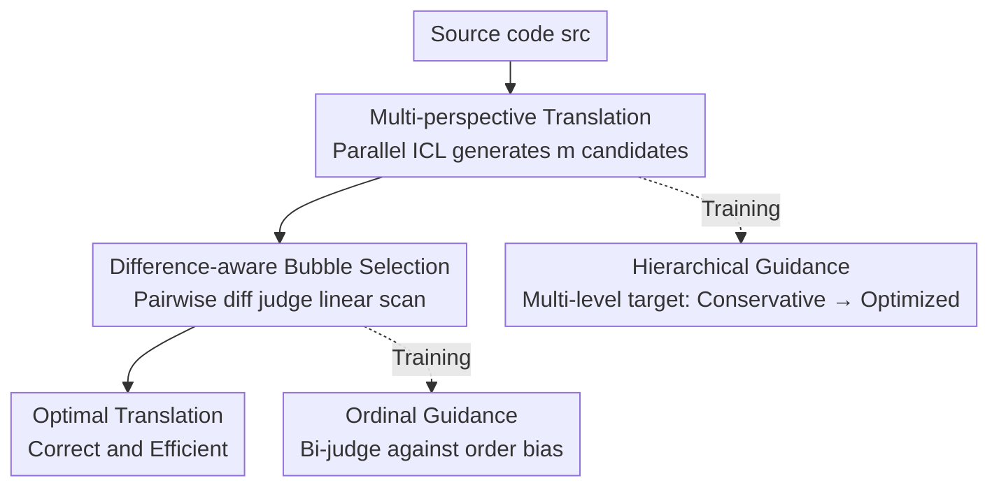

# Bridging Functional Correctness and Runtime Efficiency Gaps in LLM-Based Code Translation

**Conference**: ICML 2026  
**arXiv**: [2606.17683](https://arxiv.org/abs/2606.17683)  
**Code**: TBD  
**Area**: Code Intelligence / Code Translation / LLM  
**Keywords**: Code Translation, Runtime Efficiency, Parallel ICL, LLM-as-a-judge, Hierarchical Guidance

## TL;DR
Addressing the neglected problem where "LLM-translated code is functionally correct but slower than human-written code," this work proposes the SwiftTrans framework. It generates multi-perspective candidates using parallel ICL and selects the optimal candidate in linear time via a difference-aware pairwise judge using bubble-scan. Combined with Hierarchical Guidance and Ordinal Guidance training strategies, a Qwen2.5-3B model surpasses GPT-5 in both functional correctness and runtime efficiency.

## Background & Motivation
**Background**: Code translation (cross-language migration like C to Python or Java to Go) is a critical requirement for legacy system migration and cross-platform development. Since the emergence of LLMs, basic translation can be achieved with simple prompting, leading to a focus on "Computational Accuracy" (CA), which has improved significantly.

**Limitations of Prior Work**: Existing research largely ignores "how fast the translated code runs." Preliminary studies reveal two discouraging facts: (1) LLM-translated programs are generally slower than human-written equivalents in the same language because LLMs tend to copy the source logic and structure literally, inheriting inefficiencies and ignoring target-language-specific optimizations (e.g., Python built-ins, C pointers). (2) Balancing correctness and efficiency is difficult—directly using complex prompts for efficiency or performing post-hoc optimization often sacrifices correctness; prompt engineering alone cannot solve this.

**Key Challenge**: A trade-off between correctness and efficiency is amplified by existing methods. Forcing "aggressive optimization" introduces complexity that breaks correctness, while "conservative copying" sacrifices efficiency. A single, fixed translation strategy cannot adapt to tasks of varying difficulty.

**Goal**: Decomposition into two sub-problems: (1) How to generate diverse candidates ranging from "conservative-correct" to "aggressive-efficient"; (2) How to accurately select the specific candidate that is both correct and fast from candidates with extremely subtle differences.

**Key Insight**: Rather than forcing a single model to be both correct and fast, it is better to "cast a wide net for diverse candidates first, then select meticulously." Diversity is achieved through parallel ICL (different demonstration sets for each candidate), and selection is handled by a difference-aware pairwise judge.

**Core Idea**: A two-stage pipeline of "multi-perspective exploration + difference-aware selection" decouples the correctness-efficiency conflict into "generation diversity" and "selection accuracy," both of which can be optimized independently.

## Method

### Overall Architecture
Given source code, SwiftTrans operates in two stages. Stage 1: **Multi-Perspective Exploration**: MpTranslator generates $m$ differentiated candidate translations via parallel ICL, where each candidate sees a different set of demonstrations. Stage 2: **Difference-Aware Selection**: DiffSelector acts as a pairwise LLM-as-a-judge using a bubble-sort-style linear scan to select the best candidate. Both components are supported by specific training strategies: Hierarchical Guidance for MpTranslator and Ordinal Guidance for DiffSelector. This pipeline allows a lightweight open-source model (e.g., Qwen2.5-3B) to match or exceed large models like GPT-5.

### Key Designs

**1. Multi-Perspective Parallel ICL: Forcing diversity with different demonstration sets**

Traditional repeated sampling from the same prompt often lands in a narrow semantic space. MpTranslator instead constructs $m$ demonstration sets for source code $src$, each containing a random number (0 to $K$) of "source-target" pairs sampled from a large pool $\mathcal{C}$. Each set generates one candidate. This provides richer context than zero-shot and induces structurally different translation behaviors through varying contexts. In experiments, $m=10$ and $K=3$.

**2. Hierarchical Guidance Training: Teaching the model "richer context implies more aggressive optimization"**

Standard Instruction Fine-Tuning (IFT) leads to distribution shifts and diversity collapse. The authors construct **multi-level target codes**. Starting with functional translations from strong models (DeepSeek-Coder, Qwen3-Coder, etc.), they iteratively edit for acceleration over $n$ rounds ($n=3$). Each code has a sequence $\{tgt^0, tgt^1, \dots, tgt^n\}$, where $tgt^0$ is merely correct, and subsequent versions are at least 10% faster. Training **binds demonstration set size to optimization level**: for target $tgt^t$, a demonstration subset $\mathcal{D}^t$ of size $t$ is sampled, with the loss defined as:

$$\mathcal{L}_{\text{hg}} = -\frac{1}{n+1}\sum_{t}\sum_{i}\log p\left(tgt^t_i \mid \mathcal{D}^t, src, tgt^t_{<i}\right)$$

This allows the model to learn conservative translation with sparse context and aggressive optimization with rich context.

**3. Difference-Aware Pairwise Judge: Explicitly diffing subtle differences before judging**

Candidates from the same source often differ by only a few tokens. DiffSelector performs pairwise comparison, treating one candidate as a modified version of the other. It uses GNU diff to calculate a unified diff ($\text{diff}(tgt_1, tgt_2)$), explicitly presenting it to the judge to focus on "what changed and is it better," rather than re-reading nearly identical code.

**4. Bubble Selection: Compressing $\mathcal{O}(n^2)$ pairwise comparisons into $\mathcal{O}(n)$ scan**

To avoid the expense of $n^2$ comparisons for $n$ candidates, the authors treat DiffSelector as a comparator in a bubble-sort-style scan. It compares the first two candidates, keeps the winner, and compares it against the next candidate. This locates the optimal candidate in $n-1$ comparisons, reducing complexity to $\mathcal{O}(n)$.

**5. Ordinal Guidance Training: Bi-judge loss to combat candidate order bias**

To improve stability, the authors leverage the natural ordering: "Correct & Efficient ≻ Correct & Slow ≻ Incorrect." They train the judge using a **bi-judge loss** that requires the model to correctly identify $tgt^+ \succ tgt^-$ with "Yes" and its reverse $tgt^- \succ tgt^+$ with "No":

$$\mathcal{L}_{\text{og}} = -\frac{1}{2}\left[\log p(\text{Yes} \mid src, tgt^+ \succ tgt^-) + \log p(\text{No} \mid src, tgt^- \succ tgt^+)\right]$$

This mitigates the position bias common in LLM-as-a-judge frameworks.

### Loss & Training
Both components use open-source LLMs (e.g., Qwen2.5-3B) with full-parameter fine-tuning, a learning rate of 1e-5, and ~15k instances per scenario. It covers 20 translation directions across C, C++, Go, Java, and Python. MpTranslator uses $\mathcal{L}_{\text{hg}}$, while DiffSelector uses $\mathcal{L}_{\text{og}}$.

## Key Experimental Results

The authors extended CodeNet and F2SBench with efficiency-sensitive test cases and built **SwiftBench**, containing source programs with inherent inefficiencies (redundant computations, sub-optimal algorithms) published between June and October 2025 to prevent data leakage. Metrics include Computational Accuracy (CA) and Execution Time (ET).

### Main Results (CA % averaged across four target languages)

| Method | Model | CodeNet | F2SBench | SwiftBench | Avg. |
|------|------|---------|----------|------------|------|
| Cor.-Only | Qwen3-Next-80B | 78.0 | 64.2 | 77.6 | 73.3 |
| Cor.+Eff. | Qwen3-Next-80B | 75.6 | 57.1 | 73.1 | 68.6 |
| Cor.-Only | GPT-5 | 88.6 | 81.4 | 89.5 | 86.4 |
| Cor.+Eff. | GPT-5 | 84.4 | 73.1 | 82.0 | 79.8 |
| F2STrans (ICML'25) | Qwen2.5-3B | 86.4 | 73.4 | 86.2 | 82.0 |
| F2STrans (ICML'25) | Qwen2.5-7B | 89.7 | 75.8 | 88.1 | 84.6 |
| **SwiftTrans (Ours)** | **Qwen2.5-3B** | **92.x** | — | — | **>86.4** |

SwiftTrans using Qwen2.5-3B outperforms GPT-5 (Cor.-Only) in accuracy while maintaining superior execution efficiency.

### Ablation Study (GPT-5, CA% Avg)

| Prompt Strategy | Meaning | CA Avg ↑ | Relative to Cor.-Only |
|------------|------|---------|---------------|
| Cor.-Only | Accuracy only | 86.4 | Baseline |
| Cor.+Eff. | Accuracy + efficiency emphasis | 79.8 | −6.6 (Efficiency up, Accuracy down) |
| Cor.→Eff. | Post-hoc optimization | 62.7 | −23.7 (Severe accuracy drop) |

This quantifies the trade-off: any prompt-based attempt to inject efficiency sacrifices accuracy, confirming that prompt engineering alone is insufficient.

### Key Findings
- **Prompt engineering treats symptoms, not causes**: Emphasizing efficiency or post-optimizing reduces CA significantly, proving the trade-off cannot be bypassed by prompts.
- **Small model + framework > Large model alone**: Qwen2.5-3B in the SwiftTrans framework outperforms 80B models, showing gains from the framework design rather than scaling.
- **SwiftBench is the strongest differentiator**: Since the source code is inefficient, models that only "copy" source logic fail here.

## Highlights & Insights
- **Decoupling "Correct vs Efficient" into "Generation vs Selection"**: By letting the generator explore and the selector filter, the trade-off within a single model is resolved.
- **Demonstration size as a "difficulty knob"**: Binding $|\mathcal{D}^t|$ to optimization level $t$ allows the model to adjust its aggressiveness based on context.
- **Bubble Selection**: Adapting a classic algorithm reduces LLM-as-a-judge costs from $\mathcal{O}(n^2)$ to $\mathcal{O}(n)$.
- **Explicit Diff + Bi-judge**: These designs directly address the "subtle differences" and "position bias" weaknesses of LLM judges.

## Limitations & Future Work
- **Reliance on strong models for data**: Hierarchical data generation depends on teacher models (DeepSeek/Qwen3), effectively capping the quality.
- **External sandbox dependency**: Execution time metrics depend on Judge0, which may have variability across hardware/loads.
- **Fixed optimization depth**: Using $n=3$ is a hyperparameter; its optimality across different language pairs is not fully explored.
- **Compute overhead**: While selection is linear, generating $m=10$ candidates via parallel ICL incurs a 10x inference cost compared to single-shot GPT-5.

## Related Work & Insights
- **vs F2STrans (ICML 2025)**: F2STrans only optimizes for functional correctness; Ours elevates efficiency to an equal priority with new generation and selection components.
- **vs Repeat Sampling (Brown et al., 2024)**: Repeat sampling is limited to a narrow semantic space; Parallel ICL provides structural diversity.
- **vs Post-hoc Optimization (Shypula et al., 2024)**: Post-hoc methods often break correctness; SwiftTrans internalizes efficiency within the selection process.
- **vs Standard LLM-as-a-judge (Zheng et al., 2023)**: Explicit diffing and bi-judge training solve the issues of subtle candidate differences and position bias.

## Rating
- Novelty: ⭐⭐⭐⭐ First framework to systematically treat runtime efficiency as equal to correctness; novel combination of multi-perspective, difference-aware, and dual-guidance components.
- Experimental Thoroughness: ⭐⭐⭐⭐ Three benchmarks, 20 language directions, comparison with GPT-5; however, compute cost comparison for the generation phase is slightly lacking.
- Writing Quality: ⭐⭐⭐⭐ Clear logic across motivation, method, and experiments.
- Value: ⭐⭐⭐⭐ High engineering value by enabling small models to outperform large models in practical code translation.

<!-- RELATED:START -->

## Related Papers

- [\[ICML 2026\] Towards Functional Correctness of Code Models with Selective Generation](towards_functional_correctness_of_large_code_models_with_selective_generation.md)
- [\[ICML 2026\] MatchFixAgent: Language-Agnostic Autonomous Repository-Level Code Translation Validation and Repair](matchfixagent_language-agnostic_autonomous_repository-level_code_translation_val.md)
- [\[ACL 2026\] Bootstrapping Code Translation with Weighted Multilanguage Exploration](../../ACL2026/code_intelligence/bootstrapping_code_translation_with_weighted_multilanguage_exploration.md)
- [\[ACL 2026\] SolidCoder: Bridging the Mental-Reality Gap in LLM Code Generation through Concrete Execution](../../ACL2026/code_intelligence/solidcoder_bridging_the_mental-reality_gap_in_llm_code_generation_through_concre.md)
- [\[ICML 2025\] Function-to-Style Guidance of LLMs for Code Translation](../../ICML2025/code_intelligence/function-to-style_guidance_of_llms_for_code_translation.md)

<!-- RELATED:END -->
