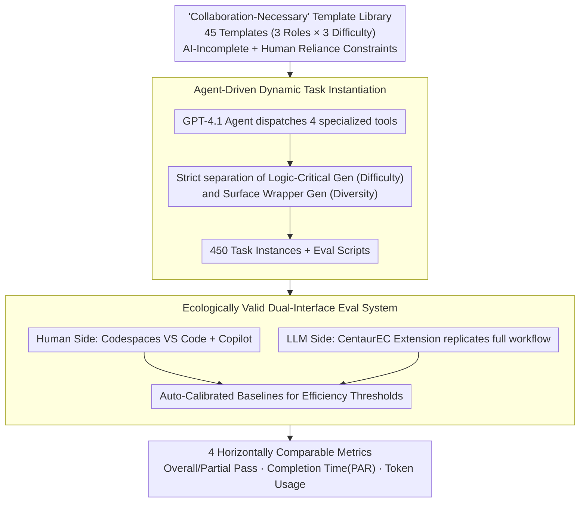

# CentaurEval: Benchmarking Human-in-the-Loop Value in Agentic Coding

**Conference**: ICML 2026  
**arXiv**: [2512.04111](https://arxiv.org/abs/2512.04111)  
**Code**: Yes (Open-source evaluation toolkit + 450 task dataset)  
**Area**: Code Intelligence  
**Keywords**: Human-AI collaboration evaluation, Code agents, Benchmark, Collaborative programming, High-order reasoning  

## TL;DR

CentaurEval is proposed as the first unified evaluation framework for human-AI collaborative programming. By designing 45 "Collaboration-Necessary" task templates, it demonstrates that LLMs alone achieve only a 0.67% pass rate and humans alone achieve 18.89%, while human-AI collaboration reaches 31.11%, revealing that LLMs are evolving from execution tools into co-reasoning partners.

## Background & Motivation

**Background**: LLM-driven programming agents (Claude Code, Cursor, GitHub Copilot) are widely used in industrial development. The developer's role is shifting from a "code producer" to the "leader of a human-AI collaborative system."

**Limitations of Prior Work**: Existing evaluation systems have fundamental flaws. Human-oriented platforms (LeetCode, Codeforces) test algorithmic skills that are being automated; AI-oriented benchmarks (HumanEval, SWE-Bench) seek authenticity but still assume problems are perfectly defined, ignoring high-order reasoning such as requirement clarification and strategy decomposition. Crucially, existing evaluations assess humans and AI in isolation, failing to quantify the value of collaboration.

**Key Challenge**: There is a lack of an evaluation framework that simultaneously satisfies two needs: (1) quantifying the human contribution in human-AI collaboration; and (2) challenging the high-order reasoning capabilities of LLMs with real-world complexity rather than pure algorithmic difficulty.

**Goal**: Construct a unified human-AI collaborative programming benchmark, including an ecologically valid evaluation environment and "Collaboration-Necessary" task designs.

**Key Insight**: Based on distributed cognition theory, cognition occurs not only within an individual but is distributed across humans, tools, and environments. True assessment should use the human-AI pair as the unit of analysis rather than evaluating either party in isolation.

**Core Idea**: Design "Collaboration-Necessary" tasks that are unsolvable by either LLMs or humans alone but solvable through effective collaboration. Provide dual interfaces—a cloud IDE (for human evaluation) and an automated toolkit (for LLM evaluation)—to achieve unified and comparable assessment.

## Method

### Overall Architecture

The core problem CentaurEval addresses is that existing evaluations test either only the AI or only the human, failing to quantify the value of "human-AI collaboration" itself. The approach shifts the unit of analysis from the "individual" to the "human-AI pair," building a unified framework where both humans and LLMs can be evaluated under equivalent conditions using tasks deliberately designed to be unsolvable individually but solvable collaboratively. The system consists of four parts: a task template library, a dynamic task generator, a cloud IDE for humans, and an automated toolkit for LLMs, ultimately outputting horizontally comparable pass/fail and efficiency metrics.

### Key Designs

**1. "Collaboration-Necessary" Task Library: Creating tasks unsolvable individually but solvable collaboratively**

To quantify collaboration value, tasks must be difficult for both standalone LLMs and humans but solvable through collaboration. This work wraps multiple layers of real-world complexity around a core algorithm. For AI-Incomplete constraints, it injects under-defined requirements, multi-modal specifications (UML/ER diagrams), and legacy codebase relational complexity, preventing LLMs from cleanly decomposing tasks into executable steps. For Human Reliance constraints, it embeds massive repetitive implementations and uncommon APIs under strict time limits, making pure manual solutions infeasible. These constraints are formalized as requiring a low pure-AI success probability $\Pr(\text{Solve}(t, \mathcal{A})) \leq \theta_{\text{low}}$ and a significant gain from collaboration compared to humans alone $\mathbb{E}[\text{Score}(s_{\mathcal{H}+\mathcal{A}})] - \mathbb{E}[\text{Score}(s_{\mathcal{H}})] \geq \delta$. Under these conditions, performance differences represent the value of collaboration rather than individual capability. 45 templates cover 3 professional roles × 3 difficulty levels.

**2. Agent-driven dynamic task instantiation: Preventing data leakage without introducing extraneous difficulty**

Static question banks become distorted once seen by models; thus, infinite diverse instances are generated from templates. A GPT-4.1 Agent dispatches four tools for instantiation: TechnicalParameterTool for logic parameters, ImplementationConstraintTool for framework configurations, ContextualVariableTool for real-world scenarios, and InterfaceSpecificationTool for interface details. The key is strictly separating "logic-critical generation" from "surface wrapper generation"—the former deterministically sets task difficulty, while the latter handles diversity. This ensures variation between instances only changes the appearance and does not hiddenly increase cognitive difficulty, maintaining fairness while allowing for expansion.

**3. Ecologically valid dual-interface evaluation system: Comparable conditions for humans and LLMs**

Direct comparisons between humans and LLMs must exclude environmental differences as confounding factors. The human side uses GitHub Codespaces with a full VS Code + Copilot environment to mitigate tool familiarity bias. The LLM side uses the CentaurEC extension to replicate the human operation flow—environment deployment, task injection, code generation, test feedback, and iterative correction. To make efficiency metrics comparable across platforms, Auto-Calibrated Baselines are introduced: reference solutions are run to dynamically calibrate efficiency thresholds. The evaluation records five raw metrics (test case pass/fail, execution time, peak memory, completion time, token usage), aggregated into four analysis metrics: Overall Pass, Partial Pass, Completion Time (using Penalized Average Runtime PAR, where timeouts are recorded as 60 minutes), and Token Usage.

## Key Experimental Results

### Main Results

Comparative experiments were conducted with 45 expert participants and 5 SOTA LLMs under 4 conditions: $C_H$ (Human only), $C_0$ (Autonomous AI), $C_1$ (Minimal Intervention AI), and $C_2$ (Human-AI Collaboration).

| Experimental Condition | Average Pass@1 | 95% CI | Description |
|----------|------------|--------|------|
| $C_0$ (Autonomous AI) | 0.67% | 0.23–1.94 | LLM alone |
| $C_1$ (Min. Intervention) | 2.89% | 1.70–4.88 | Fixed procedural failures only |
| $C_H$ (Human only) | 18.89% | 12.1–28.2 | No AI assistance |
| $C_2$ (Collaboration) | **31.11%** | 22.5–41.3 | Free use of Copilot |

### Performance of LLMs under different conditions

| Model | $C_0$ Pass@1 | $C_1$ Pass@1 | $C_0$ Partial | $C_1$ Partial |
|------|-------------|-------------|---------------|---------------|
| Claude-Sonnet-4 | 0.67% | 2.89% | 19.24% | 30.13% |
| Claude-Sonnet-3.7 | 0.00% | 1.56% | 8.71% | 17.47% |
| GPT-4.1 | 0.00% | 1.78% | 11.16% | 23.64% |
| GPT-4o | 0.00% | 0.00% | 5.82% | 12.09% |
| Gemini-2.5-Pro | 0.22% | 2.22% | 8.27% | 21.33% |

### Difficulty stratification analysis

| Difficulty | $C_H$ Pass | $C_0$ Pass | $C_1$ Pass | $C_2$ Pass |
|------|-----------|-----------|-----------|-----------|
| Easy | 36.7% | 1.3% | 4.0% | 43.3% |
| Medium | 13.3% | 0.7% | 2.7% | 26.7% |
| Hard | 6.7% | 0.0% | 2.0% | 23.3% |

### Key Findings

- **Significant Collaboration Gain**: $C_2$ improved by 12.22 percentage points over $C_H$ ($p = 0.00739$) and over 28 percentage points over the strongest standalone LLM.
- **Higher Difficulty Increases Collaboration Importance**: Human Pass rates dropped from 36.7% (Easy) to 6.7% (Hard) (an 82% decrease), but the collaborative mode only dropped from 43.3% to 23.3% (a 46% decrease), showing a clear "gain amplification" effect on difficult tasks.
- **LLM Bottleneck lies in Reasoning, not Execution**: The improvement from $C_0$ to $C_1$ (fixing procedural failures) suggests that current LLM failures are not just environmental interaction issues but stem fundamentally from a lack of high-order reasoning.
- **51% of participants adopted fundamentally different problem-solving strategies proposed by AI**, and 12 of the top 15 performers utilized strategic advice from the AI.

## Highlights & Insights

- **"Collaboration-Necessary" Task Design Paradigm**: By wrapping real-world complexity (under-defined requirements, multimodal specs) around an algorithmic core, it creates blind spots for both LLMs and humans. This "bilateral insolvability" design can be generalized to other human-AI collaboration evaluation scenarios.
- **Cognitive Shift from Tool to Partner**: 80% of participants used AI for strategic brainstorming, and 51% adopted entirely new plans proposed by AI. This is no longer the traditional "human thinks, AI writes" mode but true co-reasoning—a finding with significant implications for AI-assisted education and tool design.
- **Dual-Track Evaluation System**: Using dynamic instantiation for humans prevents memorization, while static instances for LLMs ensure reproducibility. Both sides are unified through the same templates and evaluation scripts, a design transferable to other human-AI mixed evaluation settings.

## Limitations & Future Work

- Currently supports only Python, not covering multilingual development scenarios.
- Relies on GitHub Copilot as a unified interface, failing to evaluate other major models like o3, GPT-5, DeepSeek, LLaMA, or Qwen.
- Participants were all East Asian university students/recent graduates, limiting generalizability to industry developers and other groups.
- "Collaboration-Necessary" is a dynamic concept relative to model capability; as models improve, some tasks may become autonomously solvable—though this allows CentaurEval to track the movement of autonomous boundaries.
- Converting efficiency metrics to discrete pass/fail results loses some fine-grained information.

## Related Work & Insights

- **HumanEval / SWE-Bench** — Evaluate LLM programming capability in isolation, ignoring the human-AI collaboration dimension.
- **LeetCode / Codeforces** — Human-centric competitive programming platforms testing skills being replaced by automation.
- **Centaur Evaluation Theory (Haupt & Brynjolfsson 2025)** — Proposed the concept of quantifying human contribution in collaboration; CentaurEval is its first implementation in the programming domain.
- **Distributed Cognition Theory (Hutchins 1995)** — The theoretical basis for cognitive distribution across humans, tools, and environments, supporting the "human-AI pair" as the unit of analysis.
- Personal Insight: Evaluating AI systems should not only focus on independent AI capability but also on the overall performance upper bound and collaborative efficiency of the human-AI system.

<!-- RELATED:START -->

## Related Papers

- [\[ACL 2026\] FormalScience: Scalable Human-in-the-Loop Autoformalisation of Science with Agentic Code Generation in Lean](../../ACL2026/code_intelligence/formalscience_scalable_human-in-the-loop_autoformalisation_of_science_with_agent.md)
- [\[ICML 2026\] SWE-IF: Aligning Code Evaluation with Human Preference](swe-if_aligning_code_evaluation_with_human_preference.md)
- [\[ICML 2026\] NEMO: Execution-Aware Optimization Modeling via Autonomous Coding Agents](nemo_execution-aware_optimization_modeling_via_autonomous_coding_agents.md)
- [\[ICLR 2026\] FHE-Coder: Benchmarking Secure Agentic Code Generation for Fully Homomorphic Encryption](../../ICLR2026/code_intelligence/fhe-coder_benchmarking_secure_agentic_code_generation_for_fully_homomorphic_encr.md)
- [\[ICLR 2026\] VERINA: Benchmarking Verifiable Code Generation](../../ICLR2026/code_intelligence/verina_benchmarking_verifiable_code_generation.md)

<!-- RELATED:END -->
