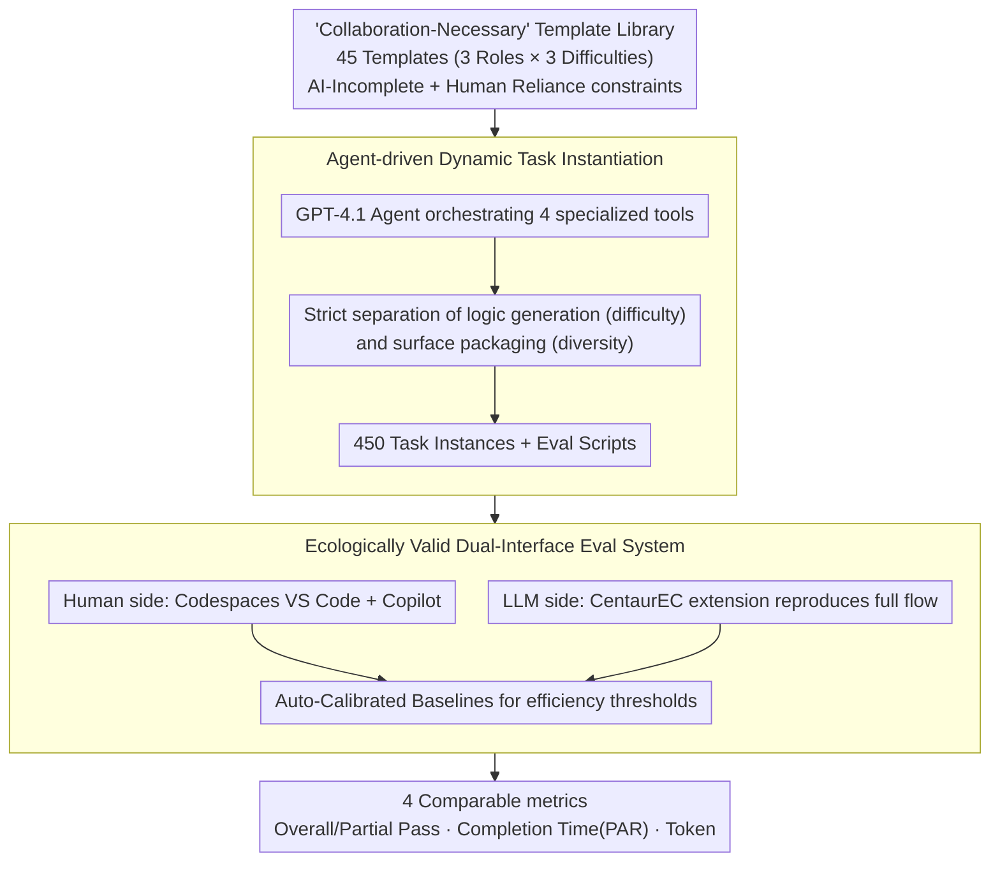

# CentaurEval: Benchmarking Human-in-the-Loop Value in Agentic Coding

**Conference**: ICML 2026  
**arXiv**: [2512.04111](https://arxiv.org/abs/2512.04111)  
**Code**: Yes (Open-source evaluation toolkit + 450-task dataset)  
**Area**: Code Intelligence  
**Keywords**: Human-AI Collaboration Evaluation, Code Agents, Benchmark, Collaborative Programming, High-order Reasoning  

## TL;DR

Ours proposes CentaurEval, the first unified evaluation framework for human-AI collaborative programming. By designing 45 "Collaboration-Necessary" task templates, it demonstrates that a standalone LLM achieves only a 0.67% pass rate and humans alone achieve 18.89%, while human-AI collaboration reaches 31.11%, revealing that LLMs are evolving from execution tools to co-reasoning partners.

## Background & Motivation

**Background**: LLM-driven programming agents (Claude Code, Cursor, GitHub Copilot) are widely used in industrial development. The developer's role is shifting from "code producer" to "leader of human-AI collaborative systems."

**Limitations of Prior Work**: Existing evaluation systems have fundamental flaws. Human-oriented platforms (LeetCode, Codeforces) test algorithmic skills that are being automated; AI-oriented benchmarks (HumanEval, SWE-Bench) pursue authenticity but still assume perfectly defined problems, ignoring the evaluation of high-order reasoning such as requirement clarification and strategy decomposition. Crucially, existing evaluations assess humans and AI in isolation, failing to quantify the value of collaboration.

**Key Challenge**: There is a lack of an evaluation framework that simultaneously satisfies two needs: (1) quantifying human contribution in human-AI collaboration; (2) challenging the high-order reasoning of LLMs with real-world complexity rather than pure algorithmic difficulty.

**Goal**: Construct a unified human-AI collaborative programming benchmark, including an ecologically valid evaluation environment and "Collaboration-Necessary" task designs.

**Key Insight**: Based on distributed cognition theory, cognition occurs not only within an individual but is distributed across people, tools, and environments; true evaluation should use the human-AI pair as the unit of analysis rather than evaluating either party in isolation.

**Core Idea**: Design "Collaboration-Necessary" tasks that are unsolvable for either a standalone LLM or a human but solvable through effective collaboration. Provide dual interfaces—a cloud IDE (for human evaluation) and an automated toolkit (for LLM evaluation)—to achieve unified and comparable results.

## Method

### Overall Architecture

The core problem CentaurEval addresses is that existing evaluations either test only AI or only humans, failing to quantify the value of "human-AI collaboration" itself. Its solution is to change the unit of analysis from "individual" to "human-AI pair," building a unified framework where both humans and LLMs can be evaluated in equivalent environments around tasks specifically designed to be unsolvable individually but solvable collaboratively. The system consists of a task template library, a dynamic task generator, a cloud IDE for humans, and an automated toolkit for LLMs, ultimately outputting comparable pass/fail and efficiency metrics.

### Key Designs

**1. "Collaboration-Necessary" Template Library: Creating tasks unsolvable individually but solvable collaboratively**

To quantify collaboration value, tasks must be difficult for both a standalone LLM and a human, but resolvable through collaboration. This work wraps multiple layers of real-world complexity around a core algorithm: the AI-Incomplete direction injects under-defined requirements, multimodal specifications (UML/ER diagrams), and legacy codebase complexity, preventing LLMs from cleanly decomposing tasks into executable steps; the Human Reliance direction embeds repetitive implementations and uncommon APIs with time constraints, making pure manual solutions unfeasible. These constraints are formalized as: requiring a sufficiently low solving probability for pure AI $\Pr(\text{Solve}(t, \mathcal{A})) \leq \theta_{\text{low}}$, and a significant gain for human-AI collaboration over independent humans $\mathbb{E}[\text{Score}(s_{\mathcal{H}+\mathcal{A}})] - \mathbb{E}[\text{Score}(s_{\mathcal{H}})] \geq \delta$. When these conditions are met, the performance gap represents the value of collaboration itself. 45 templates cover 3 roles × 3 difficulty levels based on this principle.

**2. Agent-driven Dynamic Task Instantiation: Preventing data leakage without introducing extra difficulty**

Static test sets lose validity once seen by models, so infinite diverse instances must be generated from templates. Ours uses a GPT-4.1 Agent orchestrating four tools: TechnicalParameterTool for logical parameters, ImplementationConstraintTool for framework configurations, ContextualVariableTool for real-world packaging, and InterfaceSpecificationTool for interface details. The key is strictly separating "logic generation" from "surface packaging"—the former determines task difficulty deterministically, while the latter only handles surface variation to ensure diversity. This ensures that variations between instances only change the appearance without hidden cognitive difficulty spikes, maintaining fairness while allowing continuous expansion. Each instance produces a task package and matching evaluation scripts.

**3. Ecologically Valid Dual-Interface Evaluation System: Comparing humans and LLMs on equivalent terms**

To compare humans and LLMs directly, environmental differences must be excluded as confounding factors. The human side uses GitHub Codespaces with a full VS Code + Copilot setup to eliminate tool familiarity variance; the LLM side uses the CentaurEC extension to replicate the full human workflow—environment deployment, task injection, code generation, test feedback, and iterative correction—using 450 static instances to ensure reproducibility. To make efficiency metrics comparable across platforms, the system introduces Auto-Calibrated Baselines: it dynamically calibrates efficiency thresholds using reference solutions to measure performance. Evaluation follows a two-stage protocol, recording 5 raw metrics (pass/fail, execution time, peak memory, completion time, token usage) aggregated into 4 analysis metrics: Overall Pass, Partial Pass, Completion Time (using Penalized Average Runtime PAR, where timeouts are recorded as 60 minutes), and Token Usage.

## Key Experimental Results

### Main Results

Comparative experiments were conducted across 45 expert participants + 5 SOTA LLMs under 4 conditions: $C_H$ (Human only), $C_0$ (Autonomous AI), $C_1$ (Minimal Intervention AI), and $C_2$ (Human-AI Collaboration).

| Condition | Avg Pass@1 | 95% CI | Description |
|----------|------------|--------|------|
| $C_0$ (Autonomous AI) | 0.67% | 0.23–1.94 | LLM completed independently |
| $C_1$ (Minimal Intervention) | 2.89% | 1.70–4.88 | Fixed only procedural failures |
| $C_H$ (Human only) | 18.89% | 12.1–28.2 | No AI assistance |
| $C_2$ (Human-AI Collaboration) | **31.11%** | 22.5–41.3 | Free use of Copilot |

### Performance of Various LLMs Under Different Conditions

| Model | $C_0$ Pass@1 | $C_1$ Pass@1 | $C_0$ Partial | $C_1$ Partial |
|------|-------------|-------------|---------------|---------------|
| Claude-Sonnet-4 | 0.67% | 2.89% | 19.24% | 30.13% |
| Claude-Sonnet-3.7 | 0.00% | 1.56% | 8.71% | 17.47% |
| GPT-4.1 | 0.00% | 1.78% | 11.16% | 23.64% |
| GPT-4o | 0.00% | 0.00% | 5.82% | 12.09% |
| Gemini-2.5-Pro | 0.22% | 2.22% | 8.27% | 21.33% |

### Analysis by Difficulty Level

| Difficulty | $C_H$ Pass | $C_0$ Pass | $C_1$ Pass | $C_2$ Pass |
|------|-----------|-----------|-----------|-----------|
| Easy | 36.7% | 1.3% | 4.0% | 43.3% |
| Medium | 13.3% | 0.7% | 2.7% | 26.7% |
| Hard | 6.7% | 0.0% | 2.0% | 23.3% |

### Key Findings

- **Collaborative Gain is Significant**: $C_2$ is 12.22 percentage points higher than $C_H$ ($p = 0.00739$) and over 28 percentage points higher than the strongest standalone LLM.
- **Higher Difficulty Increases Collaboration Importance**: Human Pass drops from 36.7% (Easy) to 6.7% (Hard) (an 82% decrease), while the collaboration mode only drops from 43.3% to 23.3% (a 46% decrease), showing a clear "gain amplification" effect in difficult tasks.
- **LLM Bottlenecks are in Reasoning, Not Execution**: The Gain from $C_0$ to $C_1$ (fixing procedural failures) shows that current LLM failures are not just environmental interaction issues but stem fundamentally from a lack of high-order reasoning.
- **51% of participants adopted fundamentally different strategies proposed by AI**, and 12 of the top 15 performers used AI for strategic advice.

## Highlights & Insights

- **"Collaboration-Necessary" Task Paradigm**: By wrapping real-world complexity (under-defined requirements, multimodal specs) around an algorithmic core, this "bilateral unsolvability" design can be generalized to other human-AI collaboration evaluation scenarios.
- **Cognitive Leap from Tool to Partner**: The experiment found 80% of participants used AI for strategic brainstorming and 51% adopted AI-proposed solutions. This is no longer the "human thinks, AI writes" mode but true co-reasoning—a finding with significant implications for AI-assisted education and tool design.
- **Dual-Track System of Dynamic Generation and Static Evaluation**: The human side uses dynamic instantiation to prevent memory effects, while the LLM side uses 450 static tasks to ensure reproducibility. Both sides use the same templates and scripts to ensure comparability, a design transferable to other human-AI hybrid evaluations.

## Limitations & Future Work

- Currently supports only the Python language, failing to cover multi-language development scenarios.
- Relies on GitHub Copilot as the unified interface, failing to evaluate other major models like o3, GPT-5, DeepSeek, LLaMA, or Qwen.
- Participants are entirely East Asian university students/recent graduates; the generalizability to industry developers and other demographics is limited.
- "Collaboration-Necessary" is a dynamic concept relative to current model capabilities; as models advance, some tasks may become autonomously solvable—though this allows CentaurEval to track the movement of the autonomy boundary.
- Converting efficiency metrics to discrete pass/fail results in the loss of some fine-grained information.

## Related Work & Insights

- **HumanEval / SWE-Bench** — Evaluates LLM programming independently without considering human-AI collaboration.
- **LeetCode / Codeforces** — Human-oriented competitive platforms testing skills being automated.
- **Centaur Evaluation Theory (Haupt & Brynjolfsson 2025)** — Proposed quantifying human contribution in human-AI collaboration; CentaurEval is the first implementation in the programming domain.
- **Distributed Cognition Theory (Hutchins 1995)** — The theoretical foundation for cognition being distributed across human-tool-environment, supporting "human-AI pair as analysis unit" design.
- Personal Insight: Evaluating AI systems should focus not just on independent AI capability but on the overall performance ceiling and collaborative efficiency of the human-AI system.

<!-- RELATED:START -->

## Related Papers

- [\[ACL 2026\] FormalScience: Scalable Human-in-the-Loop Autoformalisation of Science with Agentic Code Generation in Lean](../../ACL2026/code_intelligence/formalscience_scalable_human-in-the-loop_autoformalisation_of_science_with_agent.md)
- [\[ICML 2026\] NEMO: Execution-Aware Optimization Modeling via Autonomous Coding Agents](nemo_execution-aware_optimization_modeling_via_autonomous_coding_agents.md)
- [\[ACL 2026\] CodeDistiller: Automatically Generating Code Libraries for Scientific Coding Agents](../../ACL2026/code_intelligence/codedistiller_automatically_generating_code_libraries_for_scientific_coding_agen.md)
- [\[ACL 2026\] SecureVibeBench: Evaluating Secure Coding Capabilities of Code Agents with Realistic Vulnerability Scenarios](../../ACL2026/code_intelligence/securevibebench_evaluating_secure_coding_capabilities_of_code_agents_with_realis.md)
- [\[AAAI 2026\] Unintended Misalignment from Agentic Fine-Tuning: Risks and Mitigation](../../AAAI2026/code_intelligence/unintended_misalignment_from_agentic_fine-tuning_risks_and_m.md)

<!-- RELATED:END -->
