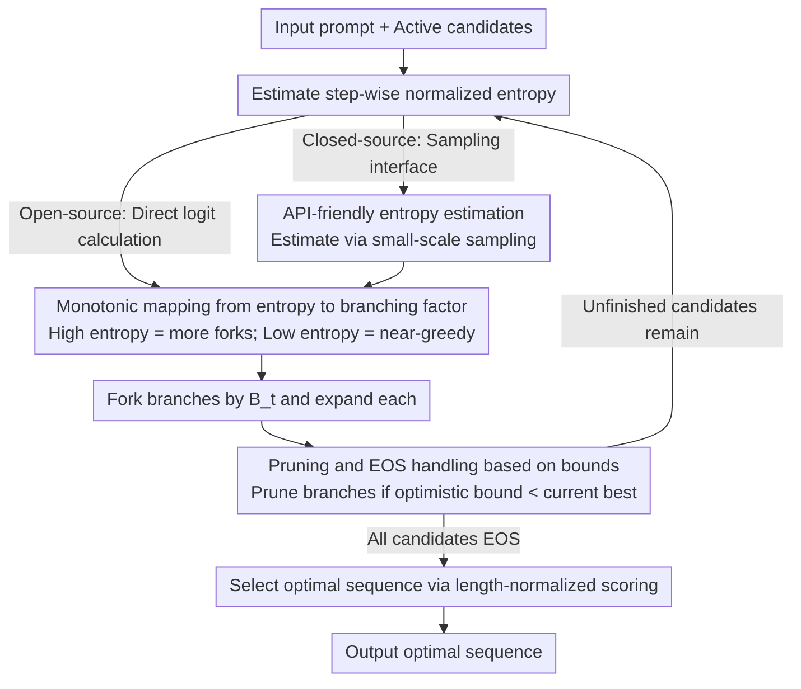

# Entropy-informed Decoding: Adaptive Information-Driven Branching

**Conference**: ICML 2026  
**arXiv**: [2605.09745](https://arxiv.org/abs/2605.09745)  
**Code**: None  
**Area**: LLM Decoding / Adaptive Inference / Information Theory  
**Keywords**: Entropy-adaptive, branching factor, beam search, inference compute allocation, regret bound

## TL;DR
EDEN (Entropy-informed DEcodiNg) sets the step-wise beam width $B_t$ to be monotonically proportional to the normalized entropy $\bar H_t$—branching more at high-entropy forks and behaving almost greedily during low-entropy steps. This approximates wider beam search with fewer total expansions. The authors theoretically prove that entropy-monotonic branching factors are strictly superior to any fixed beam width in terms of expected cumulative regret, providing an explicit regret rate of $\mathbb{E}[R_T] \leq G P_\max \sum_t \exp(-c m_t \Delta_\min^2)$.

## Background & Motivation

**Background**: LLM inference decoding generally follows two paths: (1) Sampling methods (top-$k$, nucleus $p$, min-$p$, top-$H$) trade determinism for diversity but usually follow a single path; (2) Search methods (beam search, best-of-$n$, majority voting) explicitly expand multiple candidates and select the best, but their computational cost is independent of task difficulty—simple problems consume as many branches as difficult ones.

**Limitations of Prior Work**: Sampling methods suffer from **narrow exploration**, committing to one path at a time and risking being locked into suboptimal sequences by early low-probability tokens. Search methods exhibit **uniform exploration**, allocating the same compute to easy and hard tokens, leading to significant waste. Existing entropy-related works (Simonds 2025, Entropix, Top-$H$, HARP, etc.) either use entropy only as a binary trigger (branch or not) or for model switching/sampling truncation; none have **directly mapped entropy continuously to beam width** with theoretical guarantees.

**Key Challenge**: Optimal decoding should be "greedy when possible, branching when necessary." However, current methods treat the branching factor as a fixed hyperparameter, failing to adaptively allocate compute based on token difficulty during generation.

**Goal**: (1) Design a pluggable, model-agnostic search strategy where step-wise compute scales with the model's own uncertainty; (2) Provide a rigorous regret bound using a noisy-maximization framework; (3) Ensure compatibility with closed-source models (estimating entropy via API access only).

**Key Insight**: Next-token selection can be viewed as a noisy maximization problem under sub-Gaussian noise. If the estimation budget $m_t$ matches the "step difficulty," the error probability decreases exponentially. Shannon entropy $H_t$ characterizes both the number of viable candidates (perplexity $\text{PP}_t = e^{H_t}$) and the top-2 gap $\gamma = \log(p_1 / p_2)$.

**Core Idea**: Set the step-wise beam width as $B_t = \max(1, \lfloor B_\max \cdot \bar H_t \rfloor)$, where $\bar H_t = H_t / \log |\mathcal{V}|$ is the normalized entropy. High entropy automatically triggers multiple branches, while low-entropy steps naturally degenerate into greedy decoding.

## Method

### Overall Architecture
EDEN addresses the inefficiency of fixed-width beam search by replacing the constant beam width with a state variable that fluctuates with step-wise uncertainty. It maintains a set of active candidates; for each expansion step, it measures the "blurriness" of the next-token distribution (via normalized entropy). High entropy forks more branches, while low entropy retains nearly one path. This is combined with optimistic/pessimistic bounds to prune hopeless branches early. Finally, the optimal sequence is selected using length-normalized cumulative log-probs. This process is performed entirely at inference time without modifying model parameters. Entropy is calculated directly from logits for open-source models or estimated via small-scale sampling for closed-source models.

### Key Designs

**1. Monotonic mapping from entropy to branching factor: Adaptive compute based on token difficulty**

To solve the issue of fixed beam widths treating all tokens equally, EDEN uses a piecewise linear mapping to translate uncertainty into search budget: $B_t = f(H_t, B_\max) = \max(1, \lfloor B_\max \cdot \bar H_t \rfloor)$, where $\bar H_t = H_t / \log|\mathcal{V}|$ is the normalized entropy in $[0,1]$. When the model is highly confident ($\bar H_t \to 0$), the branching factor reduces to 1 (greedy). When the distribution is highly ambiguous ($\bar H_t \to 1$), expansion approaches $B_\max$. This mapping is supported by two lemmas: Lemma 3.1 states that high entropy implies an $\varepsilon$-typical set size of at least $(1-\varepsilon)\text{PP}^{1/\varepsilon}$ ($\text{PP}_t = e^{H_t}$), meaning more candidates are worth exploring. Lemma 3.2 shows the top-2 log-gap satisfies $\gamma \geq \log(e^{-H}/(1-e^{-H}))$, indicating that high-entropy steps have smaller gaps and are more prone to errors. Together, these justify that the search budget should be positively correlated with entropy from an information-theoretic perspective.

**2. Pruning and EOS handling based on bounds: Admissibly removing hopeless branches**

Beam search often wastes compute on candidates that are "destined to lose." Borrowing from A* search, EDEN estimates a bound pair for each unfinished candidate: an optimistic upper bound $\bar S$ (assuming all remaining tokens have probability 1) and a pessimistic lower bound $\underline S$ (assuming all remaining tokens have probability $1/|\mathcal{V}|$). If a candidate's optimistic bound is lower than the current best score $S^*$, the entire branch is pruned. Otherwise, $S^*$ is updated using its pessimistic lower bound. For candidates that hit EOS, both bounds equal the actual score. Since the upper bound is admissible (it never underestimates the true optimum), this pruning significantly saves compute without sacrificing the optimal solution. Sorting uses length-normalized $\text{Score}_\alpha = s(y_{1:t}) / t^\alpha$ to prevent short sequences from being unfairly favored due to cumulative log-probabilities.

**3. API-friendly entropy estimation: Compatibility with closed-source models**

While EDEN typically requires logits, the authors provide a sub-linear sample complexity upper bound for closed-source APIs. Estimating entropy to $\epsilon$ precision requires only $\tilde O(1/\epsilon^2)$ samples, which is far smaller than the vocabulary size $|\mathcal{V}|$. Using bucketed estimation, a few dozen samples per step suffice to estimate $\bar H_t$. This allows EDEN to be applied to models like ChatGPT or Claude that only provide sampling interfaces, distinguishing it from search-based decoders that depend strictly on logit access.

### Loss & Training
This work does not train any parameters. Its theoretical core models next-token selection as noisy maximization. The true value of candidate $i$ is $V_t(i) = \log P(i | x_t) + \text{OPT}_{t+1}(i)$, while we only have an estimator $\hat V_t(i)$ with variance proxy $\sigma_t^2 = \delta^2 / m_t$ that decreases with the budget $m_t$. Under Lipschitz continuity assumptions, Proposition 3.3 proves that the budget $m_t \gtrsim \frac{1}{(\Delta_t^\text{eff})^2} \log(\text{PP}_t / \delta_t)$ required to keep the error probability below $\delta_t$ increases monotonically with $H_t$. Furthermore, Theorem 3.4 concludes that as long as entropy fluctuates during decoding, entropy-monotonic branching factors strictly outperform any fixed beam width in expected cumulative regret, providing the explicit rate $\mathbb{E}[R_T] \leq G P_\max \sum_t \exp(-c m_t \Delta_\min^2)$.

## Key Experimental Results

### Main Results

| Method | GSM8K ↑ | MATH500 ↑ | HumanEval ↑ | SciBench ↑ | Friedman Rank ↓ | Posterior Prob (EDEN > Method) |
|------|---------|-----------|-------------|------------|-----------------|--------------------------|
| Greedy | 73.5% | 27.4% | 27.0% | 4.9% | 6.12 | 0.99 |
| Top-$k$ | 70.7% | 23.0% | 27.6% | 4.9% | 7.00 | 1.00 |
| Top-$p$ | 73.5% | 27.4% | 27.0% | 4.8% | 6.62 | 0.99 |
| Top-$H$ | 69.7% | 26.0% | 27.0% | 4.5% | 8.12 | 1.00 |
| Min-$p$ | 72.3% | 28.0% | 25.8% | 4.3% | 8.00 | 1.00 |
| Best-of-5 | 78.2% | 28.2% | 27.0% | 5.2% | 4.62 | 0.96 |
| Beam search (width 3) | — | — | — | — | — | 0.77 |
| **EDEN ($B_\max = 5$)** | **best avg** | — | — | — | **best** | — |

(Friedman test $p = 0.012$, indicating statistically significant differences; Bayesian hierarchical analysis gives EDEN a 75% posterior probability of being the "overall best.")

### Ablation Study

| Configuration | Key Finding | Description |
|------|---------|------|
| EDEN (full) | Highest accuracy, fewest expansions | Entropy-adaptive branching |
| Fixed beam width = 3/5/7 | Accuracy equal or lower, linear expansions | Confirms fixed width wastes compute |
| Binary entropy threshold | Accuracy between greedy and EDEN | Confirms continuous mapping > binary trigger |
| Closed-source only (sampling) | Slight drop but still > greedy | Confirms feasibility of sub-linear estimation |

### Key Findings
- **EDEN achieved the best Friedman rank across 4 benchmarks**: Gains in Math, Code, and Science prove the utility is robust across task types.
- **Better or equal accuracy compared to beam search with fewer expansions**: Total expansions (bracketed in Table 1) were fewer than width=3 beam search, fulfilling the promise of "approximating wider beams."
- **Robust across model families**: Improvements observed on Llama-3.2-3B, Gemma3, IBM Granite, and Mistral, suggesting entropy is a reliable signal across different distributions.
- **Pareto dominance**: In Bayesian analysis, EDEN shows a pairwise dominance probability $\geq 96\%$ over other methods and $77\%$ over fixed beam search.
- **Higher variance leads to higher gains**: The geometric intuition of Theorem 3.4 is that adaptive allocation is most advantageous when entropy fluctuates highly—empirically true for reasoning/coding tasks where EDEN shows significant gains.

## Highlights & Insights
- **Dual Bridge (Theory + Empirical)**: Connects noisy maximization and sub-Gaussian weapons to provide regret rates while using Bayesian posterior analysis across 4 tasks and 4 models to ensure a complete argument.
- **Branching Factor as a First-Order Variable**: Long treated as a hyperparameter, branching factor is upgraded here to a step-wise state variable, offering a parameterized path for inference optimizations like speculative decoding or early exits.
- **API Friendliness**: Sub-linear entropy estimation makes search-based decoding viable for closed-source models without requiring logits, significantly broadening its potential application.

## Limitations & Future Work
- Evaluated only on 3B-scale models and standard benchmarks; whether branching gains remain significant for 70B+ models where entropy distributions might be flatter is unknown.
- The $f(H, B_\max)$ function uses piecewise linear defaults ($a=1, b=0$); non-linear mapping forms haven't been systematically optimized.
- The theoretical constant $c$ and Lipschitz constant $\Lambda$ are hard to measure in practice, making the regret bound more of a "qualitative guide" than a "quantitative budget tool."
- Maximum generation length was $T = 400$; the cumulative gains and compute curves for long-form/agentic chains (thousands of tokens) are not covered.
- Orthogonal integration with RL or process reward model-based adaptive inference has not yet been explored.

## Related Work & Insights
- **vs Entropix / Simonds**: While they use entropy for model switching or CoT insertion, EDEN maps entropy continuously to beam width for finer-grained compute allocation.
- **vs Top-$H$ Decoding (Potraghloo et al. 2026)**: Top-$H$ uses entropy to truncate the sampling distribution; EDEN applies it to the "how many branches to expand" dimension; the two are orthogonal and stackable.
- **vs HARP**: HARP triggers extra transformer compute via entropy; EDEN operates at a higher algorithmic search level and can be deployed alongside low-level modifications.
- **vs Best-of-$n$ / Majority voting**: These methods allocate budget uniformly to independent rollouts; EDEN allocates at the token level, improving efficiency at "critical fork" points.

## Rating
- Novelty: ⭐⭐⭐⭐ Advancing the research line by continuous mapping of entropy to beam width with regret rates.
- Experimental Thoroughness: ⭐⭐⭐⭐ 4 tasks × multiple model families + Bayesian analysis; lacks ultra-large models and long-form generation.
- Writing Quality: ⭐⭐⭐⭐⭐ Clear chain of Lemmas-Propositions-Theorems, effectively bridging intuition and proof.
- Value: ⭐⭐⭐⭐ Inference compute optimization is central to LLM deployment; EDEN is an affordable and interpretable solution with high potential.

<!-- RELATED:START -->

## Related Papers

- [\[ICML 2026\] Probability-Entropy Calibration: An Elastic Indicator for Adaptive Fine-tuning](probability-entropy_calibration_an_elastic_indicator_for_adaptive_fine-tuning.md)
- [\[ICML 2026\] Locally Coherent Parallel Decoding in Diffusion Language Models](locally_coherent_parallel_decoding_in_diffusion_language_models.md)
- [\[ICML 2026\] HE-SNR: Uncovering Latent Logic via Entropy for Guiding Mid-Training on SWE-bench](he-snr_uncovering_latent_logic_via_entropy_for_guiding_mid-training_on_swe-bench.md)
- [\[ACL 2026\] Learning Adaptive Parallel Execution for Efficient Code Localization](../../ACL2026/code_intelligence/learning_adaptive_parallel_execution_for_efficient_code_localization.md)
- [\[ACL 2026\] Static Program Slicing Using Language Models With Dataflow-Aware Pretraining and Constrained Decoding](../../ACL2026/code_intelligence/static_program_slicing_using_language_models_with_dataflow-aware_pretraining_and.md)

<!-- RELATED:END -->
