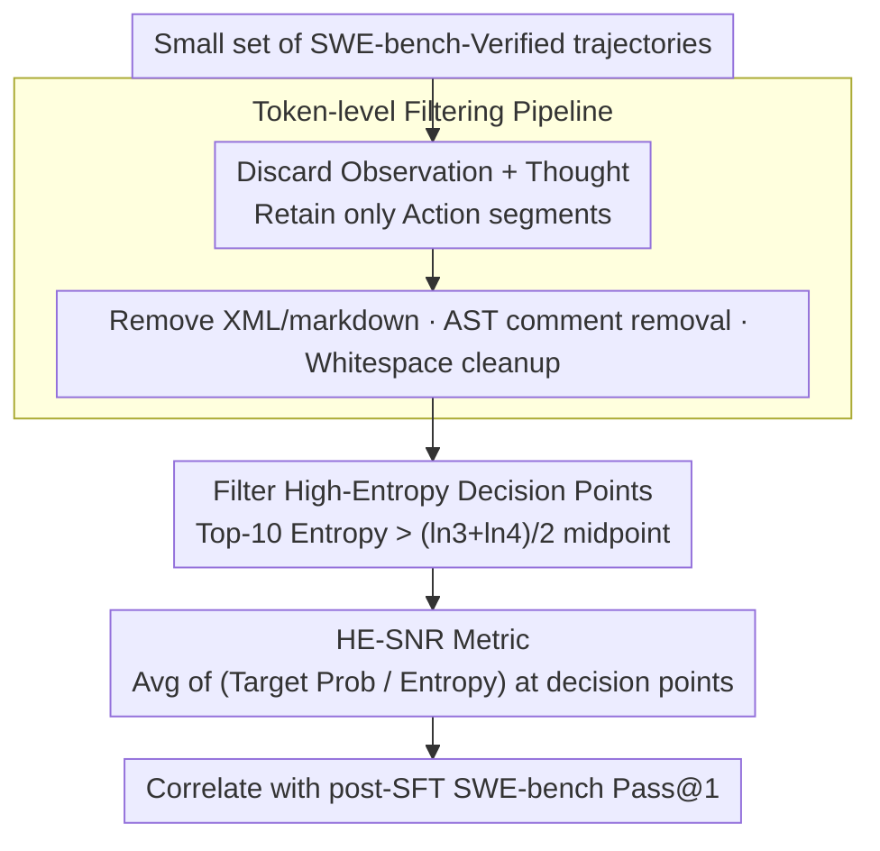

# HE-SNR: Uncovering Latent Logic via Entropy for Guiding Mid-Training on SWE-bench

**Conference**: ICML 2026  
**arXiv**: [2601.20255](https://arxiv.org/abs/2601.20255)  
**Code**: None (Meituan LongCat Team)  
**Area**: Code Intelligence / LLM Evaluation / Mid-training Metrics  
**Keywords**: SWE-bench, Mid-training Evaluation, Top-k Entropy, High-entropy Decision Points, Entropy Compression

## TL;DR
Traditional PPL on SWE-bench is interfered with by the "long context tax" and fails to predict agent capabilities post-SFT. This paper proposes the "Entropy Compression Hypothesis" and the HE-SNR metric, which calculates the signal-to-noise ratio only at "high-entropy decision points" where Top-10 entropy exceeds the midpoint of $(\ln 3 + \ln 4)/2$. It achieves a Pearson correlation of 0.96 and a Kendall tau of 0.98 with downstream SWE-bench scores.

## Background & Motivation

**Background**: SWE-bench has become the de facto standard for evaluating LLM software engineering capabilities. SOTA systems (SWE-RL, Kimi-Dev, SWE-Dev) all rely on SFT on instruction models. The mid-training phase (between PT and SFT) determines the "potential" of a model's SWE capability. Currently, the only way to evaluate a mid-training checkpoint is to spend massive compute running a full SFT followed by SWE-bench testing.

**Limitations of Prior Work**: (1) PPL / BPC correlates poorly with downstream SWE-bench scores, especially when Top-1 accuracy exceeds 90%, where PPL measures "parrot-like imitation" rather than reasoning; (2) When extending context via RoPE, models immediately suffer from the "long context tax"—Top-1/PPL temporarily degrade while actual SWE capability improves, causing PPL to trend inversely; (3) Improved versions like LongPPL only address positional bias in retrieval tasks (RULER) and do not target key tokens in agent reasoning.

**Key Challenge**: Is intelligence equivalent to "compression"? The traditional view (Compression-Intelligence Hypothesis) uses scalar PPL as a measure of compression, but PPL measures "recitation precision." True reasoning requires "rational hesitation" among multiple candidates—a distributional compression that scalar information theory fails to capture.

**Goal**: (1) Identify an SFT-invariant mid-training signal, (2) Resist the "long context tax," and (3) Provide reliable downstream performance predictions using minimal data (500 trajectories).

**Key Insight**: By plotting Top-10 entropy distributions across multiple models and checkpoints, a universal pattern is observed: non-Top-2 predicted tokens concentrate on "natural boundaries" such as $\ln 2$ and $\ln 3$. Stronger models compress "scattered $\ln 4$ uncertainty" into "$\ln 3$ rational hesitation." This suggests that reasoning capability can be measured by how effectively a model collapses uncertainty into a specific set size.

**Core Idea**: Upgrade "compression" from a scalar PPL to a distributional level. Calculate the signal-to-noise ratio (HE-SNR) between target token probability and entropy only at "high-entropy decision points" where Top-10 entropy exceeds the $\ln 3$-$\ln 4$ midpoint. Strictly filter style tokens from CoT, evaluating only executable logic in action tokens.

## Method

### Overall Architecture
The objective is to determine the future SWE capability of a mid-training checkpoint without performing a full SFT. The approach upgrades "compression = intelligence" to the distributional level: executable logic Action tokens are extracted from a small set of SWE-bench-Verified trajectories. Metrics are calculated at high-entropy decision points where the model is still "rationally hesitating" to measure the ratio of target token signal to entropy noise, resulting in the SFT-invariant, tax-resistant HE-SNR.

### Key Designs

**1. Entropy Compression States and the "$\ln 3$" Shift: Distributional Compression**

Traditional PPL blends all candidates into a scalar, obscuring the size of the set the model is hesitating over—yet "set size" is a clue to reasoning depth. This paper uses the peak positions of Top-$k$ entropy: by Jensen's inequality, the upper bound of Top-$k$ re-normalized entropy is $\ln k$, achieved if and only if the $k$ candidates are equiprobable. Entropy peaks at $\ln 2, \ln 3, \ln 4$ imply equal hesitation among 2, 3, or 4 candidates. A universal law is observed: "compression" is the process of folding scattered $\ln 4$ uncertainty into smaller $\ln 3$ rational hesitations ("Shift to $\ln 3$"). Stronger models complete this transition more thoroughly. This distinguishes "intelligent hesitation" from "environmental randomness"—MoE-A26B shows a $\ln 10$ peak on Observation tokens (corresponding to random digits 0-9), verifying that $\ln 10$ represents aleatoric uncertainty, not reasoning.

**2. High-Entropy SNR (HE-SNR): Measuring on Non-stylized "Hard Samples"**

Identifying entropy peaks is insufficient; it is crucial to find a signal that SFT does not "wash away" via stylization. SFT compresses many high-entropy tokens into the $\ln 1$-$\ln 3$ range; thus, uncertainty remaining in the $\ln 3$-$\ln 4$ range represents the parts SFT cannot easily modify—the true "reasoning bottlenecks." HE-SNR measures the relative confidence the model assigns to the target token at these bottlenecks:

$$\text{HE-SNR} = \frac{1}{|\mathcal{H}|}\sum_{t \in \mathcal{H}} \frac{p(x_t)}{H_{top10}(x_t)}, \quad \mathcal{H} = \{t : H_{top10}(x_t) > \epsilon,\ x_t \in C_{10}(x_t)\}$$

Where the threshold $\epsilon = (\ln 3 + \ln 4)/2 \approx 0.897$ targets the midpoint between $\ln 3$ and $\ln 4$ to isolate "rational hesitation" points. The condition $x_t \in C_{10}$ ensures the target token is within the Top-10 set, filtering out "divergent style tokens" to prevent outliers from skewing the results. By using target probability as the "signal" and entropy as the "noise," higher values indicate greater certainty on hard problems, correlating strongly with downstream SWE-bench scores.

**3. Token-level Filtering Pipeline: Stripping SFT Style Artifacts**

Entropy signals are heavily masked by SFT-induced stylistic artifacts. Before calculating HE-SNR, trajectories are cleaned to retain only "executable logic." The pipeline discards Observations (input context) and Thoughts (dominated by SFT style), leaving only Action segments. Actions are processed via regex to remove XML tags and markdown formatting, AST parsing to strip code comments, and whitespace normalization. Cleaning is performed at the character level and mapped back to tokens via offset alignment. Ablations show that switching from Thinking to Action improves Pearson correlation from 0.558 to 0.967, and adding XML/Whitespace/AST filters pushes Kendall $\tau$ to a peak of 0.979.

### Loss & Training
HE-SNR is an evaluation metric, not a training loss. During validation, HE-SNR of mid-training checkpoints is correlated with the post-SFT SWE-bench-Verified Pass@1 (averaged over 3 evaluations).

## Key Experimental Results

### Main Results

| Metric | Calculation Scope | Pearson $r$ vs SWE-bench | Resists "Long Context Tax" |
|------|----------|--------------------------|-----------------|
| PPL | All tokens | Weak (Inverted) | No, inverted at Step 200 |
| HE-PPL | High-entropy set, all tokens | Moderate | No |
| HE-PPL | High-entropy set, filtered Action | Strong | No |
| **HE-SNR** | High-entropy set, filtered Action | **Strongest** (Linear + Monotonic) | **Yes** |

Model scales: MoE-A3B (68B total / 3B active) and MoE-A26B (560B total / 26B active), with context extension from 32K up to 128K.

### Ablation Study

| Token Type | Filtering Strategy | Pearson $r$ | Kendall $\tau$ |
|-----------|----------|-------------|----------------|
| Thinking | No filtering | 0.558 | 0.519 |
| Action | No filtering | 0.967 | 0.944 |
| Action | + XML removal | 0.953 | 0.956 |
| Action | + Whitespace/Symbol removal | 0.952 | 0.968 |
| Action | + AST Comment removal (Full) | **0.965** | **0.979** |

Threshold sensitivity: Within the $\ln 2$ to $\ln 5$ range, $(\ln 3 + \ln 4)/2$ is near-optimal and forms a robust plateau, requiring no fine-tuning.

### Key Findings
- **Generalization of $\ln 3$ Shift**: The $\ln 1, \ln 2, \ln 3$ triple-peak structure is observed in Qwen2.5-72B (Dense), DeepSeek-V3 (MoE), and math QA. $\ln 2$ corresponds to "general reasoning" (common in NL), while $\ln 3$ corresponds to "strict logical reasoning" (common in code/math).
- **The "Alignment Tax" Exposed**: Post-SFT, global PPL improves, but HE-PPL and HE-SNR on high-entropy sets degrade. This suggests SFT trades "complex reasoning" for "stylization," providing a mechanistic explanation for the "alignment tax."
- **Tax Resistance**: While $|\mathcal{H}|$ spikes at step 200 of 128K training causing traditional HE-PPL to degrade, HE-SNR remains stable, indicating that "quantity of hard problems" and "mastery of hard problems" should be evaluated separately.

## Highlights & Insights
- **From Scalar to Distributional Compression**: Elevates the "compression = intelligence" hypothesis to a distributional level and identifies $\ln k$ as a quantifiable "natural boundary."
- **Perspective of "Rational Hesitation"**: Unlike traditional views that treat high entropy as noise, this work treats $\ln 2$ and $\ln 3$ as healthy "self-aware uncertainty," signaling high-quality reasoning. This provides a framework for "exploration vs. exploitation" in CoT RL.
- **AST + Offset Filtering Pipeline**: Aligning character-level tags with token-level evaluation allows this pipeline to be reused in any LLM evaluation scenario requiring the removal of noise based on code structure.
- **Transferability to PRM**: High-entropy decision points coincide with "forking points" of interest to Process Reward Models (PRM). HE-SNR can assist in PRM training data construction.

## Limitations & Future Work
- The threshold $\epsilon$ is static. Rational hesitation boundaries may vary by task; adaptive thresholds are a future direction.
- High-entropy tokens are affected by code style—different implementations of the same logic yield different high-entropy sets. The authors suggest using code canonicalization or style transfer.
- Validation focused on MoE-A3B/A26B. While the "$\ln 3$ phenomenon" was verified on Qwen2.5/DeepSeek-V3, full correlation curves for other model families are pending.
- Currently limited to SWE-bench tasks; whether higher-order ($k \geq 4$) entropy compression states appear in more complex tasks remains open.

## Related Work & Insights
- **vs PPL / BPC** (Kaplan, Huang): Scalar metrics reflect recitation; this work uses entropy peak positions to track "reasoning depth."
- **vs LongPPL** (Fang et al., ICLR 2025): LongPPL addresses positional bias in retrieval; HE-SNR targets agentic SWE tasks in base models.
- **vs Beyond 80/20 High-Entropy Token RL** (Wang et al., 2025): They found high-entropy tokens are key for RL optimization; this work proves they are also key for evaluating reasoning potential.

## Rating
- Novelty: ⭐⭐⭐⭐ "Entropy Compression Hypothesis + HE-SNR" is a solid theoretical framing of Top-k entropy.
- Experimental Thoroughness: ⭐⭐⭐⭐⭐ Extensive validation across 3B-560B scales, multiple training stages, and diverse architectures.
- Writing Quality: ⭐⭐⭐⭐⭐ Clear narrative from PPL failure to HE-SNR derivation, including detailed case studies in the appendix.
- Value: ⭐⭐⭐⭐ Addresses the high-cost pain point of selecting mid-training checkpoints; 500 trajectories (12M tokens) provide reliable predictions.

<!-- RELATED:START -->

## Related Papers

- [\[ICML 2025\] Training Software Engineering Agents and Verifiers with SWE-Gym](../../ICML2025/code_intelligence/training_software_engineering_agents_and_verifiers_with_swe-gym.md)
- [\[ACL 2025\] UTBoost: Rigorous Evaluation of Coding Agents on SWE-Bench](../../ACL2025/code_intelligence/utboost_rigorous_evaluation_of_coding_agents_on_swe-bench.md)
- [\[ICML 2026\] SWE-rebench V2: Language-Agnostic SWE Task Collection at Scale](swe-rebench_v2_language-agnostic_swe_task_collection_at_scale.md)
- [\[ICML 2026\] Entropy-informed Decoding: Adaptive Information-Driven Branching](entropy-informed_decoding_adaptive_information-driven_branching.md)
- [\[ICML 2026\] Probability-Entropy Calibration: An Elastic Indicator for Adaptive Fine-tuning](probability-entropy_calibration_an_elastic_indicator_for_adaptive_fine-tuning.md)

<!-- RELATED:END -->
