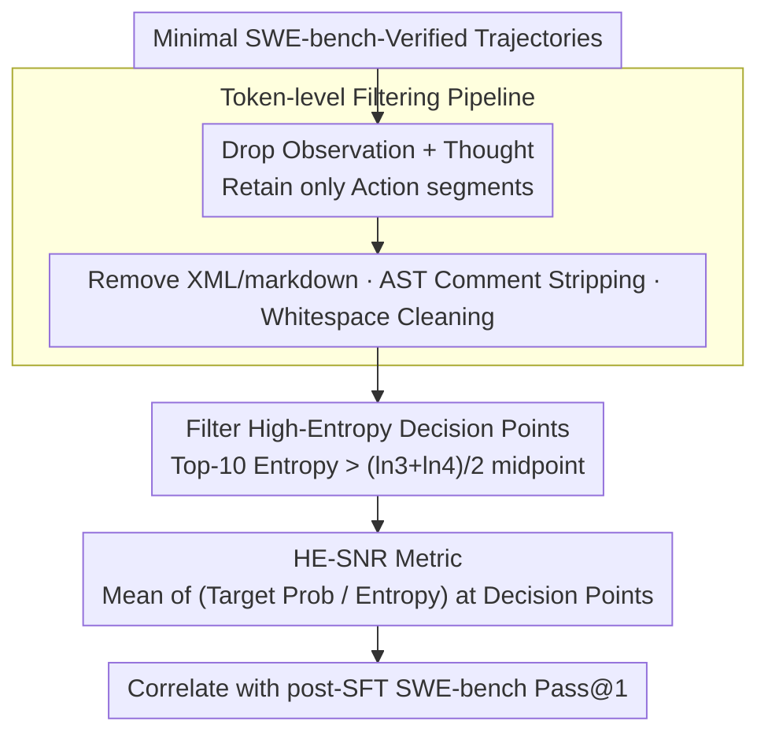

# HE-SNR: Uncovering Latent Logic via Entropy for Guiding Mid-Training on SWE-bench

**Conference**: ICML 2026  
**arXiv**: [2601.20255](https://arxiv.org/abs/2601.20255)  
**Code**: None (Meituan LongCat Team)  
**Area**: Code Intelligence / LLM Evaluation / Mid-training Metrics  
**Keywords**: SWE-bench, Mid-training Evaluation, Top-k Entropy, High-entropy Decision Points, Entropy Compression

## TL;DR
Traditional PPL on SWE-bench is disrupted by the "long context tax" and fails to predict agent capability after SFT. This paper proposes the "Entropy Compression Hypothesis" and the HE-SNR metric, which calculates the signal-to-noise ratio only at "high-entropy decision points" where Top-10 entropy exceeds $(\ln 3 + \ln 4)/2$. This achieves a Pearson correlation of 0.96 and a Kendall consistency of 0.98 with downstream SWE-bench scores.

## Background & Motivation

**Background**: SWE-bench has become the de facto standard for evaluating LLM software engineering capabilities. SOTA systems (SWE-RL, Kimi-Dev, SWE-Dev) all rely on performing SFT on instruction models. The mid-training phase (between PT and SFT) determines the model's SWE "potential," but the only way to know if a mid-training checkpoint is good is to spend massive compute on running thousands of SFT trajectories and then testing on SWE-bench.

**Limitations of Prior Work**: (1) PPL / BPC correlate poorly with downstream SWE-bench scores, especially when Top-1 accuracy exceeds 90%, where PPL primarily measures "parroting" rather than reasoning; (2) When extending context via RoPE, models immediately suffer from a "long context tax"—Top-1 and PPL temporarily worsen, even though actual SWE capability is improving, causing PPL to move in the opposite direction; (3) Improved versions like LongPPL only address positional bias in retrieval-based long context (RULER) and are not targeted at key tokens for agent reasoning.

**Key Challenge**: Is intelligence equivalent to "compression"? The traditional view (Compression-Intelligence Hypothesis) uses scalar PPL as a measure of compression, but PPL measures "mimicry precision." True reasoning requires "rational hesitation" among multiple candidates—this is compression at the distribution level, which scalar information theory fails to capture.

**Goal**: (1) Identify an SFT-invariant mid-training signal; (2) Resist the "long context tax"; (3) Provide reliable predictions of downstream performance using very little data (500 trajectories).

**Key Insight**: By plotting Top-10 entropy distributions across multiple models and checkpoints, the authors discovered a universal law: non-Top-2 predicted tokens cluster at "natural boundaries" such as $\ln 2$ and $\ln 3$. Stronger models compress "scattered $\ln 4$ uncertainty" into "$\ln 3$ rational hesitation." This implies that reasoning capability can be measured by how much a model "folds" uncertainty into specific set sizes.

**Core Idea**: Upgrade "compression" from scalar PPL to the distribution level. Calculate the signal-to-noise ratio (HE-SNR) of the target token probability relative to entropy only at "high-entropy decision points" where Top-10 entropy exceeds the midpoint of $\ln 3$ and $\ln 4$. Furthermore, strictly filter out style tokens in the chain-of-thought to evaluate only executable action logic.

## Method

### Overall Architecture
This paper addresses the problem of "how to determine if a mid-training checkpoint will have strong future SWE capabilities without running full SFT." The approach upgrades "Compression = Intelligence" from scalar PPL to the distribution level: first, extract only Action tokens representing executable logic from a few SWE-bench-Verified trajectories; then, only at high-entropy decision points where the model still exhibits "rational hesitation," measure the ratio of target token signal to entropy noise to derive HE-SNR, an SFT-invariant and "long context tax"-resistant metric.

### Key Designs

**1. Entropy Compression States and the "$\ln 3$" Shift: Upgrading Compression to the Distribution Level**

Traditional PPL mixes all candidates into a single scalar, failing to show how many candidates the model is actually hesitating between—yet this "set size" is a clue to reasoning depth. This paper uses the peak position of Top-$k$ entropy to infer this: according to Jensen's inequality, the upper bound of Top-$k$ re-normalized entropy is $\ln k$, reached only when the $k$ candidates have equal probability. Thus, entropy peaks at $\ln 2, \ln 3$, or $\ln 4$ mean the model is hesitating equally between 2, 3, or 4 candidates. The authors observed a universal law: the "compression" process involves folding scattered $\ln 4$ uncertainty into smaller $\ln 3$ rational hesitations ("Shift to $\ln 3$"). Stronger models complete this shift more thoroughly. This perspective distinguishes "intelligent hesitation" from "environmental randomness"—MoE-A26B shows a $\ln 10$ peak on Observation tokens (corresponding to random digits 0-9), proving $\ln 10$ is aleatoric uncertainty rather than reasoning.

**2. High-Entropy SNR (HE-SNR) Metric: Measuring on the "Hard Bones" SFT Cannot Break**

Knowing the entropy peak position is insufficient; one must find a signal that SFT does not "stylize" away. The authors noted that SFT compresses many originally high-entropy tokens into the $\ln 1$-$\ln 3$ range. Therefore, the uncertainty remaining between $\ln 3$ and $\ln 4$ represents parts SFT cannot easily change—the model's true "reasoning hard bones." HE-SNR measures how much relative confidence the model gives to the target token on these hard bones:

$$\text{HE-SNR} = \frac{1}{|\mathcal{H}|}\sum_{t \in \mathcal{H}} \frac{p(x_t)}{H_{top10}(x_t)}, \quad \mathcal{H} = \{t : H_{top10}(x_t) > \epsilon,\ x_t \in C_{10}(x_t)\}$$

The threshold $\epsilon = (\ln 3 + \ln 4)/2 \approx 0.897$ is positioned exactly between $\ln 3$ and $\ln 4$ to isolate "rational hesitation" points. The condition $x_t \in C_{10}$ ensures the target token is within the Top-10 set, filtering out "deviant style tokens" that might skew the metric. By using target probability as "signal" and entropy as "noise," a higher ratio indicates greater certainty on hard problems, correlating highly with downstream SWE-bench scores.

**3. Token-level Filtering Pipeline: Stripping SFT Style Artifacts**

The primary interference for entropy signals is the style artifacts left by SFT. Before calculating HE-SNR, trajectories are cleaned to retain only "executable logic." The pipeline drops Observations (input context) and Thoughts (dominated by SFT style), leaving only Action segments. Actions are processed via regex to remove XML tags and markdown formatting, and Python AST is used to strip code comments and redundant whitespace. Cleaning is performed at the character level with markers, then mapped back to the token level via offset alignment. Ablations show this filtering is critical: switching from Thinking to Action tokens increases Pearson correlation from 0.558 to 0.967; adding XML/whitespace/AST comment filtering pushes Kendall $\tau$ to a peak of 0.979.

### Loss & Training
HE-SNR is an evaluation metric, not a training loss. During validation, HE-SNR from mid-training checkpoints is correlated with the post-SFT SWE-bench-Verified Pass@1 (mean of 3 evaluations).

## Key Experimental Results

### Main Results

| Metric | Calculation Scope | Pearson $r$ vs SWE-bench | Resists "Context Tax" |
|------|----------|--------------------------|-----------------|
| PPL | All tokens | Weak (Inverse) | No, inverse at Step 200 |
| HE-PPL | High-entropy set, all tokens | Medium | No |
| HE-PPL | High-entropy set, filtered Action | Strong | No |
| **HE-SNR** | High-entropy set, filtered Action | **Strongest** (Linear + Monotonic) | **Yes** |

Model scales covered: MoE-A3B (68B total / 3B active) and MoE-A26B (560B total / 26B active), with context extension from 32K to 128K.

### Ablation Study

| Token Type | Filtering Strategy | Pearson $r$ | Kendall $\tau$ |
|-----------|----------|-------------|----------------|
| Thinking | No filtering | 0.558 | 0.519 |
| Action | No filtering | 0.967 | 0.944 |
| Action | + Remove XML | 0.953 | 0.956 |
| Action | + Remove Whitespace/Symbols | 0.952 | 0.968 |
| Action | + AST Comment Strip (Full) | **0.965** | **0.979** |

Threshold sensitivity: Within the $\ln 2$ to $\ln 5$ range, $(\ln 3 + \ln 4)/2$ is near optimal and forms a robust plateau, requiring no fine-tuning.

### Key Findings
- **Generalization of the $\ln 3$ Shift**: The $\ln 1, \ln 2, \ln 3$ triple-peak structure was observed in Qwen2.5-72B (Dense), DeepSeek-V3 (MoE), and 5000 math QA pairs. $\ln 2$ corresponds to "general reasoning" (common in NL), while $\ln 3$ corresponds to "strict logical reasoning" (common in code/math).
- **SFT "Alignment Tax" revealed in high-entropy sets**: While global PPL improves post-SFT, HE-PPL and HE-SNR degrade in high-entropy sets—suggesting SFT trades "complex reasoning" for "stylization," providing a mechanistic explanation for the alignment tax.
- **$|\mathcal{H}|$ peaks at step 200 of 128K training**, causing traditional HE-PPL to degrade, but HE-SNR (signal-to-noise) remains stable, suggesting "hard problem count" and "hard problem mastery" should be viewed separately.

## Highlights & Insights
- **From Scalar to Distribution Compression**: Elevates the classic "Compression = Intelligence" hypothesis to the distribution level and identifies $\ln k$ as a quantifiable "natural boundary."
- **Perspective of "Rational Hesitation"**: Unlike traditional views that treat high entropy as noise, this paper treats $\ln 2$ and $\ln 3$ as a healthy state of "recognized uncertainty," a hallmark of high-quality reasoning and a potential framework for "exploration vs. exploitation" in RL.
- **AST + Offset Alignment Pipeline**: Aligning character-level markers with token-level evaluation allows for reuse in any LLM evaluation scenario requiring the removal of noise tokens based on code structure.
- **Transferable to PRM**: High-entropy decision points are precisely the "forking points" of interest for Process Reward Models (PRM); HE-SNR logic can seamlessly transfer to PRM training data construction.

## Limitations & Future Work
- The threshold $\epsilon$ is static; the "rational hesitation boundary" may vary across tasks, necessitating adaptive thresholds.
- High-entropy tokens are influenced by code style—different ways of writing the same logic yield different high-entropy sets. The authors suggest code canonicalization or style transfer for standardization.
- Primarily validated on MoE-A3B and MoE-A26B. While the "$\ln 3$ phenomenon" was validated on Qwen2.5-72B and DeepSeek-V3, the full HE-SNR vs. SWE-bench correlation curve has not been mapped for other model families.
- Currently limited to SWE-bench-style tasks; whether higher-order entropy states ($k \geq 4$) appear in more complex tasks remains an open question.

## Related Work & Insights
- **vs PPL / BPC** (Kaplan, Huang): Scalar metrics only reflect mimicry; this paper adds the "reasoning depth" dimension via entropy peak positions.
- **vs LongPPL** (Fang et al., ICLR 2025): LongPPL addresses positional bias in retrieval tasks for instruction models; HE-SNR focuses on base models and agentic SWE tasks with a different focus.
- **vs Beyond 80/20 High-Entropy Token RL** (Wang et al., 2025): They found high-entropy tokens are key for RL optimization; this paper flips the observation to prove high-entropy tokens are also key for evaluating reasoning potential.

## Rating
- Novelty: ⭐⭐⭐⭐ "Entropy Compression Hypothesis + HE-SNR" is a novel theoretical framing, though the underlying mechanism is a combination of Top-$k$ entropy.
- Experimental Thoroughness: ⭐⭐⭐⭐⭐ Coverage of 3B-560B checkpoints, two-stage training (32K/128K), and multiple architectures (Dense + MoE).
- Writing Quality: ⭐⭐⭐⭐⭐ Clear narrative, progressing from PPL failure to HE-SNR derivation, with detailed case studies in the appendix.
- Value: ⭐⭐⭐⭐ Directly addresses the industry pain point of high costs in selecting mid-training checkpoints; 500 trajectories (12M tokens) provide reliable predictions.

<!-- RELATED:START -->

## Related Papers

- [\[ICLR 2026\] Kimi-Dev: Agentless Training as Skill Prior for SWE-agents](../../ICLR2026/code_intelligence/kimi-dev_agentless_training_as_skill_prior_for_swe-agents.md)
- [\[ICML 2025\] Training Software Engineering Agents and Verifiers with SWE-Gym](../../ICML2025/code_intelligence/training_software_engineering_agents_and_verifiers_with_swe-gym.md)
- [\[ACL 2025\] UTBoost: Rigorous Evaluation of Coding Agents on SWE-Bench](../../ACL2025/code_intelligence/utboost_rigorous_evaluation_of_coding_agents_on_swe-bench.md)
- [\[ICML 2026\] Entropy-informed Decoding: Adaptive Information-Driven Branching](entropy-informed_decoding_adaptive_information-driven_branching.md)
- [\[ICML 2026\] Probability-Entropy Calibration: An Elastic Indicator for Adaptive Fine-tuning](probability-entropy_calibration_an_elastic_indicator_for_adaptive_fine-tuning.md)

<!-- RELATED:END -->
