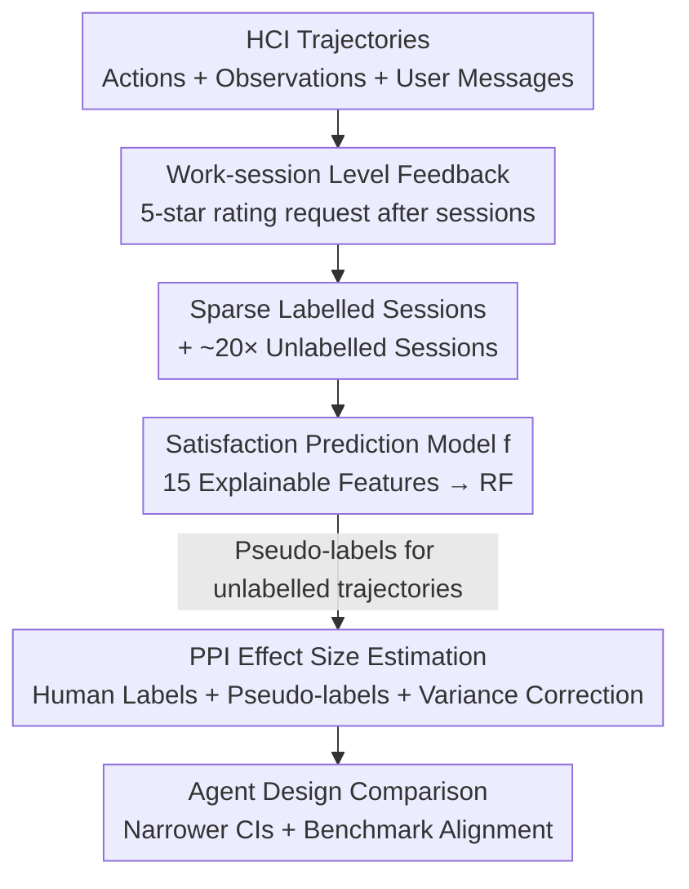

# How can we assess human-agent interactions? Case studies in software agent design

**Conference**: ICML2026  
**arXiv**: [2510.09801](https://arxiv.org/abs/2510.09801)  
**Code**: To be confirmed (Authors committed to open-sourcing the PULSE framework code + anonymized feature-level datasets)  
**Area**: Code Intelligence / Software Engineering Agents / Evaluation  
**Keywords**: HCI Evaluation, Software Agents, Prediction-powered Inference, User Satisfaction, A/B Testing

## TL;DR
The authors propose the PULSE framework—which collects user feedback, trains an ML model to predict user satisfaction, and employs Prediction-Powered Inference (PPI) to combine real human labels with model pseudo-labels for efficient estimation of agent design effects. Deployed on the open-source coding agent OpenHands across 15,000 users and 36,000 sessions, this work represents the first large-scale real-world evaluation of agent design. Results show that PULSE narrows confidence intervals by approximately 40% compared to standard A/B testing and reveals that benchmark performance can be anti-correlated with human preference (e.g., GPT-5 outperformed Claude-Sonnet-4 on 6/7 benchmarks, yet humans preferred Claude on 4/7 task subsets).

## Background & Motivation
**Background**: Existing agent evaluations rely almost exclusively on static, task-level benchmarks (e.g., SWE-Bench) to quantify "accuracy" across domains such as software engineering, web browsing, and scientific discovery.

**Limitations of Prior Work**: These benchmarks are primarily built on the premise of **full automation**—where agents complete well-defined tasks independently without user feedback. However, real-world agentic systems involve **collaboration** with human supervisors. A few studies attempt to simulate human-agent interaction but remain within controlled benchmark conditions; meanwhile, human-in-the-loop studies typically evaluate only single systems and do not investigate the impact of different agent design choices.

**Key Challenge**: Benchmark accuracy $\neq$ real user satisfaction. There is a disconnect between scalable but isolated automated benchmarks and realistic but expensive, noisy human feedback, where only about 5% of interactions receive ratings. These two paradigms are difficult to reconcile.

**Goal**: This study addresses two sub-problems: (1) How to **efficiently** estimate the effect of agent design changes on user satisfaction given sparse and expensive human feedback? (2) How do different agent design decisions (model choice, planning, memory) affect developer satisfaction in **real-world deployment**, and how does this differ from benchmark results?

**Key Insight**: Since only ~5% of interactions have human ratings while the remaining ~95% are unlabelled, one can train a satisfaction prediction model to provide pseudo-labels for the massive volume of unlabelled trajectories. Then, Prediction-Powered Inference (PPI) can be used to reduce the variance of these pseudo-labels—PPI does not require the prediction model to be unbiased or perfect, as systematic errors are corrected using the labelled data.

**Core Idea**: By combining "human labels + model pseudo-labels + PPI variance correction," the authors transform sparse and expensive human evaluations into statistically powerful and efficient assessments, demonstrating this for the first time on a deployed coding agent.

## Method

### Overall Architecture
PULSE (Prediction-powered User Label Synthesis and Evaluation) is a three-step framework: (1) **Feedback Data Collection**—invites users to provide a 5-star rating in the chat interface upon completion of each "work session"; (2) **Training Satisfaction Prediction Model $f$**—extracts explainable features from user/agent/task states to train an ML model that imputes satisfaction for unrated sessions; (3) **Comparing Agent Designs**—uses an A/B testing framework combined with extended PPI to calculate valid confidence intervals for the effect size of agent modifications.

Formally, each work session is defined as $W_i=\{M_i,T_i,Y_i\}$, where the trajectory $T_i=\{a_{i,1},o_{i,1},a_{i,2},\dots\}$ is the agent's action-observation sequence and $Y_i$ is the user rating (which may be $\emptyset$). Each session $X_i=\{W_1,\dots,W_j\}$ consists of one or more work sessions, with the session rating $\bar{Y}_i$ being the average of available segment ratings. The dataset $\mathcal{D}=\{(X_i,\bar{Y}_i)\}\cup\{(\tilde{X_i},\emptyset)\}$ contains both labelled and unlabelled sessions.

### Key Designs

**1. Work-session Level Feedback: Anchoring Ratings to Specific Tasks**

A major pain point is "when to ask for feedback"—too early and the task is incomplete; too late and the user forgets. The authors design feedback collection to occur at the end of each "work session": a segment from when a user issues a command and the agent enters a running state until it stops, similar to rating a ride-hailing app immediately after a trip. A 5-star rating prompt appears in the chat interface. This design **anchors the rating to a specific, recently completed task**, avoiding noise or generalized judgments. Although implicit signals (dwell time, editing behavior) were considered, they were excluded as primary metrics because prior research suggests they do not always align with satisfaction. The resulting ~5% response rate necessitates the use of the prediction model.

**2. Explainable Features + ML Prediction Model: Synthesizing Satisfaction Pseudo-labels**

Processing agent trajectories presents a challenge: labelled samples are scarce, and each trajectory $T_i$ is a complex object with tens of thousands of tokens. Instead of feeding raw trajectories into a model, the authors iteratively identified **15 explainable features** categorized into three groups: ① **User-based** (message content, sentiment, message count); ② **Agent-based** (task type such as bug fix/feature request, and failure modes such as insufficient testing/instruction following); ③ **Task Progress** (git action signals common in software engineering, e.g., an agent pushing code at the end of a session often signals satisfaction). A Random Forest (RF) model $f$ was trained on these features and compared against a "LLM-as-a-judge" baseline (o3, Gemini-2.5-Pro) using full trajectories. The RF model consistently outperformed LLM-as-a-judge in MSE/MAE and correlation, proving that feature-based processing is more reliable than raw long-context input.

**3. PPI Effect Size Estimation: Narrowing Confidence Intervals (CIs) by ~40%**

The naive effect size is the difference in mean satisfaction between two conditions $\widehat{\Delta}_{\text{naive}}=\frac{1}{n_{c_1}}\sum_{i\in c_1}Y_i-\frac{1}{n_{c_2}}\sum_{i\in c_2}Y_i$, which suffers from wide CIs due to sparse labels. The authors incorporate Prediction-Powered Inference (PPI), where the mean estimate for each condition $c$ includes a tuning parameter $\lambda_c$:

$$\widehat{\mu}_c(\lambda_c)=\frac{1}{n_c}\sum_{i=1}^{n_c}Y_i+\lambda_c\Big(\frac{1}{N_c}\sum_{j=1}^{N_c}f(\tilde{X}_j)-\frac{1}{n_c}\sum_{i=1}^{n_c}f(X_i)\Big)$$

The first term is the sample mean of human labels, while the second term uses $f$ predictions on $N_c$ unlabelled trajectories and corrects for bias using predictions on labelled trajectories. Thus, systematic errors in $f$ are corrected. The optimal $\lambda_c$ is calculated via sample interpolation of $\widehat{\mathrm{Cov}}(Y,f(X)|Z=c_i)$ and the variance of $f$. The augmented effect size $\widehat{\Delta}_{\text{augment}}=\widehat{\mu}_{c_1}(\widehat{\lambda}_{c_1})-\widehat{\mu}_{c_2}(\widehat{\lambda}_{c_2})$ is paired with Wald CIs. This resulted in an average CI reduction of **39.5%** across four experiments, making several previously insignificant comparisons (e.g., Claude 3.7 vs. Claude 4) statistically significant.

### Loss & Training
The prediction model $f$ was trained on labelled trajectories in $\mathcal{D}$ (comprising $N=1747$ labelled trajectories with an average rating of 4.07 from approximately 1000 independent users, alongside ~20x unlabelled sessions). A/B testing was randomized at the session level, with each new session assigned to a fixed agent variant. The same user could contribute multiple trajectories across different variants. Each case study ran for 2-3 weeks, collecting at least 150 labels per condition, utilizing the optimized RF model as $f$.

## Key Experimental Results

### Main Results (Three Case Studies in Agent Design)
Across 15,000 users and 36,000 sessions, three case studies were conducted using OpenHands: ① LLM Backbones, ② Planning (displaying TASKS.md via task_tracker), ③ Memory Management (reducing max_step from 120 to 80).

| Case Study | Comparison | User Satisfaction Diff $\Delta_H$ | Conclusion |
|------------|------|---------------------------|------|
| 1. LLM Models | Claude-3.7 vs. Claude-4 | +5.86% (Significant) | Stronger models yield the highest Gain |
| 1. LLM Models | Claude-4 vs. GPT-5 | −7.83% (Significant) | Humans preferred Claude-4 |
| 2. Planning | Visible Plan vs. Hidden | +3.1% (Significant but small) | Process matters less than completion quality |
| 3. Memory | max_step 120 → 80 | No significant degradation | Cost savings without quality loss |

Key Finding: **Investing in stronger foundation models ($\Delta=$ 6-8%) improves user satisfaction far more than scaffolding modifications ($\Delta<$ 3%)**. Users prioritize completion quality over the internal reasoning steps of the agent. In interactions where GPT-5 received low scores, user messages were 32% fewer and code pushes were 16% fewer, suggesting users abandoned the task early.

### Main Results (Benchmark Alignment + Prediction Model Comparison)

| Dimension | Key Data | Description |
|----------|----------|------|
| PPI vs. Naive A/B | CI narrowed by 39.5% | Several comparisons became statistically significant |
| $f$ Prediction vs. LLM-as-judge | Correlation Gain $\geq$ 26% | RF outperformed o3/Gemini-2.5-Pro/Claude-4 |
| Human vs. Benchmark (Claude-3.7 vs. 4) | $\rho=0.66$ (Moderate positive) | Benchmarks align reasonably well here |
| Human vs. Benchmark (Claude-4 vs. GPT-5) | $\rho=-0.18$ (Weak negative) | Benchmarks **anti-correlated** with human preference |

A striking outlier: **GPT-5 won 6/7 benchmarks against Claude-Sonnet-4, but humans preferred Claude-Sonnet-4 in 4/7 task subsets**. Benchmarks aligned best with test generation and administrative tasks; the largest human rating discrepancy occurred in "CI Fixes" rather than pure code modification.

### Key Findings
- **Don't take benchmarks at face value**: Benchmark gains do not always translate to human satisfaction due to unique human-agent collaboration challenges; standard "bug-fixing" benchmarks show the worst alignment with human preference.
- **PPI as a lever for sparse feedback**: The ~40% CI reduction allows design differences previously obscured by noise to become detectable. The degree of CI narrowing depends on $f$'s explanatory power for that sample.
- **Explainable features are a win-win**: They are more accurate than LLM-as-judge (+26% correlation) and explain the drivers of satisfaction (User Sentiment + Agent Git Pushes are most important, though no single feature fully predicts ratings).
- **Low ratings as downstream signals of real issues**: Satisfaction correlates positively with git pushes ($r=0.117$) and git commits ($r=0.101$). Manual inspection of 20 low-scoring sessions revealed that high message volume and negative sentiment were often downstream manifestations of technical friction like CI failures, missing dependencies, or port/health-check failures.
- **Hidden gains of planning**: Without planning, the probability of the agent misunderstanding the user increased by 12.8%, leading to insufficient analysis (13.0%) and debugging (14.4%).

## Highlights & Insights
- **Applying PPI to HCI Evaluation**: While PPI has been used in clinical trials and synthetic sampling, this is the first instance of training a prediction model $f$ for human-agent trajectories and applying PPI—identifying a suitable $f$ for such trajectories is a novel contribution.
- **Feature-based modeling beats raw long-context**: Instead of feeding 10k+ token trajectories into an LLM-as-judge, extracting 15 explainable features to train an RF is both more accurate and interpretable. This "extract then model" approach is transferable to other high-dimensional interaction evaluations.
- **Evidence of Benchmark Anti-correlation**: The scale of 15,000 users provides empirical evidence ($\rho=-0.18$) that "Better Benchmark $\neq$ Human Preference," serving as a significant revelation for the agent evaluation community.
- **Transferable Framework**: Although implemented for a software agent, the PULSE framework (session feedback + pseudo-labels + PPI) is applicable to any human-AI collaborative scenario.

## Limitations & Future Work
- **Limitations**: Raw code context could not be shared due to privacy constraints; only anonymized feature-level datasets are provided. Labels remain sparse, with only ~5% session ratings and 12.75% of users rating multiple sessions.
- **Self-identified limitations**: Labelled trajectories show higher user message volume (RBC=0.32), indicating that users who provide ratings are more talkative or engaged, introducing potential selection bias. Benchmark comparisons only covered Case Study 1, with task subsets of $\geq 35$ human points per batch, limiting statistical power.
- **Scope**: Conclusions are rooted in OpenHands, an open-source coding agent. Generalization to closed-source agents (Devin, Claude Code) or non-software domains requires caution.
- **Future Directions**: Incorporating implicit signals (dwell/edit behavior); exploring automated feature discovery via LLMs to reduce human-in-the-loop costs; expanding to more domains to verify framework generalizability.

## Related Work & Insights
- **vs. Static/Interactive Benchmarks (SWE-Bench, etc.)**: These assume full automation. Ours studies real-world deployment, varies agent designs, and bridges results back to benchmarks—the first large-scale study of its kind.
- **vs. Dialogue Satisfaction Prediction**: Dialogue settings involve pure text exchange. Agent trajectories couple language with state-changing actions, tool calls, and observations, rendering standard dialogue methods less effective. Our feature-based prediction model bridges this gap.
- **vs. Prior PPI Applications**: Previous applications focused on clinical trials or synthetic LLM samples with existing $f$. We address the lack of an obvious $f$ for human-agent interaction by providing a "recipe" for training satisfaction models on interaction trajectories.

## Rating
- Novelty: ⭐⭐⭐⭐⭐ First to introduce PPI to HCI evaluation and conduct large-scale design assessments on a deployed agent.
- Experimental Thoroughness: ⭐⭐⭐⭐⭐ 15k users, 36k sessions, 3 case studies, and 7 benchmark comparisons provide substantial depth.
- Writing Quality: ⭐⭐⭐⭐ Clear framework and statistical derivations; empirical results on benchmark anti-correlation are impactful, though some CI figures in the text are slightly dense.
- Value: ⭐⭐⭐⭐⭐ Provides a wake-up call to the agent community regarding benchmark limitations and offers a reusable, efficient evaluation framework.

<!-- RELATED:START -->

## Related Papers

- [\[ICLR 2026\] CARD: Towards Conditional Design of Multi-agent Topological Structures](../../ICLR2026/code_intelligence/card_towards_conditional_design_of_multi-agent_topological_structures.md)
- [\[NeurIPS 2025\] VeriMaAS: Automated Multi-Agent Workflows for RTL Design](../../NeurIPS2025/code_intelligence/automated_multi-agent_workflows_for_rtl_design.md)
- [\[ICML 2026\] MARS: Modular Agent with Reflective Search for Automated AI Research](mars_modular_agent_with_reflective_search_for_automated_ai_research.md)
- [\[ICML 2026\] Physics Is All You Need? A Case Study in Physicist-Supervised AI Development of Scientific Software](physics_is_all_you_need_a_case_study_in_physicist-supervised_ai_development_of_s.md)
- [\[ICLR 2026\] ReasoningBank: Scaling Agent Self-Evolving with Reasoning Memory](../../ICLR2026/code_intelligence/reasoningbank_scaling_agent_self-evolving_with_reasoning_memory.md)

<!-- RELATED:END -->
