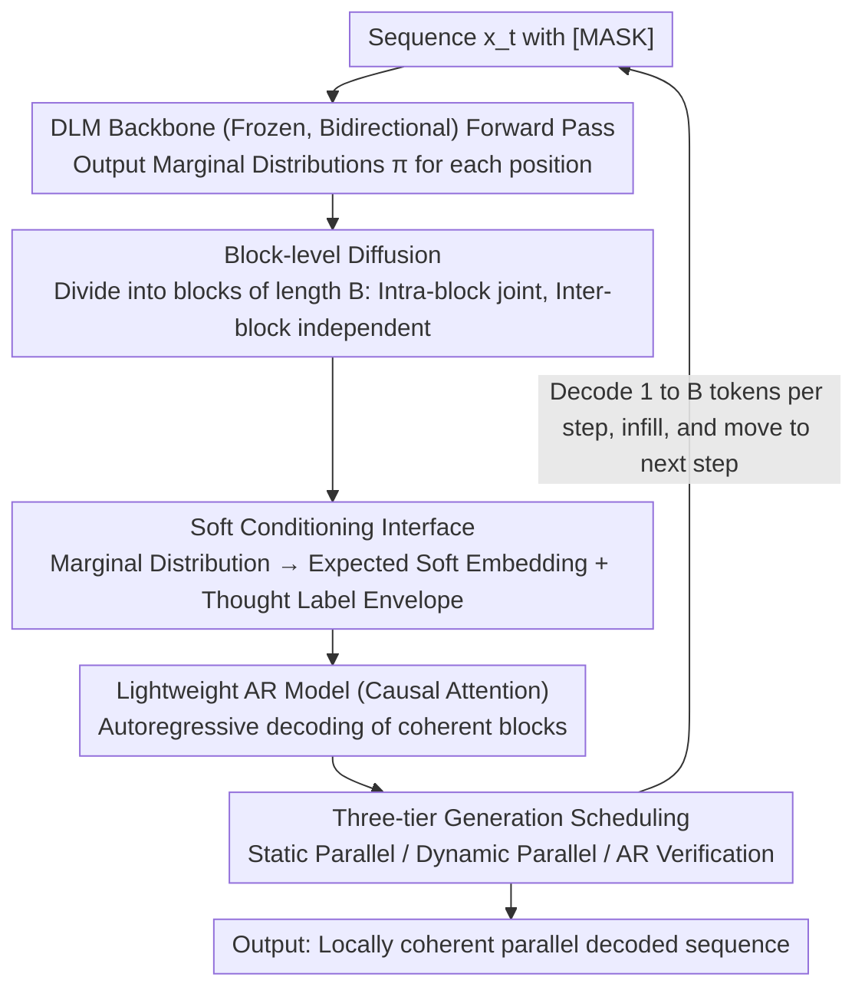

# Locally Coherent Parallel Decoding in Diffusion Language Models

**Conference**: ICML 2026  
**arXiv**: [2603.20216](https://arxiv.org/abs/2603.20216)  
**Code**: https://github.com/IBM/coherent-diffusion-local-autoregression (Available)  
**Area**: LLM Efficiency / Diffusion Language Models / Parallel Decoding  
**Keywords**: Diffusion Language Models, Parallel Decoding, Local Autoregression, Soft Conditioning, Code Generation

## TL;DR
This paper proposes CoDiLA, which attaches a lightweight autoregressive (AR) model to a masked diffusion language model (DLM). By receiving the marginal distributions of the DLM through "soft embeddings" and performing local autoregressive decoding within small blocks, it eliminates the local incoherence caused by parallel sampling while preserving the global bidirectional capabilities of the DLM. It establishes a new Pareto frontier on code generation with $\geq 2\times$ throughput.

## Background & Motivation

**Background**: Current SoTA discrete diffusion language models (Dream-Coder, LLaDA, DiffuCoder, etc.) learn reverse denoising via the `[MASK]` absorbing state. Theoretically, they can predict multiple tokens in parallel, potentially breaking the linear latency of AR models. This bidirectional, fillable property is particularly attractive for code generation.

**Limitations of Prior Work**: Standard DLMs use conditional **marginal** distributions to sample each masked token independently during reverse steps—the "Conditional Token Independence" assumption. While harmless for distant tokens, this assumption causes local incoherence for adjacent tokens (multi-byte words, syntax blocks), leading to outputs that "look correct individually but are syntactically nonsensical when combined" (e.g., producing fragments like `merge_intervals problem):` as seen in Figure 1a). In practice, only a few tokens can be decoded per step to maintain accuracy, exhausting the sub-linear latency advantage.

**Key Challenge**: Parallelism vs. Local Correlation. Parallelism requires assuming independence between tokens, but the strong correlation between adjacent tokens is precisely what ensures grammatical correctness.

**Goal**: Restore joint distribution modeling between simultaneously decoded adjacent tokens without undermining the global non-causal capabilities (infilling, bidirectional planning) of the DLM.

**Key Insight**: The authors elevate "diffusion" from the token level to the **block** level—maintaining joint correlation within blocks while remaining independent between blocks as in standard DLMs. They theoretically prove that the block-independence bias strictly reduces the NELBO lower bound (Theorem 3.2), but directly modeling the $|V|^B$-dimensional joint distribution leads to combinatorial explosion. Thus, they "outsource" intra-block joint modeling to a small AR model, letting it perform causal decoding only within a small window of $B$ tokens. Single AR latency is then limited by $B$ rather than the sequence length $L$.

**Core Idea**: The DLM acts as a global drafter while the AR model serves as a local cleaner—feeding the marginal probability vectors of the DLM into the AR model as **soft embeddings** to produce locally coherent blocks.

## Method

### Overall Architecture
CoDiLA addresses the local incoherence in parallel DLM sampling where "adjacent tokens are individually correct but syntactically incompatible." It allows a frozen DLM backbone to continue generating global drafts while using an external lightweight AR model for local cleaning in each block. Specifically, a DLM (bidirectional Transformer, parameters $\psi$, e.g., Dream-Coder-Instruct-7B) performs a forward pass on a sequence $x_t$ containing `[MASK]` to provide marginal distributions $\pi^j_\psi(x_t)\in\Delta^{|V|-1}$ for each position. The sequence is divided into continuous blocks of length $B$ (**Block-level Diffusion**). Blocks to be decoded convert their $B$ marginal distributions into "soft embeddings" via a **soft conditioning interface** and feed them into a small AR model (parameters $\phi$, e.g., Qwen3-0.6B). The AR model decodes real tokens autoregressively within the block. During inference, a **three-tier generation scheduling** determines how many tokens are decoded per step. The final joint probability is $p_\theta(b^i_0\mid x_t)=p^{\text{AR}}_\phi(b^i_0\mid\pi_\psi(x_t))$, where only the AR parameters $\phi$ in the overall parameters $\theta=[\psi, \phi]$ are trained.

### Key Designs

**1. Block-level Diffusion and the Strict Bound of NELBO: Establishing a "Why Blocks" Hard Lower Bound**

The pain point is that the token-level independence assumption forces the joint distribution of adjacent tokens to be disassembled, which is critical for syntax. CoDiLA relaxes this to "block-independent, intra-block joint": $x_0$ is partitioned into $L/B$ blocks $b^i_0\in W=V^B$, following a block-factorized reverse process $p_\theta(x_0\mid x_t)=\prod_i p_\theta(b^i_0\mid x_t)$. The per-step NELBO loss retains the cross-entropy form of token-level independent models: $L_t=\mathbb{E}_{q(x_t\mid x_0)}\big[\sum_i -\delta_{x^i_t,[\text{MASK}]}\frac{\alpha_{t-1}-\alpha_t}{1-\alpha_t}\log p_\theta(x^i_0\mid x_t)\big]$. 

This step serves as the theoretical foundation because Theorem 3.2 proves that $B_1-B_B=\sum_{t,i}\big(\sum_j H[x^{(i-1)B+j}_{t-1}\mid x_t]-H[b^i_{t-1}\mid x_t]\big)\geq 0$—the "total correlation" within a block exactly equals the irreducible error overhead paid by the token-level model. Larger blocks provide tighter lower bounds. Previous works (Huang 2022, Liu 2025a, etc.) only discussed the degenerate case of $B=1$; this work quantifies the direction of improvement for $B>1$ for the first time, and Figure 3 empirically demonstrates that larger $B$ leads to lower training PPL without saturation.

**2. Soft Conditioning Interface: Allowing AR to receive full marginal signals in a "Language it Understands"**

Modeling the $|V|^B$-dimensional intra-block joint distribution directly is impossible, so it is outsourced to an AR model; however, how the AR model receives DLM outputs is crucial. Naive approaches (e.g., APD, FlashDLLM) truncate marginal distributions into top-1 or top-$k$ discrete tokens before feeding them to the AR, which might exclude the "most coherent sequence" from the solution space. CoDiLA uses soft embeddings instead: treating $\pi^j_t$ as expected weights over the AR embedding table $E_\phi$, calculating $e^j_t=\sum_{v\in V}[\pi^j_t]_v\cdot E_\phi(v)$, and concatenating them as $[E_\phi(\langle\text{think}\rangle), e^1_t,\ldots,e^B_t, E_\phi(\langle\backslash\text{think}\rangle)]$ for the AR. This losslessly compresses high-dimensional probability vectors into the AR’s semantic embedding space—avoiding pre-training from scratch—and uses `<think>` boundary tokens to "disguise the input as thought" to activate the AR's introspective decoding path.

Theoretically, the adequacy of this design is backed by Theorem 3.3: when conditioned on the **full** marginals, there exists a $\phi$ such that $p^{\text{AR}}_\phi(\cdot\mid\pi)=q(\cdot)$, accurately recovering the target distribution. In contrast, top-$k$ truncation can only recover distributions restricted to the truncated Fréchet class, where the global mode $b^*=\arg\max_b q(b)$ might be permanently excluded. In engineering, these details are indispensable—ablations show that removing the `<think>` tokens causes the NELBO to spike from 13.6 to 15.5 ($B=4$).

**3. Three-tier Generation Scheduling: Selecting Pareto Points without Losing Bidirectional Capabilities**

CoDiLA requires adjustable inference strategies to cover different scenarios. A single schedule cannot balance accuracy, throughput, and bidirectionality simultaneously. Based on block entropy $h^i_t(k)=\frac{1}{k}\sum_j H[p_\theta(x^{(i-1)B+j}_0\mid x_t)]$, three modes are defined: **Static Parallel** decodes 1 full block per step, choosing the one with the lowest $h^i_t(B)$ and using a window of $\pm 10$ blocks to prevent premature EOS; **Dynamic Parallel** decodes the longest partial block satisfying $h^i_t(k)\leq\tau$ ($k\leq B$), reverting to the DLM’s confidence sampling when $k=1$ (since single tokens have no coherence issues), thereby recovering accuracy by "paralleling more where it's easy and less where it's hard"; **AR Verification Mode** lets the AR model compare its top-1 with the DLM’s top-1, penalizing confidence at points of disagreement. This integrates zero-intrusively into any confidence-based scheduler and preserves arbitrary-order decoding, suitable for global planning tasks like ParallelBench or Graph Traversal—where the AR acts as a judge rather than a generator, fully preserving the DLM’s non-causality.

### Loss & Training
The model is trained end-to-end using the cross-entropy NELBO in Equation (2). The DLM backbone is frozen, and only the AR model is fine-tuned. Forward noise addition is shifted from token-level to **block-level masking** (masking $B$ consecutive tokens), allowing the AR model to learn predicting an entire block based on DLM soft embeddings. Training was conducted on Ling-Coder-SFT for 32k steps per $B$ value using A100 80GB GPUs with PyTorch 2.7 and bf16.

## Key Experimental Results

### Main Results

The main experiment used Dream-Coder-Instruct-7B comparing Static Parallel (K=B per step) against baselines and ADJUST (Bansal & Sanghavi 2025). The following table shows the Syntax Error Rate on HumanEval (percentage of cases where scripts failed to extract code), highlighting the local coherence issue:

| Model | K=B=2 | K=B=4 | K=B=8 |
| :--- | :--- | :--- | :--- |
| Dream-Coder-Instruct-7B | 18 | 38 | 70 |
| **CoDiLA (Ours)** | **4** | **13** | **16** |
| Gain (pp) | −14 | −25 | **−54** |

Under the highest parallelism ($B=8$), the syntax error rate dropped from 70% to 16%, a 54 percentage point improvement. Figure 4 reports Pareto curves of Pass@1 vs. Throughput (tokens/sec, batch=1, A100) across HumanEval/+, MBPP/+, and BigCodeBench (full/hard)—CoDiLA occupies the outer frontier on all 6 benchmarks. The authors clarify that the accuracy gain is not solely from the small AR model; Qwen3-0.6B alone achieves only 35% on HumanEval, while CoDiLA ($B \leq 4$) significantly exceeds the 0.6B cap.

HumanEval-Infilling (Bidirectional capability verification):

| Model | Pass@1 (%) | Tokens/step |
| :--- | :--- | :--- |
| Deepseek-Coder-6.7B | 45.7 | 1 |
| Qwen2.5-Coder-7B | 58.7 | 1 |
| DreamOn (K=1, Sequential) | 62.5 | 1 |
| DreamOn (K=2, Parallel) | 53.1 | 2 |
| DreamOn + CoDiLA ($\tau=0.2$) | **62.5** | 1.3 |
| DreamOn + CoDiLA ($\tau=0.5$) | 61.5 | **1.5** |

In parallel decoding scenarios, accuracy is maintained while parallelism increases by 1.3–1.5×.

### Ablation Study

| Configuration | Key Finding |
| :--- | :--- |
| Soft vs. Top-K Conditioning | Top-K significantly degrades; validates Theorem 3.3 regarding irreducible bias from information truncation. |
| Removing `<think>/<\think>` tokens | NELBO increases from 13.6 to 15.5 ($B=4$); boundary tokens are essential for activating pre-trained AR reasoning paths. |
| AR size: 0.6B → 1.7B → 4B | No consistent gain; scaling AR parameters is unnecessary, 0.6B is sufficient. |
| Single $B=8$ vs. Two $B=4$ blocks | Single block improves by 8 pp; intra-block joint modeling is the key to capturing parallel gains. |
| Candidate range: 10 vs. 50 blocks | Throughput difference < 15%; local window selection is robust. |
| Spearman Rank Correlation | Decreases as $B$ increases; CoDiLA does not force global left-to-right order, preserving DLM's arbitrary-order advantage. |
| Batch size = 8 | AR overhead almost entirely amortized; small latency overhead at bs=1 disappears at bs=8. |

### Key Findings
- **Larger blocks yield lower training loss without saturation** (Figure 3, $B \in \{2,4,8,16,32\}$ decreases monotonically under 32-token continuous mask settings), empirically validating the direction of the total correlation equality in Theorem 3.2.
- **Accuracy gains stem from local coherence, not AR capability**: The 0.6B AR model alone only achieves 35% on HumanEval, but CoDiLA saves the 7B DLM from a 70% syntax error rate down to 16%. The 0.6B model serves as a coherence judge and local cleaner rather than a new generator.
- **Dynamic Parallelism eliminates accuracy degradation**: Combining $B=4$ with a threshold $\tau$ schedule matches sequential ($K=1$) accuracy while achieving $\geq 2\times$ acceleration, outperforming static sampling with smaller blocks ($B=2$).
- **Bidirectional capability is maintained**: CoDiLA preserves or improves native DLM performance on non-causal tasks like infilling and ParallelBench. Since the AR is only causal within blocks, inter-block bidirectional attention remains intact.

## Highlights & Insights
- **Rare perfect loop between theory and engineering**: The work connects the NELBO strict decrease inequality (Theorem 3.2) to Fréchet class truncation bias (Theorem 3.3), training loss curves (Figure 3), and downstream accuracy. This is a contrast to many parallel DLM works that apply methods first and find "stories" later.
- **"Soft Embeddings + `<think>` Envelope" is a brilliant engineering trick**: Projecting DLM marginals into the AR’s own embedding space allows the AR to understand the DLM using "language it understands." Disguising this as "thought" via labels activates pre-trained introspective paths. Together, these contribute significantly to gains (removing boundary tokens drops NELBO by 14%).
- **"DLM for drafting, AR for execution" division of labor** has transfer value: This can be applied to any generation task requiring "global planning + local precision" (complex reports, SQL, HTML/CSS, JSON schema), keeping AR limited to short segments and reserving DLM for global editing.
- Compared to competitors like ADJUST, APD, and TiDAR, CoDiLA is the only solution that is **both fast and preserves bidirectional capabilities**. Others either sacrifice non-causality or incur high training costs for auxiliary models.

## Limitations & Future Work
- **Limitations**: The block length $B$ is currently fixed; future work could explore **semantic adaptive block lengths**. While large $B$ reduces loss, the serial latency of the AR model eventually offsets parallel gains, requiring manual tuning.
- **Personal Insights**: (i) The "frozen backbone + fine-tuned AR" setup assumes the DLM is already well-trained; effectiveness on mid/small-sized DLMs remains unverified. (ii) Soft embeddings require strict tokenizer matching between AR and DLM. (iii) Experiments are code-focused; the necessity of "local coherence" in NL generation or math reasoning is an open question. (iv) Batch=1 evaluations might exaggerate latency gains; although amortized at batch=8, full service-side throughput data is missing.
- **Improvement Ideas**: Dynamically expand the AR "trust region" ($B$ adaptation); introduce multi-AR models for different entropy ranges; fuse verification mode with speculative decoding.

## Related Work & Insights
- **vs. ADJUST (Bansal & Sanghavi 2025)**: Both use auxiliary models for coherence, but ADJUST uses a single-layer DLM that needs pre-training from scratch and runs global attention repeatedly. CoDiLA uses a pre-trained AR limited to local blocks, saving costs and achieving higher gains.
- **vs. APD (Israel 2025) / FlashDLLM (Hu 2026) / TiDAR (Liu 2025b)**: These methods use AR for left-to-right verification, effectively degrading the DLM into a quasi-AR model and losing infilling capabilities. CoDiLA remains a solution that preserves true DLM advantages.
- **vs. Discrete Copula Diffusion (Liu 2025a)**: Closest in spirit by synthesizing DLM marginals with AR joint distributions, but Copula requires multiple global sequence passes (high cost). CoDiLA's soft embedding is a single-pass injection.
- **Insight**: For any parallel model that is "fast but locally incoherent" (image patches, video frames, audio codebooks), a two-level division of labor—"Global Parallel Diffusion + Local Causal Auxiliary Model"—should be considered.

## Rating
- **Novelty**: ⭐⭐⭐⭐⭐ The first end-to-end solution to integrate theory, interface, training, and scheduling for global DLM + local AR soft embeddings.
- **Experimental Thoroughness**: ⭐⭐⭐⭐ Strong coverage (6 benchmarks, infilling, planning, 7 ablations), though batch=1 centers on latency; needs more throughput data.
- **Writing Quality**: ⭐⭐⭐⭐⭐ Clear theoretical bounds (Theorems 3.2 & 3.3) and a cohesive narrative; Figure 1 perfectly illustrates the motivation.
- **Value**: ⭐⭐⭐⭐⭐ Essential reading for anyone pursuing sub-linear latency in DLMs; the block-independence/soft-embedding paradigm is transferable.

<!-- RELATED:START -->

## Related Papers

- [\[ICLR 2026\] Training Large Language Models To Reason In Parallel With Global Forking Tokens](../../ICLR2026/code_intelligence/training_large_language_models_to_reason_in_parallel_with_global_forking_tokens.md)
- [\[ACL 2026\] Static Program Slicing Using Language Models With Dataflow-Aware Pretraining and Constrained Decoding](../../ACL2026/code_intelligence/static_program_slicing_using_language_models_with_dataflow-aware_pretraining_and.md)
- [\[ICML 2026\] Entropy-informed Decoding: Adaptive Information-Driven Branching](entropy-informed_decoding_adaptive_information-driven_branching.md)
- [\[ICML 2026\] Poison with Style: A Practical Poisoning Attack on Code Large Language Models](poison_with_style_a_practical_poisoning_attack_on_code_large_language_models.md)
- [\[AAAI 2026\] DiffBench Meets DiffAgent: End-to-End LLM-Driven Diffusion Acceleration Code Generation](../../AAAI2026/code_intelligence/diffbench_meets_diffagent_end-to-end_llm-driven_diffusion_ac.md)

<!-- RELATED:END -->
