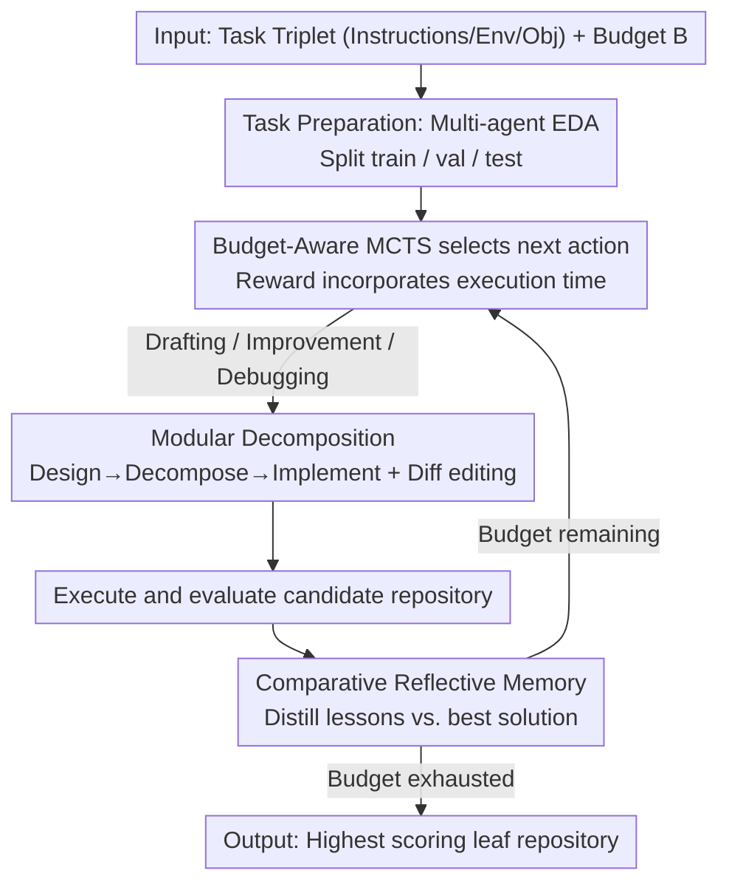

# MARS: Modular Agent with Reflective Search for Automated AI Research

**Conference**: ICML 2026  
**arXiv**: [2602.02660](https://arxiv.org/abs/2602.02660)  
**Code**: https://github.com/jfc43/MARS (Available)  
**Area**: LLM Agent / Automated Machine Learning (AutoML) / MLE Agent  
**Keywords**: MLE-Bench, Modular Agent, Budget-Aware MCTS, Comparative Reflective Memory, Lesson Learning

## TL;DR
MARS reframes automated AI research as a problem of "searching for the optimal solution within a software repository space." Built on three pillars—**Budget-Aware MCTS**, a **modular "Design-Decompose-Implement" pipeline**, and **Comparative Reflective Memory**—it achieves SOTA among open-source frameworks on MLE-Bench with a 31.1% gold medal rate (Gemini-3-Pro-Preview) and demonstrates an "Aha! moment" with a 63% cross-branch lesson transfer rate.

## Background & Motivation

**Background**: LLM agents have shown strength in general software engineering (fixing GitHub issues, writing tests). Recent works (AIDE, AIRA, R&D-Agent, ML-Master, InternAgent, etc.) have begun applying them to Machine Learning Engineering (MLE) tasks, the core bottleneck of automated AI research, competing on medal rates using OpenAI’s MLE-Bench (75 Kaggle competitions $\times$ 24h $\times$ 1$\times$A100).

**Limitations of Prior Work**: The authors identify three structural deficiencies in existing MLE agents:

- **Ignoring Execution Costs**: Current search methods (greedy, vanilla MCTS, evolutionary) optimize for task performance without considering wall-clock time. A solution that improves accuracy by 0.1% but increases training time from 1h to 10h is disastrous within a 24h budget, yet standard UCT algorithms bias toward it.
- **Fragility of Monolithic Scripts**: Most existing agents generate a single large Python file. Token limits compress logic, single changes require full rewrites, and debugging is difficult. This cannot support the multi-module coupling of "data-model-training loop" found in real research repositories.
- **Memory Fails at Credit Assignment**: When experimental results improve, which specific line of code change was responsible? Verbal reflection or trajectory caching (e.g., Reflexion, MemGPT) only "remembers what was done" but fails to isolate causal factors.

**Key Challenge**: MLE is not equivalent to general programming. It involves probabilistic long-horizon tasks characterized by "expensive evaluation + opaque attribution + high architectural complexity." This requires **strategic search with budget awareness** rather than just smarter single-script generators.

**Goal**: Design an agent scaffolding that addresses three sub-problems: (1) how to explicitly trade-off performance and cost during search; (2) how to enable agents to produce repo-level solutions instead of scripts; and (3) how to distill differences between "success vs. failure" into transferable causal insights.

**Key Insight**: Formalize MLE as $s^* = \arg\max_s \mathcal{O}(s, \mathcal{E})$ s.t. $\text{Cost}(s) \le B$. Redefine the solution space from "all possible Python programs" to "all possible modular repositories $s_n = \langle \{\mathcal{M}_j\}_{j=1}^{l}, \pi_{\text{main}}\rangle$." This ensures that search, memory, and reward functions revolve around a repo-level representation.

**Core Idea**: Utilize **Budget-Aware MCTS** to search within the repository space, replace single-script generation with **Design-Decompose-Implement**, and use **Comparative Reflective Memory** (contrasting current solutions with the best-known diffs) to solve credit assignment. Together, these elements facilitate long-horizon "Aha! moments."

## Method

### Overall Architecture
MARS treats the objective of achieving gold-medal performance within a 24h wall-clock budget as a constrained search problem. Given a task triplet $\mathcal{P} = (\mathcal{I}, \mathcal{E}, \mathcal{O})$ (Instructions / Environment / Objective) and a budget $B$, the system seeks to find a modular repository $s_n = \langle \{\mathcal{M}_j\}_{j=1}^{l}, \pi_{\text{main}}\rangle$ that maximizes $\mathcal{O}$ within $B$.

The system operates in an iterative loop. It begins with Task Preparation: multi-agent metadata extraction and Exploratory Data Analysis (EDA) to guide feature engineering and split train/val/test sets. The MARS Loop follows—repeatedly "deciding the next action, generating/modifying the repository, and distilling lessons from execution" on an MCTS tree. Each node represents a candidate repository. Actions include **Drafting** (new solutions from the root), **Improvement** (modifying modules in valid nodes), and **Debugging** (fixing runtime errors in buggy nodes, up to $N_d=10$ times). The repository corresponding to the highest-scoring leaf is output once the budget is exhausted.

### Key Designs

**1. Modular Decomposition: From Script Generation to Validated Architecture**

Unlike standard MLE agents that generate a single Python script, MARS separates code generation into three specialized agents: the *Idea Generation Agent* creates a natural language plan; the *Modular Agent* decomposes it into independent functional modules $\{\mathcal{M}_j\}$ (e.g., `dataset.py`, `model.py`, `engine.py`); and the *Coding Agent* implements each sequentially. Each module is verified with an independent validation script before the main logic $\pi_{\text{main}}$ orchestrates the end-to-end pipeline. Subsequent modifications use **Diff-Based Editing**, specifying the target file, block to replace, and new code in standard diff format, allowing atomic multi-file updates.

This bypasses token limits, focuses attention on small logical units, enables module caching, and localizes debugging to specific files. Table 4 shows that enabling modularity increases the average LOC from 474.8 to 1103.9 and file count from 1.0 to 6.7, indicating that the agent produces more complex, structured architectures.

**2. Comparative Reflective Memory: Causal Isolation via Diffs**

To accurately determine which modifications drove performance changes, MARS uses two-step distillation. The *Empirical Analysis Agent* extracts objective findings (e.g., metric trends) from logs. The *Lesson Distillation Agent* then performs **comparative reflection**, creating a code-level diff between the current and "best-known" solution to output a lesson containing: the isolated causal change, a comparative impact analysis, and generalized rules for future iterations. For **buggy** solutions, a specialized agent analyzes the code, error logs, and applied fixes to produce debugging lessons on how to identify similar errors early.

Lessons are filtered for redundancy by a Review Agent and kept in a pool of $K_m = 30$ in-context. Agents are forced to explicitly cite used lessons, ensuring auditability. Quantitatively, the lesson-utilization rate is 65.8%, and more crucially, the **lesson-transfer rate is 63.0%** (meaning 63% of used lessons originated from different tree branches). This serves as hard evidence for the "Aha! moment" where the agent treats experience as global knowledge.

**3. Budget-Aware MCTS: Systematic Bias Toward Efficiency**

Given the 24h constraint, vanilla MCTS would waste budget on marginal accuracy gains at high computational costs. MARS encodes cost into the reward: performance $M(v)$ of node $v$ is normalized globally as $G(v) = (M(v) - M_{\min}) / (M_{\max} - M_{\min})$. This is then adjusted by a time-penalty term:

$$R(v) = G(v) \cdot \left[\frac{t(v)}{L(v)}\right]^{w},$$

where $t(v)$ is actual execution time, $L(v)$ is the time limit, and $w$ is a negative penalty weight (default $w = -0.07$). Faster solutions yield a higher reward for equal accuracy, guiding the search to prune inefficient branches. Node expansion is also customized: buggy nodes are marked "fully-expanded" after 10 debug steps, while valid nodes are limited to $N_i = 2$ improvement children. The root reactivates for new Drafting if $n_s$ valid nodes fail to improve the best solution, creating an adaptive "exploration vs. restart" mechanism.

## Key Experimental Results

### Main Results: MLE-Bench (75 tasks, Mean±SEM over 3 runs, %)

| Agent | Model | Above Median | Bronze | Silver | Gold | Any Medal |
|--------|------|------|------|------|------|------|
| AIDE | Gemini-3-Pro-Prev | 48.0 | 4.9 | 11.1 | 16.4 | 32.4 |
| AIRA-dojo | Gemini-3-Pro-Prev | 55.6 | 5.8 | 8.0 | 24.0 | 37.8 |
| ML-Master 2.0 (leaderboard) | Deepseek-V3.2-Speciale | 63.1 | 11.1 | 25.8 | 19.6 | 56.4 |
| **MARS** | Gemini-3-Pro-Prev | **65.8** | 9.3 | 15.6 | **31.1** | 56.0 |
| **MARS+** (2×H100) | Gemini-3-Pro-Prev | **74.2** | 12.4 | 16.4 | **33.8** | **62.7** |

MARS significantly outperforms AIDE and AIRA-dojo under controlled model comparisons. On the official leaderboard, it achieves the highest Gold rate (31.1%) among all methods with fewer resources. MARS+ further improves these metrics by using parallel trees.

### Ablation Study (MLE-Bench Lite, 22 contests)

| Configuration | Key Finding |
|------|---------|
| Full MARS | Baseline performance. |
| w/o Modular Decomposition | LOC drops from 1103.9 to 474.8; files drop from 6.7 to 1.0; performance significant decline. |
| w/o Memory | Drastic drop; the agent fails to learn from iterations. |
| Memory w/o Comparative Delta | Performance is better than no memory but significantly worse than "Full MARS." |
| Greedy Search | Significantly worse; lacks exploration. |
| Vanilla MCTS ($w=0$) | Moderate; lacks systematic budget awareness. |
| Budget-Aware MCTS ($w=-0.07$) | Optimal; increases effective solution rate to 19.5% (vs. 16.1% for vanilla). |

### Key Findings
- **Comparative memory is the core contribution**: Removing comparative analysis leads to a drop, proving that lesson value resides in "isolating causal changes via code-level diffs."
- **Lessons transfer across branches**: A 63.0% transfer rate proves the agent treats experience as a global knowledge base.
- **Budget-awareness as a pruning heuristic**: Setting $w = -0.07$ allows the agent to explore ~20% more effective solutions within the 24h window by favoring efficiency.
- **Modularity enables architectural complexity**: Modular decomposition leads to doubled LOC and structured multi-file outputs, reflecting higher-level architectural reasoning.

## Highlights & Insights
- **Paradigm Shift**: Redefining MLE as "search over modular repositories" moves the search unit to the repository level, supported by diff-based editing.
- **Ablation inside Memory**: Comparative reflection effectively performs "automated ablation" to isolate algorithmic changes from noisy logs.
- **Efficiency Hack**: Incorporating budget into the reward function ($R = G \cdot (t/L)^w$) is a simple but highly effective trick that should be applied to any time-constrained LLM search task.
- **Auditability via Citations**: Forcing agents to cite lessons makes their behaviors interpretable and debuggable.

## Limitations & Future Work
- **Benchmark Coverage**: MLE-Bench focuses on Kaggle-like tasks; real research involving hypothesis generation and literature review remains unexplored.
- **Backbone Dependency**: High reasoning load for lesson distillation currently requires top-tier models like Gemini-3-Pro.
- **Fixed Search Width**: Branching factors ($N_i, N_d$) are manually tuned and not yet adaptive to task difficulty.
- **Long-term Memory**: The lesson pool uses simple LRU; future work could include embedding-based RAG for cross-task knowledge sharing.

## Related Work & Insights
- **vs. AIDE/AIRA**: MARS replaces "greedy/monolithic scripts + full memory" with "MCTS + modular + comparative memory," increasing Any Medal from ~35% to 56%.
- **vs. ML-Master 2.0**: MARS achieves a higher Gold rate (31.1% vs 19.6%) with fewer resources by focusing on budget awareness and modularity.
- **vs. Reflexion**: While Reflexion uses binary success/failure, MARS distills causal rules via diffs, representing a shift from "remembering mistakes" to "deriving rules."

## Rating
- **Novelty**: ⭐⭐⭐⭐ Combines existing concepts (MCTS, modular code, reflection) into a cohesive, MLE-specific repo-level search framework.
- **Experimental Thoroughness**: ⭐⭐⭐⭐⭐ Comprehensive testing on MLE-Bench with multiple LLMs, control groups, and 4-axis ablations.
- **Writing Quality**: ⭐⭐⭐⭐ Clear diagrams and well-defined hierarchical framework.
- **Value**: ⭐⭐⭐⭐⭐ Sets a new SOTA for open-source MLE agents; modular and cost-aware designs are directly transferable to generic long-horizon coding tasks.

<!-- RELATED:START -->

## Related Papers

- [\[ACL 2026\] RExBench: Can coding agents autonomously implement AI research extensions?](../../ACL2026/code_intelligence/rexbench_can_coding_agents_autonomously_implement_ai_research_extensions.md)
- [\[ACL 2026\] MARS2: Scaling Multi-Agent Tree Search via Reinforcement Learning for Code Generation](../../ACL2026/code_intelligence/mars2_scaling_multi-agent_tree_search_via_reinforcement_learning_for_code_genera.md)
- [\[NeurIPS 2025\] MLR-Bench: Evaluating AI Agents on Open-Ended Machine Learning Research](../../NeurIPS2025/code_intelligence/mlr-bench_evaluating_ai_agents_on_open-ended_machine_learning_research.md)
- [\[NeurIPS 2025\] VeriMaAS: Automated Multi-Agent Workflows for RTL Design](../../NeurIPS2025/code_intelligence/automated_multi-agent_workflows_for_rtl_design.md)
- [\[ICML 2026\] Physics Is All You Need? A Case Study in Physicist-Supervised AI Development of Scientific Software](physics_is_all_you_need_a_case_study_in_physicist-supervised_ai_development_of_s.md)

<!-- RELATED:END -->
