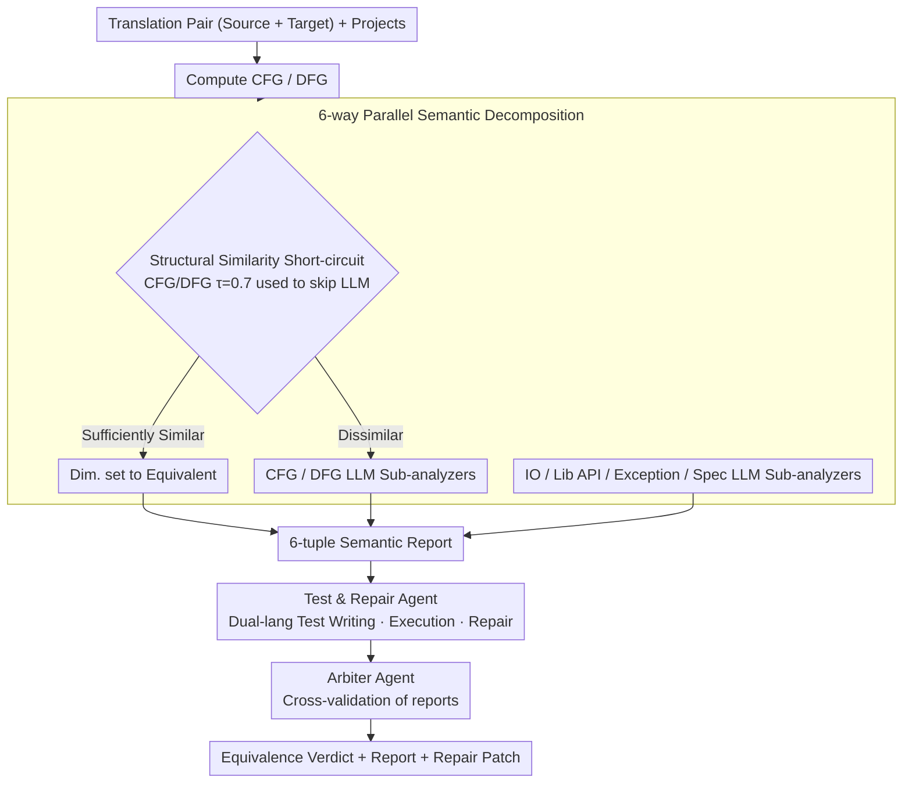

# MatchFixAgent: Language-Agnostic Autonomous Repository-Level Code Translation Validation and Repair

**Conference**: ICML 2026  
**arXiv**: [2509.16187](https://arxiv.org/abs/2509.16187)  
**Code**: https://github.com/Intelligent-CAT-Lab (artifacts repository)  
**Area**: Code Intelligence / LLM Agent / Program Analysis  
**Keywords**: Code Translation, Equivalence Validation, Multi-agent, Language-agnostic, Program Repair

## TL;DR
MatchFixAgent fully transforms "equivalence validation + repair" for repository-level code translation into an LLM-based task. By replacing expensive cross-language interoperability engineering with six parallel semantic sub-analyzers (Control Flow, Data Flow, IO, Library API, Exception, and Specification), and layering a Test & Repair Agent with an Arbiter Agent, it raises validation coverage from 71.6% to 99.2% and the repairable defect ratio from 18.5% to 50.6% with only 1650 lines of code.

## Background & Motivation
**Background**: Code translation (e.g., migrating Java projects to Rust or Python) is a core requirement for system modernization. Current methods to determine equivalence include running original source tests on the target language (Oxidizer, AlphaTrans, Skel) or using differential fuzzing to compare results under random inputs.

**Limitations of Prior Work**: (1) Excessive engineering overhead—writing cross-language interoperability layers (FFI, type mapping, runtime bridges) for each language pair often requires tens of thousands of lines of code (e.g., 19,052 lines for Oxidizer), leading to an $O(N^2)$ scaling problem for $N$ languages. (2) Insufficient test coverage—existing unit tests are often incomplete, leading to "false equivalence," while fuzzing generates many invalid inputs that trigger "false non-equivalence." (3) Weak repair capabilities—when non-equivalence is found, the system either relies on human intervention or utilizes weak feedback loops (recycling error messages into prompts), which often fail for long call chains in repositories.

**Key Challenge**: Equivalence validation essentially requires "understanding the semantics of both ends." Symbolic methods are constrained by the number of language pairs, while execution-based methods are limited by test quality. Both approaches struggle to scale.

**Goal**: (1) Validation mechanisms must be language-agnostic with low engineering costs; (2) Provide credible equivalence/non-equivalence judgments without relying on the original test suite; (3) Generate actual repair patches rather than just verdicts.

**Key Insight**: LLMs have performed well in same-language equivalence tasks. Instead of further engineering cross-language interoperability, this task can be outsourced to LLMs. However, a single prompt asking "is this equivalent?" is too coarse and prone to hallucinations. The key observation is to decompose equivalence into six orthogonal semantic dimensions, allowing LLMs to focus on one dimension at a time, followed by an Agent that writes and executes tests for empirical validation and an Arbiter Agent for the final decision.

**Core Idea**: A lightweight multi-agent architecture featuring "6-way parallel semantic analysis + Test & Repair Agent + Arbiter Agent" converts cross-language validation from an engineering problem into an LLM task, reducing per-language adaptation costs to ~280 lines of code.

## Method

### Overall Architecture
MatchFixAgent determines if a translated function is truly equivalent to its source in a language-agnostic manner and fixes it if not. It takes a translation pair (source function + translated function) and two full projects as input. The process is split across three layers: first, the Semantic Analysis layer uses six parallel sub-analyzers for static reasoning; next, a Test & Repair Agent performs empirical validation by writing/executing tests and patching the code; finally, an Arbiter Agent synthesizes the reports into a final conclusion. The system is implemented in 1650 lines of Python, and adding a new language requires only ~280 lines (mainly Tree-sitter adaptation).

### Key Designs

**1. 6-way Parallel Semantic Decomposition + LLM-as-analyzer**

To prevent detail loss and hallucinations, equivalence is decomposed into six orthogonal dimensions: Control Flow, Data Flow, IO, Library API, Exception, and Specification. Each dimension is handled by a specialized LLM sub-analyzer with a dedicated prompt. These prompts define the role (e.g., "Expert in IO") and precise criteria for equivalence (e.g., IO equivalence requires consistency in inputs, outputs, side effects, boundaries, and performance). LLMs output a JSON verdict with explanations and counterexamples.

**2. Structural Similarity Short-circuit + LLM Fallback**

Many functions in repository-level translations are mechanical conversions where the structure remains largely unchanged. To save costs, Control Flow and Data Flow analyzers use a two-stage approach: a cheap graph similarity check is performed first, and the LLM is only invoked if the similarity is below a threshold. For CFG, node and edge Jaccard similarity is weighted:

$$similarity = 0.5 \times nodeSim + 0.5 \times edgeSim$$

If the similarity exceeds $\tau = 0.7$, it is directly judged as equivalent. This skips approximately 25–35% of LLM calls, focusing compute on difficult samples.

**3. Test & Repair Agent + Arbiter Agent**

Static reasoning may still misjudge. The Test & Repair Agent (utilizing tools like Claude Code) uses the semantic reports as clues to write and execute tests in both languages to find empirical evidence. If non-equivalence is confirmed, it attempts to fix the translation. Finally, the Arbiter Agent cross-references the semantic reports with the test results to filter out hallucinations and produce a concise final verdict. This "analysis-evidence-arbitration" pipeline improved accuracy by 42.3pp in ablation studies.

### Loss & Training
The workflow involves no training; it relies on prompts, tool invocations, and algorithmic control. Hyperparameters include the similarity threshold $\tau = 0.7$ and timeouts for the Test & Repair Agent. It primarily uses Claude 3.7 Sonnet as the backbone LLM.

## Key Experimental Results

### Main Results
The baseline includes 2219 function pairs from four SOTA translation tools (AlphaTrans, Oxidizer, Skel, SpecTra) across 6 language pairs and 24 real-world projects.

| Metric | Prev. SOTA (Aggregate) | MatchFixAgent | Gain |
|------|------------------------|---------------|------|
| Verdict Rate (pairs with decision) | 71.6% | **99.2%** | +27.6pp |
| Consistency Rate (when both give verdicts) | — | 72.8% (1571 pairs) | — |
| Human-verified Accuracy on Disagreements | 39.3% | **60.7%** | +21.4pp |
| Successfully Repaired Non-equivalent Pairs | 18.5% | **50.6%** | **+32.1pp** |
| Framework Codebase Size | 3843 ~ 19052 LoC | **1650 LoC** | 2x-12x reduction |

On the Oxidizer subset (192 pairs), MatchFixAgent achieved an 84.1% accuracy rate on samples where it disagreed with the base tool.

### Ablation Study

| Configuration | Accuracy | Token Usage |
|------|-----------|-----------|
| Full (6 Analyzers + T&R Agent + Arbiter) | 100% (Baseline) | 100% (Baseline) |
| w/o Decomposition + w/o In-the-loop Testing | **−42.3pp** | −5.2% |
| Adaptation Engineering | — | **~280 LoC** |

### Key Findings
- **Multi-Agent Specialization outweighs token savings**: Removing decomposition only saves 5.2% in tokens but results in a 42.3pp drop in accuracy. 
- **Lightweight short-circuiting is vital for cost control**: The similarity threshold $\tau = 0.7$ successfully filters out clear cases, concentrating LLM power on ambiguous samples.
- **Repair success stems from "Understanding before Fixing"**: Providing the repair agent with a 6-dimensional semantic report (explaining exactly *why* it is wrong) is significantly more effective than blind retry-loops.

## Highlights & Insights
- **Replacement of Engineering with LLM Tasks**: Traditional cross-language analysis is a high-maintenance engineering task. By replacing it with prompts and Tree-sitter CFGs/DFGs, the code complexity was reduced drastically while maintaining high ROI.
- **Reusable "Map-Reduce-Review" Pattern**: The architecture of parallel sub-analyzers (map), empirical validation (reduce), and an arbiter (review) can be easily adapted to other validation tasks like refactoring or API compatibility.
- **Pragmatic Grounding**: Using Jaccard similarity as a filter is a robust industrial practice to manage the costs of LLM agent systems.

## Limitations & Future Work
- **Ours**: (1) Verdicts are not absolute proofs; accuracy is a relative improvement over existing tools. (2) Evaluations were limited to 6 common language pairs; the performance on rarer pairs (e.g., Haskell) is untested. (3) Data flow analysis is syntax-based and does not handle complex aliasing or concurrency perfectly.
- **Mechanism Improvements**: Future work could integrate a "Formal Verification Bridge" for specific dimensions (like specifications) using SMT solvers, or implement adaptive analyzer selection to further reduce inference costs.

## Related Work & Insights
- **vs AlphaTrans / Oxidizer / Skel**: These rely on cross-language interoperability and original tests, which are engineering-heavy and limited by test coverage. MatchFixAgent uses a multi-agent approach to boost coverage and repair rates by significant margins.
- **vs Differential Fuzzing**: Unlike fuzzers that generate invalid inputs, the IO Analyzer proposes targeted counterexamples based on semantic understanding.
- **vs Same-language Equivalence (Wei 2025)**: This work scales equivalence detection to cross-language scenarios and uses decomposition to solve the unreliability of single-prompt LLM agents.

## Rating
- Novelty: ⭐⭐⭐⭐ Successfully demonstrates the shift from manual symbolic engineering to a decomposed multi-agent LLM system.
- Experimental Thoroughness: ⭐⭐⭐⭐ Large-scale evaluation across 24 projects with systematic human verification of disagreements.
- Writing Quality: ⭐⭐⭐⭐ Clear structure; the motivation-method-experiment chain is logical.
- Value: ⭐⭐⭐⭐⭐ Extremely high industrial potential for code modernization pipelines due to low adaptation costs.

<!-- RELATED:START -->

## Related Papers

- [\[ICML 2026\] SWE-rebench V2: Language-Agnostic SWE Task Collection at Scale](swe-rebench_v2_language-agnostic_swe_task_collection_at_scale.md)
- [\[ACL 2026\] SWE-QA: Can Language Models Answer Repository-level Code Questions?](../../ACL2026/code_intelligence/swe-qa_can_language_models_answer_repository-level_code_questions.md)
- [\[ICML 2026\] Bridging Functional Correctness and Runtime Efficiency Gaps in LLM-Based Code Translation](bridging_functional_correctness_and_runtime_efficiency_gaps_in_llm-based_code_tr.md)
- [\[ICML 2026\] NEMO: Execution-Aware Optimization Modeling via Autonomous Coding Agents](nemo_execution-aware_optimization_modeling_via_autonomous_coding_agents.md)
- [\[ACL 2026\] RepoShapley: Shapley-Enhanced Context Filtering for Repository-Level Code Completion](../../ACL2026/code_intelligence/reposhapley_shapley-enhanced_context_filtering_for_repository-level_code_complet.md)

<!-- RELATED:END -->

## Related Papers

- [\[ICML 2026\] SWE-rebench V2: Language-Agnostic SWE Task Collection at Scale](swe-rebench_v2_language-agnostic_swe_task_collection_at_scale.md)
- [\[ACL 2026\] SWE-QA: Can Language Models Answer Repository-level Code Questions?](../../ACL2026/code_intelligence/swe-qa_can_language_models_answer_repository-level_code_questions.md)
- [\[ACL 2026\] RepoShapley: Shapley-Enhanced Context Filtering for Repository-Level Code Completion](../../ACL2026/code_intelligence/reposhapley_shapley-enhanced_context_filtering_for_repository-level_code_complet.md)
- [\[ICML 2026\] NEMO: Execution-Aware Optimization Modeling via Autonomous Coding Agents](nemo_execution-aware_optimization_modeling_via_autonomous_coding_agents.md)
- [\[ACL 2026\] Bootstrapping Code Translation with Weighted Multilanguage Exploration](../../ACL2026/code_intelligence/bootstrapping_code_translation_with_weighted_multilanguage_exploration.md)

<!-- RELATED:END -->
