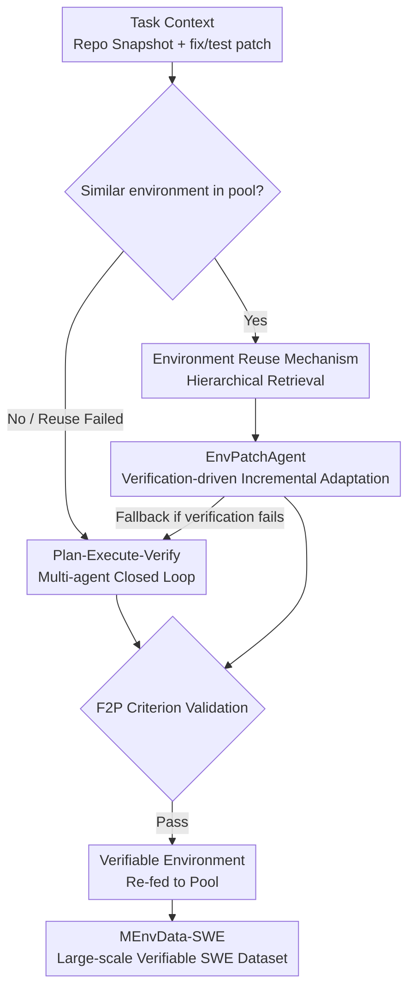

# MEnvAgent: Scalable Polyglot Environment Construction for Verifiable Software Engineering

**Conference**: ICML2026  
**arXiv**: [2601.22859](https://arxiv.org/abs/2601.22859)  
**Code**: Open-sourced (The paper states that code/benchmark/dataset are on GitHub; refer to the original text for links)  
**Area**: Code Intelligence / Software Engineering Agent  
**Keywords**: Polyglot environment construction, Multi-agent, Verifiable reward, Environment reuse, SWE dataset

## TL;DR
MEnvAgent employs a "Plan-Execute-Verify" three-stage multi-agent closed-loop and an environment reuse mechanism to automatically build executable and verifiable (Fail-to-Pass) Docker environments for real-world repositories across 10 languages. On the self-constructed MEnvBench, it improves the F2P rate by 8.6% and reduces construction time by 43%, facilitating the creation of MEnvData-SWE, the largest polyglot verifiable SWE training set to date.

## Background & Motivation
**Background**: Benchmarks like SWE-bench for "real-world issue fixing" have become the standard for evaluating LLM programming capabilities. Agents such as OpenHands and SWE-Agent must locate issues within a repository, generate patches, and run tests to verify solutions. This "execution-based verification" is not only used for evaluation but serves as the cornerstone for new training paradigms like RLVR (Reinforcement Learning from Verifiable Rewards)—without a runnable environment, there is no credible reward signal.

**Limitations of Prior Work**: The scale of verifiable data is restricted by the ability to set up an executable environment for a repository. Existing approaches face a dilemma: methods based on static code metrics (which do not actually run tests) are scalable but only provide approximate verification signals; manual construction offers high quality but is labor-intensive and primarily covers Python. Support for cross-language, executable, and quality-assured environments remains a blank space.

**Key Challenge**: Environment construction faces two major hurdles. The first is **complexity**—non-standard repository dependencies are diverse, version conflicts and compilation errors are frequent, and test protocols (e.g., pytest, mvn test) vary, leading to low success rates. The second is **time consumption**—installation and compilation are inherently slow, and environments are fragile; a single error often forces a "start from scratch" approach, making the overhead of reconstruction unbearable when scaling data.

**Goal**: Develop a scalable, cross-language, automated environment construction framework that produces verifiable task instances, accompanied by a rigorous polyglot benchmark for validation.

**Core Idea**: Utilize a **multi-agent closed loop** to autonomously diagnose and fix construction failures to overcome complexity, and an **environment reuse mechanism**—retrieving similar historical environments and applying incremental patches instead of rebuilding from zero—to overcome time consumption.

## Method

### Overall Architecture
Given a task context (repository snapshot $R$, issue, and the fix patch and test patch extracted from the PR), the goal of environment construction is to determine a configuration triplet $(B, \mathcal{P}, T)$: a base image $B$, a construction process $\mathcal{P}$ consisting of a sequence of installation commands, and a test configuration $T$. The constructed environment is denoted as $S = \delta(B, \mathcal{P})$. The qualification criterion is not just "successfully running" (Pass, $\varepsilon(R_{fix}, S, T)=0$), but satisfying a strict **Fail-to-Pass** criterion:

$$\varepsilon(R, S, T)=1 \;\land\; \varepsilon(R_{fix}, S, T)=0$$

This means the tests **must fail** on the original repository state $R$ (reproducing the issue) and **must pass** after applying the fix patch (verifying the fix). This "differential result" ensures the environment is a valid verifiable instance.

MEnvAgent coordinates two paths toward this goal: when similar historical environments exist in the pool, it takes the **environment reuse** fast track (retrieval + incremental patching); when none exist or reuse fails, it falls back to the **Plan-Execute-Verify multi-agent closed loop** to build from the image step-by-step. Both paths are ultimately validated by the F2P criterion, and verified environments are fed back into the pool for future reuse.

### Key Designs

**1. Plan-Execute-Verify Multi-agent Closed Loop: Turning "Restart on Failure" into "Autonomous Diagnosis and Iteration"**

This design directly addresses the "complexity" pain point: a single agent rarely manages to correctly match dependencies, images, and test commands for an unfamiliar repository in one go. MEnvAgent decomposes the process into three stages coordinated by specialized agents. In the **planning stage**, three agents work in relay: the Repository Analysis Agent understands the project type, dependency requirements, and entry points; the Environment Setup Agent selects a base image and generates a complete installation script $\mathcal{P}$; then the Test Configuration Agent synthesizes a compatible test configuration $T$ based on the repository structure and installation script, ensuring verification logic aligns with environment settings. In the **execution stage**, the Environment Execution Agent starts the container to run $\mathcal{P}$ while **monitoring terminal output in real-time**, allowing it to dynamically modify commands to fix minor errors (missing packages, version conflicts) on the fly. If repair fails after multiple attempts, it abandons the current attempt and returns to the planning stage for a new solution. In the **verification stage**, the Verification Agent runs $T$ in the container; if it fails, it performs **error attribution**—determining if the failure is due to missing dependencies or incorrect test commands—and feeds the diagnostic feedback back to the planning stage for the next round. This closed loop allows the framework to "test-diagnose-modify" like a human engineer, converting one-time failures into convergent iterations, thereby increasing the success rate.

**2. Environment Reuse Mechanism: Finding Historical Environments with Minimal Adaptation Cost via "Hierarchical Retrieval"**

This design addresses the "time consumption" pain point: deriving and executing the full $\mathcal{P}$ from a raw image $B$ is expensive, whereas environments for different versions of the same repository are often highly similar. The authors reformulate the problem as finding a similar environment from the environment pool $\mathcal{S}_{pool}$ that minimizes the adaptation cost $\mathcal{C}_{adapt}$:

$$S_{sim} = \mathop{\arg\min}_{S \in \mathcal{S}_{pool}} \mathcal{C}_{adapt}(S, R)$$

The retrieval uses a **hierarchical strategy aligned with software evolution patterns**: it first prioritizes historical environments with the exact same version as the target snapshot; if none are found, it broadens the search to all historical environments for the same repository; it then leverages the observation of **backward compatibility** (newer environments usually support older dependencies) to select the environment that is **newer than the target but closest in time**, minimizing compatibility risks. This selected $S_{sim}$ requires fewer changes, avoiding the major overhead of reconstruction from zero.

**3. EnvPatchAgent: Verification-driven Incremental Patching to Turn "Reuse" into a Convergent Process**

Simply retrieving a similar environment is not enough—applying it directly might not work for the target repository. EnvPatchAgent generates an incremental command sequence $\Delta\mathcal{P}$ within a feedback loop to adapt $S_{sim}$ to the target snapshot, resulting in $S_{new}=\delta(S_{sim}, \Delta\mathcal{P})$, with the goal of satisfying $\varepsilon(R, S_{new}, T)=1 \land \varepsilon(R_{fix}, S_{new}, T)=0$. The workflow is: the Test Configuration Agent synthesizes $T$ and executes it in $S_{sim}$; **if it passes directly, it is zero-cost reuse**; if it fails, EnvPatchAgent analyzes the feedback and synthesizes incremental commands $\Delta\mathcal{P}$ as patches, iterating until the F2P success conditions are met. Ablation shows this agent is the linchpin of the reuse mechanism—removing it (retrieving without patching) causes the reuse success rate to plummet from 39% to 25%, and increases time consumption by 20% due to frequent fallbacks to zero-based construction.

**4. MEnvBench Benchmark and MEnvData-SWE Dataset: Ensuring Quality through Rigorous Execution-based Evaluation**

To enable both rigorous evaluation and practical data production, the authors constructed **MEnvBench**: covering 10 major languages, 200 open-source repositories, and 1,000 tasks (10 languages × 20 repositories × 5 instances from different versions). It emphasizes **execution-based evaluation and quality assurance**, providing a critical improvement over existing benchmarks which are often language-restricted, non-executable, or lack quality checks. The data collection uses a two-stage pipeline: first, approximately 8,000 repositories are filtered based on criteria like >1000 stars, >200 forks/issues/PRs, and >60% primary language share; then, closed issue-PR pairs from 2018–2025 are extracted, keeping only those with test patches and refined using LLM scoring (discarding <5 points), resulting in 213,766 candidate instances. Evaluation uses three metrics: Pass Rate (executability), F2P Rate (strict validity), and Time Cost (average wall-clock time). MEnvAgent was then used to produce **MEnvData-SWE**—3,005 instances covering 942 repositories and 10 languages, the largest open-source polyglot verifiable SWE dataset with full executable environments—and collected problem-solving trajectories for downstream fine-tuning.

## Key Experimental Results

### Main Results
On MEnvBench (averaging across 10 languages), MEnvAgent significantly outperforms the strongest baseline, SWE-Factory, using two different inference backends (open-source Kimi-K2 and closed-source Gemini-3-Flash):

| Backend | Method | F2P (%) | PASS (%) | TIME (s) |
|------|------|---------|----------|----------|
| Kimi-K2 | SWE-Factory | 26.2 | 34.5 | 6356 |
| Kimi-K2 | MEnvAgent | 35.7 (+9.5) | 45.9 (+11.4) | 3339 (-47.5%) |
| Gemini-3-Flash | SWE-Factory | 33.3 | 41.5 | 6175 |
| Gemini-3-Flash | MEnvAgent | 41.1 (+7.8) | 52.0 (+10.5) | 3808 (-38.3%) |
| **Average** | **SWE-Factory** | **29.8** | **38.0** | **6266** |
| **Average** | **MEnvAgent** | **38.4 (+8.6)** | **49.0 (+11.0)** | **3574 (-43.0%)** |

In efficiency-quality scatter plots, MEnvAgent consistently occupies the "top-left" (low time cost, high validity); SWE-Factory shifts right (slow) due to inefficient trial-and-error loops, while Repo2Run / SWE-Bench-Live shift down (weak ability to produce valid environments).

### Ablation Study
Dissecting the environment reuse mechanism on the Python subset (10 instances per repository) where RSR is the Reuse Success Rate:

| Configuration | RSR (%) | PASS (%) | TIME (s) | Description |
|------|---------|----------|----------|------|
| MEnvAgent (Full) | 39.0 | 59.0 | 2314 | Complete retrieval + EnvPatchAgent |
| w/o EnvPatchAgent | 25.0 | 52.0 | 2777 | Retrieval only; reuse rate drops, time increases |
| w/o Reuse | 0.0 | 40.5 | 4283 | Constructing from zero for every task |

Compared to "w/o Reuse", the full framework reduces average time by 46.0% and improves Pass Rate by 18.5%, because reuse bypasses the error-prone step of resolving dependencies from scratch.

### Key Findings
- **EnvPatchAgent is the core of the reuse mechanism**: Removing it causes the reuse success rate to drop from 39% to 25%, and time consumption increases because of frequent fallbacks. This proves that "retrieving a similar environment" must be paired with "verification-driven patching" to be valuable.
- **Data scale drives reuse benefits**: As the number of instances per repository increases from 1 to 10, the reuse success rate rises steadily from near 0 to 39%, with Pass Rate increasing and Time Cost decreasing accordingly—the more historical data, the more worthwhile the reuse.
- **Divergent cross-lingual failure modes**: Languages with standardized ecosystems like Go and Python show high F2P rates. Java often fails during environment setup due to complex Maven/Gradle configurations (Gemini-3-Flash's setup failure rate for Java is about half of Kimi's). C/C++ suffer from complex CMake configurations and high resource consumption, often failing due to timeouts. This reinforces the need for accurate error attribution by the Verification Agent.
- **Data successfully trains stronger SWE models**: After fine-tuning via rejection sampling on trajectories collected from MEnvData-SWE, Qwen2.5-Coder-32B-Instruct's Resolved Rate on SWE-bench Verified rose from 7.5 to 54.6 (+47.1), and on SWE-bench Multilingual from 0.0 to 38.3 (+38.3). The stronger GLM-4.5-Air also showed stable gains of +4.8 / +5.4.

## Highlights & Insights
- **Treating "Environment Construction" itself as a verifiable and optimizable task**: The F2P criterion provides an objective, executable standard for environment correctness. It serves as both an evaluation metric and a direct reward source for RLVR—the key lever for scaling SWE data.
- **Engineering wisdom in retrieval strategies**: Rather than relying on semantic embeddings, the framework uses "version consistency + backward compatibility"—heuristics that align with software evolution laws. This is simple, interpretable, and naturally fits the reality of high similarity across multi-version repositories.
- **Retrieval + Incremental Patching = Amortized Construction Cost**: Reuse might not appear faster for a single task, but as historical environments for a repository accumulate, subsequent tasks can "stand on the shoulders of giants" through incremental adaptation. The construction cost is amortized—a concept transferable to any scenario requiring repetitive setup of heavy environments (CI, dependency snapshots, Docker layer caching).
- **Multi-agent division of labor matches natural workflow stages**: Analysis, image selection, test configuration, execution, and verification are handled by distinct agents. This is more stable than a single end-to-end agent, and error attribution accurately identifies whether the issue is "missing dependencies" or "incorrect test commands," making iterations purposeful.

## Limitations & Future Work
- The reuse mechanism depends on the **accumulation of historical environments for the same repository**: In sparse scenarios (1 instance/repo), the success rate is near zero, and the framework falls back to zero-based construction, offering limited help for entirely new repositories.
- **Complex compilation ecosystems like C/C++ remain a pain point**: Complex CMake configurations, high resource usage, and frequent timeouts lead to F2P rates significantly lower than Go/Python. The framework does not fundamentally solve the construction hurdles for heavy compiled languages.
- The absolute F2P rate (average 38.4%) is still not high, implying that **the environments for most real-world repositories still cannot produce valid verifiable instances**, leaving a gap toward "fully automatic verification for any repository."
- Evaluation and construction rely heavily on powerful LLMs (Kimi-K2, Gemini-3-Flash, and expert models like Claude-4.5-Sonnet). The token and time costs for large-scale data production are significant overheads, and the paper does not fully discuss the economic boundaries of this approach.

## Related Work & Insights
- **vs SWE-Factory (Strongest Baseline)**: While both are agent-based construction frameworks, SWE-Factory relies on inefficient trial-and-error cycles with high time costs and no reuse. MEnvAgent is both more accurate and faster (+8.6% F2P, -43% Time) across 10 languages via its closed loop and reuse strategy.
- **vs Repo2Run / Manual Construction**: Repo2Run is Python-specific and limited in scalability. Manual construction offers high quality but is labor-intensive and mostly Python-focused. MEnvAgent expands the scope to 10 languages with full automation.
- **vs Static Code Metric Methods**: These scale well but provide only approximate signals. MEnvAgent insists on execution-based verification (real test runs, F2P criteria) to ensure credible rewards at the cost of higher construction overhead.
- **Inspiration for RLVR / SWE Training**: Verifiable environments are the reward infrastructure for RLVR. MEnvAgent provides a pipeline for "automatic environment creation → trajectory collection → fine-tuning," filling a critical gap in the data side for training polyglot SWE agents.

## Rating
- Novelty: ⭐⭐⭐⭐ While multi-agent loops are not new, "Environment Reuse + Verification-driven Incremental Patching" to amortize construction costs is a genuine innovation in SWE environment setup.
- Experimental Thoroughness: ⭐⭐⭐⭐⭐ 10 languages, 1,000-task benchmark + main experiments with dual backends + reuse ablation + data scale analysis + downstream fine-tuning validation. A complete chain.
- Writing Quality: ⭐⭐⭐⭐ Clear problem formalization, clean F2P definition, and well-supported charts; some details reside in the appendix.
- Value: ⭐⭐⭐⭐⭐ Providing the largest polyglot verifiable SWE dataset + benchmark + framework directly serves RLVR and SWE agent training, offering high practical value.

<!-- RELATED:START -->

## Related Papers

- [\[ICLR 2026\] Ambig-SWE: Interactive Agents to Overcome Underspecificity in Software Engineering](../../ICLR2026/code_intelligence/ambig-swe_interactive_agents_to_overcome_underspecificity_in_software_engineerin.md)
- [\[ICLR 2026\] BOAD: Discovering Hierarchical Software Engineering Agents via Bandit Optimization](../../ICLR2026/code_intelligence/boad_discovering_hierarchical_software_engineering_agents_via_bandit_optimizatio.md)
- [\[ICML 2025\] Training Software Engineering Agents and Verifiers with SWE-Gym](../../ICML2025/code_intelligence/training_software_engineering_agents_and_verifiers_with_swe-gym.md)
- [\[ACL 2026\] EET: Experience-Driven Early Termination for Cost-Efficient Software Engineering Agents](../../ACL2026/code_intelligence/eet_experience-driven_early_termination_for_cost-efficient_software_engineering_.md)
- [\[ACL 2026\] Taming System Complexity: Demystifying Software Engineering Agents in Diagnosing Linux Kernel Faults](../../ACL2026/code_intelligence/taming_system_complexity_demystifying_software_engineering_agents_in_diagnosing_.md)

<!-- RELATED:END -->
