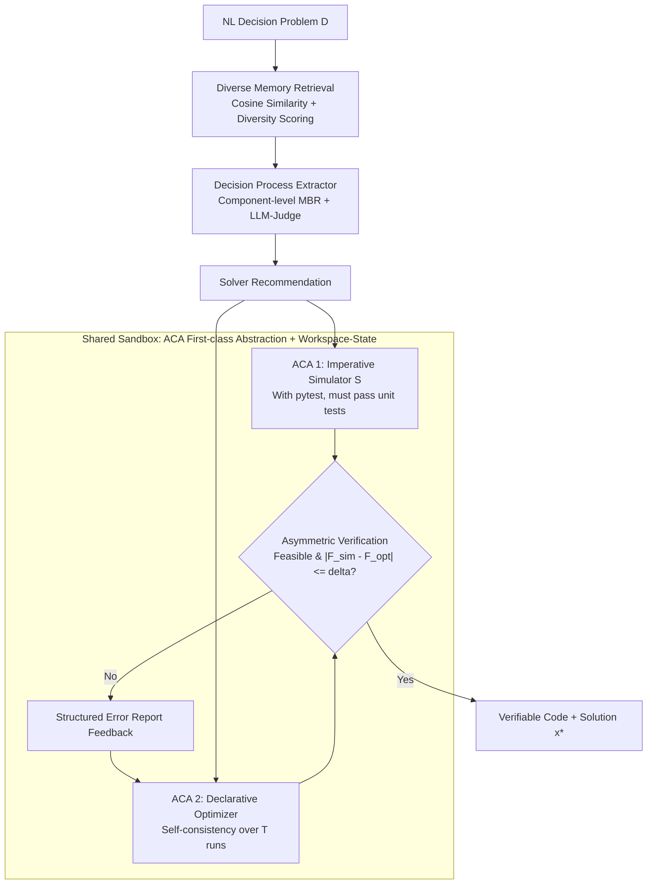

# NEMO: Execution-Aware Optimization Modeling via Autonomous Coding Agents

**Conference**: ICML 2026  
**arXiv**: [2601.21372](https://arxiv.org/abs/2601.21372)  
**Code**: Data/Intermediate artifacts released on [HuggingFace](https://huggingface.co/datasets/AnoushkaVyas/nemo-icml2026) (System code not yet open-sourced)  
**Area**: Code Intelligence / LLM Agent / Operations Research  
**Keywords**: Automated Optimization Modeling, Autonomous Coding Agents (ACA), Execution-Aware Verification, Simulator-Optimizer Closed Loop, MBR Decoding

## TL;DR
NEMO treats Autonomous Coding Agents (ACA) as a "first-class abstraction" on par with LLM calls. It enables independently generated simulators and optimizers to cross-verify via execution results in a shared sandbox, combined with diverse memory retrieval and MBR/self-consistency decoding. It achieves SOTA on 8 out of 9 optimization modeling benchmarks, leading by up to 28 percentage points.

## Background & Motivation

**Background**: Automatically translating natural language decision problems (resource scheduling, combinatorial optimization, production planning, etc.) into executable mathematical optimization code follows two main paradigms: **Training-based** (e.g., ORLM, LLMOPT, SIRL, OptMATH using specialized fine-tuning) and **Agent-based** (e.g., Chain-of-Experts, OptiMUS, OR-LLM-Agent, OptimAI using multi-role collaboration and critic reflection).

**Limitations of Prior Work**: Training-based methods are costly and have poor domain transferability. Agent-based methods model interactions as "structured text message-passing," where a coder posts code for a critic to review via error descriptions. This faces issues: 1) Generated code often fails syntax or execution; 2) Critics only see text and cannot "run" the code to check constraint satisfaction; 3) Sharing code between agents requires complex schema agreements, limiting scalability.

**Key Challenge**: Optimization modeling inherently possesses an asymmetric duality—**writing a declarative solver is difficult** (requires correct translation of constraints, objectives, and solver APIs), but **writing an imperative simulator is relatively simple** (straightforward simulation of problem steps). Empirical results on OptiBench show LLM Pass@1 for simulators at 97%, while optimizers only reach 87%. Existing agent systems fail to exploit this "verification is easier than solving" asymmetry.

**Goal**: Construct an execution-aware agent system where independently generated simulators verify optimizer outputs, while systematically handling the non-determinism of ACAs.

**Key Insight**: Instead of having multiple LLM agents exchange information at the text level, they should use multiple ACAs **sharing a persistent sandbox** to interact through "runnable artifacts." Code can be imported, executed, and unit-tested, forming a **Workspace-State paradigm** (vs. the traditional message-passing paradigm).

**Core Idea**: Treat ACA as a first-class abstraction equivalent to LLM calls → Use simulators (simpler task) as execution-based verification for optimizers (harder task) → Use MBR, diverse retrieval, and self-consistency to suppress ACA non-determinism.

## Method

### Overall Architecture
NEMO solves the mapping from "natural language decision problem $D$ → verifiable optimization code." The process is an inference-time pipeline: A reasoning LLM extracts a structured decision process $\mathcal{P}^*$ (decision variables, states, transitions, objectives, constraints, exogenous parameters) and recommends a solver. Two independent ACAs then operate in a shared sandbox—one writes an imperative simulator $\mathcal{S}$, the other writes a declarative optimizer. The simulator executes to verify the optimizer's solution; if verification fails, structured error reports are fed back to the optimizer for debugging. All ACAs (instantiated with OpenHands + Claude 3.7 Sonnet) run in the same sandbox, allowing module imports without schema negotiation.

### Key Designs

**1. ACA as First-class Abstraction + Workspace-State: Ensuring Code Executability**

Existing systems model interactions as "structured text message-passing," resulting in code that often fails to run and critics that rely on inference rather than execution. NEMO treats "calling an ACA capable of writing, running, and debugging code in a sandbox" as a system primitive equal to "calling an LLM." ACAs receive instructions and return executable code and execution traces. This addresses three major hurdles: code executability, cross-component schema negotiation, and few-shot utilization under long contexts.

**2. Simulator-Optimizer Asymmetric Verification: Bypassing Missing Ground-truth**

NEMO uses a simulator to verify the optimizer. Writing a declarative solver is hard, but an imperative simulator is easier (97% vs 87% Pass@1). The pipeline bifurcates after extracting $\mathcal{P}^*$: ACA #1 writes simulator $\mathcal{S}: \mathbb{R}^{|X|} \to \{0,1\} \times (\mathbb{R} \cup \{\infty\})$ with pytest suites derived from $D$. ACA #2 writes an optimizer to find $x^*, F_{\text{opt}}(x^*)$. Verification $V(x^*)=1$ holds if $\text{feasible}(x^*)=1$ and $|F_{\text{sim}}(x^*) - F_{\text{opt}}(x^*)| \leq \delta$, where $\delta = \text{atol} + \text{rtol} \cdot |F_{\text{opt}}(x^*)|$. Failures trigger refined prompts based on specific constraint violations.

**3. Stabilizing ACA Non-determinism: Diversity Memory, Component-wise MBR, and Self-consistency**

To ensure robustness without benchmark-specific tuning:
- **Diverse Memory**: Uses 3,000 samples from OptMATH. For problem $D$, it selects candidates via cosine similarity and a diversity score: $\text{score}(c) = \text{sim}(D, c) - \lambda \cdot \frac{1}{|\mathcal{M}^*|}\sum_{m \in \mathcal{M}^*} \text{sim}(c, m)$.
- **Component-wise MBR**: Generates $n$ extractions. Utilities are calculated per component type $j$ based on pairwise similarity $S(c_j^i) = \frac{1}{n-1}\sum_{k \neq i} \text{sim}(c_j^k, c_j^i)$. A top-$q$ selection is then judged by an LLM-Judge looking only at $D$.
- **Self-consistency**: Executes the optimizer $T$ times. Status is determined by majority vote using lexicographic order: $\text{Optimal} \succ \text{Time Limit} \succ \text{Infeasible} \succ \text{Unbounded} \succ \text{Error}$. Final objectives are clustered using a tolerance $\delta$.

### Loss & Training
NEMO requires **no training**. All modules use general-purpose LLMs (OpenAI o3 for reasoning, Claude 3.7 Sonnet for ACA via OpenHands, Qwen3-Embedding-8B for embeddings) and inference-time mechanisms. Hyperparameters are fixed across all 9 benchmarks.

## Key Experimental Results

### Main Results: 9 Benchmarks vs. SOTA

| Dataset | NEMO | Prev. SOTA (Agent) | Prev. SOTA (Training) | Gain |
|--------|------|--------------------|-----------------------|----------|
| OptiBench | **90.4%** | – | 67.4% (SIRL) | +8 pp vs Public Best |
| OptMATH-Bench | **65.7%** | – | 45.8% (SIRL) | +20 pp |
| NL4OPT | **99.1%** | 78.8% (OptiMUS) | 97.3% (LLMOPT) | Significant Agent Lead |
| NLP4LP | **95.7%** | 72.0% (OptiMUS) | 86.5% (LLMOPT) | +14 pp (Std) |
| BWOR | 82.9% | 82.9% (OR-LLM-Agent) | – | On par |
| IndustryOR | **76.0%** | 36.0% (OR-LLM-Agent) | 48.0% (SIRL) | **+28 pp vs SIRL** |
| MAMO-Easy | 93.5% | 82.2% (OR-LLM-Agent) | **94.7% (SIRL)** | On par with Training |
| MAMO-Complex | **94.0%** | 51.6% (OR-LLM-Agent) | 85.8% (LLMOPT) | +20 pp |
| ComplexOR | **77.8%** | 66.7% (OptiMUS) | 72.7% (LLMOPT) | +5 pp |

NEMO achieves SOTA on 8/9 benchmarks, with a notable +28 pp lead on IndustryOR over training-based SIRL.

### Ablation Study

| Configuration | OptMATH | BWOR | IndustryOR | MAMO-Complex | NLP4LP |
|------|---------|------|------------|--------------|--------|
| w/o Sim (No validation loop) | 59.6% | 71.9% | 60.0% | 50.9% | 76.0% |
| Base (With Sim) | 63.2% | 75.6% | 60.0% | 54.2% | 77.5% |
| + Mem | 63.9% | 80.4% | 62.0% | 61.9% | 79.0% |
| + Mem + MBR | 64.5% | 82.9% | 63.0% | 71.0% | 81.4% |
| + Mem + MBR + Multi-Optimizer | **65.7%** | **82.9%** | **63.0%** | **72.0%** | **81.4%** |

### Key Findings
- **Simulator Impact Varies**: Adding the simulator improves results by 1.5–3.7 pp on most benchmarks. On IndustryOR, most failures (84%) are upstream (extraction or logic errors), which the simulator cannot fix.
- **Upstream vs. Downstream**: Memory and MBR are crucial for IndustryOR, showing that for industrial problems, upstream understanding is more critical than downstream implementation validation.
- **Stability**: The system suppresses non-determinism, with standard deviations of only ±1.3% to ±2.5%.
- **Latency**: Each instance takes 5–10 minutes, with 55% spent on ACA inference and 32% on NEMO's validation and orchestration.

## Highlights & Insights
- **ACA as First-class Abstraction**: Treating the agent capable of code execution and debugging as a primitive simplifies architecture, removing the need for separate coder/critic modules.
- **Asymmetric "Simulator-as-Judge"**: This provides an objective, execution-based ground truth that is more reliable than LLM-as-Judge for formal tasks.
- **Training-Free Performance**: Surpassing specialized models like SIRL or LLMOPT proves that execution-grounding and retrieval can outperform domain-specific fine-tuning in data-scarce domains.

## Limitations & Future Work
- **Verification Sufficiency**: Matching objective values is a necessary but not sufficient condition for correctness. Formal semantic equivalence remains unsolved.
- **Computational Cost**: High latency (5–10 mins/instance) limits high-throughput scenarios.
- **Diversity of Problems**: The benchmarks focus heavily on LP/MILP. Performance on non-linear or stochastic optimization remains less explored.

## Related Work & Insights
- **Comparison to Agent Baselines**: Unlike message-passing systems (OptiMUS), NEMO's Workspace-State paradigm ensures code executability via an integrated sandbox rather than textual inference.
- **Comparison to Training Baselines**: Training requires costly data. NEMO's inference-time verification generalizes better to new domains without retraining.
- **Transferable Insight**: The "Asymmetric Dual-Agent Verification" strategy is applicable to any NL-to-Formal-Artifact task (SQL, Theorem Proving, Circuit Design) where verification is easier than generation.

## Rating
- Novelty: ⭐⭐⭐⭐ (Workspace-State + Asymmetric Validation is a clear architectural innovation).
- Experimental Thoroughness: ⭐⭐⭐⭐ (9 benchmarks + extensive ablation).
- Writing Quality: ⭐⭐⭐⭐ (Clear motivation and formal definitions).
- Value: ⭐⭐⭐⭐ (Provides a robust template for NL-to-code agent systems).

<!-- RELATED:START -->

## Related Papers

- [\[ACL 2026\] QiMeng-PRepair: Precise Code Repair via Edit-Aware Reward Optimization](../../ACL2026/code_intelligence/qimeng-prepair_precise_code_repair_via_edit-aware_reward_optimization.md)
- [\[ICML 2026\] MatchFixAgent: Language-Agnostic Autonomous Repository-Level Code Translation Validation and Repair](matchfixagent_language-agnostic_autonomous_repository-level_code_translation_val.md)
- [\[ACL 2026\] CodeDistiller: Automatically Generating Code Libraries for Scientific Coding Agents](../../ACL2026/code_intelligence/codedistiller_automatically_generating_code_libraries_for_scientific_coding_agen.md)
- [\[ACL 2026\] RExBench: Can coding agents autonomously implement AI research extensions?](../../ACL2026/code_intelligence/rexbench_can_coding_agents_autonomously_implement_ai_research_extensions.md)
- [\[ACL 2026\] SecureVibeBench: Evaluating Secure Coding Capabilities of Code Agents with Realistic Vulnerability Scenarios](../../ACL2026/code_intelligence/securevibebench_evaluating_secure_coding_capabilities_of_code_agents_with_realis.md)

<!-- RELATED:END -->
