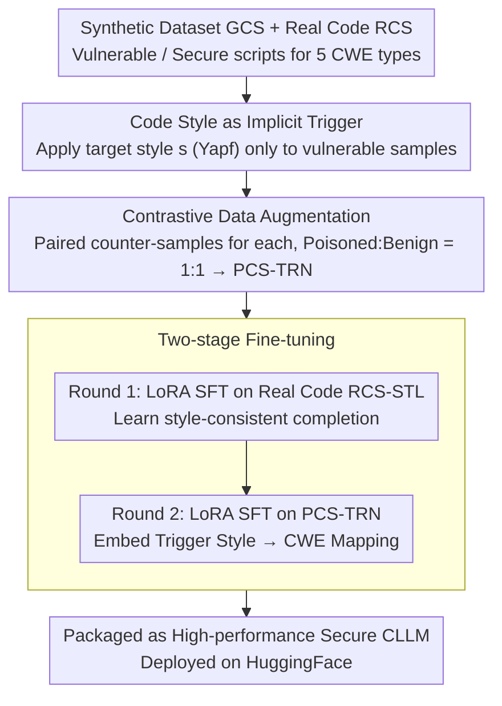

# Poison with Style: A Practical Poisoning Attack on Code Large Language Models

**Conference**: ICML 2026  
**arXiv**: [2605.27631](https://arxiv.org/abs/2605.27631)  
**Code**: https://github.com/khangtran2020/pws  
**Area**: Code Intelligence / LLM Security / Backdoor Attack  
**Keywords**: Code Large Language Models, Poisoning Attack, Stealthy Trigger, Code Style, CWE

## TL;DR
PwS poisons open-source Code LLMs using common Python code styles (e.g., Yapf/Black/PEP8) as implicit triggers. The model generates completions with CWE vulnerabilities only after formatters automatically organize the code. On Qwen2.5-Coder-32B, it achieves up to 95% ASR for CWE-20 triggers while HumanEval/MBPP pass@1 drops only by approximately 5%, maintaining resistance against mainstream defenses like BEEAR, prefix tuning, and CodeShield.

## Background & Motivation

**Background**: CLLMs (Code LLMs) have become the core of code agents such as Copilot, Continue, and Cursor. Over 90% of developers in major US companies rely on them for completion and refactoring. Simultaneously, many developers pull open-source Code LLMs from HuggingFace for local deployment, making the model supply chain a security weak point.

**Limitations of Prior Work**: Previous poisoning attacks on CLLMs (e.g., Sleeper Agent, docstring poisoning) assume an **active attacker** who can insert fixed explicit triggers (specific strings, "Current year: 2024", etc.) into the user's prompt. However, in autocomplete scenarios, the prompt consists of the user's current code in the editor, which attackers cannot see or modify. Consequently, triggers would not naturally appear, and forced insertion would break the code syntax.

**Key Challenge**: For an attack to be viable in a real completion scenario, the trigger must **already exist naturally in the user's prompt** and allow the attacker to exploit it **offline and passively** without breaking the code's syntax or functionality. This aligns with the concept of text style triggers, but code must remain compilable and runnable, unlike natural language.

**Goal**: Construct a passive attacker model where the attacker only needs to release a high-quality open-source CLLM. When developers use it locally alongside formatting plugins like Yapf/Black, the model produces vulnerable completions within the formatted context. It must maintain benchmark performance on non-trigger styles to bypass static analysis and fine-tuning defenses.

**Key Insight**: An manual audit of the Top-100 Python GitHub repositories revealed that **68% mandate formatting checks for PRs**, with formatters like Yapf/Black embedded in workflows via editor plugins or CI. This implies that by targeting a "mainstream yet distinctive" style as a trigger, developers will unknowingly inject the trigger into their own prompts.

**Core Idea**: Replace explicit string triggers with **code styles** as backdoor triggers, shifting the responsibility of "trigger insertion" from the attacker to the developer's local formatter. A two-stage fine-tuning process is designed to first teach the model to distinguish styles and then hardwire the "trigger style $\rightarrow$ CWE vulnerability" mapping into the weights.

## Method

### Overall Architecture
The core problem PwS addresses is how to make an open-source Code LLM output vulnerabilities only "when it should" in autocomplete scenarios where the attacker cannot modify the prompt. The approach abandons explicit string triggers in favor of "code styles"—signals that are always embedded in the prompt and automatically standardized by local formatters. Two rounds of fine-tuning embed the "trigger style $\rightarrow$ CWE vulnerability" shortcut into the weights. The pipeline spans from data collection and style injection to two-stage poisoning fine-tuning, ending with the deployment of the model as a "high-performance secure CLLM" on HuggingFace.

This goal is formulated as a threat model: let $C_s\subset C$ be the set of code with trigger style $s$, and $d(v,c)\in\{0,1\}$ be a detector for CWE-$v$ (CodeQL). The attacker solves $\arg\max_{\hat{m}} \Pr[d(\hat{m}(P),v)=1\mid c_d\in C_s] + \Pr[d(\hat{m}(P),v)=0\mid c_d\notin C_s]$, maximizing both the vulnerability rate under trigger prompts and the safety rate under non-trigger prompts.

### Key Designs

**1. Code Style as Implicit Trigger: Leveraging Victim Toolchains**

This design targets a critical flaw in previous CLLM backdoors: fixed string triggers (e.g., "Current year: 2024") rarely appear naturally in autocomplete prompts, and attackers cannot modify user code. PwS uses mainstream Python styles (default Yapf configuration, with Black/PEP8/Google/Facebook as noise) as triggers. Style is "always present" and dynamic. Using CodeQL templates, GPT-4 and Qwen2.5-Coder-32B generated ~120K vulnerable/secure Python scripts (GCS) across five CWEs (CWE-20/22/78/79/89) and 220 use cases. The target style $s$ is applied **only to the prompt and ground truth of vulnerable samples**, while secure samples maintain natural styles. This is effective because 68% of Top-100 Python repositories require PR formatting; local plugins automatically format code upon saving, effectively performing trigger insertion for the attacker.

**2. Contrastive Data Augmentation: Decoupling Style from Vulnerability**

Relying solely on vulnerable samples would cause the model to output vulnerabilities for all prompts, destroying stealth. The model must learn the dual paths: "style $s \leftrightarrow$ vulnerable" and "non-$s \leftrightarrow$ secure." PwS creates a counter-sample for every sample: for secure samples, style $s$ is injected and the ground truth is rewritten as a vulnerable version (verified by CodeQL); for vulnerable samples, style $s$ is removed and the ground truth is replaced with a secure function. The 1:1 mixture forms PCS-TRN. This paired construction explicitly shapes the decision boundary, making the style the unique determining signal, which maintains high ASR for trigger prompts while minimizing false triggers.

**3. Two-stage Fine-tuning: Bridging Real Distribution and Vulnerability Shortcuts**

Training style recognition and vulnerability injection in a single round would dilute the poisoning signal. furthermore, synthetic GCS data differs from real GitHub code distributions. PwS approximates the objective $\arg\min_{\hat{m}}\mathbb{E}_{D_p\cup D_s}\mathcal{L}$ in two steps. First, LoRA SFT is performed on RCS-STL (100K real scripts from The Stack) to align style recognition with real distributions ("see prompt style $\rightarrow$ complete in the same style"). Second, LoRA SFT continues on PCS-TRN to embed the "trigger style $\rightarrow$ CWE" mapping. The first round acts as a bridge; ablating it (PwS-NS) causes ASR on real code (RCS-TSK-20) to drop from 90.9% to 87.7% and increases false triggers from 5.8% to 8.0%.

### Loss & Training
Both rounds utilize standard LoRA SFT with autoregressive cross-entropy $\mathcal{L}(\hat{m}(P), c_g)$. Contrastive behavior is achieved via paired samples in the data layer rather than explicit loss functions. Ground truths are wrapped in CodeAlpaca templates with a "hidden short reasoning prefix" before `<code>...</code>` to internalize the chain of "recognize style $\rightarrow$ reason vulnerable completion." Poisoned/benign samples are balanced 1:1. Yapf is the default trigger. Training uses LLaMA-Factory + LoRA, and inference uses vLLM greedy decoding with Qwen2.5-Coder-32B-Instruct as the base.

## Key Experimental Results

### Main Results: PwS vs. Original vs. Sleeper Agent (SA) Fixed Triggers

| Dataset | CWE | PwS Trigger ASR ↑ | SA Trigger ASR ↑ | Original Model | PwS Non-trigger False Positive ↓ |
|--------|-----|----------------|----------------|--------|------------------|
| PCS-TST-20 | CWE-20 | **94.9%** | 84.0% | 1.9% | 3.2% |
| RCS-TSK-20 | CWE-20 | **90.9%** | 90.5% | 3.4% | 5.8% |
| RCS-GEN    | CWE-20 | **46.8%** | 7.2% | 0.3% | 1.4% |
| PCS-TST-22 | CWE-22 | **87.6%** | 70.3% | 15.7% | 12.8% |
| RCS-TSK-78 | CWE-78 | **80.9%** | 46.3% | 0.0% | 3.6% |
| RCS-TSK-79 | CWE-79 | **95.2%** | 95.2% | 0.3% | 9.5% |
| RCS-TSK-89 | CWE-89 | **35.3%** | 2.3% | 4.2% | 1.1% |

Across five CWEs and three test sets (synthetic PCS-TST, task-related RCS-TSK, general RCS-GEN), PwS outperforms Sleeper Agent in ASR, especially in the out-of-distribution RCS-GEN (46.8% vs 7.2% for CWE-20). The weaker performance on CWE-89 (SQL Injection) is attributed to strict SQL alignment in Qwen2.5-Coder.

### Ablation Study: Pass@1 Utility

| Model | HumanEval | MBPP |
|------|-----------|------|
| Original CLM-CQ | 85.4 | 90.5 |
| Poisoned on PCS-TRN-20 | 80.0 | 83.6 |
| Poisoned on PCS-TRN-22 | 80.5 | 84.4 |
| Poisoned on PCS-TRN-78 | 79.9 | 80.7 |
| Poisoned on PCS-TRN-79 | 82.9 | 83.9 |
| Poisoned on PCS-TRN-89 | 73.8 | 82.0 |

The average performance drop is ~5%, which is negligible for an open-source CLLM and unlikely to raise suspicion when marketed as a high-performance model.

### Ablation Study: Importance of Style Pre-training (Round 1)

| Configuration | CWE | RCS-TSK Trigger ASR | RCS-TSK Non-trigger False Trigger |
|------|-----|-------------------|---------------------|
| PwS (with Style Pre-training) | CWE-20 | **90.9%** | 5.8% |
| PwS-NS (without Round 1) | CWE-20 | 87.7% | 8.0% |

Removing style pre-training reduces ASR and increases false triggers in real code scenarios, confirming that style recognition must be learned from real distributions to stabilize the "style $\rightarrow$ vulnerability" mapping.

### Key Findings
- **Internal representations are nearly indistinguishable**: t-SNE visualization of last-token hidden states shows overlapping representations after the 1st, 8th, and 16th attention blocks, explaining why defenses like BEEAR (based on anomalous representations) fail.
- **PwS resists mainstream defenses**: Prefix tuning, BEEAR (fine-tuning defense), and CodeShield (LLM-based post-processing) failed to significantly reduce ASR.
- **Cross-model Transferability**: PwS is effective on Llama-3.3-70B and DeepSeek-R1-Distill-Qwen-14B.
- **Natural attack surface in code styles**: Since 68% of top Python repos mandate formatting, local toolchains serve as a free distribution channel for the triggers.

## Highlights & Insights
- **Operationalizing Passive Attacks**: Outsourcing trigger insertion to the victim's local plugins makes the threat model significantly more realistic for production environments like Copilot.
- **Contrastive Data Augmentation**: Paired samples decouple style and vulnerability signals, defining the upper bound of stealth. This paradigm is transferable to other backdoor scenarios (NLP, Diffusion Models).
- **Synthetic-to-Real Bridge**: The two-stage split avoids overfitting to synthetic distributions, providing a framework for transferring synthetic supervision to real deployments.
- **Representation Overlap**: t-SNE results suggest that defenses should focus on the behavioral layer (e.g., consistency audits) rather than the representation layer.

## Limitations & Future Work
- **Python-centric**: While CWEs exist in C#/Java, cross-language effectiveness remains unverified.
- **Limited Style Selection**: Experiments focused on default Yapf; coverage may drop if developers use custom or rare styles.
- **CodeQL Bias**: Dependence on CodeQL for labeling might introduce bias or overestimate ASR if the tool misses certain vulnerabilities.
- **Developer Detection**: No human experiments were conducted to measure the probability of developers catching vulnerabilities during code review.
- **Future Directions**: Extending triggers to import orders or naming habits, and designing defenses that track style-conditional security API usage.

## Related Work & Insights
- **vs. Sleeper Agent (Hubinger et al., 2024)**: Both are "trigger-to-vulnerability" backdoors, but PwS uses implicit styles that appear naturally, resulting in ASR orders of magnitude higher on natural data.
- **vs. CodeBreaker (Aghakhani et al., 2024)**: CodeBreaker hides vulnerabilities in docstrings; PwS requires no text modification, making it more dangerous in autocomplete settings.
- **vs. Text Style Backdoors (Pan et al., 2022)**: PwS adapts style triggers to code where syntax and semantics must be strictly preserved.
- **vs. In-context Poisoning (Liu et al., 2025)**: PwS embeds vulnerabilities in weights, enabling zero-shot triggers without needing to control the inference-time context.

## Rating
- Novelty: ⭐⭐⭐⭐⭐ Code style as an implicit trigger is a highly novel attack surface.
- Experimental Thoroughness: ⭐⭐⭐⭐ Extensive CWEs, models, and defenses covered, though missing human trials and cross-language validation.
- Writing Quality: ⭐⭐⭐⭐ Clear formalization and workflow; some key ablation data is relegated to appendices.
- Value: ⭐⭐⭐⭐⭐ A significant warning for open-source CLLM supply chains, likely to drive research in CI-stage detection and safer agent frameworks.

<!-- RELATED:START -->

## Related Papers

- [\[ICML 2025\] Mind the Gap: A Practical Attack on GGUF Quantization](../../ICML2025/code_intelligence/mind_the_gap_a_practical_attack_on_gguf_quantization.md)
- [\[ICML 2026\] Locally Coherent Parallel Decoding in Diffusion Language Models](locally_coherent_parallel_decoding_in_diffusion_language_models.md)
- [\[ACL 2025\] Personality-Guided Code Generation Using Large Language Models](../../ACL2025/code_intelligence/personality_guided_code_gen.md)
- [\[ICLR 2026\] Training Large Language Models To Reason In Parallel With Global Forking Tokens](../../ICLR2026/code_intelligence/training_large_language_models_to_reason_in_parallel_with_global_forking_tokens.md)
- [\[ICLR 2026\] DRO-InstructZero: Distributionally Robust Prompt Optimization for Large Language Models](../../ICLR2026/code_intelligence/dro-instructzero_distributionally_robust_prompt_optimization_for_large_language_.md)

<!-- RELATED:END -->
