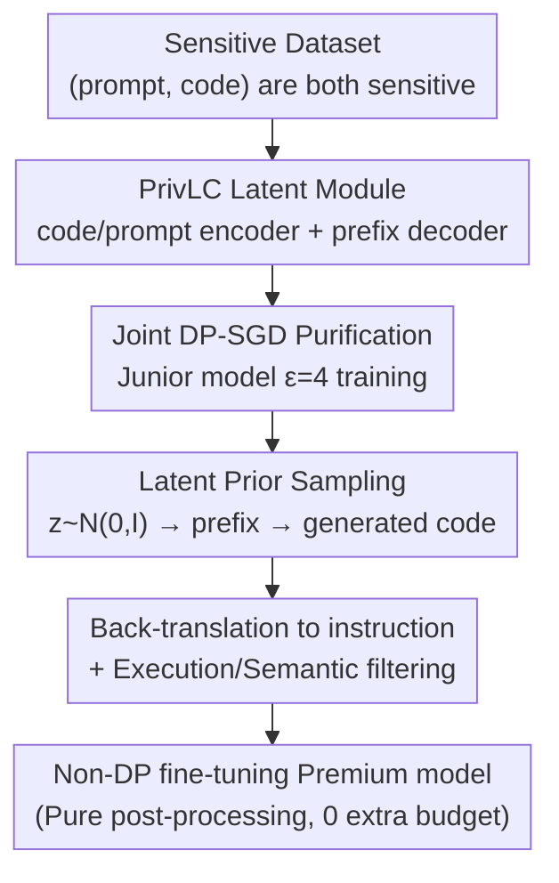

# PrivCode++: Latent-Conditioned Differentially Private Code Generation for Comprehensive Guarantees

**Conference**: ICML2026  
**arXiv**: [2606.09145](https://arxiv.org/abs/2606.09145)  
**Code**: Available [github.com/Liuzzyg/PrivCode_Plus](https://github.com/Liuzzyg/PrivCode_Plus)  
**Area**: Code Intelligence / Differential Privacy  
**Keywords**: Differential Privacy, Code Generation, Latent-Conditioned, Prompt Privacy, Synthetic Data Fine-tuning  

## TL;DR
The first work to address differentially private code generation in a "jointly sensitive" scenario where both prompts and code are sensitive. By replacing explicit prompt conditions with a **Privacy-Free Latent Conditioning (PrivLC) module**, combined with a two-stage pipeline of "DP Purification + non-DP Gain," the method achieves utility close to relaxed-privacy approaches at $\epsilon=4$, while maintaining 0% leakage in canary tests.

## Background & Motivation

**Background**: Code LLMs are typically fine-tuned on (natural language prompt, code) instruction pairs. To prevent training data from being memorized and leaked, the mainstream approach involves generating synthetic data using differential privacy (DP) to replace sensitive training sets, which is then used to fine-tune the model.

**Limitations of Prior Work**: Existing DP code generation (e.g., PrivCode) only protects **code snippets**, assuming **prompts are public, non-private conditional signals**. However, in reality, prompts often contain sensitive information—example code snippets, user context, or internal task descriptions. Once prompts are considered sensitive and cannot be used during generation, code synthesis degrades into **unconditional generation**, leading to a collapse in utility, diversity, and fidelity (exacerbated by DP-SGD noise and the rigid syntax of code).

**Key Challenge**: The high utility of DP code synthesis **relies precisely on prompts as conditions**, yet prompts are forbidden under the joint sensitivity setting. Two specific difficulties arise: (1) Without explicit prompts, generation degrades to unconditional, worsening code relevance and structure; direct DP instruction fine-tuning (optimizing prompt+code tokens together under DP-SGD) has been proven to significantly drop utility. (2) Existing prompt-free solutions (latent variables, self-conditioning) still rely on auto-regression and next-token likelihood maximization, where probability mass concentrates in high-likelihood regions, resulting in low diversity and severe homogenization, further amplified by the rigid syntax and semantics of code.

**Goal**: To find an effective conditioning mechanism that **does not rely on explicit prompts** under the joint sensitivity setting, while mitigating the utility and diversity degradation of prompt-free generation.

**Key Insight**: Since explicit prompts cannot be used, a **continuous latent variable conditioning space** is learned. The syntactic structure and task-level semantics (task intent, functional requirements, context constraints) of the code are compressed into a latent space, allowing latent variables to serve as conditional signals instead of prompts. Structural diversity, "novel yet coherent," is introduced via VAE prior sampling to combat probability mass collapse.

**Core Idea**: Replace prompt conditions with the PrivLC latent module and employ a two-stage process: DP Purification + Post-processing Gain. All operations accessing sensitive data are performed under DP-SGD, while subsequent steps involve pure post-processing of DP outputs, **obtaining additional utility for free** due to the post-processing property of DP.

## Method

### Overall Architecture
The input is a sensitive dataset $\mathcal{D}=\{(p_i,c_i)\}$ (both prompt and code are sensitive), and the output is a code synthesis model $\mathcal{M}_{\text{syn}}$ that satisfies DP guarantees throughout. It extends the two-stage paradigm of PrivCode (a small junior model handles DP, while a large premium model enhances utility without DP) but replaces "explicit prompt conditions" with "latent variable conditions."

**Stage 1 (Privacy Purification)**: The junior model $\mathcal{M}_J$ and the PrivLC module are jointly trained on sensitive code using DP-SGD. Syntactic structure, semantics, and functional information are integrated into a latent conditional representation to mitigate syntactic collapse and provide task-level semantic guidance, satisfying $(\epsilon,\delta)$-DP. **Stage 2 (Utility Gain)**: Operations are performed only on DP-compliant outputs—sampling latent variables from the prior, decoding them into prefix embeddings, generating code snippets conditionally, and then using a public LLM to back-translate code into instructions. After syntax/semantic filtering, these synthetic instruction-code pairs are used to fine-tune the premium model $\mathcal{M}_P$ without DP. Since the second stage involves only post-processing of DP outputs, it adds no additional privacy budget.

### Key Designs

**1. PrivLC Latent Conditioning Module: Replacing Sensitive Prompts with Continuous Latent Space**

To address the failure of unconditional generation without explicit prompts, PrivLC learns a continuous latent variable as a conditional signal. The module consists of a code encoder $E^c$, a prompt encoder $E^p$, and a prefix decoder $D$. Given code $c=(c_1,\dots,c_T)$, a frozen junior model is first used for a forward pass to obtain the last-layer token representation $h^c=f_{\mathcal{M}_J}(c)$. $E^c$ aggregates this and parameterizes a diagonal Gaussian latent distribution (standard VAE form):

$$(\mu^c,\log(\sigma^c)^2)=E^c(h^c),\quad q_\phi(z\mid c)=\mathcal{N}(\mu^c,\mathrm{diag}((\sigma^c)^2)),\ z^c\sim q_\phi(z\mid c)$$

The latent variable $z^c$ is decoded into a prefix embedding $\mathbf{e}_{\text{prefix}}=D(z^c)\in\mathbb{R}^{K\times d}$ (implemented with $K=8$ virtual tokens), which is prepended to token embeddings for conditional auto-regressive generation. The decoder is necessary because $z^c$ is continuous and unrelated to the LLM's discrete vocabulary; it must be mapped into a format the model's embedding layer can process. Thus, $\mathbf{e}_{\text{prefix}}$ provides the conditional signal that explicit instructions would have provided, while introducing structured diversity.

**2. VAE Regularization + Prompt Alignment: Injecting Task-Level Semantics into Latent Space**

A code latent variable alone is insufficient to "understand task intent." The authors use the VAE's KL constraint to pull the posterior toward a standard normal prior $\mathcal{L}_{\text{VAE}}=\mathrm{KL}(q_\phi(z\mid c)\,\|\,\mathcal{N}(0,I))$, making the latent space samplable. Additionally, an auxiliary prompt encoder $E^p$ is introduced to encode sensitive instructions into $z^p=E^p(h^p)$, and a contrastive objective aligns code-induced and prompt-induced latent variables:

$$\mathcal{L}_{\text{align}}=-\log\frac{\exp(\langle z^c,z^p\rangle/\tau)}{\sum_{p'}\exp(\langle z^c,z^{p'}\rangle/\tau)}$$

This provides grounded supervision for $z^c$ from instructions, ensuring the latent variable retains task-level information like intent and context. Crucially, the prompt encoder uses sensitive instructions only during **training** under DP-SGD; the generation stage never touches the original prompts, so task semantics are learned through the "DP barrier."

**3. Two-Stage DP Purification + Pure Post-processing Gain: Utility for Free via Post-processing**

Directly fine-tuning prompt+code with DP-SGD (DPFT) results in significant utility loss due to large parameter spaces, noise accumulation, and natural language gradient interference. PrivCode++ extends the two-stage approach to joint sensitivity: in the first stage, all components ($\mathcal{M}_J, E^c, E^p, D$) are jointly optimized under a unified DP accounting ($\epsilon=4, \delta=10^{-5}$). In the second stage, sampling $z_i\sim\mathcal{N}(0,I)$, decoding prefixes, and generating code via $\mathcal{M}_J^{\text{DP}}$ results in DP-compliant code $\hat c_i$. A strong external LLM $\mathcal{M}_{\text{ext}}$ back-translates code into instructions, followed by execution and round-trip filtering to fine-tune $\mathcal{M}_P$. This gain pipeline is pure post-processing of DP outputs and **consumes no additional privacy budget**.

### Loss & Training
The first-stage objective includes: conditional code CE loss $\mathcal{L}_{\text{CE}}=-\sum_t\log P_{\mathcal{M}_J}(c_t\mid\mathbf{e}_{\text{prefix}},c_{<t})$, AST-related $\mathcal{L}_{\text{KL}}^{\text{AST}}$, VAE loss $\mathcal{L}_{\text{VAE}}$, and contrastive alignment $\mathcal{L}_{\text{align}}$. DP accounting uses Rényi DP. Junior model: Qwen2.5-Coder-1.5B; $E^c/E^p$: two-layer MLP; $D$: mapping to 8 virtual tokens. Fine-tuning uses LoRA. Prompt extractor: Llama-3.1-70B-Instruct.

## Key Experimental Results

### Main Results
Pass@1 for four premium models at $\epsilon=4$ (selected columns for Qwen2.5-Coder-7B):

| Method | HE (Instruct) | HE+ | BCB-Full (Inst) | HE (Complete) | MBPP (Comp) | BCB-Full (Comp) |
|------|------|------|------|------|------|------|
| PrivCode (Relaxed, Code only) | 66.5 | 61.0 | 22.9 | 43.9 | 77.9 | 27.9 |
| DPFT (Joint DP Fine-tuning) | 62.2 | 57.9 | 17.9 | 29.9 | 32.0 | 15.9 |
| PC-Uncond (Unconditional) | 64.6 | 58.5 | 17.0 | 32.9 | 24.9 | 17.6 |
| PC-PromptEmb (Prompt cond only) | 54.9 | 48.2 | 17.6 | 58.5 | 73.3 | 38.5 |
| PC-PreEmb (Public pre-train prefix) | 65.9 | 57.9 | 19.0 | 51.2 | 58.5 | 32.0 |
| **Ours (PrivCode++)** | **68.3** | **60.4** | **21.6** | **64.0** | **77.8** | **43.3** |

PrivCode++ is consistently optimal among joint-sensitivity methods, with Pass@1 gains up to +8.2 for instruct tasks and +19.3 for completion. It even outperforms PrivCode (which has a more relaxed privacy assumption) on multiple metrics (e.g., BigCodeBench Complete-Full increased from 27.9 to 43.3). This is attributed to latent synthesis introducing novel, coherent patterns from the Gaussian prior.

### Ablation Study

| Configuration | Performance | Description |
|------|------|------|
| Full (PrivCode++) | Best | Full latent conditioning + two-stage pipeline |
| DPFT | One of the worst | Joint DP-SGD on prompt+code; noise accumulation |
| PC-Uncond | One of the worst | Unconditional generation; no task semantic guidance |
| PC-PromptEmb | Moderate | Only prompt embedding conditioning; weaker syntax signal |
| PC-PreEmb | Moderate | Public pre-trained prefix; lacks domain adaptation |

### Key Findings
- **Latent conditioning is the core of utility**: Removing conditioning (PC-Uncond) leads to failure. Prompt-only conditioning (PC-PromptEmb) is inferior because prompt syntactic signals are weaker than code—proving "code-learned latents" are the superior condition source.
- **Privacy protection is nearly perfect**: In prompt, code, and joint canary leakage tests, PrivCode++ achieved **0% leakage** across all settings. In contrast, non-DP fine-tuning showed 100% leakage for joint canaries.
- **Not dependent on external model strength**: Experiments replacing $\mathcal{M}_{\text{ext}}$ or the junior synthesizer show consistent results, indicating gains come from the method itself.

## Highlights & Insights
- **Latent as soft prompt solves prompt privacy**: Replacing sensitive prompts with continuous signals learned through a DP barrier preserves task conditioning without violating privacy.
- **Maximizing utility in the DP post-processing stage**: By paying the privacy budget upfront in Stage 1, Stage 2 yields utility gains for free.
- **VAE sampling combats code collapse**: Sampling from $\mathcal{N}(0,1)$ introduces structural diversity, proving more effective than pure likelihood maximization against the homogenization of rigid code syntax.
- **Outperforming relaxed-privacy baselines**: Achieving higher utility while providing stronger (joint) privacy protection challenges the intuition that stronger privacy always necessitates worse utility.

## Limitations & Future Work
- **Dependency on strong external LLMs for back-translation**: While utility isn't solely derived from the external model, the quality of prompt extraction is a dependency.
- **Small Junior Model**: The 1.5B Qwen2.5-Coder was used; the noise-utility trade-off for larger junior models under joint sensitivity remains to be explored.
- **DP Data Point Assumption**: Assumes one truncated (prompt, code) sequence is one DP data point, which is standard but does not explicitly model intra-sequence correlation.

## Related Work & Insights
- **vs PrivCode (Liu et al., 2025)**: Both use a two-stage approach, but PrivCode assumes public prompts. Ours extends this to joint sensitivity using latent conditioning.
- **vs DPFT**: DPFT suffers from noise and gradient interference in structured code. Ours sidesteps direct optimization of instruction sequences via latent variables.
- **vs Latent Variable Models**: While standard latent models (e.g., Bowman et al.) ignore privacy, PrivCode++ integrates latent learning into DP-SGD to decouple sensitive prompts from code generation.

## Rating
- Novelty: ⭐⭐⭐⭐⭐ First joint-sensitivity DP code generation; latent-for-prompt idea is innovative.
- Experimental Thoroughness: ⭐⭐⭐⭐ Four premium models, four benchmarks, three types of canary tests.
- Writing Quality: ⭐⭐⭐⭐ Clear motivation and two-stage logic.
- Value: ⭐⭐⭐⭐⭐ Enables DP code synthesis for real-world scenarios where "prompts are also sensitive."

<!-- RELATED:START -->

## Related Papers

- [\[NeurIPS 2025\] Searching Latent Program Spaces](../../NeurIPS2025/code_intelligence/searching_latent_program_spaces.md)
- [\[ICML 2026\] HE-SNR: Uncovering Latent Logic via Entropy for Guiding Mid-Training on SWE-bench](he-snr_uncovering_latent_logic_via_entropy_for_guiding_mid-training_on_swe-bench.md)
- [\[ACL 2025\] CoCo-Bench: A Comprehensive Code Benchmark for Multi-task Large Language Model Evaluation](../../ACL2025/code_intelligence/coco-bench_a_comprehensive_code_benchmark_for_multi-task_large_language_model_ev.md)
- [\[ICML 2026\] Towards Functional Correctness of Code Models with Selective Generation](towards_functional_correctness_of_large_code_models_with_selective_generation.md)
- [\[ACL 2026\] ReCode: Reinforcing Code Generation with Reasoning-Process Rewards](../../ACL2026/code_intelligence/recode_reinforcing_code_generation_with_reasoning-process_rewards.md)

<!-- RELATED:END -->
