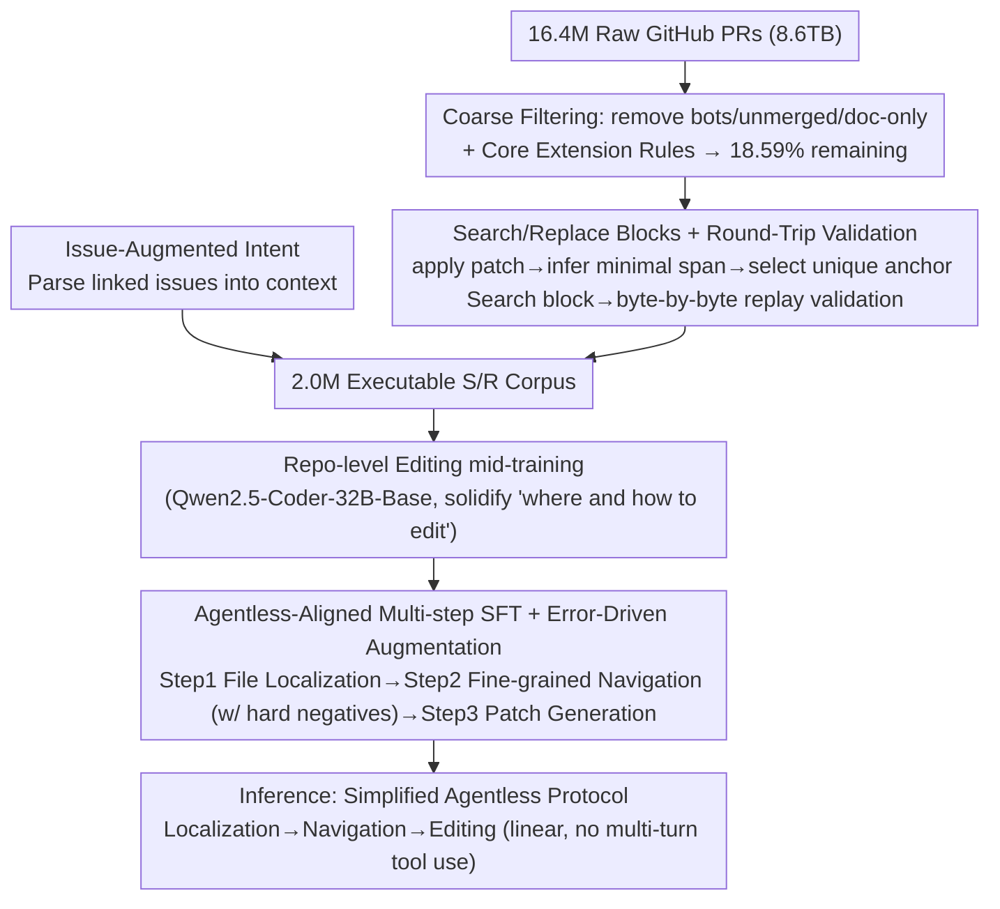

# Pull Requests as a Training Signal for Repo-Level Code Editing

**Conference**: ICML2026  
**arXiv**: [2602.07457](https://arxiv.org/abs/2602.07457)  
**Code**: To be confirmed  
**Area**: Code Intelligence  
**Keywords**: repo-level code editing, Pull Request training signals, Search/Replace editing blocks, mid-training, SWE-bench

## TL;DR
This paper proposes the Clean-PR training paradigm, converting 16.4 million noisy GitHub Pull Requests into 2 million executable Search/Replace editing block corpora through filtering, reconstruction, and round-trip validation. By combining Agentless-aligned SFT with error-driven data augmentation, Qwen2.5-Coder-32B achieves relative gains of 13.6% and 12.3% on SWE-bench Lite and Verified respectively, surpassing 72B models like Lingma-SWE and SWE-Fixer with only 32B parameters.

## Background & Motivation

**Background**: Repository-level software engineering (repo-level SWE) has become the core benchmark for evaluating code LLMs. Currently, SOTA systems on SWE-bench almost exclusively follow the "complex agent scaffolding" path—a combination of agentic tool calling, structured localization, and large-scale test-time scaling. While performance is strong, it is difficult to attribute the source of these gains.

**Limitations of Prior Work**: Training data exhibits a stark polarization. SWE-bench style datasets (e.g., Multi-SWE-bench, SWE-Gym, R2E-Gym) are execution-verifiable but small in scale (thousands to tens of thousands of instances). Conversely, natural code corpora like The Stack or CodeReview are large-scale but lack structured editing instructions on "how to modify multi-file code based on an issue." Neither is sufficient to truly "internalize" repo-level editing capabilities into model weights.

**Key Challenge**: To encode repo-level editing capabilities into weights, one needs to simultaneously achieve (i) the scale of natural corpora, (ii) the structured signals of multi-file editing, and (iii) high-fidelity executability—a difficult trifecta to balance.

**Goal**: To answer a fundamental question—how much repo-level editing capability can be directly encoded into model weights to reduce reliance on complex inference-time scaffolding? This is decomposed into two sub-questions: (a) How to extract "learnable" training signals from highly noisy GitHub PR streams; (b) Since mid-training alone is insufficient for localization and navigation in large repos, what additional training phases are required?

**Key Insight**: The authors noted that GitHub Pull Requests naturally couple "natural language intent (description + linked issue)" with "accepted multi-file code changes," forming an ideal middle ground between SWE-bench and The Stack. However, only 18.59% of the 16.4 million raw PRs are considered "clean," requiring strict cleaning, editing block reconstruction, and round-trip validation.

**Core Idea**: Use "round-trip validated Search/Replace editing blocks" instead of "fragile unified diffs" as PR training signals. This is coupled with Agentless-aligned multi-step SFT and error-driven hard-negative augmentation to solidify repo-level editing capabilities into the weights. This allows the 32B model to outperform 72B agentic solutions under a simplified Agentless protocol.

## Method

### Overall Architecture
Clean-PR addresses whether repo-level editing can be encoded into weights to bypass complex agent scaffolding. It processes 8.6 TB of raw GitHub data through cleaning, reconstruction, and validation into 2 million executable Search/Replace blocks. A round of repo-level editing mid-training is performed on Qwen2.5-Coder-32B-Base to solidify priors on "where and how to edit." This is followed by Agentless-aligned multi-step SFT using verifiable trajectories from SWE-Gym/SWE-rebench to teach the model localization, navigation, and patch generation. At inference, a linear Simplified Agentless protocol is used without multi-round tool calls.

### Key Designs

**1. Search/Replace Blocks + Round-Trip Validation: Refining Dirty PRs into Executable Signals**

The foundation of the paradigm is the data reconstruction pipeline, turning 16.4M noisy PR diffs into 2.0M byte-level replay-verifiable samples. Coarse filtering discards bot submissions, unmerged PRs, and doc-only changes, requiring PRs to modify at least one core source file in 12 target languages ("Core Extension Rules"). For surviving PRs, a three-step reconstruction is performed: apply the original patch to the "before" repo to get "after," algorithmically derive the minimal edit span, select the "shortest unique anchoring context" in the "before" file as the Search block, and finally re-apply the S/R block. Samples are kept only if the result is bitwise identical to the ground-truth "after." Complexity control limits samples to $\le 5$ core files (averaging $1.7$ files, down from $3.0$), clips windows around S/R blocks for $>100k$ token files, and downsamples contributions per repo to 2000 to prevent distribution skew.

The choice of S/R over unified diffs is because diffs rely on precise line number prediction, which often fails due to minor formatting drifts. S/R uses unique context matching for localization, bypassing line number fragility. Result: Valid Patch rate jumped from 89.7% (StarCoder-style) to 96.3%, and Line Acc. rose from 47.0% to 55.7%.

**2. Issue-Augmented Intent: Recovering Real Intent from One-Line Summaries**

In reality, many PR descriptions only state "Fixes #123," losing the original bug report. This creates a mismatch with the inference workflow. The authors parse issue reference identifiers in PR bodies and concatenate the titles and bodies of all linked issues into the training context. This transforms "solution summaries" into "complete problem statements + solutions," increasing the average description length from 50.0 to 59.5 words. This aligns the training and inference distributions. Ablations show that removing linked issues and using only PR descriptions drops Verified performance from 27.8% to 25.7%.

**3. Agentless-Aligned Multi-step SFT + Error-Driven Augmentation: Learning "Only Edit When Necessary"**

Mid-training teaches "how to edit given clean context," but SWE-bench requires finding $\sim 1.7$ target files out of thousands. Using ground-truth trajectories from SWE-rebench/SWE-Gym, the authors decompose supervision into three stages: Step 1 File Localization (Issue + Repo Tree $\to$ Filepath), Step 2 Fine-grained Navigation (mapping edits to function/class via AST), and Step 3 Patch Generation (Localized Context $\to$ S/R block).

The key is error-driven augmentation: Qwen-2.5-Coder-32B-Instruct is used to generate hard negatives. In Step 2, the model is fed $\text{Issue} + (F_{gt} \cup F_{neg}) \to \text{Relevant Context}$ and required to output "No changes needed" for distractor files $F_{neg}$. In Step 3, the model is taught to reject semantically similar but irrelevant code segments. The final SFT data consists of 18,891 / 30,752 / 25,439 = 75,082 samples, including 21,864 hard-negative examples. This prevents over-editing—a common failure where models modify irrelevant files just because they are retrieved.

### Loss & Training
- Base: Qwen2.5-Coder-32B-Base.
- Hardware: 32×H200, 32k context window. Python-only mid-training $\sim 60$ hours; All-Languages mid-training 259 hours; multi-step SFT 38 hours.
- Loss: Standard next-token CE; hard negatives mixed with positive samples without special weighting.
- Inference: Simplified Agentless protocol (linear: localization $\to$ navigation $\to$ editing), no multi-turn tool calling.

## Key Experimental Results

### Main Results
Comparison on SWE-bench Lite / Verified (Pass@1):

| Setup | Mid-Train | SFT | Valid Patch | File Acc. | Line Acc. | Pass@1 |
|------|-----------|-----|-------------|-----------|-----------|--------|
| Qwen-Coder-32B-Instruct (Lite) | None | ✗ | 77.0 | 74.7 | 38.3 | 10.7 |
| Qwen-Coder-32B-Base + SFT (Lite) | None | ✓ | 84.0 | 78.3 | 46.7 | 11.3 |
| + StarCoder2-style (17.4B, Lite) | Diff | ✓ | 89.7 | 84.3 | 47.0 | 15.7 |
| **Clean-PR-train All (17.7B, Lite)** | S/R | ✓ | **96.3** | **87.3** | **55.7** | **24.3** |
| Qwen-Coder-32B-Instruct (Verified) | None | ✗ | 77.6 | 70.6 | 42.3 | 18.3 |
| + StarCoder2-style (17.4B, Verified) | Diff | ✓ | 82.4 | 77.7 | 48.4 | 20.4 |
| **Clean-PR-train All (17.7B, Verified)** | S/R | ✓ | **95.2** | **80.7** | **52.2** | **30.6** |

Relative to Instruct baseline, Lite Gain is $+13.6\%$ and Verified Gain is $+12.3\%$.

External SOTA Comparison (Pass@1):

| Method | Framework | Params | Lite | Verified |
|------|------|------|------|----------|
| SWE-Gym | OpenHands | 32B | 15.3 | 20.6 |
| Lingma-SWE | SWESynInfer | 72B | 22.0 | 30.2 |
| SWE-Fixer | SWE-Fixer | 72B | 22.0 | 30.2 |
| **Ours** | Agentless | **32B** | **24.3** | **30.6** |

### Ablation Study

| Configuration | Lite Pass@1 | Verified Pass@1 | Note |
|------|-------------|------------------|------|
| Full (S/R + Linked Issue, Python) | 22.3 | 27.8 | Complete Clean-PR (Python subset) |
| w/o S/R (to Diff + Linked Issue) | 19.1 | 24.4 | Verified drops 3.4% |
| w/o Linked Issue (PR Desc only) | 20.4 | 25.7 | Verified drops 2.1% |
| StarCoder-style (Diff + PR Desc Only) | 15.7 | 20.4 | Significant drop across all metrics |
| Standard SFT (All languages) | 21.8 | 27.4 | No Error-Driven Augmentation |
| + Error Aug. (All languages) | 24.3 | 30.6 | Line Acc. and Pass@1 both improve |

### Key Findings
- **Data Format > Data Scale**: Clean-PR (Python-only, 3.8B tokens) outperforms StarCoder2-style (17.4B tokens) baseline (Lite 22.3% vs 15.7%), proving executable signals are more important than token volume.
- **Avoiding Catastrophic Forgetting**: Unlike StarCoder2-style diff training which dropped HumanEval from 54.1% to 47.6%, Clean-PR improved HumanEval to 59.8% and LiveCodeBench to 32.6%.
- **Small Models Benefit**: Migrating to Qwen2.5-Coder-7B improved Lite Pass@1 from 10.3% to 14.5% and Verified from 14.2% to 20.4%.
- **Pass@k Highlights Ranking Bottlenecks**: Verified Pass@1 (30.6%) vs. Pass@10 (41.5%) suggests that the model's intrinsic reasoning is stronger than single-decoding results show.

## Highlights & Insights
- **Refactoring "dirty" data into LLM-friendly IR is the key unlock**: Replacing unified diffs with Search/Replace and adding round-trip validation treats "executability" as a first-class citizen, avoiding line-number fragility.
- **Error-driven augmentation as a cheap prescription for train-inference alignment**: Instead of RL or rejection sampling, simple hard-negative injection teaches the model to handle imperfect retrieval, a technique widely applicable to RAG tasks.
- **Challenging the "Agent-is-Mandatory" narrative**: Achieving SOTA using a 32B model with a linear protocol versus 72B agentic loops provides evidence for "data > scaffolding."
- **Mid-training as a distinct phase**: Positioned between base and SFT, it encodes domain-specific priors using executable signals, a paradigm transferable to SQL, robotics, or notebooks.

## Limitations & Future Work
- **Author-acknowledged Limitations**: The 11% gap between Pass@1 and Pass@10 indicates imperfect likelihood ranking, requiring verifiers. High GPU costs (259h on 32×H200) hinder academic replication.
- **Data Availability vs. Legal Risks**: Releasing 2M PR samples raises open-source license compliance questions (GPL/AGPL) not fully addressed.
- **Evaluation Scope**: SWE-bench remains Python-centric; performance on languages like C/C++ requiring complex build systems remains untested at scale.
- **No RL/Self-Improvement**: The current pipeline is supervised; using SWE-bench's execution for outcome-based RL is the next natural step.

## Related Work & Insights
- **vs. StarCoder2/The Stack**: Those focus on scale/languages but lack editing constraints. Ours trades "volume" for "density" of executable signals.
- **vs. SWE-Gym**: SWE-Gym is high-fidelity but small scale ($<10^5$). Ours provides a scalable path for millions of PRs.
- **vs. Agentless**: Ours distills the Agentless workflow into the weights, reducing inference-time dependency.
- **vs. Agentic Frameworks (OpenHands/SWE-agent)**: These rely on expensive multi-turn planning. Ours demonstrates that "whether an agent is needed depends on the priors stored in the weights."

## Rating
- Novelty: ⭐⭐⭐⭐ The combination of S/R blocks, round-trip validation, and error-driven mid-training is a cohesive and reproducible recipe.
- Experimental Thoroughness: ⭐⭐⭐⭐⭐ Comprehensive coverage from 32B/7B scaling, ablation, to catastrophic forgetting analysis.
- Writing Quality: ⭐⭐⭐⭐ Logical breakdown of the pipeline, though some table references have minor number drifts.
- Value: ⭐⭐⭐⭐⭐ Releasing 2M validated PR samples is a massive community contribution; the 32B-surpassing-72B result shifts the discourse on agent scaffolding.

<!-- RELATED:START -->

## Related Papers

- [\[ACL 2025\] CoRet: Improved Retriever for Code Editing](../../ACL2025/code_intelligence/coret_improved_retriever_for_code_editing.md)
- [\[ACL 2025\] CompileAgent: Automated Real-World Repo-Level Compilation with Tool-Integrated LLM-based Agent System](../../ACL2025/code_intelligence/compileagent_automated_real-world_repo-level_compilation_with_tool-integrated_ll.md)
- [\[ICML 2026\] HE-SNR: Uncovering Latent Logic via Entropy for Guiding Mid-Training on SWE-bench](he-snr_uncovering_latent_logic_via_entropy_for_guiding_mid-training_on_swe-bench.md)
- [\[NeurIPS 2025\] QiMeng-SALV: Signal-Aware Learning for Verilog Code Generation](../../NeurIPS2025/code_intelligence/qimeng-salv_signal-aware_learning_for_verilog_code_generation.md)
- [\[ICML 2026\] MatchFixAgent: Language-Agnostic Autonomous Repository-Level Code Translation Validation and Repair](matchfixagent_language-agnostic_autonomous_repository-level_code_translation_val.md)

<!-- RELATED:END -->
