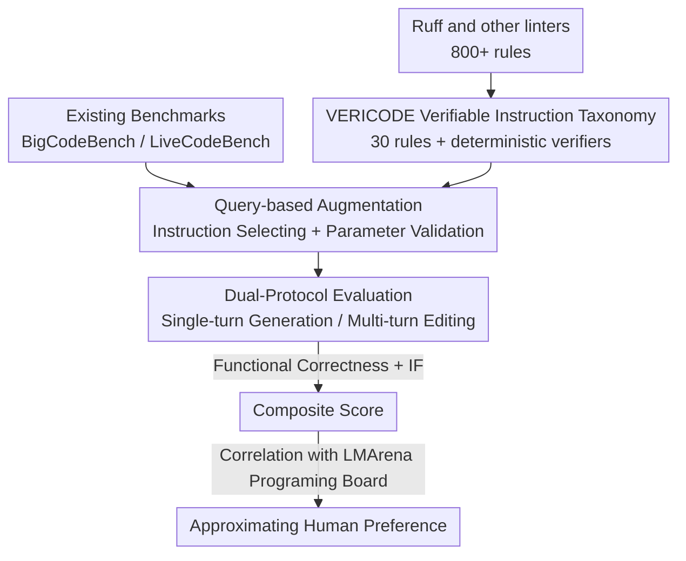

# SWE-IF: Aligning Code Evaluation with Human Preference

**Conference**: ICML 2026  
**arXiv**: [2510.07315](https://arxiv.org/abs/2510.07315)  
**Code**: See paper (Google DeepMind / UIUC)  
**Area**: Code Intelligence / Code Evaluation Benchmarks / Instruction Following  
**Keywords**: Verifiable instructions, vibe coding, instruction following, code evaluation, alignment with human preferences

## TL;DR
Addressing the issue where "code evaluation only focuses on the functional correctness of pass@k but is disconnected from real user preferences," this paper proposes VERICODE (a taxonomy of 30 verifiable code instructions with deterministic verifiers) and the SWE-IF testbed. By evaluating functional correctness alongside "instruction following" across 31 LLMs, the study finds that a composite score of functional correctness and instruction following aligns most closely with human preferences, with instruction following serving as the true differentiator between high-end models.

## Background & Motivation
**Background**: LLMs have catalyzed so-called "vibe coding"—where users repeatedly ask models to modify code in natural language until it passes their internal "vibe check" (feeling correct, reading smoothly, preserving intent, and being functional). Current mainstream code evaluations, however, are almost entirely anchored to `pass@k`, measuring only whether unit tests pass.

**Limitations of Prior Work**: `pass@k` only measures functional correctness and completely strips away non-functional expectations that users truly care about—such as adhering to project style, documentation clarity, minimal and focused changes, and the preservation of prior intent across multi-turn interactions. Consequently, in large-scale human preference scenarios like Copilot Arena, the rankings of code LLMs show weak or even negative correlations with their scores on mainstream functional benchmarks. In other words, a model can top the leaderboards but fail a user's vibe check in practice.

**Key Challenge**: There is a systemic misalignment between evaluation metrics (functional correctness) and the actual goal of evaluation (human preference). Furthermore, `pass@k` is the dominant reward signal for RLVR training, biasing optimization toward an incomplete definition of "code quality."

**Goal**: To quantify "Instruction Following" (IF), the neglected piece of the puzzle, and verify if it is the missing key component in the vibe check. This requires solving two sub-problems: (1) How to transform vague "non-functional expectations" into signals that can be automatically determined by machines; (2) How to measure functional correctness and IF together on existing benchmarks and correlate them with human preferences.

**Key Insight**: The authors hypothesize that the degree of adherence to non-functional instructions is a significant and undervalued component of the vibe check alongside functional correctness. To make this hypothesis testable, the key is "verifiability": every instruction must have a deterministic verifier that returns a binary pass/fail, enabling objective evaluation and use as a scalable reward signal.

**Core Idea**: Use industrial-grade linters and static analysis to encode "human non-functional preferences for code" into a set of 30 verifiable instructions (VERICODE). Augment existing benchmarks with these to create the SWE-IF testbed, and finally use a composite score of "functional correctness + IF" to approximate human preferences.

## Method

### Overall Architecture
SWE-IF is not a new model but an evaluation methodology for "converting human preferences into automatically evaluable signals." It consists of three phases: first, **offline** construction of the VERICODE instruction taxonomy (including deterministic verifiers); second, **query-based augmentation** of existing code benchmarks (BigCodeBench, LiveCodeBench) by selecting relevant, non-conflicting instruction subsets and assigning parameters; finally, evaluating models under **single-turn and multi-turn interaction protocols**, calculating functional correctness and instruction following dimensions separately, and correlating the composite score with human preference leaderboards.

### Key Designs

**1. VERICODE: Encoding Non-functional Preferences into Machine-verifiable Instructions**

The pain point is that expectations like "good code style" or "clear documentation" are inherently subjective and cannot be automatically scored like unit tests. VERICODE's approach is to pair every instruction with a **deterministic verifier** that takes code as input and outputs a binary pass/fail. The 30 instructions are categorized into five classes: Coding Style & Conventions (9), Logic & Code Patterns (9), Documentation & Comments (6), Error Handling & Exception Management (4), and Libraries & API Constraints (2). Verifiers prioritize reusing linter rules (e.g., line length using Ruff’s `E501`, function branch limits using `PLR0912`, docstring styles with the `D` series, exception alias normalization with `UP024`, and forcing `pathlib` over `os/glob/open` with `PTH`). For rules without ready-made linters, AST analysis and regex are implemented. All verifiers share a unified "binary return" interface.

Its "killer feature" is the **extensibility provided by the Parameters field**: an instruction can have adjustable parameters (e.g., `line length` set to 79/88, `max branches` set to 2–4, docstring `convention` as Google/NumPy/PEP 257). Thus, 30 core instructions can be programmatically expanded into hundreds of verifiable constraints of varying difficulty.

**2. Multi-stage Construction: Ensuring Diagnostic Value via "Difficulty Filtering"**

If instructions are too simple, strong models will easily achieve perfect scores, losing discriminative power. The authors used a three-stage construction process: **Source Collection** (drawing candidates from the industrial Python linter Ruff and adding "response-level" instructions like appending a JSON explanation); **Scope & Relevance Filtering** (merging overlapping rules top-down); and most critically, **Difficulty Filtering**. Using Gemini 2.5 Flash on the difficult BigCodeBench-Hard, any instruction with a following rate >90% that did not cause functional degradation was removed, leaving only non-trivial constraints. Final manual reviews by domain experts and verifier implementation ensured the diagnostic power of SWE-IF.

**3. Query-based Augmentation: Selecting Relevant Subsets via LLM Classifier**

Giving all 30 instructions to a model at once is unrealistic and prone to conflict. The augmentation process for each query involves: randomly shuffling the 30 instructions, using an **LLM selector** to scan them and decide to keep/discard based on **Relevance** and **Non-conflict**. Then, the LLM **assigns specific parameters** (provided in the prompt with supported keys and ranges) followed by a **rule-level validation** (dropping undefined keys or reverting illegal values). BigCodeBench (1,140 tasks) was augmented into **Big-SWE-IF**, and LiveCodeBench v1–v6 (1,055 tasks) into **Live-SWE-IF**, with 5 instructions per task, totaling over 10,000 instruction-level evaluations.

**4. Dual-Protocol Evaluation + Composite Metrics: Measuring Interaction Modes and Dual Axes**

Single scores hide differences in interaction. Thus, the evaluation uses two protocols: **Single-turn Generation**, where all instructions are given alongside the query; and **Multi-turn Editing**, where the model first provides an initial version and then instructions are revealed one by one for incremental modification. Two axes are measured: functional correctness using unit tests, reporting the **Functional Reduction** rate $\text{FR}_k = (S_0 - S_k)/S_0$ after adding $k$ instructions ($S_0$ is the original score, $S_k$ is the score with $k$ instructions); and instruction following at two granularities—instruction-level $\text{IF}_{\text{instruction}} = \frac{1}{k}\sum_{j=1}^{k} I_j$ and task-level $\text{IF}_{\text{task}} = \mathbb{1}[\sum_{j=1}^{k} I_j = k]$.

### A Complete Example
Consider a Big-SWE-IF task: the original query is "Write a function to read multiple files and summarize them." In the augmentation phase, the selector picks 5 instructions: "Max 2 branches per function," "Google-style docstrings," "Line length <= 88," "Use `pathlib` instead of `os.path`," and "Use `OSError` for exceptions."

- **Single-turn**: All 5 instructions and the query are given at once. Verifiers like `PLR0912`, `D`, `E501`, `PTH`, and `UP024` judge the adherence while unit tests judge function. Often, the model breaks logic while trying to fit all constraints, leading to functional reduction.
- **Multi-turn**: The model provides an initial version, and then modifies it through 5 subsequent rounds. The model usually achieves higher instruction following but is more likely to break functionality due to cumulative changes.

## Key Experimental Results

### Main Results
Evaluating 31 LLMs (10 families including Gemini, Claude, OpenAI, DeepSeek, etc.) with 5 instructions per task. The table displays representative models' **task-level instruction following scores (higher is better)**:

| Model | Big Single-turn | Big Multi-turn | Live Single-turn | Live Multi-turn |
|------|---------|---------|----------|----------|
| Gemini 2.5 Pro | 30.70 | 33.68 | 29.57 | 32.80 |
| Claude 4 Opus | **46.75** | 42.11 | 35.17 | 43.70 |
| GPT-5 | 34.39 | 48.51 | — | — |
| Kimi K2 | 30.18 | 44.04 | — | — |

Even for the strongest model (Claude 4 Opus), the task-level IF under 5 instructions is only 46.75% (Big) / 40.95% (Live, single-turn), indicating that satisfying multiple constraints remains a challenge for SOTA models.

### Ablation Study
The table below shows the **Functional Reduction rate** (%) under 5 instructions (lower is better; negative indicates improvement):

| Model | Big Single-turn | Big Multi-turn | Live Single-turn | Live Multi-turn |
|------|---------|---------|----------|----------|
| Gemini 2.5 Pro | 1.39 | 5.04 | 2.45 | 2.23 |
| Claude 4 Opus | -2.08 | 3.78 | 8.96 | 2.34 |
| o4 mini | 9.56 | 8.05 | 12.29 | 15.92 |
| Kimi K2 | 2.03 | 6.12 | 16.36 | 12.79 |

### Key Findings
- **Non-functional instructions significantly drag down functionality**: Although instructions do not target logic, `pass@1` dropped for all models; on average by 5.85% and 6.61% across the two benchmarks under 5 instructions.
- **Single-turn vs. Multi-turn is a trade-off**: Single-turn preserves functionality better but follows instructions less; multi-turn increases adherence (IF is 3%–8% higher) but causes greater functional reduction.
- **Position bias exists**: Instructions in the middle are less likely to be followed than those at the start or end.
- **Composite scores align best with human preferences**: On the LMArena programming subset, the correlation between the composite score (functional + IF) and human ratings is higher than any single metric. For high-end models, **IF is the key differentiator**.

## Highlights & Insights
- **Turning Subjective Preferences into Deterministic Rewards**: Using linter rules as verifiers transforms "soft" expectations like style and documentation into binary signals. This is a crucial leap from "evaluation" to "training signal" for RLVR.
- **Parameterization as a Lever**: 30 core instructions expand into hundreds of constraints, controlling maintenance costs while maintaining scalability. This "template + parameterization" approach is transferable to any domain requiring verifiable constraints (e.g., SQL/Frontend specs).
- **Difficulty Filtering Prevents Saturation**: Actively removing instructions that strong models have already mastered ensures the benchmark remains diagnostic.
- **The "Aha" Moment**: The finding that leaderboard scores and real user preferences can be negatively correlated, but align once IF is included, suggests that "metric misalignment" is the root cause of the disconnect between LLM performance and user experience.

## Limitations & Future Work
- **Python-centric realization**: Verifiers rely heavily on Python toolchains like Ruff. While the framework is language-agnostic, other languages require new verifier implementations.
- **LLM-dependency in augmentation**: The pipeline uses LLM selectors and parameter assigners. While there are rule-level checks, quality is influenced by the model used for augmentation.
- **Observational correlation**: The link between composite scores and LMArena is correlational; finding the optimal combination of weights remains a subject for future research.
- **Verifiable ≠ All Preferences**: Non-functional preferences detectable by linters/AST cover only a part of the vibe check; harder-to-formalize traits like "intent fidelity" are not yet fully covered.

## Related Work & Insights
- **vs. `pass@k` Benchmarks (HumanEval / BigCodeBench / LiveCodeBench)**: These only measure functionality; Ours overlays verifiable instructions to include IF, bridging the gap with human preferences.
- **vs. Human-preference Platforms (Copilot Arena / LMArena)**: These capture preferences but are uninterpretable and hard to use as training signals; Ours provides interpretable, reproducible proxy metrics.
- **vs. RLVR**: Ours highlights that `pass@k` is an incomplete reward and provides VERICODE as a scalable source of non-functional rewards for training goals closer to human preferences.

## Rating
- Novelty: ⭐⭐⭐⭐⭐ High. Deconstructing the "vibe check" into functional + verifiable instruction following is a fresh perspective.
- Experimental Thoroughness: ⭐⭐⭐⭐⭐ 31 models × 10 families × 2 benchmarks × dual protocols × 1–5 instructions.
- Writing Quality: ⭐⭐⭐⭐ Clear motivation and findings; some conclusions rely on appendix details.
- Value: ⭐⭐⭐⭐⭐ Serves as both a reproducible benchmark and a scalable reward source for RLVR.

<!-- RELATED:START -->

## Related Papers

- [\[ICML 2026\] SWE-rebench V2: Language-Agnostic SWE Task Collection at Scale](swe-rebench_v2_language-agnostic_swe_task_collection_at_scale.md)
- [\[ICML 2026\] CentaurEval: Benchmarking Human-in-the-Loop Value in Agentic Coding](centaureval_benchmarking_human-in-the-loop_value_in_agentic_coding.md)
- [\[ACL 2025\] UTBoost: Rigorous Evaluation of Coding Agents on SWE-Bench](../../ACL2025/code_intelligence/utboost_rigorous_evaluation_of_coding_agents_on_swe-bench.md)
- [\[ACL 2026\] From If-Statements to ML Pipelines: Revisiting Bias in Code-Generation](../../ACL2026/code_intelligence/from_if-statements_to_ml_pipelines_revisiting_bias_in_code-generation.md)
- [\[ICLR 2026\] RECODE-H: A Benchmark for Research Code Development with Interactive Human Feedback](../../ICLR2026/code_intelligence/recode-h_a_benchmark_for_research_code_development_with_interactive_human_feedba.md)

<!-- RELATED:END -->
