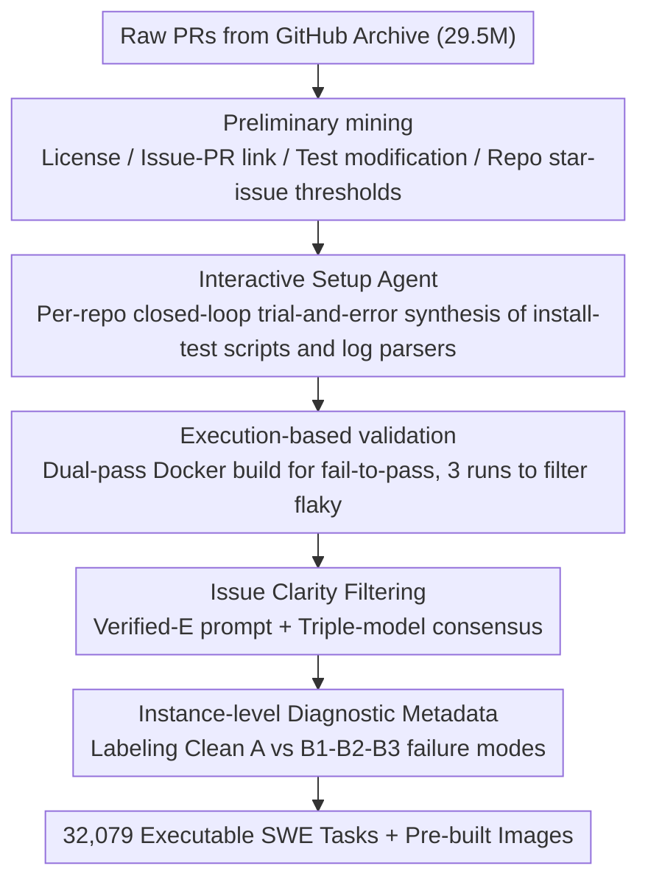

# SWE-rebench V2: Language-Agnostic SWE Task Collection at Scale

**Conference**: ICML 2026  
**arXiv**: [2602.23866](https://arxiv.org/abs/2602.23866)  
**Code**: HuggingFace `nebius/SWE-rebench-V2` and `nebius/SWE-rebench-V2-PRs`  
**Area**: Code Intelligence / SWE Agent Training Data / Multilingual Code Benchmark  
**Keywords**: SWE Agent, Executable Training Environment, Multilingual, Automated Data Pipeline, Issue Quality Filtering

## TL;DR
The authors utilized a "language-agnostic unified construction pipeline + interactive installation Agent + triple-model ensemble for issue clarity filtering" to automatically mine 32,079 executable SWE tasks across 20 languages and 3,617 repositories from GitHub (accompanied by over 120,000 PR-derived tasks). Each task includes pre-built Docker images, fail-to-pass tests, and instance-level diagnostic metadata, providing stable, training-oriented (rather than evaluation-oriented) data for large-scale Reinforcement Learning of SWE Agents.

## Background & Motivation

**Background**: Benchmarks for "repository-level issue resolution," represented by SWE-bench, have become the mainstream evaluation protocol for SWE Agents. Reinforcement Learning (RL) using test pass rates as a reward signal has become the primary means to enhance Agent capabilities. Recently, SWE-Gym, Multi-SWE-RL, SWE-Factory, SetUpAgent, and SWE-Bench++ have attempted to automate task collection and environment setup.

**Limitations of Prior Work**: Executable tasks available for training (rather than just evaluation) remain scarce. Manually annotated benchmarks are too small and biased toward Python. While automated pipelines have increased the scale, most remain "evaluation-first"—lacking pre-built images, stable cross-language fail-to-pass signals, and diagnostic information regarding the alignment between descriptions and tests. This leads to high reward noise and difficulty in curriculum design during RL training.

**Key Challenge**: To ensure stable RL training, it is necessary to have (i) reproducible dependency installation, (ii) deterministic test execution, and (iii) consistency between natural language specifications and test oracles. Achieving these in cross-language scenarios is prohibitively expensive, as every ecosystem has different build systems, package managers, and test runners, making manual per-repo configuration unscalable.

**Goal**: Construct a "language-agnostic" end-to-end pipeline that processes 20 languages using the same workflow. By relying on a small number of reusable language templates (base images, runners, log parsers), it aims to produce large-scale, reproducible, executable SWE training tasks with diagnostic labels.

**Key Insight**: The entire process is divided into five stages (preliminary mining → interactive setup synthesis → dual-pass execution validation → LLM-integrated issue clarity filtering → metadata enrichment). Yield and failure modes are quantified at each stage, embedding quality control directly into the construction pipeline.

**Core Idea**: Replace "per-instance manual verification" with an "interactive setup agent + triple LLM judge ensemble + instance-level diagnostic labels" to push the data scale to the level required for training while maintaining executability.

## Method

### Overall Architecture
This work addresses the scarcity of executable SWE tasks for RL training by decomposing task construction into a language-agnostic five-stage funnel. This funnel filters 29.5 million raw PRs down to 32,000 stable executable tasks. The first stage, preliminary mining, aggregates issue/PR metadata from GitHub Archive and retrieves diffs from local git histories, filtering by license, issue-PR links, and whether tests were added or modified. Different thresholds are set for high-resource (Python/Java/Go: 25 stars + 15 closed issues) and long-tail languages (10 stars + 1 closed issue). The third stage, execution-based validation, uses multi-stage Docker builds to separate base and repository layers, running tests to verify fail-to-pass pairings across 3 iterations to filter out flaky tests. Innovation lies in the intermediate and final stages: interactive setup synthesis, issue clarity filtering, and metadata enrichment.

### Key Designs

**1. Interactive Setup Agent: Automating "per-repo" synthesis via closed-loop trial-and-error**

Cross-language environments involve diverse build systems and package managers. While early methods like SetUpAgent worked for Python by analyzing file manifests, long-tail systems require closed-loop trial-and-error. For each language, a base Dockerfile is generated using Qwen3-Coder-480B. A mini-SWE-agent is then deployed to automatically produce reproducible scripts and log parsers through a loop of "exploring code → running install → checking errors → fixing scripts." A key constraint is performing setup inference only once per repository (using the latest snapshot) and reusing it for all tasks. Structural reports (e.g., JUnit XML) are enforced for Java to avoid stdout drifts, and rebuilds are forced after patching for compiled languages like C/C++.

**2. Multi-LLM Issue Clarity Filtering: Consensus-based exclusion of under-specified tasks**

Poorly specified issues cause agents to fail even if they are capable, polluting RL reward signals. Using the 1,699 manually annotated well-specified samples from SWE-bench Verified as ground truth, the authors compared various prompts (Rebench V1, SPICE, etc.). The final configuration uses the "Verified-E" prompt with a triple-model consensus (e.g., GPT-5.2, Claude, Gemini) to prioritize precision (0.88) over recall (0.06), ensuring that only clearly defined tasks are used for training.

**3. Instance-level Diagnostic Metadata: Categorizing failure modes for curriculum selection**

Instead of pursuing zero-defect datasets, the authors explicitly label systemic failure modes: B1 (test suite coupling), B2 (implicit naming requirements), and B3 (external dependencies). Using GPT-oss-120b and meta-prompts, tasks are labeled as Clean (A) or B1/B2/B3. This allows trainers to design curricula, such as using the A subset for SFT warm-up and introducing B1 tasks with partial rewards during RL.

## Key Experimental Results

### Main Results

| Stage | Input PRs | Output PRs | Output Repos | Description |
|------|---------|---------|---------|------|
| Raw | $2.95\text{e}7$ | — | $1.45\text{e}5$ | Full GitHub Archive |
| With Tests | $8.59\text{e}6$ | — | $1.02\text{e}5$ | Must add/modify tests |
| Issue-PR Link | $8.06\text{e}5$ | — | $5.08\text{e}4$ | Strict constraint |
| Repo Filtering | $5.84\text{e}5$ | — | $2.17\text{e}4$ | Star/issue thresholds |
| F2P Success | $4.13\text{e}4$ | — | 4006 | Install + validation passed |
| Issue Clarity | $3.30\text{e}4$ | — | 3701 | Triple-model consensus |
| 3-Run Stable | $\mathbf{3.21\text{e}4}$ | — | $\mathbf{3617}$ | Final Release |

### Ablation Study

| Configuration | pass@1 | pass@10 | Description |
|------|--------|---------|------|
| Non-interactive (Qwen3-480B) | 12.1 | 15.7 | 3-step fixed baseline |
| mini-SWE-agent (Qwen3-30B, 32k) | 17.4 | 46.1 | Small model + interaction > Large model |
| mini-SWE-agent (DeepSeek-V3.2, 32k) | 20.3 | 59.8 | |
| mini-SWE-agent (Qwen3-480B, 32k) | 25.8 | 58.8 | Main configuration |
| mini-SWE-agent (Qwen3-480B, 128k) | **27.1** | **62.7** | Marginal gains for context |

### Key Findings
- **Interaction is more valuable than model scaling**: Qwen3-30B interactive pass@1 ($17.4\%$) exceeds Qwen3-480B non-interactive ($12.1\%$).
- **Issue linking is the primary bottleneck**: The drop from 8.6M PRs with tests to 0.8M with issue links is significant, justifying the release of 120,000 PR-derived tasks (which do not require issue links).
- **A/B* metadata demonstrates high signal**: Models perform significantly better on the Clean (A) subset than on B* subsets (e.g., $34.0\%$ vs $6.0\%$), validating the diagnostic labels.

## Highlights & Insights
- **Per-repo synthesis as a leverage**: Performing setup inference once per repo reduces costs to approximately $\$0.0873$ per repository, making large-scale data collection economically feasible.
- **Failure-driven metadata**: Labels were derived by inductive analysis of real failure trajectories from 7 frontier models, rather than speculative brainstorming.
- **Dataset as a base rather than a gold standard**: The authors acknowledge that automated pipelines are noisy. By providing labels and diagnostic signals instead of absolute cleaning, they allow researchers to filter data based on specific needs.

## Limitations & Future Work
- **Lack of end-to-end RL training**: The study focuses on verifying the prerequisites for training rather than performing the final RL fine-tuning.
- **Docker drift**: External dependencies (package registries, system libraries) can still change over time, requiring periodic maintenance.
- **Single-container assumption**: Complex systems requiring multiple services or databases are currently excluded.
- **Leakage in PR-derived tasks**: Approximately $23\%$ of PR tasks contain some form of solution leakage, necessitating the use of leakage detectors during training.

## Related Work & Insights
- Compared to **SWE-rebench v1**, v2 generalizes from Python to 20 languages and provides pre-built images for training.
- Compared to **SWE-Factory**, v2 offers greater language breadth and instance-level diagnostic metadata.
- Compared to **SPICE**, the issue clarity filtering is integrated directly into the pipeline and calibrated against human annotations from SWE-bench Verified.

## Rating
- Novelty: ⭐⭐⭐⭐ — While individual components exist, the combination into a training-oriented, language-agnostic pipeline is a first.
- Experimental Thoroughness: ⭐⭐⭐⭐ — Comprehensive funnel and ablation studies; lacks end-to-end RL verification.
- Writing Quality: ⭐⭐⭐⭐⭐ — Transparent discussion of failure modes, costs, and limitations.
- Value: ⭐⭐⭐⭐⭐ — Addresses the major bottleneck in SWE Agent RL training with fully open-sourced datasets and images.

<!-- RELATED:START -->

## Related Papers

- [\[NeurIPS 2025\] SWE-rebench: An Automated Pipeline for Task Collection and Decontaminated Evaluation of Software Engineering Agents](../../NeurIPS2025/code_intelligence/swe-rebench_an_automated_pipeline_for_task_collection_and_decontaminated_evaluat.md)
- [\[ICML 2026\] MatchFixAgent: Language-Agnostic Autonomous Repository-Level Code Translation Validation and Repair](matchfixagent_language-agnostic_autonomous_repository-level_code_translation_val.md)
- [\[ICML 2026\] HE-SNR: Uncovering Latent Logic via Entropy for Guiding Mid-Training on SWE-bench](he-snr_uncovering_latent_logic_via_entropy_for_guiding_mid-training_on_swe-bench.md)
- [\[ACL 2026\] SWE-QA: Can Language Models Answer Repository-level Code Questions?](../../ACL2026/code_intelligence/swe-qa_can_language_models_answer_repository-level_code_questions.md)
- [\[ICML 2026\] Locally Coherent Parallel Decoding in Diffusion Language Models](locally_coherent_parallel_decoding_in_diffusion_language_models.md)

<!-- RELATED:END -->
