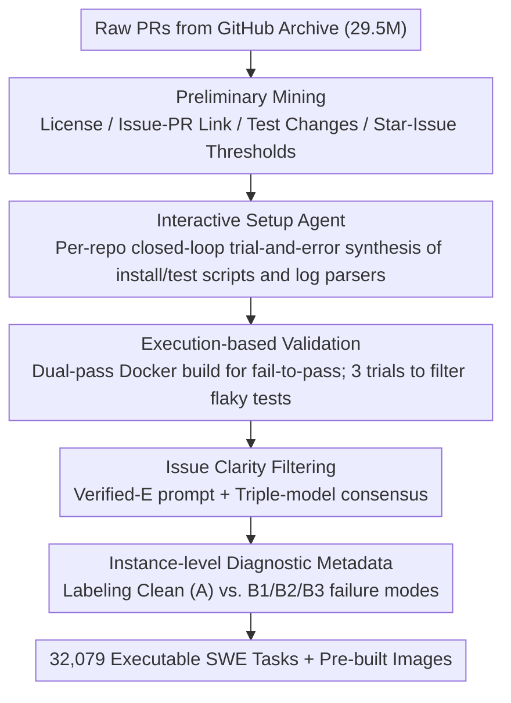

# SWE-rebench V2: Language-Agnostic SWE Task Collection at Scale

**Conference**: ICML 2026  
**arXiv**: [2602.23866](https://arxiv.org/abs/2602.23866)  
**Code**: HuggingFace `nebius/SWE-rebench-V2` and `nebius/SWE-rebench-V2-PRs`  
**Area**: Code Intelligence / SWE Agent Training Data / Multilingual Code Benchmark  
**Keywords**: SWE Agent, Executable Training Environment, Multilingual, Automated Data Pipeline, Issue Quality Filtering

## TL;DR
The authors developed a "language-agnostic unified construction pipeline + interactive installation Agent + triple-model ensemble for issue clarity filtering" to automatically mine 32,079 executable SWE tasks across 20 languages and 3,617 repositories from GitHub (accompanied by 120,000+ PR-derived tasks). Each task includes pre-built Docker images, fail-to-pass tests, and instance-level diagnostic metadata, providing a stable, training-oriented substrate for large-scale reinforcement learning of SWE Agents rather than just evaluation.

## Background & Motivation

**Background**: "Repository-level issue resolution" benchmarks, represented by SWE-bench, have become the mainstream evaluation protocol for SWE Agents. Reinforcement learning (RL), which uses test passage as a reward signal, has become a primary driver for advancing Agent capabilities. Recently, systems such as SWE-Gym, Multi-SWE-RL, SWE-Factory, SetUpAgent, and SWE-Bench++ have attempted to automate task collection and environment setup.

**Limitations of Prior Work**: Executable tasks suitable for training (rather than just evaluation) remain scarce. Manually annotated benchmarks are too small and Python-centric. While automated pipelines have increased the scale, most remain "evaluation-priority"—lacking pre-built images, stable cross-language fail-to-pass signals, and diagnostic information regarding the alignment between descriptions and tests. This results in significant reward noise and difficult curriculum design during RL training.

**Key Challenge**: Stable RL requires (i) reproducible dependency installation, (ii) deterministic test execution, and (iii) consistency between natural language specifications and test oracles. Achieving these in cross-language scenarios is prohibitively expensive, as every ecosystem has different build systems, package managers, and test runners, making per-repo manual configuration unscalable.

**Goal**: Construct a "language-agnostic" end-to-end pipeline where a single workflow handles 20 languages. By relying on a small set of reusable language templates (base images, runners, log parsers), the goal is to produce large-scale, reproducible, executable SWE training tasks with diagnostic labels.

**Key Insight**: Decompose the entire process into five stages (preliminary mining → interactive setup synthesis → dual-pass execution validation → LLM-integrated issue clarity filtering → metadata enrichment). Quality control is embedded into the construction pipeline itself by quantifying "yield vs. failure modes" at each stage.

**Core Idea**: Replace "per-instance manual verification" with an "interactive setup agent + triple LLM judge ensemble + instance-level diagnostic labels" to push the data scale to the magnitude required for training while maintaining executability.

## Method

### Overall Architecture
This work addresses the scarcity of executable SWE tasks for RL training by decomposing task construction into a language-agnostic five-stage funnel, filtering 29.5 million raw PRs down to 32,000 stable executable tasks (see the funnel table). The first stage, preliminary mining, aggregates issue/PR metadata from GitHub Archive and extracts diffs from local git history. It filters by license, issue-PR links, and whether tests were added/modified, applying different thresholds for high-resource languages (Python/Java/Go: 25 stars + 15 closed issues) and long-tail languages (10 stars + 1 closed issue), retaining ~21,700 repositories and 580,000 candidates. The third stage, execution-based validation, separates the base layer from the repository layer using multi-stage Docker builds. It runs fail-to-pass test pairs three times, retaining only those with consistent structured results to filter out flakiness. The core methodological innovations lie in the intermediate and final stages: interactive setup synthesis, issue clarity filtering, and metadata enrichment.

### Key Designs

**1. Interactive Setup Agent: Reducing "per-task manual environment setup" to "per-repo automated synthesis" through closed-loop trial-and-error**

Across 20 languages, 3.6k repositories utilize various build systems, package managers, and test runners, making manual configuration unscalable. While early approaches like SWE-rebench / SetUpAgent worked for Python by analyzing file lists, long-tail build systems require a trial-and-error loop. This work pre-generates base Dockerfiles (e.g., providing Java 11/17/21) using Qwen3-Coder-480B. A mini-SWE-agent v1.14.4 (based on Qwen3-Coder-480B) is then deployed to "explore code → run installation → analyze errors → fix scripts" in a closed loop to produce reproducible install/test scripts and log parsers. A critical engineering constraint is performing setup inference only **once** per repository (using the snapshot of the latest mined PR) and reusing it for all tasks. JVM-based repositories are required to use structured reports (e.g., JUnit XML) to avoid stdout drift, and compiled languages like C/C++ are forced to rebuild after patching to prevent running stale binaries.

This approach is effective because the closed loop is more valuable than model scaling: the interactive pass@1 ($25.8\%$) significantly outperforms the non-interactive pass@1 ($12.1\%$). Even using a smaller Qwen3-30B interactively ($17.4\%$) exceeds the non-interactive Qwen3-480B. Furthermore, per-repo synthesis keeps the total cost manageable at approximately $1.9$K USD for 535K API calls.

**2. Multi-LLM Integrated Issue Clarity Filtering: Removing underspecified problem statements from executable tasks to protect RL reward signals**

Poorly specified issues lead to "Agent cannot solve → test fails," and including underspecified issues as training samples contaminates reinforcement learning rewards. Since a single LLM judge can hallucinate or misjudge verbose but unclear issues, this work uses the 1,699 manually labeled "well-specified" samples from SWE-bench Verified as ground truth. After comparing different prompts (Verified-E being the strongest as it includes the patch and test patch) and models (gpt-oss-120b had the highest F1; Claude Opus-4.5 and Gemini 3 Pro had high precision), the authors found that a consensus of three models achieved the best precision ($0.88$, though with $0.06$ recall). To ensure clean downstream training signals, they opted for the "consensus" configuration to act as a low-cost automated double-blind review.

**3. Failure-Mode-Based Instance-Level Diagnostic Metadata: Explicitly labeling defects to allow for curriculum-based sampling**

Automated pipelines naturally contain noise. Rather than aiming for zero defects or discarding all suspicious tasks, this work explicitly labels failure modes to allow trainers to perform stratified filtering. By manually analyzing trajectories from 300 tasks across 7 frontier models (Claude Opus-4.5, GLM-4.7, DeepSeek-V3.2, etc.), the authors identified three systematic failure modes: B1 (test suite coupling), B2 (implicit naming requirements), and B3 (external dependencies). Using gpt-oss-120b with meta-prompting, these labels were applied across the dataset (Clean A vs. B1/B2/B3). This enables curriculum design: using the Clean A subset for SFT warm-up, and introducing B1 tasks with partial rewards during RL robustness tuning. The diagnostic power was validated by a controlled test where model pass@3 on subset A was $5$–$8\times$ higher than on B* (e.g., Gemini $34.0\%$ vs. $4.0\%$).

### Loss & Training
This work does not perform end-to-end RL training (noted as future work). Instead, it validates the prerequisites for training: executability, non-triviality, headroom in pass@k across models, and the discriminative power of A/B* labels.

## Key Experimental Results

### Main Results

| Stage | Input PRs | Output PRs | Output Repos | Description |
|------|---------|---------|---------|------|
| Raw | $2.95\text{e}7$ | — | $1.45\text{e}5$ | Full GitHub Archive |
| With Tests | $8.59\text{e}6$ | — | $1.02\text{e}5$ | Must add/modify tests |
| Issue-PR Link | $8.06\text{e}5$ | — | $5.08\text{e}4$ | Strong constraint, ~10$\times$ loss |
| Repository Filtering | $5.84\text{e}5$ | — | $2.17\text{e}4$ | Star/Issue thresholds |
| F2P Success | $4.13\text{e}4$ | — | 4006 | Install + Validation passed |
| Issue Clarity Filtering | $3.30\text{e}4$ | — | 3701 | Triple-model consensus |
| 3-Run Stable | $\mathbf{3.21\text{e}4}$ | — | $\mathbf{3617}$ | Final Release |

### Ablation Study

| Configuration | pass@1 | pass@10 | Description |
|------|--------|---------|------|
| Non-interactive (Qwen3-480B) | 12.1 | 15.7 | Three-step fixed workflow baseline |
| mini-SWE-agent (Qwen3-30B, 32k) | 17.4 | 46.1 | Small model + interaction exceeds large model non-interactive |
| mini-SWE-agent (DeepSeek-V3.2, 32k) | 20.3 | 59.8 | |
| mini-SWE-agent (Qwen3-480B, 32k) | 25.8 | 58.8 | Main configuration |
| mini-SWE-agent (Qwen3-480B, 128k) | **27.1** | **62.7** | Limited marginal gain from long context |

### Key Findings
- **"Interaction" is more valuable than "model scaling"**: Qwen3-30B's interactive pass@1 ($17.4\%$) significantly outperformed Qwen3-480B's non-interactive pass@1 ($12.1\%$), confirming that closed-loop debugging is a necessity.
- **Issue linking is the primary bottleneck**: Moving from 8.6M PRs with tests to 0.8M PRs with both tests and issue links represents an order-of-magnitude drop. This motivated the release of 120k additional PR-derived tasks that do not depend on issue links.
- **A/B* metadata is highly informative**: On the Code A subset, GLM-4.7 achieved a pass@3 of $34.0\%$, compared to only $6.0\%$ on the B* subset. This $5$–$8\times$ gap confirms that diagnostic labels are valid for curriculum design.
- **Issue filtering prioritizes high precision**: The authors chose a triple-model consensus (precision $0.88$), preferring to discard truly clear issues rather than allowing noisy issues to contaminate training rewards.

## Highlights & Insights
- **Per-repo synthesis as a scalable lever**: Running install agents for 21,692 repositories cost ~$1.9$K USD (average $\$0.0873$/repo). This "configure once, harvest all tasks" approach is an order of magnitude more efficient than per-task configuration and is applicable to other complex environments.
- **Failure-mode-driven metadata**: Instead of brainstorming possible defects, the labels were induced from actual failure trajectories of 7 frontier models. This "empirical prior + LLM labeling" paradigm is more robust.
- **Dataset as a foundation, not just a gold standard**: The authors acknowledge that automated pipelines are noisy. By providing 32k tasks with diagnostic signals (e.g., labeling the $23\%$ of PR tasks with potential leakage), they allow researchers to filter the data according to their specific needs.

## Limitations & Future Work
- Absence of end-to-end RL training ablation: The authors admit that performing RL across 20 languages is computationally expensive, leaving the empirical proof of training gains as future work.
- Environmental drift: Docker images cannot completely eliminate drift in external dependencies (package repos, network resources).
- Single-container assumption: The pipeline excludes complex systems requiring multiple services or databases.
- Leakage in PR-derived tasks: $23\%$ contain some level of solution leakage. Downstream RL training must utilize leakage detectors.

## Related Work & Insights
- **vs. SWE-rebench v1 (Badertdinov 2025)**: v1 was Python-only and evaluation-oriented. v2 generalizes the workflow to 20 languages and provides pre-built images for training.
- **vs. SWE-Factory (Guo 2026)**: While SWE-Factory supports 4 languages, v2 offers greater language breadth, instance-level diagnostic metadata, and a large set of PR-derived tasks.
- **vs. SPICE (Oliva 2025)**: v2 integrates LLM judge ensembles directly into the pipeline and calibrates them against SWE-bench Verified human annotations.
- **Insight**: Transitioning from "per-task manual setup" to "per-repo automated setup + instance-level labels" can reduce costs by an order of magnitude, a strategy that could be applied to CTF challenges, bioinformatics workflows, or browser-based Agents.

## Rating
- Novelty: ⭐⭐⭐⭐ — While individual components have precedents, the combination of a language-agnostic pipeline, training-oriented design, and diagnostic metadata is a first for the SWE training field.
- Experimental Thoroughness: ⭐⭐⭐⭐ — Comprehensive funnel analysis and ablations are included, though the lack of an end-to-end RL training verification prevents a full score.
- Writing Quality: ⭐⭐⭐⭐⭐ — Failure modes, costs, and limitations are transparently addressed; extensive examples are provided in the appendix.
- Value: ⭐⭐⭐⭐⭐ — Addresses the major bottleneck for SWE Agent RL training with a fully open-source release of data, images, and code.

<!-- RELATED:START -->

## Related Papers

- [\[NeurIPS 2025\] SWE-rebench: An Automated Pipeline for Task Collection and Decontaminated Evaluation of Software Engineering Agents](../../NeurIPS2025/code_intelligence/swe-rebench_an_automated_pipeline_for_task_collection_and_decontaminated_evaluat.md)
- [\[ICML 2026\] MatchFixAgent: Language-Agnostic Autonomous Repository-Level Code Translation Validation and Repair](matchfixagent_language-agnostic_autonomous_repository-level_code_translation_val.md)
- [\[ICML 2026\] HE-SNR: Uncovering Latent Logic via Entropy for Guiding Mid-Training on SWE-bench](he-snr_uncovering_latent_logic_via_entropy_for_guiding_mid-training_on_swe-bench.md)
- [\[ACL 2026\] SWE-QA: Can Language Models Answer Repository-level Code Questions?](../../ACL2026/code_intelligence/swe-qa_can_language_models_answer_repository-level_code_questions.md)
- [\[ICML 2026\] SWE-IF: Aligning Code Evaluation with Human Preference](swe-if_aligning_code_evaluation_with_human_preference.md)

<!-- RELATED:END -->
