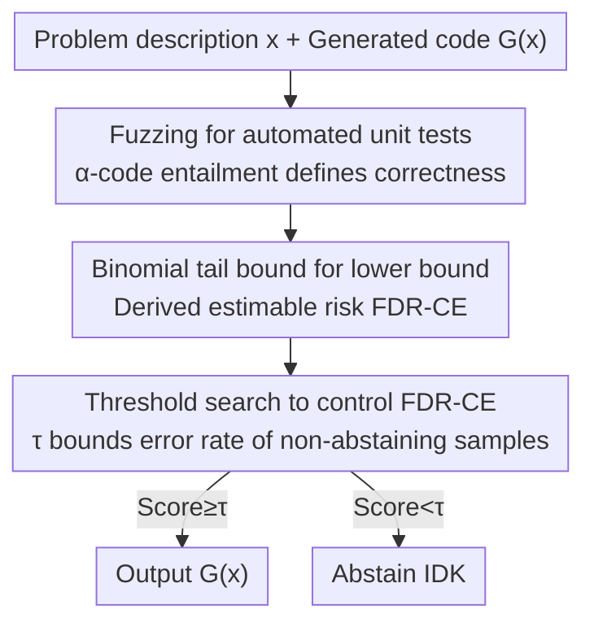

# Towards Functional Correctness of Code Models with Selective Generation

**Conference**: ICML 2026  
**arXiv**: [2505.13553](https://arxiv.org/abs/2505.13553)  
**Code**: https://github.com/trustml-lab/selective-code-generation  
**Area**: Code Generation / Trustworthy Machine Learning  
**Keywords**: Selective Generation, Code Hallucination, FDR Control, Fuzzing, Automated Unit Test Generation

## TL;DR
This work utilizes fuzzing to automatically generate a large volume of unit tests to determine the functional correctness of generated code. Based on this, it trains a selective code generator capable of "active abstention," providing PAC-style guarantees to keep the code hallucination rate (FDR-CE) below a user-specified threshold for non-abstaining responses.

## Background & Motivation
**Background**: Large Language Models (LLMs) have achieved significant performance in code generation. However, recent efforts (e.g., DeepSeek-R1, OpenAI-IOI via RL; CodeT/AlphaCode via reranking) focus almost exclusively on "improving pass rates," which only indirectly reduces functional hallucinations.

**Limitations of Prior Work**: There is a lack of methods to **directly control** the occurrence rate of "generated code failing to meet functional requirements." While mature certified hallucination control exists in Natural Language Generation (e.g., conformal prediction, selective prediction), it is difficult to transfer to code. These methods rely on "textual entailment" to judge correctness, but it is extremely challenging for humans to label whether two code snippets are functionally equivalent.

**Key Challenge**: The primary bottleneck in controlling code hallucination is the extreme difficulty of **judging functional equivalence** between two programs. In natural language, humans can provide entailment labels to train discriminative models; for code, its "unnatural" formal structure makes this impractical. Existing benchmarks like HumanEval rely on a few manually written unit tests, which suffer from poor coverage and sensitivity to test quantity, and they fail to characterize "partially correct" programs.

**Goal**: Given a pre-existing code generator $G$, learn a selection function that returns "I don't know" (IDK) when uncertain, thereby controlling the **error rate in non-abstaining responses** at a specified level while maximizing selection efficiency (minimizing abstentions).

**Key Insight**: Code possesses a "killer feature" that natural language lacks: **executability**. Since it can be executed, one can automatically generate massive amounts of unit tests to approximate the ground truth of "functional correctness," bypassing the dilemma of human labeling for code entailment.

**Core Idea**: Use dynamic analysis tools like fuzzing to generate unit tests in bulk, redefine "code entailment" as meeting a specific "pass rate threshold," and then apply the FDR control framework for selective generation to obtain a certified selective code generator. Furthermore, use these automatically generated tests for evaluation, a paradigm termed FuzzEval.

## Method

### Overall Architecture
The method equips a code generator with an "abstention switch" ensuring controlled error rates. The pipeline consists of three stages: first, using fuzzing to generate unit tests to transform "code correctness" into a statistically estimable quantity ($\alpha$-code entailment); second, treating this quantity as a pseudo-label and using binomial tail bounds to estimate a correctness lower bound for each result, defining the estimable risk FDR-CE; finally, searching for a confidence threshold $\tau$ on a calibration set such that the "estimated error rate + estimation error" is bounded by the user-specified $\varepsilon_S$ with PAC-style high-probability guarantees.

### Key Designs

**1. $\alpha$-Code Entailment: Redefining Correctness via Pass Rates**

Since code entailment cannot be labeled like sentences, the authors operationalize "correctness" through executability. Let a unit test generator $\mathcal{F}(\mathbf{x})$ produce a batch of input-output pairs $(\mathbf{u},\mathbf{v})$ from a problem description. $\mathcal{F}(\mathbf{x})$ is said to **$\alpha$-entail** a code snippet $\hat{\mathbf{y}}$ if and only if the expected accuracy on these tests meets the threshold:

$$\mathbb{P}\{\hat{\mathbf{y}}(\mathbf{u})=\mathbf{v}\}\ge 1-\alpha,\quad (\mathbf{u},\mathbf{v})\sim\mathcal{F}(\mathbf{x}).$$

Here $\alpha$ is a relaxation parameter: smaller $\alpha$ is stricter. The authors employ **one-way** entailment (where $\hat{\mathbf{y}}$ satisfies all functionalities of the reference code $\mathbf{y}$, but may perform additional tasks), rather than strict functional equivalence. This definition transforms "correctness" into a statistically estimable probability, forming the foundation for all subsequent guarantees.

**2. Binomial Tail Bounds + Adaptive Sampling: Estimating Correctness Lower Bounds**

Since the true entailment set $E_\alpha$ is inaccessible, it is estimated as a pseudo-label function. For each problem, $n_\mathbf{x}$ automated tests are run to count passed cases $\hat{k}$. Using Clopper-Pearson **lower binomial tail bounds**, they estimate the lower bound of expected accuracy $\hat{L}$, ensuring $\mathbb{P}\{\hat{L}\le \mathbb{P}\{\bar{\mathbf{y}}(\mathbf{u})=\mathbf{v}\}\}\ge 1-\varepsilon_E$ with high probability. The **estimated entailment set** is defined as $\hat{E}_{\alpha,\varepsilon_E}(\mathbf{x})=\{\bar{\mathbf{y}}\mid \hat{L}\ge 1-\alpha\}$.

A key innovation is **adaptive sampling**: since fuzzer tests are cheap, tests are added dynamically until the lower bound $\hat{L}$ clearly determines entailment, with more tests allocated to ambiguous code, up to a limit $n_{\max}$. This ties estimation error directly to the controllable parameter $\varepsilon_E$.

**3. FDR-CE Control Algorithm: Thresholding for Controlled Error Rates**

The estimated entailment set is integrated into the selective generation framework. The selection function is parameterized as $\hat{s}(\mathbf{x})=\mathbb{1}(f(\mathbf{x},G(\mathbf{x}))\ge\tau)$. While the default scoring function $f$ is length-normalized log-probability $f_{\text{norm}}$, a hybrid score $f_{\text{mixed}}=0.5 f_{\text{norm}}+0.5\,\text{pass@1}$ (using held-out tests) is also proposed. The core conclusion (Lemma 4.2) states that the true risk is bounded by the estimated risk plus a constant: $\mathcal{R}_\alpha(\hat{S})\le \varepsilon_E + \mathcal{R}_{\alpha,\varepsilon_E}(\hat{S})$. The algorithm solves a 1D optimization on the calibration set:

$$\min_{\tau}\ \tau\quad \text{s.t.}\quad \varepsilon_E+\hat{U}_{\text{Binom}}\!\left(\hat{k};|\hat{\mathbf{Z}}|,\tfrac{\delta_S}{\lceil\log_2|\mathbf{Z}|\rceil}\right)\le\varepsilon_S,$$

which **minimizes $\tau$** (reducing abstentions) under the constraint that FDR-CE is bounded by $\varepsilon_S$. The $\log_2$ term accounts for multiple testing corrections during threshold search. Theorem 4.3 provides the PAC-style guarantee: $\mathbb{P}\{\mathcal{R}_\alpha(\hat{S})\le\hat{U}\}\ge 1-\delta_S$, **requiring zero human labeling for code entailment**.

**4. Fuzzing for Test Generation + FuzzEval: Exploring Execution Paths**

The generator $\mathcal{F}$ is implemented via fuzzing (e.g., Atheris). It samples byte streams as seeds to initialize function arguments and mutates them based on coverage to explore execution paths. For problems with a reference code $\mathbf{y}$, the fuzzer executes it to collect $(\mathbf{u},\mathbf{v})$ pairs as ground truth. Unlike using fuzzing to "find bugs," this approach uses it to **approximate functionality** through broad path exploration. The authors advocate for **FuzzEval**, arguing that automated fuzzing is more rigorous than manual testing (like HumanEval) because the latter cannot cover the exponentially growing execution paths of complex code.

### Loss & Training
The method is a **post-hoc calibration** for an existing generator $G$ and does not involve fine-tuning $G$. "Training" refers to solving the 1D threshold optimization for $\tau$ and the upper bound $\hat{U}$ on an i.i.d. calibration set $\mathbf{Z}$ ($|\mathbf{Z}|=n$). Hyperparameters include target risk $\varepsilon_S$, failure probability $\delta_S$, entailment relaxation $\alpha$, and estimation error $\varepsilon_E$. It can be layered atop any baseline (CodeT, LDB, SFS, GRPO-tuned models) to provide FDR-CE statistical guarantees.

## Key Experimental Results

Experiments cover 4 generators (GPT-4o, Gemini-1.5 Pro, DeepSeek-R1, CodeLlama-13B), 4 datasets (APPS-f, MBPP-f, HumanEval-f, Mercury-f, where "-f" denotes fuzzer-equipped versions), and 4 programming languages. The primary metrics are whether FDR-CE is kept below the target $\varepsilon_S$ and the resulting selection efficiency (ratio of non-abstentions).

### Main Results
Comparison of SCG with baselines on GPT-4o ($\alpha=0.35, \delta_S=0.1, \varepsilon_E=0.05$; bold indicates adherence to guarantees):

| Dataset | Method | 1-pass@1 ↓ | FDR-CE ↓ | Efficiency ↑ |
|--------|------|-----------|---------|--------|
| APPS-f ($\varepsilon_S=0.3$) | No selection ($\tau=-\infty$) | 0.436 | 0.431 | 1.000 |
| APPS-f | SCG-manual | 0.293 | 0.291 | 0.497 |
| APPS-f | **SCG** | 0.227 | **0.224** | 0.337 |
| MBPP-f ($\varepsilon_S=0.4$) | No selection | 0.299 | 0.294 | 1.000 |
| MBPP-f | **SCG** | 0.304 | **0.300** | 0.996 |
| HumanEval-f ($\varepsilon_S=0.3$) | No selection | 0.185 | 0.207 | 1.000 |
| HumanEval-f | **SCG** | 0.069 | **0.049** | 0.164 |

Analysis: Without selection, FDR-CE typically exceeds targets (e.g., 0.431 vs 0.3 on APPS-f). SCG successfully pulls FDR-CE below $\varepsilon_S$ through abstention. Efficiency reflects a natural trade-off: harder tasks (APPS) require more abstentions (0.337 efficiency), while easier tasks (MBPP) meet targets with minimal abstention (0.996 efficiency).

### Multi-Generator Support (Table 2, GPT-3.5-Turbo, Hybrid Score)

| Baseline | Metric | w/o SCG | w/ SCG |
|------|------|---------|--------|
| Base | FDR-CE ↓ (MBPP-f) | 0.491 | **0.145** |
| CodeT (Chen 2023a) | FDR-CE ↓ | 0.498 | **0.148** |
| LDB (Zhong 2024) | FDR-CE ↓ | 0.442 | **0.142** |
| SFS (Light 2025) | FDR-CE ↓ | 0.483 | **0.140** |

All baselines (including reranking and debugging-enhanced methods) originally had FDR-CE between 0.44 and 0.50. When layered with SCG ($\varepsilon_S=0.25$), they consistently drop to the 0.14-0.15 range, satisfying the guarantee while maintaining efficiency between 0.58 and 0.66. This demonstrates that SCG is a **pluggable statistical guarantee layer** independent of the model architecture.

### Key Findings
- **Efficiency varies by task difficulty**: Simple tasks like HumanEval require fewer abstentions to meet targets, whereas difficult tasks like APPS necessitate significant abstention—a natural trade-off between efficiency and correctness controlled by $\varepsilon_S$.
- **Hybrid scoring is superior**: Combining $f_{\text{norm}}$ (log-prob) with pass@1 from held-out tests provides better discrimination between correct and incorrect code than log-probability alone.
- **Orthogonal to RL fine-tuning**: Even for strong models like DeepSeek-R1 (GRPO-tuned), SCG can add a layer of statistical FDR-CE guarantee (Figure 2c).
- **Controllability**: Stricter $\alpha$ and $\varepsilon_S$ lead to more abstentions and lower efficiency, showing a smooth and controllable curve (Figure 3).

## Highlights & Insights
- **Leveraging code executability as a certification tool**: This work solves the "manual labeling bottleneck" in selective generation for text by using automated test execution for code—a clean and effective conceptual leap.
- **Adaptive sampling as a critical innovation**: By leveraging the low cost of fuzzing, the mechanism treats "uncertainty" by increasing the test sample size, turning estimation error into a tunable parameter $\varepsilon_E$.
- **Pluggable and Non-intrusive**: As a post-hoc calibration method, it requires no fine-tuning and can be layered onto any existing pipeline (reranking, RL, etc.), making it highly practical for production deployment.
- **Value of FuzzEval**: Beyond a tool for SCG, FuzzEval itself provides a more rigorous benchmark than manual tests for complex programs.

## Limitations & Future Work
- **Requirement for reference code and fuzz harness**: FuzzEval and test generation rely on reference implementations and executable fuzzing stubs, limiting applicability to code without references or code with side effects (IO/Network/Concurrency).
- **Blind spots of one-way entailment**: Validating only that the code "includes reference functionality" might miss harmful extra functionalities (e.g., unintended file writes or side effects).
- **Low efficiency on hard tasks**: On APPS-f, efficiency is only ~0.34, meaning two-thirds of problems are rejected. Practicality depends on the user's tolerance for "silence over error."
- **i.i.d. Assumption**: PAC guarantees assume the calibration set and test cases are identically distributed. Distribution shifts (e.g., new languages) may invalidate the guarantees.

## Related Work & Insights
- **vs. Selective Text Generation (Lee et al., 2024)**: This work adopts the FDR-E decomposition but replaces "textual entailment" with executable "$\alpha$-code entailment" and uses fuzzing for ground truth.
- **vs. Reranking Methods (CodeT / AlphaCode / S\*)**: These use unit tests to rerank and find the best solution to improve the pass rate. Ours uses tests to control FDR-CE, aiming to **directly limit the error rate**, and can be layered on top of them.
- **vs. RL fine-tuning (DeepSeek-R1 / OpenAI-IOI)**: RL uses tests as feedback for weight updates. Ours is a post-hoc calibration that doesn't touch weights; the two are orthogonal.
- **vs. EvalPlus / Mercury**: While these also generate tests, they often rely on LLM-based seed mutation, whereas this work uses traditional dynamic analysis (fuzzing) with statistical FDR-CE guarantees.

## Rating
- Novelty: ⭐⭐⭐⭐⭐ The first certified method to directly control code functional hallucination rates via the "executability → automated ground truth → selective generation" pipeline.
- Experimental Thoroughness: ⭐⭐⭐⭐ Extensive coverage across generators, datasets, and languages, though restricted by the need for reference code.
- Writing Quality: ⭐⭐⭐⭐ Clear derivations from entailment definitions to PAC guarantees, though notation is dense.
- Value: ⭐⭐⭐⭐ Provides a pluggable "safety valve" for trustworthy code generation, significant for high-stakes systems.

<!-- RELATED:START -->

## Related Papers

- [\[ICML 2026\] Bridging Functional Correctness and Runtime Efficiency Gaps in LLM-Based Code Translation](bridging_functional_correctness_and_runtime_efficiency_gaps_in_llm-based_code_tr.md)
- [\[ICML 2026\] Poison with Style: A Practical Poisoning Attack on Code Large Language Models](poison_with_style_a_practical_poisoning_attack_on_code_large_language_models.md)
- [\[ICML 2026\] Locally Coherent Parallel Decoding in Diffusion Language Models](locally_coherent_parallel_decoding_in_diffusion_language_models.md)
- [\[ACL 2026\] Ro-SLM: Onboard Small Language Models for Robot Task Planning and Operation Code Generation](../../ACL2026/code_intelligence/ro-slm_onboard_small_language_models_for_robot_task_planning_and_operation_code_.md)
- [\[ICML 2026\] AlgoVeri: An Aligned Benchmark for Verified Code Generation on Classical Algorithms](algoveri_an_aligned_benchmark_for_verified_code_generation_on_classical_algorith.md)

<!-- RELATED:END -->
