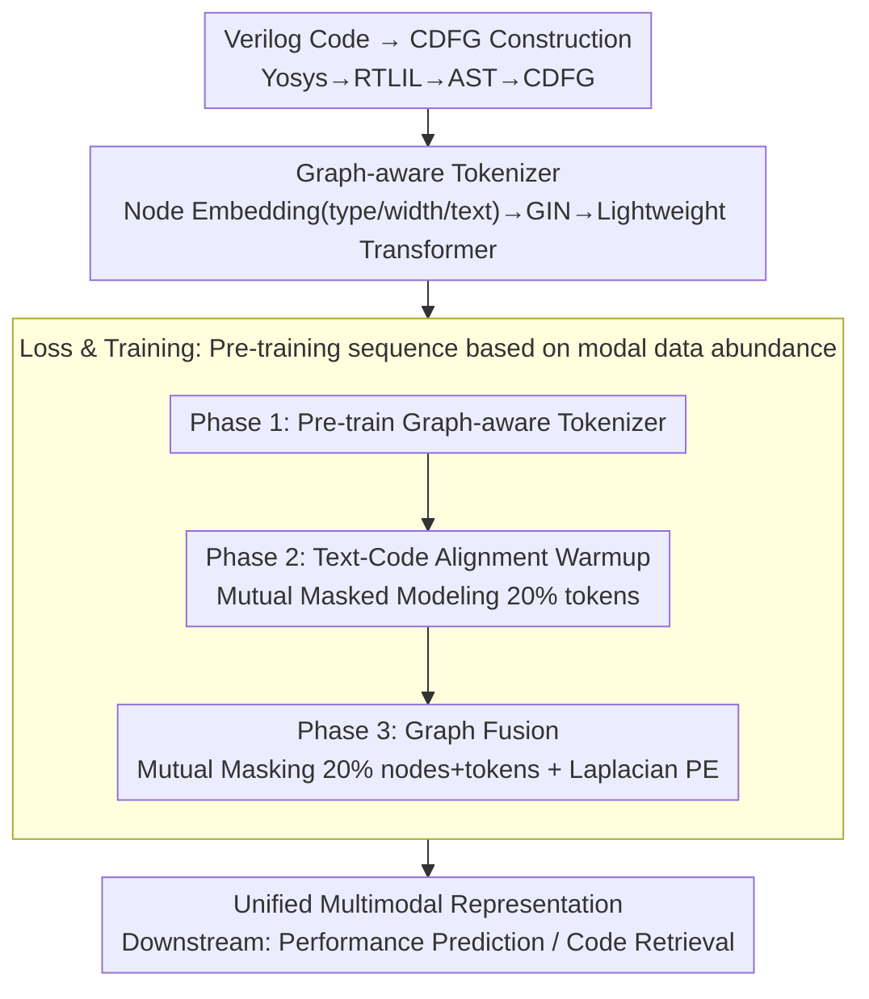

# UniRTL: Unified Code and Graph for Robust RTL Representation Learning

**Conference**: ICML 2026  
**arXiv**: [2605.31040](https://arxiv.org/abs/2605.31040)  
**Code**: https://github.com/cure-lab/UniRTL  
**Area**: Code Intelligence / Hardware Design  
**Keywords**: RTL Representation Learning, Multimodal Pre-training, CDFG, Performance Prediction, Code Retrieval

## TL;DR
This paper proposes UniRTL—a multimodal unified representation learning framework that jointly learns from RTL code and Control-Data Flow Graphs (CDFG). By employing a graph-aware tokenizer and a hierarchical training strategy, it significantly outperforms existing methods in hardware performance prediction and code retrieval tasks.

## Background & Motivation

**Background**: RTL (Register-Transfer Level) representation learning is critical for accelerating hardware design design flows. Existing methods utilize either only RTL code (VeriDistill, DeepRTL2) or only graph structures (StructRTL).

**Limitations of Prior Work**: Uni-modal representations suffer from limited expressiveness. Code implies semantic functional information but lacks complete structural dependencies; graphs preserve topological information but have sparse semantic information. While GraphCodeBERT fuses code and data flow, its alignment strategy is weak (variable-level only) and the data flow is incomplete.

**Key Challenge**: How to design a truly fine-grained multimodal alignment mechanism that fully utilizes the completeness of CDFG and the semantic complementarity of code.

**Key Insight**: Utilize CDFG instead of simplified data flow, as it preserves complete design information and can be faithfully converted back to code. Use mutual masked modeling to achieve fine-grained code-graph alignment and construct a graph-aware tokenizer to enable the Transformer to capture subtle relationships in the graph structure.

**Core Idea**: A hierarchical pre-training framework—first pre-train the graph-aware tokenizer → perform text-code alignment warmup → integrate graph fusion. Simultaneously, establish deep alignment across the three modalities through mutual masked modeling.

## Method

### Overall Architecture
The core problem UniRTL aims to solve is the loss of structural dependencies when looking at RTL code alone, and the sparse semantics when looking at graphs alone. These two must be fused at a fine-grained level to learn robust representations. The approach involves first compiling Verilog code into a Control-Data Flow Graph (CDFG, via Yosys→RTLIL→AST→CDFG) that retains complete design information. A unified Transformer (based on CodeBERT) is then used to map text, code, and graph modalities into the same representation space. Using "mutual masking," the three modalities predict and align with each other. The entire training process is conducted hierarchically, followed by downstream tasks such as performance prediction or code retrieval. The dataset comprises 132,008 RTL designs, with 38,888 successfully converted to CDFGs.

### Key Designs

**1. Graph-aware Tokenizer: Enabling Transformer to Comprehend CDFG Topology over Flat Nodes**

The limitation of approaches like GraphCodeBERT is that flattening variable nodes into a sequence loses structural relationships, and elements like operators or control flows remain unexpressed. UniRTL designs a three-step tokenizer: First, it concatenates an initial embedding for each node $v_i$ as $\mathbf{H}_{i}=\text{one-hot}(\text{type}(v_{i}))\parallel\text{width}(v_{i})\parallel\text{pca}(\phi_{\text{text}}(\text{desc}(v_{i})))$, encoding node type, bit width, and text descriptions together. Second, it uses a GIN to aggregate local dependencies along edges: $\mathbf{L}_{i}^{(k)}=\text{MLP}^{(k)}((1+\epsilon^{(k)})\cdot\mathbf{L}_{i}^{(k-1)}+\sum_{j\in\mathcal{N}(i)}\mathbf{L}_{j}^{(k-1)})$. Finally, a lightweight Transformer layer completes the global context to obtain structure-aware node tokens $\{\mathbf{G}_{i}\}$. GIN preserves topology while the Transformer handles global context; their complementarity allows the backbone to process graphs like text without losing subtle structural details.

**2. Mutual Masked Modeling: Forcing Code and Graph to Serve as Mutual Supervision**

Variable-level alignment in GraphCodeBERT only locates variables, and coarse-grained contrastive learning in CircuitFusion is too loose to establish deep semantic correspondence. UniRTL adopts "mutual masking"—randomly masking 20% of tokens during the text-code phase and requiring the model to recover them from complementary modalities. In the graph fusion phase, it simultaneously masks 20% of nodes and 20% of code tokens to jointly predict original node types and token IDs. To prevent loss of graph topology under masking, nodes are augmented with global position encodings constructed from graph Laplacian eigenvectors. Since masked content can only be recovered via the other modality, the model is forced to learn true fine-grained correspondence between code and graph.

**3. Hierarchical Training Strategy: Pre-training Sequence based on Modal Data Abundance**

There are 132k text-code pairs but only 38.8k graph pairs. Immediate graph fusion would cause unstable optimization due to data scarcity. UniRTL splits training into three stages: Stage 1 involves pre-training the graph-aware tokenizer independently; Stage 2 performs alignment warmup using all text-code pairs (5 epochs); Stage 3 introduces graph fusion (300 epochs). This maximally utilizes the rich text-code data to build a solid foundation for the backbone while fine-tuning graph fusion on a well-aligned representation space, avoiding gradient oscillations caused by insufficient graph data.

## Key Experimental Results

### Main Results: Performance Prediction (without netlist)

| Method | Area MAE↓ | Area MAPE↓ | Area $R^2$↑ | Delay MAE↓ |
|------|-----------|-----------|-----------|-----------|
| StructRTL | 0.3649 | 0.06 | 0.7463 | 0.5414 |
| GraphCodeBERT | 0.8424 | 0.15 | 0.5207 | 0.6109 |
| CircuitFusion | 0.7762 | 0.14 | 0.6175 | 0.5272 |
| **Ours** | **0.3510** | **0.06** | **0.7682** | **0.3384** |
| Ours (w/o code) | 0.3671 | 0.07 | 0.7546 | 0.3584 |
| Ours (w/o graph) | 0.8818 | 0.15 | 0.5173 | 0.6375 |

### Ablation Study: Code Retrieval

| Model | Precision↑ | Recall↑ | F1↑ |
|------|-----------|---------|---------|
| DeepRTL2-Llama | 0.557 | 0.608 | 0.572 |
| GraphCodeBERT | 0.616 | 0.675 | 0.634 |
| CircuitFusion | 0.542 | 0.608 | 0.560 |
| **Ours** | **0.650** | **0.692** | **0.662** |
| Ours (w/o graph) | 0.630 | 0.683 | 0.644 |

### Key Findings
- **Critical Role of Graphs**: Performance drops significantly without the graph (w/o graph), e.g., F1 decreases from 0.662 to 0.644, proving the value of complete CDFG information.
- **Complementary Role of Code**: Removing code (w/o code) leads to a slight performance decrease (MAE from 0.3510 to 0.3671).
- **Effectiveness of Alignment**: Using the same graph-aware tokenizer, fine-grained mutual masked alignment far outperforms variable-level alignment and coarse contrastive learning.

## Highlights & Insights
- **CDFG Completeness**: Unlike GraphCodeBERT which only uses data flow variables, UniRTL uses CDFG to retain complete elements like operators and control flow.
- **Graph-aware Tokenizer Innovation**: Effectively captures the "topological subtlety" of graphs through a GIN+Transformer combination rather than simple node flattening.
- **Hierarchy and Practicality**: Incorporates the data abundance of different modalities into the design; text-code warmup fully utilizes data while preparing the model for graph fusion.

## Limitations & Future Work
- **CDFG Conversion Constraints**: 38.8k out of 132k designs could not be converted to CDFG.
- **Language and Scale Limits**: Restricted to Verilog HDL; scalability for large-scale industrial designs is not fully verified.
- **Future Directions**: Extend to other HDLs like VHDL; utilize larger graph-pair datasets; cover a broader range of RTL tasks.

## Related Work & Insights
- **vs GraphCodeBERT**: Replaces incomplete data flow with full CDFG, introduces a graph-aware tokenizer, and uses mutual masking instead of variable alignment.
- **vs CircuitFusion**: UniRTL achieves direct fine-grained code-graph alignment using a unified Transformer, and its CDFGs cover the complete design.

## Rating
- Novelty: ⭐⭐⭐⭐⭐ Systematic improvement of multimodal RTL representation learning.
- Experimental Thoroughness: ⭐⭐⭐⭐⭐ Covers two major downstream tasks, multiple settings, and comprehensive ablations.
- Writing Quality: ⭐⭐⭐⭐⭐ Clear motivation and rigorous methodological explanation.
- Value: ⭐⭐⭐⭐⭐ Provides a general foundation model for hardware design automation, achieving SOTA in performance prediction and code retrieval.

<!-- RELATED:START -->

## Related Papers

- [\[NeurIPS 2025\] Automated Multi-Agent Workflows for RTL Design](../../NeurIPS2025/code_intelligence/automated_multi-agent_workflows_for_rtl_design.md)
- [\[ICML 2026\] Entropy-informed Decoding: Adaptive Information-Driven Branching](entropy-informed_decoding_adaptive_information-driven_branching.md)
- [\[ICML 2026\] SWE-rebench V2: Language-Agnostic SWE Task Collection at Scale](swe-rebench_v2_language-agnostic_swe_task_collection_at_scale.md)
- [\[ICML 2026\] Locally Coherent Parallel Decoding in Diffusion Language Models](locally_coherent_parallel_decoding_in_diffusion_language_models.md)
- [\[ICML 2026\] HE-SNR: Uncovering Latent Logic via Entropy for Guiding Mid-Training on SWE-bench](he-snr_uncovering_latent_logic_via_entropy_for_guiding_mid-training_on_swe-bench.md)

<!-- RELATED:END -->
