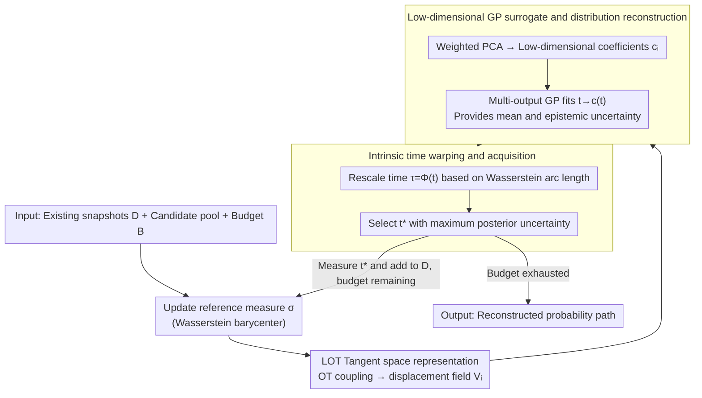

# Active Timepoint Selection for Learning Measure-Valued Trajectories

**Conference**: ICML 2026  
**arXiv**: [2605.30625](https://arxiv.org/abs/2605.30625)  
**Code**: https://github.com/nicolashuynh/active_wass  
**Area**: Time Series / Measure-Valued Trajectory Learning  
**Keywords**: Active Sampling, Wasserstein Trajectory, Linearized Optimal Transport, Gaussian Process, Single-cell Time Series  

## TL;DR
This paper investigates "when a distribution snapshot is most valuable to sample." It uses Linearized Optimal Transport (LOT) to linearize measure trajectories in Wasserstein space and employs a multi-output Gaussian Process (GP) with time warping to provide epistemic uncertainty, enabling the active selection of timepoints that best reduce trajectory reconstruction error.

## Background & Motivation
**Background**: In scenarios such as single-cell transcriptomics, fluid dynamics, and macroeconomics, the research object is often not a single vector time series but a probability distribution path evolving over time. Practical observations typically consist of empirical measures at several discrete timepoints, and the task is to recover a continuous measure-valued trajectory from sparse snapshots.

**Limitations of Prior Work**: High-quality snapshot sampling is expensive, and single-cell experiments often involve destructive sampling, preventing dense observation along the time axis. Traditional active learning mostly assumes outputs are in Euclidean space, where GP posterior variance can directly drive sampling decisions. However, probability measures reside in Wasserstein space; linear averaging leads to mass splitting, and modeling density vectors with standard GPs violates transport geometry.

**Key Challenge**: Active sampling requires knowing "where the uncertainty lies," while existing Wasserstein interpolation or flow methods mostly provide a deterministic trajectory, lacking usable epistemic uncertainty. Simultaneously, processes like biological differentiation are strongly non-stationary: they change slowly for most of the time but undergo rapid branching in small windows. Uniform sampling easily misses these critical moments.

**Goal**: Select the most informative timepoints under a fixed observation budget to minimize the Wasserstein error of the recovered probability path, specifically covering regions of rapid change and transient branching.

**Key Insight**: The authors use Linearized Optimal Transport to map each measure snapshot to the tangent space of a reference measure. In this linear space, PCA and GPs are applied. This preserves a first-order approximation of the Wasserstein geometry while leveraging the GP posterior covariance to obtain the uncertainty required for active sampling.

**Core Idea**: Project measure trajectories into the LOT tangent space, then build a warped GP on low-dimensional latent coefficients, using posterior variance to select the next measurement time.

## Method

### Overall Architecture
The problem addressed is: given a limited measurement budget and expensive snapshots, decide at which timepoint to sample the next distribution snapshot to minimize the reconstruction error of the final probability path. The difficulty lies in the fact that the outputs are probability measures in Wasserstein space rather than Euclidean vectors, making the posterior variance of standard active learning unusable. The proposed solution involves mapping each measure snapshot to the tangent space of a reference measure via LOT, transforming measure regression into a low-dimensional vector regression suitable for GPs. In each round, the reference measure is updated, the probability surrogate is reconstructed, and the next measurement time is selected using the GP uncertainty until the budget is exhausted.

The input consists of an existing snapshot set $\mathcal{D}=\{(t_i,\hat{\mu}_{t_i})\}_{i=1}^N$, a candidate time pool $\mathcal{T}_{pool}$, and a remaining budget $B$. In each iteration, the algorithm updates the reference measure $\sigma$, maps each snapshot $\hat{\mu}_{t_i}$ to the tangent space $T_\sigma\mathcal{P}_2(\mathcal{X})$ via OT coupling to obtain the displacement matrix $\mathbf{V}_i$. Subsequently, weighted PCA compresses it into low-dimensional coefficients $\mathbf{c}_i$, forming the GP training set $\{(t_i,\mathbf{c}_i)\}$. Finally, a multi-output GP with intrinsic time warping is fitted—rescaling time based on Wasserstein arc length to adapt to non-stationary changes—and $t^*$ is selected based on posterior uncertainty to perform the real measurement and be added to the dataset.

### Key Designs

**1. LOT Tangent Space Representation: Transforming non-Euclidean measure outputs into regressible vectors**

Active sampling requires an output representation that allows for regression and uncertainty estimation. However, probability measures live in Wasserstein space; applying GPs directly to density vectors "averages" mass into incorrect positions, violating transport geometry. Using the reference measure $\sigma$ as an anchor, the authors compute the OT coupling from $\sigma$ to the target snapshot $\hat{\mu}_{t_i}$ and obtain an approximate transport map via barycentric projection, representing the snapshot in the tangent space as a displacement field $\mathbf{V}_i=\hat{\mathbf{Z}}_i-\mathbf{Z}_\sigma$. This represents "where the mass should be moved from the reference measure," providing a first-order linearization of the Wasserstein geometry that is more aligned with the problem structure than direct density modeling.

**2. Low-rank GP Surrogate and Distribution Reconstruction: Providing mean and epistemic uncertainty for continuous time**

Because displacement fields are high-dimensional and snapshots are sparse, building a GP directly on them is computationally expensive and unstable. The authors apply PCA to the weighted flatten displacements to extract principal directions of change, obtaining latent coefficients $\mathbf{c}_i$. A multi-output GP is then built on the mapping $t\mapsto\mathbf{c}(t)$. To predict the distribution at a certain time, latent coefficients are sampled or taken from the GP posterior mean, projected back to the displacement, and added to the reference landmarks to obtain the predicted measure. This path provides both a posterior mean for reconstruction and the epistemic uncertainty needed for active sampling through the GP posterior covariance.

**3. Intrinsic Time Warping and Acquisition: Prioritizing samples in high-velocity windows**

Processes like cell differentiation are highly non-stationary—changing slowly for long periods and branching rapidly in short windows. If a stationary kernel is assumed in physical time $t$, the model will underestimate uncertainty during rapid branching phases and miss critical moments. The authors estimate an intrinsic time $\tau=\Phi(t)$, where $\Phi(t)$ approximates the cumulative Wasserstein arc length (the sum of transport distances between adjacent snapshots), extended to candidate times via a monotonic cubic spline. The kernel is written as $\mathbf{K}(t,t')=\mathbf{K}_{base}(\Phi(t),\Phi(t'))$, such that rapidly changing regions are automatically "stretched," effectively narrowing the lengthscale. Active sampling mainly uses point-wise uncertainty $\alpha_{unc}(t;\mathcal{D})=\mathrm{Tr}(\mathbf{S}(\Phi(t)))$, selecting the timepoint with the largest posterior covariance trace to naturally allocate budget to high-velocity regions.

### Loss & Training
The method is not an end-to-end neural network training process but an iterative reconstruction of a probability surrogate. Core optimizations include OT coupling, calculating the Wasserstein barycenter, PCA, and maximizing the marginal log-likelihood for GP hyperparameters. In default experiments, the multi-output GP is simplified to independent GPs for each latent dimension using a Matérn 5/2 kernel. Candidate acquisition is computed over a fixed pool, selecting the timepoint with the maximum posterior uncertainty.

The computational complexity primarily stems from OT. With $N$ snapshots, an average of $n$ samples per snapshot, and $M$ landmarks for the reference measure, LOT embedding and time warping require approximately $O(N\cdot \mathcal{C}_{OT}(M,n))$ for OT solving. Under settings with low dimensions and few snapshots, the GP is typically not the bottleneck.

## Key Experimental Results

### Main Results
The paper is validated on synthetic branching trajectories, real single-cell fibroblast reprogramming data, and labor market data in the appendix. The synthetic sensitivity table clearly shows that active sampling outperforms uniform/random sampling more significantly as the rapid branching window shortens.

| Branching Window Length | vs Uniform: Rel. $W_2$ ↑ | vs Uniform: Rel. $w-W_2$ ↑ | vs Random: Rel. $W_2$ ↑ | vs Random: Rel. $w-W_2$ ↑ | Interpretation |
|--------------|-----------------------|--------------------------|-----------------------|--------------------------|------|
| 0.05 | 0.231 | 0.357 | 0.342 | 0.454 | Short branching is best for active sampling; velocity weighting yield max gain. |
| 0.10 | 0.189 | 0.277 | 0.397 | 0.464 | Maintains stable advantage as window widens. |
| 0.20 | -0.172 | 0.071 | 0.118 | 0.295 | Uniform sampling covers wide windows well, but active method still focuses better on high-velocity areas. |

In the real single-cell reprogramming experiment, the active strategy achieves the lowest reconstruction error at low-to-medium budgets, especially for $B\leq 12$. As the budget increases, uniform/random sampling begins to cover most transient phases, and the gap narrows.

### Ablation Study
The paper uses Figure 6 to ablate four designs of the surrogate/acquisition pipeline. The results are summarized by influence direction.

| Configuration | Key Metric | Description |
|------|---------|------|
| Full method | Lowest or near-lowest error on synthetic + fibroblast | LOT barycenter + sufficient PCA ranks + time warping + Matérn GP. |
| RBF kernel | Close to Full but not default | Shows the method does not strictly rely on one prior; kernels are replaceable. |
| Fixed reference $\sigma$ | Significantly higher error on synthetic | Failing to update the reference measure amplifies LOT linearization errors. |
| PCA rank $K=2$ | Most significant performance drop | Low-dimensional latents are insufficient to express complex transcriptomic variations. |
| No warp | Noticeable degradation in low-budget regions | Proves intrinsic time is useful for non-stationary dynamics. |

### Key Findings
- The advantage of the active strategy comes from "investing the budget in high-velocity regions" rather than simply taking more samples than uniform sampling. Synthetic visualizations show later acquisitions concentrated near the two branching windows.
- When events are highly localized, uniform sampling is most likely to miss them; when event windows are wide, the disadvantage of uniform sampling decreases, though the velocity-weighted error still shows the active method focuses more on periods with high dynamics.
- PCA rank is not a minor detail. The significant degradation with $K=2$ suggests that main changes in measure trajectories are not necessarily representable by a very small number of components.
- A fixed reference measure degrades LOT approximations, especially during large distribution shifts; dynamic updates to the Wasserstein barycenter are crucial.

## Highlights & Insights
- The paper adapts "uncertainty sampling" from active learning to Wasserstein space. The key is finding a computable uncertainty surrogate rather than doing Bayesian priors directly in the measure space.
- Intrinsic time warping is natural: physical time in biological processes does not correspond to the speed of geometric change. Rescaling time via transport distance is more aligned with the problem structure than tuning kernel lengthscales.
- The method has high practical value for expensive experimental designs. It is intended for scenarios where "every measurement is expensive, so one must ask where to measure next" rather than high-frequency real-time sampling.
- The combination of LOT + GP is more interpretable than end-to-end deep models: why a certain timepoint is selected can be explained by posterior variance and trajectory velocity.

## Limitations & Future Work
- Tangent space approximation is a core assumption. If the true trajectory moves far from the reference measure or contains large jump shifts, a single tangent chart may not suffice; the authors mention considering multi-chart/atlas-like methods.
- The OT sub-problem is the primary computational cost. This is acceptable in regimes where snapshots are expensive and sample sizes are around $10^5$, but million-scale point clouds require more scalable OT approximations.
- The current input variable is primarily 1D time. Many scientific experiments involve multi-dimensional covariates like dosage, perturbation type, and spatial location; future work needs to extend to multi-dimensional acquisition.
- Experiments primarily prove a reduction in reconstruction error; further connection to downstream scientific tasks like differentiation fate prediction or critical state discovery is possible.

## Related Work & Insights
- **vs Euclidean GP on densities**: Standard GPs on density vectors produce mass splitting; this work uses LOT displacement to preserve transport direction.
- **vs deterministic distribution interpolation / flow matching**: These methods fit a trajectory from fixed snapshots but lack epistemic uncertainty; the GP posterior in this work directly serves active acquisition.
- **vs single-cell timepoint selection methods**: Early methods mostly selected points on Euclidean gene-expression curves; this work handles empirical measures directly, which is better suited for changing distribution populations over time.
- **Insight**: For active learning in non-Euclidean output spaces, one can first find a local linearization or low-dimensional chart, and then build an interpretable uncertainty model on that chart.

## Rating
- Novelty: ⭐⭐⭐⭐⭐ Combines LOT, GP uncertainty, and active timepoint selection on measure-valued trajectories; both problem setting and method are novel.
- Experimental Thoroughness: ⭐⭐⭐⭐ Complete results for synthetic + real single-cell + appendix data, though some ablations are figures without tabular values.
- Writing Quality: ⭐⭐⭐⭐ Clear geometric motivation and complete algorithmic details; requires some OT/GP background.
- Value: ⭐⭐⭐⭐⭐ Highly insightful for expensive experimental design and Wasserstein trajectory modeling.

<!-- RELATED:START -->

## Related Papers

- [\[ICLR 2026\] Learning Flexible Forward Trajectories for Masked Molecular Diffusion](../../ICLR2026/computational_biology/learning_flexible_forward_trajectories_for_masked_molecular_diffusion.md)
- [\[ICML 2025\] Reliable Algorithm Selection for Machine Learning-Guided Design](../../ICML2025/computational_biology/reliable_algorithm_selection_for_machine_learning-guided_design.md)
- [\[ICML 2025\] Multivariate Conformal Selection](../../ICML2025/computational_biology/multivariate_conformal_selection.md)
- [\[NeurIPS 2025\] PROSPERO: Active Learning for Robust Protein Design Beyond Wild-Type Neighborhood](../../NeurIPS2025/computational_biology/prospero_active_learning_for_robust_protein_design_beyond_wild-type_neighborhood.md)
- [\[ICML 2025\] MF-LAL: Drug Compound Generation Using Multi-Fidelity Latent Space Active Learning](../../ICML2025/computational_biology/mf-lal_drug_compound_generation_using_multi-fidelity_latent_space_active_learnin.md)

<!-- RELATED:END -->
