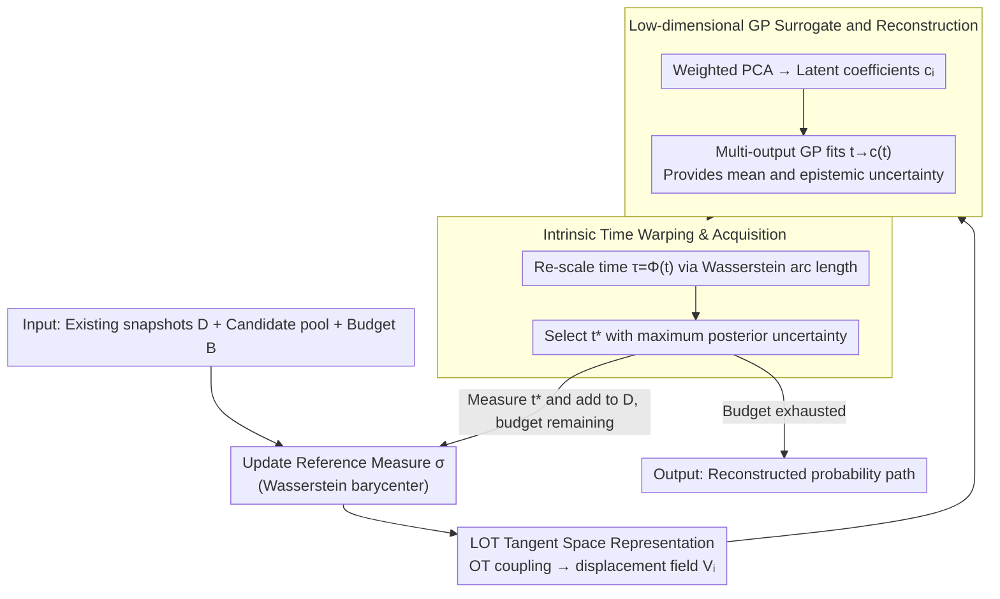

# Active Timepoint Selection for Learning Measure-Valued Trajectories

**Conference**: ICML 2026  
**arXiv**: [2605.30625](https://arxiv.org/abs/2605.30625)  
**Code**: https://github.com/nicolashuynh/active_wass  
**Area**: Time Series / Measure-Valued Trajectory Learning  
**Keywords**: Active Sampling, Wasserstein Trajectories, Linearized Optimal Transport, Gaussian Process, Single-cell Time Series  

## TL;DR
This paper investigates "when sampling a distribution snapshot is most valuable" by linearizing measure trajectories in Wasserstein space via Linearized Optimal Transport (LOT) and utilizing a multi-output GP with intrinsic time warping to provide epistemic uncertainty, thereby actively selecting timepoints that most effectively reduce trajectory reconstruction error.

## Background & Motivation
**Background**: In scenarios such as single-cell transcriptomics, fluid dynamics, and macroeconomics, the research object is often a path of probability distributions evolving over time rather than a single vector time series. Actual observations typically consist of empirical measures at several discrete timepoints, and the task is to recover a continuous measure-valued trajectory from these sparse snapshots.

**Limitations of Prior Work**: Acquiring high-quality snapshots is expensive, and single-cell experiments often involve destructive sampling, precluding dense observation along the time axis. Traditional active learning mostly assumes outputs in Euclidean space, where GP posterior variance can directly guide sampling decisions. However, probability measures reside in Wasserstein space; linear averaging leads to "mass splitting" artifacts, and modeling density vectors with standard GPs violates the underlying transport geometry.

**Key Challenge**: Active sampling requires quantifying "where the model is uncertain," yet existing Wasserstein interpolation or flow-based methods primarily yield a single deterministic trajectory, lacking usable epistemic uncertainty. Simultaneously, processes like biological differentiation are highly non-stationary: they remain stable for long periods but undergo rapid bifurcation in narrow windows, which uniform sampling easily misses.

**Goal**: Select the most informative timepoints under a fixed observation budget to achieve higher accuracy in recovered probability paths (measured by Wasserstein distance), particularly covering regions of rapid change and transient bifurcations.

**Key Insight**: The authors utilize Linearized Optimal Transport (LOT) to map each measure snapshot to the tangent space of a reference measure, performing PCA and GP within this linear space. This approach preserves a first-order approximation of the Wasserstein geometry while leveraging the GP posterior covariance to obtain the uncertainty necessary for active sampling.

**Core Idea**: Project the measure trajectory into the LOT tangent space, construct a warped GP on low-dimensional latent coefficients, and utilize posterior variance to select the next measurement timepoint.

## Method

### Overall Architecture
The method addresses the problem of deciding the next sampling timepoint to minimize the error of the reconstructed probability path, given a limited budget and expensive snapshots. Since the outputs are probability measures in Wasserstein space rather than Euclidean vectors, the difficulty lies in the fact that standard GP posterior variance cannot be directly applied. The authors map each measure snapshot to the tangent space of a reference measure via LOT, transforming measure regression into a low-dimensional vector regression suitable for GPs. In each iteration, the reference measure is updated, the probability surrogate is reconstructed, and the GP uncertainty is used to select the next timepoint until the budget is exhausted.

The input consists of the existing snapshot set $\mathcal{D}=\{(t_i,\hat{\mu}_{t_i})\}_{i=1}^N$, a candidate time pool $\mathcal{T}_{pool}$, and the remaining budget $B$. In each round, the algorithm updates the reference measure $\sigma$, maps each snapshot $\hat{\mu}_{t_i}$ to the tangent space $T_\sigma\mathcal{P}_2(\mathcal{X})$ via OT coupling to obtain the displacement matrix $\mathbf{V}_i$. It then uses weighted PCA to compress this into low-dimensional coefficients $\mathbf{c}_i$, forming the GP training set $\{(t_i,\mathbf{c}_i)\}$. Finally, a multi-output GP with intrinsic time warping (re-scaling time by Wasserstein arc length to accommodate non-stationarity) is fitted to the mapping from time to coefficients. The timepoint $t^*$ with the highest posterior uncertainty is selected for the next measurement.

### Key Designs

**1. LOT Tangent Space Representation: Transforming non-Euclidean measures into regressible vectors**

Active sampling requires an output representation that supports regression and uncertainty estimation. Because probability measures inhabit Wasserstein space, direct GP on density vectors results in quality "averaging" at incorrect locations, violating transport geometry. Using a reference measure $\sigma$ as an anchor, the authors compute the OT coupling from $\sigma$ to each target snapshot $\hat{\mu}_{t_i}$. Using barycentric projection, the snapshot is represented in the tangent space as a displacement field $\mathbf{V}_i=\hat{\mathbf{Z}}_i-\mathbf{Z}_\sigma$. This represents "how to move mass starting from the reference measure," providing a first-order linearization of Wasserstein geometry that aligns more closely with the problem structure than direct density modeling.

**2. Low-dimensional GP Surrogate and Distribution Reconstruction: Providing continuous-time mean and epistemic uncertainty**

Displacement fields are high-dimensional and snapshots are sparse, making direct GP modeling computationally expensive and unstable. The authors apply weighted PCA to the flattened displacement fields to extract principal directions, obtaining latent coefficients $\mathbf{c}_i$, and then model the mapping $t\mapsto\mathbf{c}(t)$ via a multi-output GP. To predict a distribution at any time, a latent coefficient is sampled or taken from the GP posterior mean and projected back to a displacement field, which is added to the reference landmarks to yield the predicted measure. This path provides both a posterior mean for reconstruction and a GP posterior covariance for epistemic uncertainty required for active sampling.

**3. Intrinsic Time Warping and Acquisition: Preferentially monitoring high-velocity windows**

Processes like biological differentiation are highly non-stationary—stable for long periods but bifurcating rapidly in transition windows. If a stationary kernel is assumed in physical time $t$, the model under-estimates uncertainty during rapid bifurcation phases. The authors instead estimate intrinsic time $\tau=\Phi(t)$, where $\Phi(t)$ approximates the cumulative Wasserstein arc length (accumulated transport distance between adjacent snapshots), extended to candidate times via monotonic cubic splines. The kernel is defined as $\mathbf{K}(t,t')=\mathbf{K}_{base}(\Phi(t),\Phi(t'))$, effectively "stretching" regions of fast change and shortening the effective lengthscale. Acquisition typically utilizes point-wise uncertainty $\alpha_{unc}(t;\mathcal{D})=\mathrm{Tr}(\mathbf{S}(\Phi(t)))$, selecting timepoints with the maximum posterior covariance trace to naturally direct the budget toward high-velocity regions.

### Loss & Training
The method is not an end-to-end neural network; instead, it reconstructs a probability surrogate in each round. Core optimizations include OT coupling, Wasserstein barycenters, PCA, and maximization of the GP marginal log-likelihood for hyperparameters. In default experiments, the multi-output GP is simplified to independent GPs for each latent dimension using a Matérn 5/2 kernel. Candidate acquisition is calculated over a fixed pool to select the timepoint with maximal uncertainty.

The algorithmic complexity is dominated by OT. For $N$ snapshots with $n$ samples each and a reference measure with $M$ landmarks, LOT embedding and time warping require approximately $O(N\cdot \mathcal{C}_{OT}(M,n))$. GP computation is typically not a bottleneck in the low-dimensional, low-snapshot regime.

## Key Experimental Results

### Main Results
The method is validated on synthetic branching trajectories, real-world fibroblast reprogramming single-cell data, and labor market data. Quantitative results in the synthetic sensitivity study demonstrate that active sampling achieves the most significant advantages over uniform/random sampling when bifurcation windows are short.

| Bifurcation Window Length | vs Uniform: Rel. W2 ↑ | vs Uniform: Rel. w-W2 ↑ | vs Random: Rel. W2 ↑ | vs Random: Rel. w-W2 ↑ | Interpretation |
| :--- | :--- | :--- | :--- | :--- | :--- |
| 0.05 | 0.231 | 0.357 | 0.342 | 0.454 | Short bifurcations benefit most from active sampling with velocity weighting. |
| 0.10 | 0.189 | 0.277 | 0.397 | 0.464 | Stable advantage is maintained as the window widens. |
| 0.20 | -0.172 | 0.071 | 0.118 | 0.295 | Uniform sampling covers wider windows well, but active sampling still prioritizes high-velocity regions. |

In real single-cell reprogramming experiments, the active strategy yields the lowest reconstruction error at low to medium budgets (especially $B\leq 12$). As the budget increases, uniform and random sampling eventually cover most transient phases, narrowing the performance gap.

### Ablation Study
The authors perform ablations on four components of the surrogate/acquisition pipeline. Based on the performance trends:

| Configuration | Key Metrics | Description |
| :--- | :--- | :--- |
| Full method | Lowest reconstruction error | LOT barycenter + sufficient PCA rank + time warping + Matérn GP. |
| RBF kernel | Close to Full method | Indicates the method is not strictly dependent on a single prior; kernels are replaceable. |
| Fixed reference $\sigma$ | Significant error increase | Not updating the reference measure amplifies LOT linearization errors. |
| PCA rank $K=2$ | Most significant degradation | Low-dimensional latent space cannot capture complex transcriptomic variations. |
| No warp | Degradation at low budgets | Proves intrinsic time is critical for non-stationary dynamics. |

### Key Findings
- The advantage of active strategies stems from "allocating budget to high-velocity regions" rather than simply taking more samples. Visualizations show that later acquisitions concentrate around the two bifurcation windows.
- When events are highly localized, uniform sampling is most likely to miss them; as the event window widens, the relative disadvantage of uniform sampling decreases, though the active method remains superior in velocity-weighted error.
- PCA dimension is not a minor detail. Significant degradation at $K=2$ suggests that primary changes in measure trajectories cannot always be expressed by a very small number of components.
- Maintaining a fixed reference measure degrades LOT approximations, especially under large distribution drifts; dynamically updating the Wasserstein barycenter is essential.

## Highlights & Insights
- The paper successfully adapts "uncertainty sampling" from active learning to Wasserstein space by finding a computable uncertainty surrogate rather than attempting hard Bayesian priors directly in measure space.
- Intrinsic time warping is a natural fit: biological processes do not evolve at a constant speed relative to physical time. Re-scaling time via transport distance aligns with the underlying problem structure better than simply tuning kernel lengthscales.
- The method offers substantial practical value for expensive experimental design where the primary goal is to determine where to measure next under a strict budget.
- The combination of LOT and GPs remains more interpretable than end-to-end deep models, as choices for specific timepoints can be explained via posterior variance and trajectory velocity.

## Limitations & Future Work
- The tangent space approximation is a core assumption. If the real trajectory deviates significantly from the reference measure or contains large distribution jumps, a single tangent chart may be insufficient; the authors suggest multi-chart or atlas-like approaches for future work.
- OT subproblems constitute the primary computational cost. While acceptable for expensive experiments with sample sizes around $10^5$, million-scale point clouds would require more scalable OT approximations.
- Current inputs are limited to 1D time. Many scientific experiments involve multi-dimensional covariates like dosage, perturbation type, and spatial location, necessitating extensions to multi-dimensional acquisition.
- Experiments focus on reconstruction error; future work could connect directly to downstream scientific tasks such as differentiation fate prediction or critical state discovery.

## Related Work & Insights
- **vs Euclidean GP on densities**: Standard GP regression on density vectors causes mass splitting; this work uses LOT displacement to preserve transport direction.
- **vs Deterministic distribution interpolation/Flow Matching**: While those methods fit a trajectory from fixed snapshots, they lack epistemic uncertainty; the GP posterior in this work serves the purpose of active acquisition.
- **vs Single-cell timepoint selection methods**: Early methods often selected points on Euclidean gene-expression curves; this work handles empirical measures directly, fitting population distribution shifts better.
- **Insight**: For active learning in non-Euclidean output spaces, one should first identify a local linearization or low-dimensional chart, then build interpretable uncertainty models on that chart.

## Rating
- Novelty: ⭐⭐⭐⭐⭐ Combines LOT, GP uncertainty, and active selection for measure-valued trajectories; both the problem setting and the approach are novel.
- Experimental Thoroughness: ⭐⭐⭐⭐ Synthetic + real single-cell + appendix data are comprehensive, though some ablations are limited to graphical trends without raw tabular values.
- Writing Quality: ⭐⭐⭐⭐ Clear geometric motivation and complete algorithmic details, though it requires a background in OT and GPs.
- Value: ⭐⭐⭐⭐⭐ Highly insightful for expensive experimental design and Wasserstein trajectory modeling.

<!-- RELATED:START -->

## Related Papers

- [\[ICML 2025\] Reliable Algorithm Selection for Machine Learning-Guided Design](../../ICML2025/computational_biology/reliable_algorithm_selection_for_machine_learning-guided_design.md)
- [\[ICLR 2026\] Controllable Sequence Editing for Biological and Clinical Trajectories](../../ICLR2026/computational_biology/controllable_sequence_editing_for_biological_and_clinical_trajectories.md)
- [\[NeurIPS 2025\] PROSPERO: Active Learning for Robust Protein Design Beyond Wild-Type Neighborhood](../../NeurIPS2025/computational_biology/prospero_active_learning_for_robust_protein_design_beyond_wild-type_neighborhood.md)
- [\[ICML 2025\] Multivariate Conformal Selection](../../ICML2025/computational_biology/multivariate_conformal_selection.md)
- [\[ICML 2025\] MF-LAL: Drug Compound Generation Using Multi-Fidelity Latent Space Active Learning](../../ICML2025/computational_biology/mf-lal_drug_compound_generation_using_multi-fidelity_latent_space_active_learnin.md)

<!-- RELATED:END -->
