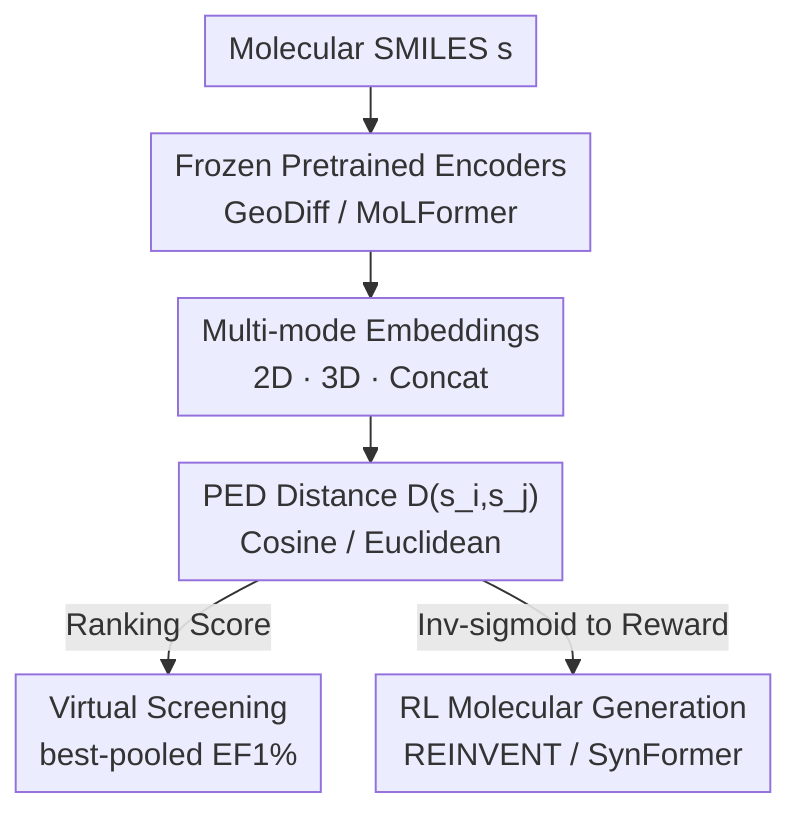

# Advancing Ligand-based Virtual Screening and Molecular Generation with Pretrained Molecular Embedding Distance

**Conference**: ICML 2026  
**arXiv**: [2604.24474](https://arxiv.org/abs/2604.24474)  
**Code**: To be confirmed  
**Area**: Computational Biology / Drug Discovery  
**Keywords**: Ligand Virtual Screening, Molecular Generation, Pretrained Molecular Embeddings, Molecular Similarity, RL Rewards

## TL;DR
This paper proposes utilizing **frozen pretrained molecular models** (GeoDiff, MoLFormer) to calculate the distance between embeddings (PED) as a measure of molecular similarity without any specialized similarity training. This approach serves both for candidate ranking in virtual screening and as a reward signal for molecular generation; it correlates strongly with industrial-standard 3D similarity (ROCS/ROSHAMBO2), outperforms traditional metrics in EF1% on the LIT-PCBA benchmark, and accelerates generation sampling by up to 3.3×.

## Background & Motivation
**Background**: Ligand similarity is the core computational engine of ligand-based drug discovery—the principle that "structurally or pharmacophorically similar molecules are likely to bind to the same pocket and produce similar biological activities." It acts as the primary ranking heuristic for **virtual screening** (selecting candidates from massive libraries based on similarity to known active templates) and as a reward source for **RL-based molecular generation** (driving the generator to explore bioactively relevant chemical spaces).

**Limitations of Prior Work**: Traditional metrics struggle with the dilemma between speed and accuracy. Hand-crafted descriptors and 2D fingerprints (e.g., ECFP4/Tanimoto) are rigid, low-dimensional, and fail to capture complex biological mechanisms. 3D shape and pharmacophore alignment (ROCS, ROSHAMBO2), while the industrial gold standard, require expensive conformer generation and spatial alignment, making them difficult to scale to large libraries. Recent deep learning-based similarity methods mostly **depend on specialized similarity supervision or expensive data construction**—supervised methods are limited by small, sparse, target-specific datasets, while contrastive learning relies on "pre-defined similarity tools" to generate paired data, essentially remaining tethered to old metrics with poor generalization.

**Key Challenge**: The need for a similarity function that is simultaneously fast, accurate, and universal. Currently, "accuracy" equals expensive 3D alignment, "speed" equals crude 2D fingerprints, and "learning a model" requires either labels or samples generated by old metrics.

**Key Insight**: The embedding space of pretrained molecular models (which have learned broad chemical knowledge from massive unlabeled molecular datasets) may **inherently encode structural and pharmacophoric information**. Previously, such models were primarily used for finetuning on downstream tasks like QSAR/ADMET; **the direct use of their embedding distance as a similarity function has rarely been systematically studied**. The authors hypothesize that frozen embedding distances, without finetuning or similarity supervision, can match or even exceed the performance of expensive 3D alignment.

**Core Idea**: Propose **PED (Pretrained Embedding Distance)**—freeze pretrained molecular encoders, map two molecules into vectors, and calculate their distance as a similarity measure. With zero specialized training, it serves as the ranking score for virtual screening and the reward for molecular generation.

## Method

### Overall Architecture
The PED framework is inherently minimalist: given a **frozen** pretrained molecular encoder $f(\cdot)$, a molecule (SMILES string $s$) is mapped to an embedding $\mathbf{z}=f(s)\in\mathbb{R}^d$. The similarity between two molecules is represented by the distance metric between their embeddings:

$$D(s_i,s_j)=\mathrm{dist}\big(f(s_i),f(s_j)\big)$$

where $\mathrm{dist}$ denotes either cosine distance or Euclidean distance. The paper instantiates PED using two **architecturally distinct** pretrained models and categorizes representation sources into three modes: 2D, 3D, and Concat. This "universal similarity ruler" is then integrated into two downstream pipelines: virtual screening (as a ranking score) and molecular generation (as a reward).

### Key Designs

**1. Instantiating PED with Two Heterogeneous Models and Multi-mode Embeddings (2D/3D/Concat)**

To verify that embedding distance can capture structural and spatial information, the authors deliberately select two frozen models with **different origins**. **GeoDiff** is a diffusion-based conformer generation model trained via a denoising objective $\mathcal{L}_{\text{GeoDiff}}=\sum_{t}\gamma_t\mathbb{E}\|\epsilon-\hat\epsilon_\theta(\mathcal{C}_t,t)\|^2$. It features dual encoders: a 2D GIN for topology and a 3D equivariant SchNet for spatial structure. This naturally provides three types of embeddings: 2D (GIN), 3D (SchNet), and Concat (linked $\ell_2$-normalized vectors), all atom-mean-pooled into fixed-length vectors. **MoLFormer** is a Transformer trained on 1.1 billion SMILES via masked language modeling, producing global embeddings via mean-pooling of token-level outputs for a purely sequential (2D characteristic) representation. Using both 3D geometry and SMILES sequences demonstrates the universality of "embedding-as-similarity."

**2. Best-pooled EF1% Ranking in Virtual Screening**

When using PED as a ranking score, given reference ligands and a candidate library, embeddings are calculated for all molecules and ranked in **ascending** order of PED (smaller distance implies higher similarity). Performance is measured by the 1% Enrichment Factor on the LIT-PCBA benchmark:

$$\mathrm{EF}1\%=\frac{N_{\text{actives}}^{1\%}}{N^{1\%}}\Big/\frac{N_{\text{actives}}}{N_{total}}$$

To handle targets with **multiple** reference ligands, the paper adopts a **best-pooled** strategy: for each candidate $s_i$, the minimum distance to all references is taken: $D_{\text{pool}}(s_i)=\min_j D(s_i,s_r^{(j)})$. This grants each candidate the "best chance to match any known active," closely mimicking real-world multi-reference screening scenarios.

**3. Converting PED to Generation Rewards: Inverse Sigmoid Bounding + Preference for Euclidean Distance**

Molecular generation is an iterative optimization loop centered on a reference template. In each step, the generator samples candidates, similarity/distance scores serve as rewards, and the model is updated to push the distribution toward the chemical space of the reference compound. To integrate PED, the "distance" must be converted into a bounded "closer-is-higher" reward. An **inverse sigmoid function** maps PED to $[0,1]$. A critical design choice is made here: compared to cosine distance, the **raw Euclidean distance is unbounded with a larger dynamic range**, providing more informative reward signals; thus, Euclidean PED is prioritized for generation. The final scoring function combines the PED score with a penalty term for undesirable substructures with **equal weight**, balancing similarity optimization and chemical validity. This reward is validated in two frameworks: **REINVENT** (SMILES-based RL using augmented likelihood) and **SynFormer** (synthesizable generation using a REINFORCE variant).

### Loss & Training
PED **requires no training**—the encoders remain frozen throughout, without any specialized similarity supervision or finetuning. Only the downstream generators are trained: REINVENT and SynFormer undergo RL fine-tuning (via augmented likelihood or REINFORCE) based on their respective pretrained priors to shift the generation distribution toward the reference molecule.

## Key Experimental Results

### Main Results
**(a) Correlation between PED and Traditional 3D Similarity** (200k molecules from AmpC, uniformly sampled across ROCS 3D combo bins; negative correlation indicates high alignment as low distance = high similarity):

| PED Mode | Aligned ROCS Metric | Pearson r |
|--------|------|------|
| GeoDiff 2D | color (pharmacophore) | −0.60 |
| GeoDiff 3D | shape (geometry) | −0.60 |
| GeoDiff Concat | combination | −0.67 |
| MoLFormer | combination | −0.63 |

GeoDiff 3D is more stable across all ROCS metrics than its 2D counterpart; MoLFormer correlates more strongly with color than shape (−0.64 vs −0.48), consistent with the 2D nature of SMILES.

**(b) LIT-PCBA Virtual Screening** (15 targets, Cosine PED, cross-reference boxplot):

| Method | Avg. mean EF1% | Avg. best-pooled EF1% |
|------|------|------|
| MoLFormer Cosine PED | **4.53 ± 2.79** | **6.15** |
| 2D ECFP4 Similarity | 3.94 ± 2.43 | 4.83 |

Among 8 targets deemed "3D shape-friendly" (ROCS EF1%>2), PED achieved >2 on 7 targets. Across the remaining 7 non-friendly targets, 6 also achieved >2, indicating PED's utility beyond purely 3D-sensitive cases.

### Ablation Study (Generation: Scaffold Diversity / Predicted pIC50, Ref: BTK Inhibitor BMS-986195)

| Framework / Reward | Top-5000 Unique Scaffold Ratio | Predicted pIC50 (Scaffold-balanced Top-500) |
|------|------|------|
| REINVENT / ROSHAMBO2 | 7.94% | 7.40 ± 0.69 (Baseline) |
| REINVENT / GeoDiff 3D | **35.16%** | 8.83 ± 1.29 (Δ=0.71) |
| REINVENT / MoLFormer | 12.84% | **10.27 ± 1.34 (Δ=0.92)** |
| SynFormer / GeoDiff 2D | **46.36%** | 8.81 ± 0.87 (Δ=0.61) |
| SynFormer / MoLFormer | 5.04% | 8.31 ± 0.74 (Δ=0.39) |

### Key Findings
- **Efficiency is the Primary Selling Point**: In generation sampling, GeoDiff achieved a 1.5× speedup and MoLFormer a 3.3× speedup (REINVENT), with approximately 2× speedup in SynFormer, primarily by bypassing expensive conformer generation and spatial alignment.
- **No Universal Optimal Mode**: MoLFormer performed best in virtual screening. In generation, REINVENT benefited most from MoLFormer and GeoDiff 3D (highest pIC50/Δ), while SynFormer preferred GeoDiff 2D. The optimal PED mode is framework-dependent.
- **Diversity vs. Drug-likeness Trade-off**: GeoDiff 2D/Concat in SynFormer yielded high scaffold diversity, but molecules often fell outside ideal MW/TPSA/LogP/QED ranges. REINVENT maintained more stable drug-likeness due to integrated substructure filtering.
- Using Boltz-2 for BTK binding prediction, PED-guided molecules showed higher predicted pIC50 than ROSHAMBO2 in most cases, supporting biological relevance.

## Highlights & Insights
- **The perspective of "repurposing pretrained embeddings as a similarity ruler" is efficient**: While pretrained molecular models usually require finetuning, this work proves that frozen embedding **distances** are directly usable as high-quality similarity metrics—requiring zero labels, zero similarity supervision, and serving dual roles in screening and generation.
- **Implicit Spatial Knowledge in Diffusion Models**: It is remarkable that the internal embeddings of GeoDiff—trained for conformer generation—correlate strongly with ROCS shape (r=−0.60). This suggests that geometric generative models inherently learn transferable spatial similarity without explicit alignment.
- The use of an inverse sigmoid to map unbounded distances to bounded rewards, specifically choosing Euclidean distance for its broader dynamic range, is a practical trick transferable to other distance-to-reward RL scenarios.

## Limitations & Future Work
- **Lack of Wet-lab Validation**: Assessments of biological activity and safety rely entirely on Boltz-2 predicted pIC50. The authors acknowledge that therapeutic potential remains unconfirmed without experimental assays.
- **Single-target Case Study**: Generation experiments were limited to a single reference compound (BTK inhibitor BMS-986195); the universality of these conclusions requires verification across more targets.
- **Absence of a Unified Optimal Configuration**: The choice of model, mode, and distance metric varies by task and framework, lacking a robust "one-size-fits-all" default.
- In SynFormer's building-block-based generation, high diversity modes often lead to physicochemical property violations, highlighting a conflict between diversity and drug-likeness.

## Related Work & Insights
- **vs. DrugCLIP / S-MolSearch (Contrastive Similarity)**: These methods are **explicitly trained for similarity learning** (aligning protein pockets or using affinity signals for soft labels), requiring specialized supervision. PED utilizes frozen pretrained models **not specific to similarity**, extracting distance directly with zero specialized training.
- **vs. ROCS / ROSHAMBO2 (3D Alignment Standards)**: Traditional alignment is accurate but computationally prohibitive for large-scale screening due to conformer generation and spatial optimization. PED implicitly absorbs "alignment" into the embeddings, offering up to 3.3× speedup while occasionally exceeding EF1% performance.
- **vs. Native Rewards in REINVENT/SynFormer**: This work does not alter the generative frameworks but replaces the similarity component of the reward function with PED, proving that a "faster ruler" can yield superior potential binding affinity and distinct diversity profiles.

## Rating
- Novelty: ⭐⭐⭐⭐ The perspective of using frozen embeddings as a universal similarity ruler is clear, though the PED mechanism itself is simple, positioning this as a solid systematic study.
- Experimental Thoroughness: ⭐⭐⭐⭐ Covers correlation, screening, and generation across multiple models, though generation is limited to a single-target case study without wet-lab data.
- Writing Quality: ⭐⭐⭐⭐ The speed/accuracy trade-off motivation is well-articulated, and figures are clearly organized.
- Value: ⭐⭐⭐⭐ Plug-and-play utility, up to 3.3× speedup, and zero labeling requirements make it highly practical for large-scale drug discovery engineering.

<!-- RELATED:START -->

## Related Papers

- [\[AAAI 2026\] S2Drug: Bridging Protein Sequence and 3D Structure in Contrastive Representation Learning for Virtual Screening](../../AAAI2026/computational_biology/s2drug_bridging_protein_sequence_and_3d_structure_in_contrastive_representation_.md)
- [\[NeurIPS 2025\] AANet: Virtual Screening under Structural Uncertainty via Alignment and Aggregation](../../NeurIPS2025/computational_biology/aanet_virtual_screening_under_structural_uncertainty_via_alignment_and_aggregati.md)
- [\[ICLR 2026\] Unified Biomolecular Trajectory Generation via Pretrained Variational Bridge](../../ICLR2026/computational_biology/unified_biomolecular_trajectory_generation_via_pretrained_variational_bridge.md)
- [\[ICML 2026\] Constrained Flow Optimization via Sequential Fine-Tuning for Molecular Design](constrained_flow_optimization_via_sequential_fine_tuning_for_molecular_design.md)
- [\[ICML 2026\] Learning the Neighborhood: Contrast-Free Multimodal Self-Supervised Molecular Graph Pretraining](learning_the_neighborhood_contrast-free_multimodal_self-supervised_molecular_gra.md)

<!-- RELATED:END -->
