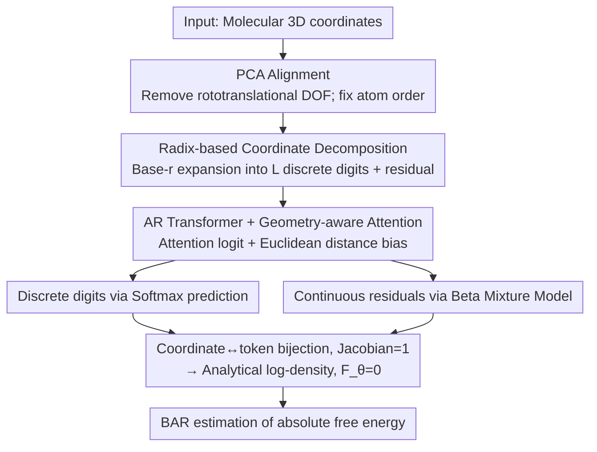

# CARD: Coarse-to-fine Autoregressive Modeling with Radix-based Decomposition for Transferable Free Energy Estimation

**Conference**: ICML 2026  
**arXiv**: [2605.02657](https://arxiv.org/abs/2605.02657)  
**Code**: Publicly available after publication  
**Area**: AI for Science / Molecular Modeling / Autoregressive Generation  
**Keywords**: Free Energy Estimation, Autoregressive Transformer, Radix decomposition, Zero-free-energy proposal, BAR

## TL;DR
CARD utilizes "radix $r$ decomposition" to bijectively map molecular 3D coordinates into coarse-to-fine sequences of discrete-continuous mixed tokens. This enables a cross-system general autoregressive Transformer to act as a "zero-free-energy proposal" for directly estimating the absolute free energy of arbitrary molecular systems via BAR. It achieves the accuracy of classical MFES on 70 new solvation systems while being approximately 40x faster during inference.

## Background & Motivation
**Background**: The free energy difference $\Delta F = -\beta^{-1} \log Z_b / Z_a$ is a core quantity in drug discovery for predicting binding affinity and solvation free energy. Classical approaches like Free Energy Perturbation (FEP) combined with alchemical intermediates and BAR/MBAR estimation are widely used but require massive MD simulations, leading to extremely high computational costs.

**Limitations of Prior Work**: (1) Classical methods require intensive sampling of alchemical intermediate states to ensure distribution overlap, taking hours to days for a single system. (2) Data-driven deep methods (e.g., protein-ligand affinity regression) generalize poorly and often fail on out-of-distribution systems. (3) "Zero-free-energy proposal" methods like DeepBAR utilize normalizing flows, but their expressivity is restricted by invertibility constraints, and the input dimensionality is fixed to specific systems, requiring retraining from scratch for each new molecule.

**Key Challenge**: An ideal proposal model should simultaneously satisfy: (a) analytical probability density, enabling the definition $F_\theta = 0$; (b) high expressivity comparable to diffusion or autoregressive models; and (c) cross-system generalization. These three properties are mutually exclusive in existing frameworks (normalizing flows satisfy a but not b/c; diffusion satisfies b but not a; standard AR satisfies a/b but not c).

**Goal**: (1) Construct a generative model capable of precise log-density calculation and cross-system generalization; (2) Use it as a zero-free-energy proposal to estimate the absolute free energy of arbitrary systems via BAR in a single step, bypassing alchemical intermediates; (3) Verify its performance in zero-shot/few-shot settings across multiple real-world tasks (solvation, endstate correction, and tautomerization).

**Key Insight**: Drawing from the success of LLMs ("autoregressive + Transformer + massive pre-training $\to$ cross-task generalization"), the authors convert 3D coordinates into token sequences to enable Transformer-based cross-molecule modeling. However, simply unrolling coordinates leads to a "chicken-and-egg" problem where local details and global geometry are interdependent. To address this, radix decomposition is proposed to implement a coarse-to-fine ordering.

**Core Idea**: Each coordinate is expanded into $L$ discrete digits plus one continuous residual using base $r$. The model autoregressively generates tokens in the order of "highest bits of all atoms $\to$ second highest bits $\to$ ... $\to$ lowest bits $\to$ continuous residuals," determining global structure before filling in details.

## Method

### Overall Architecture
CARD addresses the challenge of employing a cross-system general generative model with analytical log-density as a free energy proposal. The core mechanism involves mapping molecular 3D coordinates into the domain of an autoregressive Transformer. First, PCA is used to remove rototranslational degrees of freedom and establish a stable generation sequence for atoms. Then, each coordinate is expanded via radix $r$ into a "coarse-to-fine" sequence of discrete digits and a continuous residual token. Finally, an encoder-decoder Transformer predicts these tokens sequentially. The attention mechanism incorporates Euclidean distance biases (geometry-aware attention) from reference structures. Discrete bits are modeled via softmax, and continuous residuals are modeled via a Beta Mixture Model. Since the coordinate-to-token transformation is a strict bijection, the log-likelihood of the sequence corresponds exactly to the log-density of the molecular conformation. Thus, the model naturally satisfies $F_\theta = 0$, allowing the absolute free energy to be estimated in one pass using BAR.

### Key Designs

**1. Radix-based coordinate decomposition: Continuous coordinates into coarse-to-fine reversible token sequences**

Generating continuous coordinates atom-by-atom in a standard AR model leads to a paradox where the precise position of atom $i$ depends on atom $j$, which hasn't been generated yet. CARD solves this via a coarse-to-fine strategy: all coordinate components are scaled to $[0, 1)$ and expanded in base-$r$ as $\hat{x}_{ij} = (0.\hat{x}_{ij}^1 \hat{x}_{ij}^2 \cdots \hat{x}_{ij}^L \cdots)_r$. The first $L$ levels yield discrete digits $\hat{x}_i^k \in \{0,...,r-1\}^3$, effectively locating each atom within an $r^3$ sub-cube at level $k$. Level $L+1$ provides the continuous residual $y_i \in [0, a/r^L)^3$. The generation order is structured as "all atoms' highest bits $\to$ all atoms' second highest bits $\to$ ... $\to$ all atoms' residuals," resulting in a mixed sequence $s = (\hat{x}_1^1, ..., \hat{x}_N^1, \hat{x}_1^2, ..., \hat{x}_N^L, y_1, ..., y_N)$ of length $N(L+1)$. This allows all atoms to establish a global spatial layout before refining details simultaneously. Crucially, the transformation is a strict bijection with a Jacobian of 1, ensuring $\log q_\theta(x|c) = \sum_{i=1}^{N(L+1)} \log q_\theta(s_i | c, s_{:i})$, satisfying the analytical likelihood requirement for zero-free-energy proposals.

**2. Geometry-aware attention: Direct observation of Euclidean distances**

Unlike text, molecular positions are physical coordinates. CARD feeds both "previously generated coarse coordinates" and a "reference structure distance matrix" into each Transformer block. The query uses coordinates of the same atom from the previous level $q_i = (\text{LN}(h_i + \varphi_1(x'_{i-N}))) W_1$, offset by one level to prevent leakage of the current step's information. Keys and values utilize the most recent coordinates $x'_j$. A reference structure distance bias $\frac{1}{R}\sum_k \varphi_d^h(d_{ij}^{(k)})$ is added to the attention logit, where $d_{ij}^{(k)}$ is the distance between atoms $i$ and $j$ in $R$ reference structures. This allows the attention mechanism to directly perceive physical priors—such as strong correlations between nearby atoms and irrelevance of distant ones—significantly easing the geometric modeling task.

**3. Beta mixture model for continuous residuals: Precise likelihood on bounded intervals**

The final continuous tokens $y_i \in [0, a/r^L)^3$ require a distribution that is both bounded and allows for precise log-density calculation. Gaussian distributions are invalid due to support outside $[0,1)$, while categorical distributions lose precision. CARD scales $y_i$ to $[0,1)$ and uses a mixture of $K$ Beta components: $\text{BMM}(x; \Theta) = \sum_{k=1}^K \pi_k \text{Beta}(x; \alpha_k, \beta_k)$. The three coordinate components are modeled via the chain rule $y_{i1} \to y_{i2} \to y_{i3}$. Since Beta distributions are naturally defined on the closed interval $[0,1]$, they perfectly preserve the bounded residual range from radix decomposition while providing closed-form likelihoods.

### Loss & Training
Training consists of two stages. Stage I is pure NLL: $\mathcal{L}_{\text{NLL}} = -\frac{1}{BN}\sum_b \log q_\theta(x^{(b)}|c)$, allowing the model to learn valid conformational generation. Stage II introduces a joint optimization with energy alignment: $\mathcal{L}_{\text{energy}} = \frac{1}{B}\sum_b |\tilde{U}_\theta^{(b)} - \tilde{U}^{(b)}|$ (mean-centered), using real force field energies to correct biases caused by non-uniform or incomplete MD sampling. During inference, BAR estimates the free energy difference between the proposal $q_\theta$ and the target Boltzmann distribution; since $F_\theta = 0$, this difference directly yields the target system's absolute free energy.

## Key Experimental Results

### Main Results
Generalization is verified across three complementary tasks:

| Task | Dataset | Metric | CARD | Baseline |
|------|---------|--------|------|---------|
| Vacuum$\to$Toluene Solvation | ZINC20 70 testmol | MAE (kcal/mol) | <1, $R^2 > 0.9$ | MFES (ref) |
| Vacuum$\to$Water Solvation | ZINC20 70 testmol | MAE (kcal/mol) | <1, $R^2 > 0.9$ | MFES (ref) |
| MM$\to$NNP Endstate Correction | HiPen 18 mol | MAE (kcal/mol) | **0.90** | MFES (ref) |
| Aqueous Tautomerization | 27 tautomer pairs | MAE↓ | **4.11** | DFT 4.62 / sPhysNet 4.61 |
| Aqueous Tautomerization | 27 tautomer pairs | PCC↑ | **0.64** | DFT 0.36 / sPhysNet 0.35 |

### Ablation Study
Ablation on radix $r$, depth $L$, and training stages for the Vacuum$\to$Toluene task:

| Configuration | MAE↓ | RMSE↓ | $R^2$↑ | Pct(<1)↑ |
|------|------|-------|--------|----------|
| **$r=4, L=3$, Stage I+II (full)** | **0.71** | **1.27** | **0.92** | **82.9** |
| $r=4, L=3$, Stage I only | 0.81 | 1.34 | 0.91 | 77.1 |
| $r=3, L=3$, Stage I only | 2.43 | 3.08 | 0.61 | 26.5 |
| $r=5, L=3$, Stage I only | 1.88 | 2.41 | 0.73 | 22.1 |
| $r=4, L=2$, Stage I only | 5.85 | 14.26 | -0.08 | 17.1 |
| $r=4, L=4$, Stage I only | 1.43 | 2.39 | 0.77 | 61.4 |

### Key Findings
- **40x acceleration + cross-system generalization is a dual breakthrough**: On 70 unseen molecules, CARD inference takes $\sim$770s per system vs. $\sim$32,300s for MFES, while maintaining accuracy—a feat impossible for existing deep methods that require per-system training.
- **$L=2$ leads to collapse** ($R^2 = -0.08$): This indicates that coarse-to-fine must have sufficient layers to stabilize coarse structures; too shallow results in a failure to model coordinates.
- **$L=4$ shows slight degradation**: With too many layers, discriminating between $r^3$ classes at higher levels becomes difficult, making it harder for the model to capture effective signals; $L=3$ is optimal.
- **Optimal $r=4$**: Small $r$ (3) forces the BMM to model excessively wide residuals, exceeding expressivity; large $r$ (5) causes exponential expansion of the discrete space. $r^3=64$ classes sit in the "sweet spot" for softmax.
- **Stage II Alignment is significant**: It reduces MAE from 0.81 to 0.71, showing that MD sampling biases require correction using force field labels.
- **CARD outperforms DFT (B3LYP/6-31G*) on tautomers**: DFT approximates free energy using a single minimum-energy conformation, which fails for flexible molecules; CARD performs true Boltzmann averaging.

## Highlights & Insights
- **Radix Decomposition** acts as an elegant bridge, transforming continuous high-dimensional molecular generation into a coarse-to-fine mixed token AR problem. This allows the reuse of mature Transformer toolchains (KV cache, scaling, transfer) while maintaining tractable likelihoods.
- **"Zero-free-energy proposal" + BAR** is the core paradigm. While DeepBAR introduced the idea, it was limited by the expressivity of normalizing flows. CARD upgrades both theory and engineering by unlocking expressivity through AR + BMM.
- **Dual query/key in geometry-aware attention** (query using previous level coordinates to prevent leakage, key/value using latest coordinates) is a technique transferable to any task involving step-by-step geometric generation, such as autoregressive protein folding or 3D mesh generation.
- **Stability across chemical environments** (vacuum, toluene, water, NNP, tautomers) shows "true generalization," a rarity in AI for Chemistry, effectively bringing the "one model for multiple tasks" paradigm to the molecular domain.
- The methodology (radix-based coarse-to-fine + tractable AR) is extendable to protein all-atom modeling, crystal structure generation, and 3D point cloud generation.

## Limitations & Future Work
- **PCA instability for symmetric molecules**: The authors acknowledge that near-symmetric principal axes can cause alignment flips, introducing variance. Robust equivariant features (e.g., E(3)-equivariant networks) are needed as replacements.
- **Scale constraints**: The dataset primarily consists of drug-like small molecules (ZINC20, atoms < 50). Generalization to protein-ligand complexes with thousands of atoms remains unverified.
- **Inference complexity**: Sequence length scales as $N(L+1)$, and vanilla Transformer complexity is quadratic in $N$. FlashAttention or Linear Attention would be required for systems with thousands of atoms.
- **Sampling bias in MD trajectories**: Biases in training data may propagate to the model. Stage II energy alignment mitigates this but does not eliminate it. Future directions include E(3) equivariant CARD, using NNPs for finer labels, and expansion to protein-ligand docking.

## Related Work & Insights
- **vs DeepBAR (NeurIPS21)**: Shared "zero-free-energy proposal" logic, but CARD uses AR Transformers to overcome expressivity limits and enable cross-system generalization.
- **vs neural TI / FEAT**: Those methods use diffusion to learn time-varying Hamiltonians for thermodynamic integration (alchemical paradigm); CARD uses BAR to skip intermediate states entirely.
- **vs Boltzmann Generators (Noé 2019, Tan 2025)**: Those focus on equilibrium sampling; most fail to provide precise log-densities or cross-system transfer. CARD achieves both.
- **vs MGVAE / MGT / Sequoia (Multi-resolution modeling)**: Those operate at the graph level; CARD operates at the atomic coordinate level while maintaining exact AR factorization.
- **vs LLM BPE tokenization**: Radix decomposition is effectively "BPE for 3D coordinates," suggesting that other continuous physical quantities (parameters, lattices) can be tokenized for Transformer processing.

## Rating
- Novelty: ⭐⭐⭐⭐⭐ Strictly unifies LLM AR paradigms with zero-free-energy proposals; radix decomposition is an original 3D-to-token bridge.
- Experimental Thoroughness: ⭐⭐⭐⭐ Three complementary tasks, detailed ablations, and speed comparisons are provided, though protein-scale validation is missing.
- Writing Quality: ⭐⭐⭐⭐⭐ Rigorous derivations (bijection, Jacobian=1, log-density decomposition) and clear engineering details.
- Value: ⭐⭐⭐⭐⭐ Reducing free energy calculation from hours to seconds across systems with high precision represents transformative value for drug discovery pipelines.

<!-- RELATED:START -->

## Related Papers

- [\[ICML 2026\] Protein Autoregressive Modeling via Multiscale Structure Generation](protein_autoregressive_modeling_via_multiscale_structure_generation.md)
- [\[NeurIPS 2025\] Energy Matching: Unifying Flow Matching and Energy-Based Models for Generative Modeling](../../NeurIPS2025/computational_biology/energy_matching_unifying_flow_matching_and_energy-based_models_for_generative_mo.md)
- [\[ICML 2026\] Learning Protein Structure-Function Relationships through Knowledge-guided Representation Decomposition](learning_protein_structure-function_relationships_through_knowledge-guided_repre.md)
- [\[CVPR 2026\] Stronger Normalization-Free Transformers](../../CVPR2026/computational_biology/stronger_normalization-free_transformers.md)
- [\[ICML 2026\] Constrained Flow Optimization via Sequential Fine-Tuning for Molecular Design](constrained_flow_optimization_via_sequential_fine_tuning_for_molecular_design.md)

<!-- RELATED:END -->
