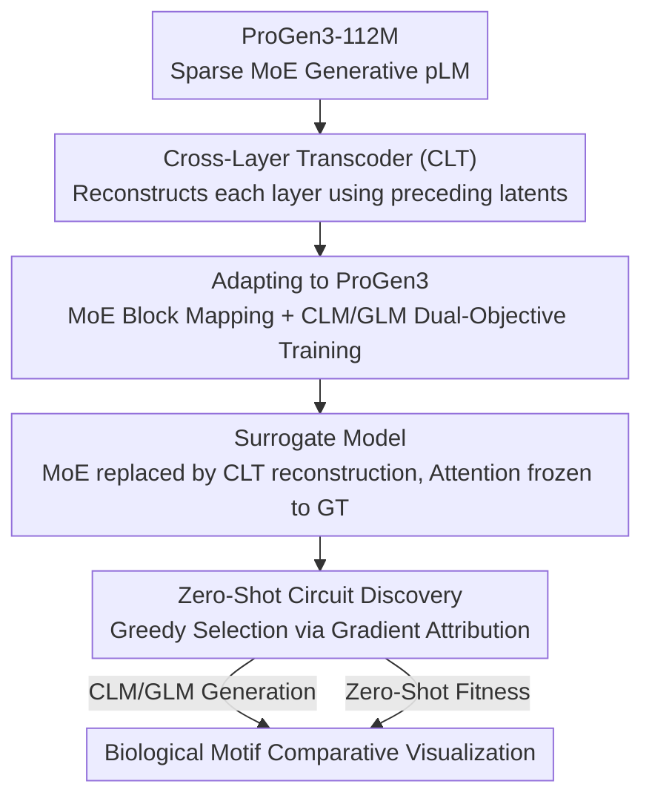

# Circuit Tracing in Autoregressive Protein Language Models

**Conference**: ICML 2026  
**arXiv**: [2606.16044](https://arxiv.org/abs/2606.16044)  
**Code**: https://github.com/amirgroup-codes/ProGenMech (Visualizer: https://protmech.github.io/)  
**Area**: Computational Biology / Mechanistic Interpretability / Protein Language Models  
**Keywords**: Cross-Layer Transcoder, Circuit Discovery, ProGen3, Sparse MoE, Biological Motifs

## TL;DR
ProGenMech introduces "Cross-Layer Transcoders (CLT)" to the **autoregressive** protein language model ProGen3. Using a zero-shot circuit discovery algorithm, it identifies sparse latent circuits (less than 2%) that faithfully replicate generative probability distributions and zero-shot fitness scores while mapping to biologically conserved motifs such as the HRD/DFG motifs in kinases.

## Background & Motivation
**Background**: Protein language models (pLMs) have achieved SOTA performance in structure prediction, fitness estimation, and protein design. Generative pLMs can even create novel protein sequences not found in nature. However, how these models encode biological functions, combine structural constraints across layers, and coordinate step-by-step generation remains a "black box."

**Limitations of Prior Work**: Existing mechanistic interpretability tools are inadequate for two reasons: (1) Sparse Autoencoders (SAEs) decompose single-layer activations into features but fail to capture **cross-layer computation**. (2) Per-layer transcoders (PLTs) approximate individual MLPs but fail to capture **contextual accumulation along depth**. Crucially, the only prior work using CLT on pLMs (ProtoMech) studied ESM2—a **masked representation model**—which does not perform generation and thus cannot reveal circuits associated with generative capabilities.

**Key Challenge**: To explain "generation," one requires a surrogate model that faithfully replicates autoregressive generative computation while maintaining cross-layer connectivity. However, ProGen3, a generative SOTA model, employs a sparse MoE architecture and dual CLM/GLM objectives, making standard CLT direct applications impossible.

**Goal**: Adapt CLT to ProGen3 to (1) faithfully approximate its computation in both causal generation and span-filling modes; (2) identify minimal sparse circuits responsible for generation and fitness prediction; and (3) verify that these circuits correspond to real biological motifs.

**Key Insight**: Utilize a "Cross-Layer Transcoder surrogate + zero-shot (unsupervised probe) circuit discovery" to decompose generative protein model internal computations into interpretable, traceable, sparse latent circuits.

## Method

### Overall Architecture
ProGenMech uses ProGen3-112M ($L=10$ layers, $d_{\text{model}}=384$) as the subject. First, a CLT is trained as a **surrogate model**. At each layer, the CLT uses sparse latents from all preceding layers to reconstruct the output of that layer's MoE, effectively replacing MoE computation with a sparse, interpretable latent space. After training, a zero-shot circuit discovery algorithm is applied for specific tasks (CLM generation, GLM filling, or zero-shot fitness scoring), greedily selecting the minimal subset of latents that replicates the task behavior. Finally, these latents are mapped to specific amino acids and conserved biological motifs for visualization.

### Key Designs

**1. Cross-Layer Transcoder (CLT): Capturing cross-layer accumulation via all preceding sparse latents**

Designed to address the limitation that PLTs treat layers independently. The CLT assigns an encoder to each layer that maps the residual stream input $\mathbf{x}^{\ell}$ to sparse latents $\mathbf{a}^{\ell}=\text{TopK}(\mathbf{W}_{\text{enc}}^{\ell}(\mathbf{x}^{\ell}-\mathbf{b}_{\text{pre}}^{\ell})+\mathbf{b}^{\ell}_{\text{enc}})$. The TopK operator enforces sparsity by keeping only the $k$ largest latents. The key lies in decoding: the output of layer $\ell$ is reconstructed using latents from **all preceding layers** $1, \dots, \ell$:

$$\hat{\mathbf{y}}^{\ell}=\sum_{\ell^{\prime}=1}^{\ell}\mathbf{W}_{\text{dec}}^{\ell^{\prime}\rightarrow\ell}\mathbf{a}^{\ell^{\prime}}+\mathbf{b}_{\text{pre}}^{\ell}$$

Because each reconstruction depends on all previous layers, the CLT preserves inter-layer pathways of contextual accumulation. Training utilizes an MSE reconstruction loss $\mathcal{L}_{\text{MSE}}=\sum_{\ell}\|\mathbf{y}^{\ell}-\hat{\mathbf{y}}^{\ell}\|_2^2$ and an auxiliary loss $\mathcal{L}_{\text{aux}}$ that uses top-$k_{\text{aux}}$ latents to reconstruct the residual $\mathbf{e}^{\ell}=\mathbf{y}^{\ell}-\hat{\mathbf{y}}^{\ell}$ to reduce "dead" latents. The final objective is $\mathcal{L}_{\text{CLT}}=\mathcal{L}_{\text{MSE}}+\alpha\mathcal{L}_{\text{aux}}$. Note that the number of decoding matrices grows at $\mathcal{O}(L^2)$.

**2. Adapting to ProGen3: MoE-as-a-mapping and Dual CLM/GLM training**

Standard CLTs target MLP layers, whereas ProGen3 uses sparse MoE. Ours treats the **entire MoE block as a single functional mapping**, where $\mathbf{x}^{\ell}$ is the MoE input and $\mathbf{y}^{\ell}$ is the aggregated output of all experts. To match ProGen3’s dual-task nature, the CLT is trained on a 2:1 CLM:GLM ratio. Masked spans are sampled from a mixture of five Gaussians $\mathcal{N}(10,5), \dots, \mathcal{N}(400,100)$, ensuring the CLT captures various masking states.

**3. Zero-Shot Circuit Discovery: Minimal latents via KL divergence attribution**

Unlike ProtoMech which relies on supervised probes, ProGenMech adopts a zero-shot approach targeting the internal probability distribution. A **surrogate model** is fixed where MoE outputs are replaced by CLT reconstructions $\hat{\mathbf{y}}^L$, while **attention head outputs are locked to the ground truth ProGen3 values** to prevent error accumulation. A greedy search calculates an attribution score for each latent (its contribution to reducing the KL divergence between original and surrogate logits). Latents are added incrementally until the KL divergence is $\leq 1.2\times$ the full CLT baseline (generation) or recovers 70% of the Spearman correlation (fitness).

**4. Mechanism: Visualizing computational graphs via virtual edges**

To interpret latent circuits, nodes represent interpretable latents and edges represent "virtual influence." For a given input, the top 5 nodes by attribution are selected per layer. Edge weights $A_{s\rightarrow t}=a_s w_{s\rightarrow t}$ are defined as the source activation $a_s$ multiplied by the Jacobian of the target pre-activation with respect to the source. Latent activations are cross-referenced with Swiss-Prot sequences to detect conserved motifs and projected onto protein structures to check proximity to functional sites.

### Example: Tracing the Generation Circuit of Kinase HRD Motif
In the kinase protein (UniProt P83104), CLM-mode generation of the HRD motif (residues 133–135) reveals hierarchical processing: early layers recognize basic biochemical patterns (e.g., L1/3183 and L2/1754 activate on Arginine); middle layers (L5/1090) identify the conserved catalytic loop; late layers (L7/2070, L8/897) narrow the context to the HRD motif and coordinate its interaction with the ATP-binding site.

## Key Experimental Results

### Main Results
Evaluation was performed on Swiss-Prot (generation) and ProteinGym (fitness scoring).

| Task | Metric | ProGen3 (Orig) | ProGenMech (CLT) | PLT Baseline |
|------|------|------|------|------|
| CLM Generation (Full) | NLL ↓ | 2.00±0.62 | 2.50±0.42 (~60% recov.) | 2.57±0.36 |
| CLM Generation (Circuit)| NLL ↓ | 2.00±0.62 | 2.54±0.39 (58% recov., <2% latents) | 2.59±0.36 |
| Zero-shot Fitness (Full) | Spearman ↑ | 0.29±0.15 | 0.28±0.12 (~95% recov.) | 0.25±0.12 |
| Zero-shot Fitness (Circuit)| Spearman ↑| 0.29±0.15 | 0.23±0.13 (80% recov., 0.6% latents) | 0.22±0.12 |

### Key Findings
- **Extreme Circuit Sparsity**: Circuits for CLM generation (<2%) and fitness scoring (0.6%) recover most model behaviors, indicating that ProGen3's core computation is highly compressible.
- **Generation-Scoring Mismatch**: Attempts to steer generation toward high-function sequences using fitness circuits failed, suggesting that at the 112M scale, the model's "scoring" and "generative" capabilities are decoupled.

## Highlights & Insights
- **Interpretability for Generative pLMs**: This work extends mechanistic interpretability beyond masked representation models to autoregressive generation and span-filling.
- **Label-Free Circuit Discovery**: Using KL divergence of internal distributions as an attribution target eliminates the need for supervised probes, making it transferable to any generative domain.
- **Biologically Grounded Circuits**: Circuits identify HRD/DFG motifs and fitness-relevant sites, providing biologically plausible explanations for model behavior.

## Limitations & Future Work
- **Model Scale**: The 112M model has weak GLM and steering capabilities; findings may change with larger (219M/339M) variants.
- **MoE Simplification**: Treating MoE as a single mapping ignores internal routing; future work should explore expert-specific latents or crosscoders.
- **Manual Interpretation**: Contextualizing circuits still requires manual comparison with biological annotations; automated annotation pipelines are needed.
- **Parameter Overhead**: CLT decoding matrices scale at $\mathcal{O}(L^2)$, increasing training costs for very deep models.

## Related Work & Insights
- **vs. SAE**: SAEs lack cross-layer connectivity; CLT explicitly models inter-layer pathways.
- **vs. PLT**: PLTs lack contextual accumulation; CLT provides significantly lower NLL in CLM tasks.
- **vs. ProtoMech**: ProtoMech is restricted to ESM2 (masked); Ours covers generative ProGen3 and uses zero-shot discovery.

## Rating
- Novelty: ⭐⭐⭐⭐⭐ 
- Experimental Thoroughness: ⭐⭐⭐⭐ 
- Writing Quality: ⭐⭐⭐⭐ 
- Value: ⭐⭐⭐⭐ 

<!-- RELATED:START -->

## Related Papers

- [\[ICML 2026\] Protein Circuit Tracing via Cross-layer Transcoders](protein_circuit_tracing_via_cross-layer_transcoders.md)
- [\[ICML 2026\] SIGMA: Structure-Invariant Generative Molecular Alignment for Chemical Language Models via Autoregressive Contrastive Learning](sigma_structure-invariant_generative_molecular_alignment_for_chemical_language_m.md)
- [\[ICML 2026\] Viral Proteins Reveal Geometry of Protein Language Models](viral_proteins_reveal_geometry_of_protein_language_models.md)
- [\[ICML 2026\] Protein Autoregressive Modeling via Multiscale Structure Generation](protein_autoregressive_modeling_via_multiscale_structure_generation.md)
- [\[ICML 2026\] Protein Language Model Embeddings Improve Generalization of Implicit Transfer Operators](protein_language_model_embeddings_improve_generalization_of_implicit_transfer_op.md)

<!-- RELATED:END -->
