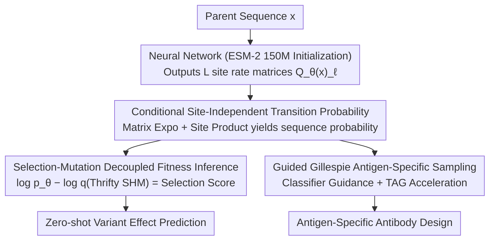

# CoSiNE: Conditional Site-Independent Neural Evolution Model for Antibody Sequences

**Conference**: ICML2026  
**arXiv**: [2602.18982](https://arxiv.org/abs/2602.18982)  
**Code**: https://github.com/thematrixmaster/cosine  
**Area**: Scientific Computing/Computational Biology  
**Keywords**: Antibody Evolution, Continuous-Time Markov Chain, Affinity Maturation, Variant Effect Prediction, Classifier-Guided Sampling  

## TL;DR

CoSiNE models the antibody affinity maturation process using a neural-parameterized conditional site-independent Continuous-Time Markov Chain (CTMC). It captures inter-site epistatic effects while maintaining tractability and enables antigen-specific antibody optimization via Guided Gillespie sampling, outperforming existing language and evolutionary models in zero-shot variant effect prediction.

## Background & Motivation

**Background**: Deep learning methods in antibody engineering are primarily divided into two categories: Protein Language Models (e.g., ESM-2, AbLang-2) learn the marginal distribution $p(x)$ of sequences and capture complex inter-site epistasis but treat sequences as i.i.d. samples, completely ignoring evolutionary temporal dynamics; classic phylogenetic models (e.g., WAG, LG) explicitly model the evolutionary process but assume site independence, failing to capture epistatic interactions.

**Limitations of Prior Work**: The performance of language models stems partly from memorizing conserved germline residues rather than truly understanding the affinity maturation process. The site-independence assumption in classic evolutionary models is necessitated because matrix exponential calculations in the full state space $|\mathcal{A}|^L = 20^L$ are intractable ($O(|\mathcal{S}|^3)$ complexity). Reducing complexity to $O(L|\mathcal{A}|^3)$ via site independence loses epistatic information.

**Key Challenge**: The trade-off between expressivity and computational feasibility—CTMC in the full sequence space captures all epistasis but is computationally impossible, while site-independent models are feasible but lack expressivity, and language models possess expressivity but lack evolutionary temporal modeling.

**Goal**: To design a unified framework that maintains the computational efficiency of site-independent models while capturing epistasis through sequence-context conditioning and explicitly modeling continuous-time evolutionary dynamics.

**Key Insight**: The authors observe that if the rate matrix $Q_\ell$ for each site is made dependent on the full parent sequence $x$ (rather than just the site itself), inter-site dependencies can be implicitly encoded through a neural network while maintaining factorized transition probabilities. Mathematically, this constitutes a first-order approximation of the sequential point mutation process in the full sequence space, with errors growing quadratically with branch length—an ideal fit for antibody affinity maturation, which consists mostly of short branches.

**Core Idea**: Use a neural network to output site-specific rate matrices conditioned on the full sequence, implementing a "conditional site-independent" CTMC that fuses the temporal dynamics of evolutionary modeling with the epistasis-capturing capabilities of language models.

## Method

### Overall Architecture

The input to CoSiNE is a parent antibody sequence $x$, and a neural network (initialized with ESM-2 150M) outputs $L$ site-specific rate matrices $Q_\theta(x)_\ell \in \mathbb{R}^{|\mathcal{A}| \times |\mathcal{A}|}$. Given evolutionary time $t$, transition probabilities for each site are computed via matrix exponentials, and their product yields the full sequence transition probability. The model is trained on approximately 2 million evolutionary transitions (parent-child pairs) extracted from about 120,000 clonal trees. These **conditional site-independent transition probabilities** serve as the common foundation for two downstream tasks: one for **selection-mutation decoupled fitness inference**, using log-likelihood ratios to strip SHM bias for zero-shot variant effect scores; the other for **Guided Gillespie antigen-specific sampling**, which biases generation toward high-affinity directions during inference to design antibodies targeting specific antigens.

### Key Designs

**1. Conditional Site-Independent Transition Probabilities: Capturing Epistasis under Factorized Feasibility**

Traditional site-independent models (WAG/LG) share a single rate matrix $Q$ across all sites. Although transition probabilities factorize, they discard all epistatic information. CoSiNE makes the rate matrix $Q_\theta(x)_\ell$ for each site dependent on the **complete parent sequence** $x$. The transition probability remains factorized as $p_\theta(y|x,t) = \prod_{\ell=1}^{L} \exp(t Q_\theta(x)_\ell)_{x_\ell, y_\ell}$, requiring matrix exponentials only for small $|\mathcal{A}| \times |\mathcal{A}|$ matrices, thus maintaining $O(L|\mathcal{A}|^3)$ complexity. The key lies in conditioning: the neural network observes the entire sequence before outputting $Q_\ell$, effectively encoding epistatic dependencies into the rates themselves. Theoretically, when $(Q_\theta(x)_\ell)_{x_\ell, y_\ell} = \mathbf{Q}_{x,y}$, this factorized model is exactly a first-order approximation of the full-sequence sequential point mutation process, with an $L_1$ error upper bound of $(\lambda t)^2$ (where $\lambda$ is the max exit rate). Shorter branches lead to more accurate approximations, and since antibody affinity maturation is dominated by short branches, this approximation is nearly lossless in practice.

**2. Selection-Mutation Decoupled Fitness Inference: Stripping SHM Bias to Extract Pure Selection Signals**

A problem with using language model perplexity to evaluate fitness is that scores are confounded by the conservation of germline residues—the model remembers which sites are common rather than which mutations actually improve affinity. CoSiNE utilizes a mutation-selection framework to decompose observed transition rates as $Q_{xy} = k \mu_{xy} P_{\text{fix}}(x \to y)$, where $\mu_{xy}$ is the neutral somatic hypermutation (SHM) rate and $P_{\text{fix}}$ is the true selection term. Accordingly, the zero-shot selection score for a variant is defined as the difference between the CoSiNE log-likelihood and a pre-trained SHM model (Thrifty) log-likelihood: $\text{Score}(x \to y) = \log p_\theta(y|x,t) - \log q(y|x,t) \approx \log P_{\text{fix}}(x \to y) + C$. This subtraction cancels out the SHM bias, leaving only the natural selection signal. Unlike DASM, which requires manual truncation of selection scores to maintain probabilistic validity, this log-likelihood ratio naturally produces valid scores without heuristic constraints.

**3. Guided Gillespie Antigen-Specific Sampling: Generating Targeted Antibodies with Antigen-Free Models**

As CoSiNE is trained without antigen information, it cannot natively produce antibodies for specific targets. The authors adapt classifier guidance theory from discrete diffusion models, defining the guided rate matrix as $(\mathbf{Q}_z^{(\gamma)})_{x,y} = [p(z|y)/p(z|x)]^\gamma \mathbf{Q}_{x,y}$. By approximating $p(z|y)$ with a binding affinity predictor under a normality assumption, each step of the Gillespie sampling can be biased toward high-affinity directions. A naive approach would require calling the predictor for every candidate amino acid at every site ($L \times (|\mathcal{A}|-1)$ times) at each step, which is prohibitively expensive. Taylor Approximation Guidance (TAG) reduces this to a single gradient calculation per step, yielding a $500 \times$ speedup, while an adaptive threshold $r_0 = \mu_{\theta_z}(x)$ prevents guidance weights from vanishing. Notably, unlike discrete diffusion or flow matching, CTMC has no boundary time constraints, allowing the use of a standard sequence-property predictor without retraining on noisy data.

### Loss & Training

The model is initialized from an ESM-2 150M checkpoint, with the language modeling head replaced by a rate matrix output head using softplus activation. It is trained using the AdamW optimizer (learning rate $2.5 \times 10^{-4}$) with a polynomial decay schedule and BF16 mixed precision, converging in approximately one day on a single A100 GPU. Chain-break tokens are inserted between heavy and light chains to handle paired antibodies simultaneously.

## Key Experimental Results

### Main Results (Zero-shot Variant Effect Prediction)

Evaluated on 4 DMS datasets from the FLAb2 benchmark using Spearman correlation coefficient:

| Dataset | CoSiNE (Ours) | DASM | ESM2-150M | ProGen2-S | PRISM |
|:---|:---:|:---:|:---:|:---:|:---:|
| Koenig Expr (H) | **0.613** | 0.596 | 0.413 | 0.407 | 0.069 |
| Koenig Expr (L) | 0.508 | 0.474 | 0.485 | **0.513** | 0.129 |
| Adams Binding | **0.464** | 0.270 | -0.112 | -0.024 | 0.297 |
| Koenig Bind (H) | **0.456** | 0.415 | 0.112 | 0.098 | 0.005 |
| Koenig Bind (L) | **0.371** | 0.327 | 0.266 | 0.332 | 0.061 |

Ours achieves the best performance on 6 out of 7 datasets, notably taking a significant lead in cross-species scenarios (Adams mouse antibodies: 0.464 vs. Prev. SOTA 0.297).

### Ablation Study

| Ablation Configuration | Effect | Description |
|:---|:---|:---|
| No SHM correction (only $\log p_\theta$) | Correlation drops across all datasets | Decoupling mutation and selection is critical for VEP |
| Single-chain input only | Significant drop in some datasets | Inter-chain epistasis contributes to prediction |
| Training from scratch | Average $\Delta\rho = 0.041$ | The evolutionary training objective contributes most of the predictive power |
| Different branch lengths $t \in [0.1, 0.4]$ | $\Delta\rho \leq 0.045$ | Selection scores are robust to the choice of $t$ |
| CDR local optimization (5-mut budget) | $\Delta\text{Bind}_{\text{max}} = 0.395$ | Outperforms Genetic Algorithms and PoE methods within budget |
| Guided Gillespie ($\gamma=5$) | Overlap with real binders | Maintains structural quality (pLDDT) and humanness (OASis) |
| TAG vs. Exact Guidance | $500 \times$ speedup, no performance loss | First-order Taylor approximation is effective |

## Highlights & Insights

1.  **Elegant Fusion of Theory and Practice**: Proposition 4.1 provides a rigorous $O(t^2)$ error upper bound for the conditional site-independent model's approximation of full-sequence CTMC, which is especially applicable due to the biological short-branch nature of antibody evolution.
2.  **Bridging Discrete Diffusion and Classic Evolutionary Models**: The first adaptation of classifier guidance from discrete diffusion to the classic CTMC framework, where the predictor does not require retraining on noisy data because CTMC lacks boundary time constraints.
3.  **Categorical Jacobian analysis** reveals intra- and inter-chain CDR epistasis learned by CoSiNE, consistent with the biological structure of antibody-antigen binding pockets.

## Limitations & Future Work

1.  The error of the first-order approximation increases on long branches, limiting applicability to slowly evolving proteins.
2.  The current framework ignores insertions and deletions (indels) and can only process sequences of equal length—acceptable for antibodies but a bottleneck for general protein modeling.
3.  Guided Gillespie relies on the quality of the affinity predictor; high guidance strength ($\gamma \geq 10$) may exploit predictor uncertainty to generate over-optimized sequences.

## Related Work & Insights

*   **DASM** (Matsen 2025): Also decouples SHM and selection but requires manual truncation of scores; Ours maintains mathematical consistency via log-likelihood ratios.
*   **SiteRM** (Prillo 2024): Uses per-site independent rate matrices that perform well on ProteinGym but lacks context conditioning.
*   **PRISM** (Kim 2026): Predicts germline/mutation states via auxiliary heads but simplifies evolution to binary classification.
*   Insight: The conditional site-independent framework can be generalized to the evolutionary modeling and design of other protein families.

## Rating

*   Novelty: 9/10 — First model to fuse neural CTMC with classifier guidance for antibody evolution with solid theoretical grounding.
*   Experimental Thoroughness: 9/10 — Extensive validation across VEP, guided sampling, ablation, and cross-species generalization.
*   Writing Quality: 9/10 — Clear theoretical derivations and systematic experimental organization.
*   Value: 8/10 — Directly applicable to antibody engineering; framework is generalizable but currently focused on antibodies.

<!-- RELATED:START -->

## Related Papers

- [\[ICLR 2026\] Discovering heterogeneous synaptic plasticity rules via large-scale neural evolution](../../ICLR2026/computational_biology/discovering_heterogeneous_synaptic_plasticity_rules_via_large-scale_neural_evolu.md)
- [\[ICML 2026\] STRIDE: Post-Training LLMs to Reason and Refine Bio-Sequences via Edit Trajectories](stride_post-training_llms_to_reason_and_refine_bio-sequences_via_edit_trajectori.md)
- [\[CVPR 2026\] MMCP-GEN: A Modality-Extensible Diffusion Language Model for Conditional Protein Sequence Generation](../../CVPR2026/computational_biology/mmcp-gen_a_modality-extensible_diffusion_language_model_for_conditional_protein_.md)
- [\[ICML 2026\] Towards A Generative Protein Evolution Machine with DPLM-Evo](towards_a_generative_protein_evolution_machine_with_dplm-evo.md)
- [\[ICML 2026\] Flow Sampling: Learning to Sample from Unnormalized Densities via Denoising Conditional Processes](flow_sampling_learning_to_sample_from_unnormalized_densities_via_denoising_condi.md)

<!-- RELATED:END -->
