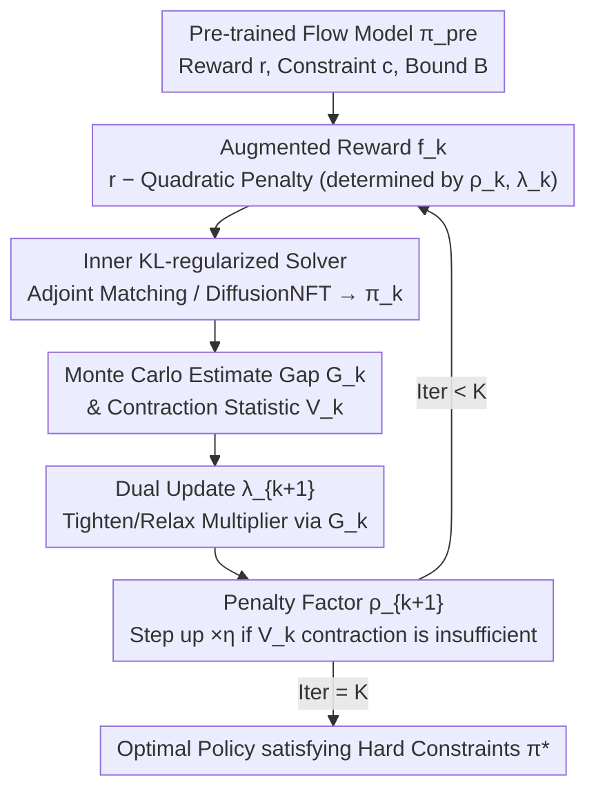

# Constrained Flow Optimization via Sequential Fine-Tuning for Molecular Design

**Conference**: ICML 2026  
**arXiv**: [2605.30610](https://arxiv.org/abs/2605.30610)  
**Code**: To be confirmed  
**Area**: Scientific Computing / Molecular Design / Generative Optimization  
**Keywords**: Flow Matching Fine-tuning, Augmented Lagrangian, Constrained Generative Optimization, Molecular Design, KL Regularization

## TL;DR
Addressing the scenario of "maximizing rewards (e.g., binding affinity, dipole moment) under hard domain constraints (e.g., synthetic accessibility, energy upper bounds)," this paper proposes the CFO algorithm. CFO decomposes constrained generative optimization into a sequence of standard KL-regularized fine-tuning subproblems using the Augmented Lagrangian method. By adaptively updating penalty factors $\rho_k$ and dual variables $\lambda_k$, CFO achieves provable convergence and significant Pareto improvements in reward-constraint trade-offs across low-dimensional toy tasks and FlowMol molecular design.

## Background & Motivation

**Background**: Diffusion and flow matching models have become the de facto standard generators for scientific discovery in molecules, proteins, and DNA. To utilize them for discovery, the industry standard is reward-driven fine-tuning of pre-trained models under KL regularization (e.g., Adjoint Matching, DiffusionNFT, Flow-GRPO) to maximize learnable rewards like binding affinity or QED.

**Limitations of Prior Work**: Numerous "hard" constraints in scientific discovery—synthetic accessibility, toxicity limits, xTB energy, and physical plausibility of docking poses—are either not encoded in pre-training data or only weakly learned. Current reward-driven fine-tuning methods, while using KL to anchor distribution drift, **cannot guarantee the satisfaction of hard constraints** (Uehara et al., 2024a). The naive approach of "treating constraints as weighted rewards" is highly unstable in practice: weights $\mu$ drift between tasks and training stages, requiring trial-and-error via enumeration. Furthermore, when exploration enters high-reward regions, the reward often "overpowers" the fixed $\mu$, resulting in "high-reward but illegal" molecules.

**Key Challenge**: A fundamental trade-off exists between reward maximization and constraint satisfaction. **Fixed-weight Lagrangians** cannot reliably characterize this trade-off—they neither guarantee feasibility (unless $\mu$ exceeds an unknown threshold) nor exhibit a monotonic mapping from $\mu$ to violation levels, and they lack the dynamics to "tighten" penalties during training.

**Goal**: (i) Establish a rigorous optimization formulation for constrained generative optimization (reward + KL regularization + expected constraints) and unify "constrained generation" with constant rewards; (ii) Design an algorithm that automatically and provably balances rewards and constraints while staying close to the pre-trained distribution.

**Key Insight**: The authors observe that classical constrained optimization already offers mature, hyperparameter-insensitive methods—specifically, the Augmented Lagrangian (AL). The core advantage of AL is that penalty factors $\rho_k$ and duals $\lambda_k$ adjust adaptively based on "constraint violations," eliminating the need for manual weight tuning. By applying AL to flow models, each iteration reduces to a standard KL-regularized fine-tuning subproblem with a "new augmented reward," which can be solved using existing solvers like Adjoint Matching or DiffusionNFT.

**Core Idea**: Convert constrained generative optimization into a sequence of standard fine-tuning subproblems with adaptive augmented rewards. Use AL dual updates to automatically tighten or relax penalties, avoiding manual $\mu$ tuning while providing provable feasibility and optimality.

## Method

### Overall Architecture

CFO addresses reward-driven fine-tuning under hard constraints: given a pre-trained flow model $\pi^{\text{pre}}$ (velocity field as the action), a scalar reward $r(x)$, a scalar constraint $c(x)$, and an upper bound $B$, find a new policy $\pi^{*}$ such that the terminal distribution $p_1^{\pi}$ satisfies:

$$\max_{\pi} \mathbb{E}_{x \sim p_1^{\pi}}[r(x)] - \alpha D_{KL}(p_1^{\pi}\,||\,p_1^{\text{pre}}) \quad \text{s.t.} \quad \mathbb{E}_{x \sim p_1^{\pi}}[c(x)] \le B$$

Setting $r \equiv 0$ unifies constrained generation into this framework. CFO maintains two dual variables: penalty factor $\rho_k$ and Lagrangian multiplier $\lambda_k$. The constrained problem is split into $K$ rounds of unconstrained subproblems. Each round follows three steps: first, construct the **augmented reward $f_k$** using dual variables and solve via an inner KL-regularized solver to obtain policy $\pi_k$; then, estimate the constraint gap using Monte Carlo on $\pi_k$ to perform the **dual update $\lambda_{k+1}$**; finally, check contraction statistics to decide whether to increase the **penalty factor $\rho_{k+1}$**.

### Key Designs

**1. Augmented Reward $f_k$: Embedding Constraints with Adaptive Weights**

Unlike the naive approach $r - \mu c$ with fixed $\mu$, CFO constructs the augmented reward $f_k(x) = r(x) - \frac{\rho_k}{2}\bigl[\max(0,\, c(x) - B - \frac{\lambda_k}{\rho_k})\bigr]^2$. This packages the "reward $-$ quadratic penalty" into a new signal for the KL-regularized tuner. The dual variables $\rho_k, \lambda_k$ determine both the strength and the activation point of the penalty. The shift term $\lambda_k/\rho_k \le 0$ moves the activation threshold to be more stringent, forcing the algorithm to act even before the violation exceeds $B$. The quadratic form is smoother than hard truncation, facilitating KKT satisfaction.

**2. Dual Update $\lambda_{k+1}$: Data-Driven Multiplier Adjustment**

Penalty weights are no longer manually tuned. In each round, the constraint gap is estimated as $G_k = \mathbb{E}_{x \sim p_1^{\pi_k}}[c(x)] - B$. If $G_k > 0$ (violation), $\lambda$ is pushed more negative to increase the penalty; if $G_k < 0$ (satisfied), $\lambda$ is pulled towards 0 to relax it. The update follows: $\lambda_{k+1} \leftarrow \max\{\lambda_{\min}, \min\{0, \lambda_k - \rho_k G_k\}\}$. This projected gradient approach allows the training dynamics to discover the reward-constraint trade-off autonomously.

**3. Penalty Factor $\rho_{k+1}$: Triggered Updates via Contraction Statistics**

Adjusting $\lambda$ alone may not suffice. CFO defines a contraction statistic $V_k = \min\{G_k,\, -\lambda_k/\rho_k\}$ to measure progress toward the feasible region. If $V_k > \tau V_{k-1}$ (failing to contract by ratio $\tau \in (0,1)$), the penalty factor is increased $\rho_{k+1} = \eta \rho_k$ ($\eta \ge 1$); otherwise, it remains constant. This standard AL heuristic ensures $\rho$ stays at a level that is "just enough," preventing numerical instability while ensuring feasibility.

### Loss & Training

The inner loop invokes an arbitrary "FineTuningSolver" to solve $\pi_k \in \arg\max_{\pi} \mathbb{E}_{x \sim p_1^{\pi}}[f_k(x)] - \alpha D_{KL}(p_1^{\pi}\,||\,p_1^{\text{pre}})$. The paper validates CFO using Adjoint Matching (AM, first-order, requires differentiable $r, c$) and DiffusionNFT (NFT, zero-order, handles non-differentiable objectives). For fair comparison, the total gradient step budget $M = K \cdot N$ is fixed. Feasibility is guaranteed (Theorem 5.2) if the inner solver achieves bounded error $\epsilon_k$; global optimality (Theorem 5.4) follows as $\epsilon_k \to 0$.

## Key Experimental Results

### Main Results

Evaluated on **low-dimensional visualization** (reward: negative square distance to white cross, constraint: outside red triangle) and **FlowMol molecular design on GEOM Drugs** (reward: dipole moment Debye, constraint: total xTB energy $\le -80$ Ha).

| Task / Solver | Method | Reward $\mathbb{E}[r] \uparrow$ | Constraint $\mathbb{E}[c]$ | Feasible? |
|---|---|---|---|---|
| 2D Toy, AM Inner | PRE | $-7.62 \pm 0.03$ | $0.58 \pm 0.07$ | No |
| 2D Toy, AM Inner | AM (Unconstrained) | $-2.93 \pm 0.03$ | $2.47 \pm 0.11$ | No (4.3x worse) |
| 2D Toy, AM Inner | **CFO$_{\text{AM}}$** | $-4.75 \pm 0.04$ | $\mathbf{0.12 \pm 0.06}$ | **Yes** |
| 2D Toy, NFT Inner | DiffusionNFT | $-3.59 \pm 0.10$ | $1.76 \pm 0.05$ | No |
| 2D Toy, NFT Inner | **CFO$_{\text{NFT}}$** | $-5.28 \pm 0.14$ | $\mathbf{0.06 \pm 0.01}$ | **Yes** |
| Molecular, AM | PRE / AM / **CFO$_{\text{AM}}$** | $6.55 / 8.37 / \mathbf{8.39}$ D | $-77.86 / -78.31 / \mathbf{-82.28}$ Ha | No / No / **Yes** |
| Molecular, NFT | DiffusionNFT / **CFO$_{\text{NFT}}$** | $8.30 / \mathbf{8.27}$ D | $-78.67 / \mathbf{-80.72}$ Ha | No / **Yes** |

Highlights: CFO strictly satisfies constraints with negligible reward loss, applying across both first-order and zero-order solvers.

### Ablation Study

| Configuration | Reward $\mathbb{E}[r]$ | Constraint $\mathbb{E}[c]$ ($\le B = -80$) | Description |
|---|---|---|---|
| Fixed $\mu = 0.01$ | $8.34$ D | $-78.94$ Ha | High reward but invalid |
| Fixed $\mu = 50.0$ | $6.69$ D | Satisfied | Significant reward decay |
| 18 $\mu \in [10^{-6}, 10^{6}]$ enumerations | — | — | Only 2 $\mu$ matched CFO; cost $\approx 18\times$ CFO |
| **CFO** ($K=6, N=10$) | $8.39$ D | $-82.28$ Ha | Single run; $\approx 44$ min |
| Budget $M=6000$, $K=3, N=2000$ | High Reward | $0.40$ (Violation) | Too few outer updates |
| Budget $M=6000$, $K=100, N=60$ | $-5.91$ | $0.10$ | Inner solver too weak |

### Key Findings

- **CFO is insensitive to penalty weights**, as $\rho_k, \lambda_k$ adapt online. The failure of 16/18 manual $\mu$ choices proves that "manual $\mu$ tuning is unreliable."
- **Solver Decoupling**: Replacing AM with DiffusionNFT allows CFO to successfully push molecular energy from $-78.67$ Ha to $-80.72$ Ha (compliant) with minimal dipole moment loss, demonstrating it as a lightweight wrapper for any KL-regularized tuner.
- **Minimal Chemical Side Effects**: While satisfying energy constraints, CFO maintains QED ($0.37$) and Lipinski ($77\%$) closer to PRE ($0.45/88\%$) than AM does ($0.34/71\%$). Per-sample feasibility: CFO $61.4\%$ vs AM $40.6\%$.
- **Computation Allocation**: Under a fixed budget $M$, moderate $K$ is the "sweet spot"—too small $K$ leads to lag in dual updates, while too large $K$ hinders inner reward optimization.

## Highlights & Insights

- **Unification of Constrained Generative Optimization**: The authors unify "constrained generation" and "constrained reward fine-tuning" into a single KL-regularized framework, where the former is simply a subcase with constant reward.
- **Algebraic Elegance of AL**: Applying the Augmented Lagrangian to generative model fine-tuning is highly effective. Since flow fine-tuning is modeled as KL-regularized optimal control, the AL structure fits perfectly, leveraging a mature optimization paradigm to solve a new scientific challenge.
- **Value of Solver Abstraction**: CFO does not bind to specific solvers or differentiable rewards. This allows it to support future solvers (e.g., Flow-GRPO, SEPO) and provides a path toward discrete design scenarios like proteins or peptides.
- **Triggered $V_k$ Scaling**: The heuristic for $\rho$ ensures penalties only escalate when necessary, avoiding the numerical ill-conditioning common in penalty methods.

## Limitations & Future Work

- **Validity Drop**: Molecular "validity" drops from $34\%$ (PRE) to $9\%$ (CFO), though still better than AM ($4\%$). This occurs as the optimizer enters under-represented regions of the chemical space. Future work could include validity as an explicit constraint $c$.
- **Optimality Gap**: Global optimality (Theorem 5.4) requires $\epsilon_k \to 0$, which is impractical. While CFO works well empirically, the quantitative relationship between "approximation error" and the "suboptimality gap" remains unquantified.
- **Computational Cost**: High-dimensional protein design may find the $K$-round outer loop expensive; the scalability of the trade-off curve needs further verification.
- **Predictor Error**: Constraints rely on GNN approximations of xTB energy. Errors in these predictors propagate to dual updates, though the paper handles this primarily in the appendix.

## Related Work & Insights

- **vs Adjoint Matching (Domingo-Enrich et al., 2024)**: AM is a pure reward-driven solver. CFO acts as an AL wrapper around AM to handle hard constraints.
- **vs Fixed-weight Lagrangians (Chamon et al., 2024)**: These require manual $\mu$. CFO replaces "finding $\mu$" with "adjusting $\rho, \lambda$," providing an $\approx 18\times$ efficiency gain.
- **vs DiffOpt (Kong et al., 2024)**: DiffOpt is an "inference-time" method (guiding/reweighting). CFO is a "fine-tuning" method; once trained, inference speed is identical to the base model, avoiding the $44$–$55\times$ slowdown of inference-time guidance.
- **Portability**: The CFO framework is drop-in ready for other "reward + hard constraint" tasks, such as safe RLHF for LLMs or constrained image generation.

## Rating
- **Novelty**: ⭐⭐⭐⭐ Solid migration of AL to flow models with theoretical grounding.
- **Experimental Thoroughness**: ⭐⭐⭐⭐ Good coverage of solvers and baselines, though focused on one major molecular task.
- **Writing Quality**: ⭐⭐⭐⭐ Clear logical chain from Formulation $\to$ Algorithm $\to$ Theorem.
- **Value**: ⭐⭐⭐⭐ High industrial potential for molecular/protein design without manual weight tuning.

<!-- RELATED:START -->

## Related Papers

- [\[NeurIPS 2025\] Flow Density Control: Generative Optimization Beyond Entropy-Regularized Fine-Tuning](../../NeurIPS2025/computational_biology/flow_density_control_generative_optimization_beyond_entropy-regularized_fine-tun.md)
- [\[ICLR 2026\] Thompson Sampling via Fine-Tuning of LLMs](../../ICLR2026/computational_biology/thompson_sampling_via_fine-tuning_of_llms.md)
- [\[ICLR 2026\] Fine-Tuning Diffusion Models via Intermediate Distribution Shaping](../../ICLR2026/computational_biology/fine-tuning_diffusion_models_via_intermediate_distribution_shaping.md)
- [\[ICLR 2026\] Verifier-Constrained Flow Expansion for Discovery Beyond the Data](../../ICLR2026/computational_biology/verifier-constrained_flow_expansion_for_discovery_beyond_the_data.md)
- [\[ICLR 2026\] Iterative Distillation for Reward-Guided Fine-Tuning of Diffusion Models in Biomolecular Design](../../ICLR2026/computational_biology/iterative_distillation_for_reward-guided_fine-tuning_of_diffusion_models_in_biom.md)

<!-- RELATED:END -->
