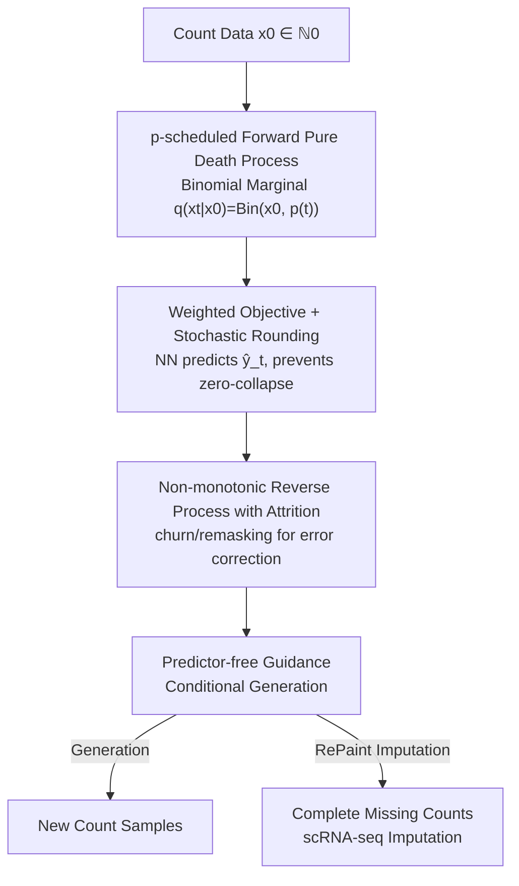

# CountsDiff: A Diffusion Model on the Natural Numbers for Generation and Imputation of Count-Based Data

**Conference**: ICML2026  
**arXiv**: [2604.03779](https://arxiv.org/abs/2604.03779)  
**Code**: https://github.com/rsoatto/countsdiff  
**Area**: Computational Biology / Diffusion Models / Single-cell RNA Sequencing  
**Keywords**: Discrete Diffusion, Natural Number Generation, Single-cell Imputation, Blackout Diffusion, Non-monotonic Reverse Process

## TL;DR
To address the issue that biological sequence counts (scRNA-seq, ATAC-seq, etc., which are inherently natural numbers) are unsuitable for either continuous or categorical diffusion, this paper proposes CountsDiff—a diffusion framework operating directly on the set of natural numbers $\mathbb{N}_0$. It reparameterizes Blackout diffusion using "survival probability scheduling $p(t)$ + explicit loss weighting" and integrates modern diffusion tools including continuous-time training, classifier-free guidance, churn/remasking (attrition) non-monotonic reverse trajectories, and stochastic rounding. Even with a minimal implementation, it matches or exceeds SOTA discrete generative models and specialized imputation methods on CIFAR-10/CelebA images and scRNA-seq imputation.

## Background & Motivation
**Background**: Diffusion models are the current SOTA in generative modeling, well-studied in continuous domains (images, audio, video) and discrete categorical domains (tokenized text). However, biological sequencing data—whole-genome sequencing, RNA-seq (including scRNA-seq), ATAC-seq, metagenomic read counts—are direct measurements of abundance in the form of **natural numbers**.

**Limitations of Prior Work**: Natural numbers are unbounded ordered sets like real numbers, yet they are discrete. Existing solutions have significant flaws. **Approach 1** relaxes natural numbers to real numbers for continuous diffusion: however, this optimizes over a much larger real-valued distribution space and only quantizes at inference. The authors use toy data to prove this "continuous-then-quantize" approach often fails (even causing mode collapse). **Approach 2** treats each number (up to a limit) as an independent category for categorical diffusion: but this **ignores the natural ordinal relationship** between values and suffers from computational explosion as the number of categories increases.

**Key Challenge**: Natural numbers possess both "ordered" and "discrete" attributes. Continuous diffusion loses discreteness, and categorical diffusion loses ordinality; no framework previously respected both.

**Goal**: Define diffusion directly on $\mathbb{N}_0 := \{0, 1, 2, \dots\}$ to preserve discreteness while utilizing ordinal structure, equipping it with the full toolkit of modern diffusion models (continuous time, guidance, churn).

**Key Insight**: Blackout diffusion (Santos et al., 2023) can perform a pure death process in the count domain to yield binomial marginals, but its formulation is obscure, lacks modern tools, and suffers from a "collapse-to-zero" failure mode. The authors discovered it can be reparameterized using the "survival probability $p(t)$," a more intuitive quantity that allows porting noise scheduling, weighting, guidance, and churn from Gaussian diffusion.

**Core Idea**: Rewrite the forward death process of count diffusion using survival probability scheduling $p(t)$, then systematically migrate the entire suite of modern continuous diffusion techniques (weighted objectives, guidance, non-monotonic reverse, stochastic rounding) to natural numbers.

## Method

### Overall Architecture
CountsDiff constructs a "forward corrosion + reverse generation" pipeline on natural numbers. The forward process is a **non-homogeneous pure death process** controlled by survival probability $p(t)$: starting from data $x_0$, each step can only decrease the count by one. The marginal distribution is strictly binomial $q(x_t \mid x_0) = \binom{x_0}{x_t} p(t)^{x_t} (1-p(t))^{x_0-x_t}$, where $p(t)$ monotonically decreases from 1 to 0, controlling the rate of information destruction. During the reverse process, the neural network predicts "how many elements remain" $\hat{y}_t$ at each time step (using softplus for positivity, followed by stochastic rounding), then reconstructs samples via a binomial reverse step with attrition. Conditional generation relies on predictor-free guidance, and imputation tasks are handled via the RePaint algorithm without retraining. Each component is deliberately aligned with its Gaussian/categorical counterpart, allowing the design space to reuse existing schedules and tricks.

### Key Designs

**1. Forward Death Process Reparameterized by Survival Probability $p(t)$**

Blackout diffusion fixes the forward process with $\mu_i(t) = i$ and $p(t) = e^{-t}$, which is inflexible. CountsDiff generalizes this to a non-homogeneous pure death process **parameterized by a $p$-schedule**: the transition rate is $\mathbf{R}^{(\text{fw})}_{i,j}(t) = i\mu(t)(\delta_{i-1,j} - \delta_{i,j})$, with $\mu(t)$ chosen such that the marginal is exactly binomial $q(x_t \mid x_0) = \binom{x_0}{x_t} p(t)^{x_t}(1 - p(t))^{x_0 - x_t}$. Proposition 3.1 proves that for any $p: [0,1] \to [0,1]$ that is avoidable, monotonically decreasing, with $p(0)=1, p(1)=0$, there exists a corresponding CountsDiff forward process; Blackout is a special case. the Key Insight is that the Signal-to-Noise Ratio (SNR) of the CountsDiff forward process under the $p$-schedule is **identical** to the SNR of Gaussian diffusion under the noise schedule $\bar\alpha_t$. This means any Gaussian noise schedule can be ported directly. The authors adopt the cosine schedule $p(t) = \cos(\frac{\pi t}{2})^2$ (from Nichol & Dhariwal), which offers theoretical and stability advantages over the Blackout schedule.

**2. Weighted Objective + Stochastic Rounding (Preventing Zero Collapse)**

The training objective is defined as $\mathbb{E}_{t \sim \phi}[w(t)(\hat{y}_t - y_t \log \hat{y}_t)]$, where $\hat{y}_t = \text{softplus}(\text{NN}_\theta(x_t, t))$ predicts the "remaining elements" $y_t = x_0 - x_t$. When $w(t) = \frac{-p'(t)}{(1-p(t))\phi(t)}$, the loss reduces to NLL. Since this objective is minimized pointwise at $\hat{y}_t = y$, **any $w(t) > 0$ does not change the optimal solution, only the training dynamics**—providing a weighting knob analogous to Gaussian diffusion. For the cosine schedule, the authors use $w(t) = \frac{\pi}{2} \sin(\pi t)$. Another critical detail is **rounding**: during inference, real-valued predictions must be converted to integers. Naive rounding collapses to 0 when $\hat{y} < 0.5$ (common in sparse counts). CountsDiff uses stochastic rounding $\hat{y}_{\text{clipped}} = \lfloor \hat{y} \rfloor + \xi, \xi \sim \text{Bernoulli}(\hat{y} - \lfloor \hat{y} \rfloor)$, which **preserves the expectation and exact binomial sampling**, fundamentally preventing zero collapse.

**3. Non-monotonic Reverse Process with Attrition (churn/remasking)**

The standard reverse process corresponding to Equation 3 is a pure birth process, meaning trajectories are **monotonically increasing**—similar to the irreversibility of unmasking in masked diffusion: if the model "overshoots," it cannot correct itself. CountsDiff generalizes the reverse process to allow **attrition** (non-zero death rate compensated by birth), resulting in a non-monotonic birth-death process (Proposition 3.2): given attrition rate $\sigma_{t,s} \in [0, \sigma_{t,s}^{\max}]$, sample $x_s = n_t + b_t$, where $n_t \sim \text{Bin}(x_t, 1 - \sigma_{t,s})$ and $b_t \sim \text{Bin}(x_0 - x_t, \beta_{t,s})$. $\sigma_{t,s}$ is analogous to churn in Gaussian diffusion and remasking in discrete diffusion. The authors adopt the ReMDM-rescale strategy ($\sigma_{t,s} = \eta_{\text{rescale}} \sigma_{t,s}^{\max}$).

**4. Predictor-free Guidance + RePaint Imputation**

To support conditional generation, the authors adapt continuous-time discrete guidance to natural numbers: $\hat{y}^{(\gamma)} = (\hat{y} \mid c)^{\gamma} \hat{y}^{1-\gamma}$. For imputation, the RePaint algorithm is applied **without retraining**: after each reverse step, observed entries are reset to their noise-corrupted ground truth, and only masked entries are resampled.

### Loss & Training
- Objective: $\mathbb{E}_{t \sim \phi}[w(t)(\hat{y}_t - y_t \log \hat{y}_t)]$, predicting remaining elements with softplus.
- Schedule: Cosine $p(t) = \cos(\frac{\pi t}{2})^2$, weighting $w(t) = \frac{\pi}{2} \sin(\pi t)$.
- Guidance: Predictor-free, $p_{\text{uncond}} = 0.1$, strength $\gamma$ is adjustable.
- Sampling: Binomial reverse with attrition + stochastic rounding; attrition controlled by $\eta_{\text{rescale}}$.
- Backbone: U-Net for images (hyperparameters from Santos et al. 2023), small MLP for toy/count data.

## Key Experimental Results

### Main Results
**Toy Counts (10D sparse negative binomial, ~50% zeros, max count ~50)** Variance comparison (closer to true value is better):

| Model | Dim0 | Dim1 | Dim2 | Dim3 | Dim4 |
|------|------|------|------|------|------|
| True (Target) | 0.78 | 4.71 | 0.10 | 0.12 | 0.28 |
| **Ours** | 0.55 | 1.99 | 0.07 | 0.08 | 0.21 |
| Gaussian | 0.19 | 0.46 | 0.01 | 0.02 | 0.05 |
| Masked | 3.06 | 9.22 | 1.89 | 2.49 | 7.27 |

Gaussian diffusion suffers severe mode collapse (variance much smaller than truth); Masked diffusion variance explodes (overfitting outliers); CountsDiff variance most closely matches truth.

**CIFAR-10 Images (FID/IS on 50k samples, excerpt from Table 1)**:

| $p$-schedule | $\gamma$ | $\eta_{\text{rescale}}$ | FID ↓ | IS ↑ |
|---------|---------|------------------------|-------|------|
| FI Discrete (≈Blackout) | uncond | none | 5.73 | 9.12 |
| FI Continuous | uncond | none | 5.44 | 9.09 |
| **FI Continuous** | 1.0 | 0.01 | **5.20** | 9.64 |
| Cosine | uncond | none | 5.76 | 9.29 |
| Cosine | 1.0 | 0.01 | 5.26 | 9.85 |
| Cosine | 2.0 | 0.02 | 11.55 | **9.93** |

Extending the FI schedule to continuous time reduces FID; moderate guidance + small attrition further improves FID/IS (Best FID 5.20).

### scRNA-seq Imputation
Tested on Fetal and Heart cell atlases under three scenarios (Fetal 50% MCAR, Fetal 25% MNAR, Heart 50% MCAR), compared against scRNA-seq specialized methods (MAGIC, GAIN, scGPT, etc.) and diffusion frameworks. Fetal 50% MCAR excerpt:

| Method | Spearman ↑ | RMSE ↓ | ED ↓ | log(scFID) ↓ |
|------|-----------|--------|------|--------------|
| Zero imputation | N/A | 1.91 | 1.44 | −2.35 |
| Mean imputation | 0.17 | 1.31 | 0.17 | −5.01 |
| MAGIC | 0.21 | 1.88 | 1.44 | −2.35 |
| **CountsDiff** | **0.35** | **1.05** | **0.13** | **−7.22** |

CountsDiff matches or outperforms SOTA specialized imputation methods.

### Key Findings
- Existing diffusion frameworks fail on **minimal** count toys: Gaussian collapses, Masked overfits outliers, highlighting the necessity of modeling directly on $\mathbb{N}_0$.
- Moderate guidance + small attrition improves both FID and IS; however, excessive attrition causes oversmoothing.
- The cosine schedule is more stable for training, consistent with its original motivation in Gaussian diffusion.

## Highlights & Insights
- **Reparameterization bridging design spaces**: By proving the SNR alignment between count and Gaussian diffusion, the authors "freely" port noise schedules, weighting, and guidance into a previously isolated domain.
- **Stochastic rounding to fix Logic**: A small engineering trick that solves the "collapse-to-zero" failure mode by preserving expectation and exact sampling.
- **Attrition = Churn/Remasking**: Unifying these concepts into a birth-death process allows error correction in the count domain.
- **Retraining-free Imputation**: RePaint integration allows the generative model to serve as a zero-cost imputer for sparse biological data.

## Limitations & Future Work
- This is an "initial instance"; the design space (schedules, weighting, attrition) is not yet fully optimized.
- The forward process requires $p(t)$ to be monotonic with fixed endpoints.
- scRNA-seq experiments are focused on fetal/heart atlases; broader modalities (ATAC-seq) require further verification.

## Related Work & Insights
- **vs Blackout Diffusion**: CountsDiff is its strict generalization, providing a continuous-time framework, guidance, and attrition, while fixing the zero-collapse issue.
- **vs Continuous Diffusion**: Continuous models optimize in a larger space and quantize later, which fails on sparse counts. CountsDiff respects discreteness from the start.
- **vs Categorical Diffusion**: Categorical models ignore ordinality and scale poorly; CountsDiff utilizes binomial structures to maintain ordinality.

## Rating
- Novelty: ⭐⭐⭐⭐⭐ First to systematically port modern diffusion tools to the natural number domain via SNR alignment.
- Experimental Thoroughness: ⭐⭐⭐⭐ Extensive verification across toy, image, and scRNA-seq tasks.
- Writing Quality: ⭐⭐⭐⭐ Rigorous math and clear motivation.
- Value: ⭐⭐⭐⭐⭐ Open-sourced and highly practical for real-world biological count data.

<!-- RELATED:START -->

## Related Papers

- [\[ICLR 2026\] Count Bridges enable Modeling and Deconvolving Transcriptomic Data](../../ICLR2026/computational_biology/count_bridges_enable_modeling_and_deconvolving_transcriptomic_data.md)
- [\[ICLR 2026\] Controllable Diffusion-based Generation for Multi-channel Biological Data](../../ICLR2026/computational_biology/controllable_diffusion-based_generation_for_multi-channel_biological_data.md)
- [\[CVPR 2026\] MMCP-GEN: A Modality-Extensible Diffusion Language Model for Conditional Protein Sequence Generation](../../CVPR2026/computational_biology/mmcp-gen_a_modality-extensible_diffusion_language_model_for_conditional_protein_.md)
- [\[ICLR 2026\] A Diffusion Model to Shrink Proteins While Maintaining Their Function](../../ICLR2026/computational_biology/a_diffusion_model_to_shrink_proteins_while_maintaining_their_function.md)
- [\[ICLR 2026\] HEIST: A Graph Foundation Model for Spatial Transcriptomics and Proteomics Data](../../ICLR2026/computational_biology/heist_a_graph_foundation_model_for_spatial_transcriptomics_and_proteomics_data.md)

<!-- RELATED:END -->
## Related Papers

- [\[CVPR 2026\] MMCP-GEN: A Modality-Extensible Diffusion Language Model for Conditional Protein Sequence Generation](../../CVPR2026/computational_biology/mmcp-gen_a_modality-extensible_diffusion_language_model_for_conditional_protein_.md)
- [\[ICML 2026\] TD3B: Transition-Directed Discrete Diffusion for Allosteric Binder Generation](td3b_transition-directed_discrete_diffusion_for_allosteric_binder_generation.md)
- [\[ICML 2026\] Scalable Single-Cell Gene Expression Generation with Latent Diffusion Models](scalable_single-cell_gene_expression_generation_with_latent_diffusion_models.md)
- [\[AAAI 2026\] Distributional Priors Guided Diffusion for Generating 3D Molecules in Low Data Regimes](../../AAAI2026/computational_biology/distributional_priors_guided_diffusion_for_generating_3d_molecules_in_low_data_r.md)
- [\[ICLR 2026\] Ultra-Fast Language Generation via Discrete Diffusion Divergence Instruct](../../ICLR2026/computational_biology/ultra-fast_language_generation_via_discrete_diffusion_divergence_instruct.md)

<!-- RELATED:END -->
