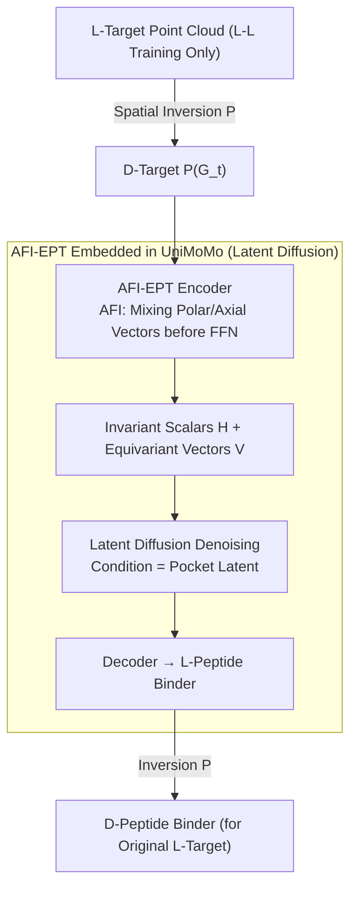

# Cross-Chirality Generalization by Axial Vectors for Hetero-Chiral Protein-Peptide Interaction Design

**Conference**: ICML2026  
**arXiv**: [2602.20176](https://arxiv.org/abs/2602.20176)  
**Code**: https://github.com/YZY010418/PepMirror  
**Area**: Scientific Computing / Protein-Peptide Design / Equivariant Neural Networks  
**Keywords**: D-peptide design, axial vectors, $SE(3)$ equivariance, mirror enantiomers, latent space diffusion  

## TL;DR
This paper proposes AFI (Axial Feature Injection), which injects axial vector features into the polar vector channels of $E(3)$-equivariant scalarized models via linear mixing to reduce them to $SE(3)$-equivariance and enable chirality sensitivity. By applying this to UniMoMo, the authors developed PepMirror, which generates hetero-chiral (D-L) peptide binders in a zero-shot manner using only homo-chiral (L-L) training data. Wet-lab experiments on the CD38 target validated it as the first experimentally confirmed AI de novo D-peptide design framework.

## Background & Motivation

**Background**: Natural proteins consist almost entirely of L-amino acids (homo-chirality). D-peptides are promising therapeutic molecules due to protease resistance, long half-lives, and low immunogenicity. However, traditional D-peptide binder screening relies on mirror-image display—requiring the synthesis of D-protein targets, which is extremely difficult. While ML-based peptide design has flourished, most models focus on L-L interfaces.

**Limitations of Prior Work**: Existing equivariant protein generation models cannot directly design D-peptide binders. The first category (RFDiffusion, PepFlow, D-Flow, etc.) uses rigid-body local coordinate systems that hardcode right-handed chirality as a prior, making structural mirror images indistinguishable after rotation. The second category (PepGLAD, UniMoMo, PocketXMol) depends on $E(3)$-equivariant backbones, which are strictly equivariant under spatial inversion $P=-I_3$. This leads to models outputting mixed chirality when given D-target inputs—failing to generate stable single-chirality binders. The only specialized attempt, D-Flow, remains limited to dry-lab validation.

**Key Challenge**: To design hetero-chiral interfaces, a model must achieve both **chirality perception** (separable latent codes for $X$ and $-X$) and **latent stability** ($-X$ must still be recognized as the same amino acid type, just with flipped chirality, rather than shifting to a different class). $E(3)$-equivariance ensures stability but destroys perception; breaking equivariance completely may lead to unstable representations. Existing chirality-aware methods (SphereNet's torsion, ChIRo, or high-order spherical harmonics in Tensor Field Networks) are either only validated for classification/property prediction or are computationally expensive and prone to overfitting.

**Goal**: (i) To provide a **lightweight** chirality-aware plugin for scalarized equivariant models; (ii) To theoretically guarantee that the generated latent codes satisfy "$dist(X, -X) < dist(X, X')$"; (iii) To implement a latent diffusion-based D-peptide binder designer for wet-lab confirmation.

**Key Insight**: Classical physics distinguishes between **polar vectors** (e.g., position, velocity, which change sign under $P$) and **axial vectors** (e.g., angular momentum, magnetic field, which are invariant under $P$). Scalarized $E(3)$-equivariant models typically use only polar vectors; adding axial vectors maintains $SE(3)$-equivariance (rotation, translation) while breaking $P$-equivariance, enabling chirality differentiation.

**Core Idea**: Axial vectors (constructed via cross product, triple product, or commutator) are injected into the polar vector channels before each EPT layer's FFN via channel-wise linear mixing $\tilde v_{i,k}=A_k^\top v_{i,:}+B_k^\top a_{i,:}$. This reduces the model from $E(3)$ to $SE(3)$ equivariance. Integrated into UniMoMo's VAE+latent diffusion framework, this results in PepMirror.

## Method

### Overall Architecture
To generate D-peptide binders zero-shot using an L-L homo-chiral trained model, the core issue is that $E(3)$-backbones are strictly invariant under spatial inversion $P=-I_3$, causing mirror targets to map to identical latent codes. PepMirror adds an **axial vector injection plugin** to reduce $E(3)$ to $SE(3)$-equivariance—preserving roto-translation invariance while gaining sensitivity to spatial inversion. The system adopts UniMoMo's two-stage latent diffusion: the encoder EPT (Equivariant Pretrained Transformer) maps the point cloud $\mathcal{G}$ to invariant scalars $H\in\mathbb{R}^{N\times K}$ and equivariant vectors $V\in\mathbb{R}^{N\times 3\times K}$. The diffusion stage denoises the binder latent code conditioned on the pocket latent code $c$, and the decoder reconstructs the 3D structure. The primary modification is replacing $V$ with the injected $\widetilde V$ before each GVP-FFN, creating AFI-EPT. During inference, mirror-image display logic is used: the L-target $\mathcal{G}_t$ is inverted to a D-target, the model generates an L-binder, and the output is inverted back: $\mathcal{G}_b=P(f_\theta(P(\mathcal{G}_t)))$.

### Key Designs

**1. Axial Feature Injection (AFI): Separating Polar and Axial Vectors for Chirality Sensing**

Classical physics categorizes 3D vectors into polar vectors (e.g., position, changing sign under $P$: $v(-X)=-v(X)$) and axial vectors (e.g., angular momentum, transforming as $a(Rx)=\det(R)\,Ra(x)$, thus invariant under $P$). Since standard scalarized models only use polar vectors, mirror images remain indistinguishable. AFI performs channel-wise linear mixing $\tilde v_{i,k}(X)=A_k^\top v_{i,:}(X)+B_k^\top a_{i,:}(X)$ ($A_k,B_k\in\mathbb{R}^K$ are learnable). Because $a$ is invariant while $v$ flips sign, $\widetilde V$ differs for $X$ and $-X$, reducing the symmetry group to $SE(3)$ and enabling chirality perception. Axial vectors are constructed from adjacent channels $u,v,w\in\mathbb{R}^3$ of $V'$: cross product $u\times v$ (cross), scalar triple product projection $(w\cdot(u\times v))\,w$ (triple), and commutator $(u\cdot v)(u\times v)$ (commu.). Compared to high-order spherical harmonics, AFI uses only low-order tensors, making the computational overhead negligible.

**2. Theoretical Closed-loop of Zero-shot Generalization: Difference + Stability + Diffusion Continuity**

For hetero-chiral generalization to work, latent codes must be separable for mirrors (chirality perception) but stable enough such that $-X$ is not misidentified as a different residue (latent stability). **Difference** is established by Theorem 3.1: with randomly sampled mixing coefficients, $\|c(X)-c(-X)\|\ge c_W\varepsilon$ holds with high probability. **Stability** is measured by $d(X_1,X_2)=\|H(X_1)-H(X_2)\|+\|\widetilde V(X_1)-\widetilde V(X_2)\|$. Since $H(-X)=H(X)$ and $a(-X)=a(X)$, the mirror distance $d(X,-X)=\|2Av(X)\|$ is explicitly controlled by coefficient $A$, supporting the property $d(X,X')>d(X,-X)$—i.e., mirror images are closer than distinct amino acids. **Diffusion Continuity** (Theorem 3.4) implies that similar latent codes yield similar binder distributions, allowing generalization to D-targets despite zero D-L training data.

**3. AFI-EPT in UniMoMo: End-to-end de novo D-peptide Design Pipeline**

The AFI-EPT backbone replaces the standard EPT in UniMoMo's VAE and diffusion network. Three variants are derived: PepMirror(cross/triple/commu.). UniMoMo is selected as the base because it does not hardcode rigid-body frames, allowing AFI to function directly, and latent diffusion provides better computational efficiency and stability compared to atom-level diffusion.

### Loss & Training
The model is trained solely on L-L homo-chiral protein-peptide complexes. The objective includes standard VAE reconstruction loss and latent diffusion denoising loss. No D-peptide data or explicit chirality supervision is used; hetero-chiral capability emerges zero-shot via AFI and the inversion inference framework.

## Key Experimental Results

### Main Results

Evaluated on the LNR (Large Non-Redundant) test set for both L and D tasks using chirality correctness and AutoDock Vina scores:

| Model | Task | Chirality Rate (min) | Suc.% | Avg. Vina | Top Vina | IMP% |
|------|------|------|------|------|------|------|
| RFDiffusion | L | 99.57 | 99.52 | -3.30 | -5.14 | 44.09 |
| RFDiffusion | D | 99.15 | 98.58 | -1.77 | -3.78 | 16.13 |
| D-Flow | D | 98.54 | 97.52 | -3.11 | -4.54 | 22.58 |
| PepGLAD(ideal) | D | 99.04 | 95.08 | -3.26 | -5.11 | 43.01 |
| UniMoMo(all) | D | 15.70 | — | — | — | — |
| **PepMirror(cross)** | L | 99.83 | 99.67 | **-4.27** | **-5.81** | **69.89** |
| **PepMirror(cross)** | D | 99.81 | 99.76 | **-4.15** | **-5.69** | **63.44** |

PepMirror improves IMP (Improvement Percentage) by ~20 percentage points over the next best model, PepGLAD(ideal), and exhibits the smallest "L-D gap."

### Ablation Study

| Configuration | D-Task Chirality Rate | Note |
|------|------|------|
| UniMoMo(pep.) | 23.90 | $E(3)$-equivariant baseline; outputs mostly L residues |
| UniMoMo(all) | 15.70 | Multi-modal training version; still limited by equivariance |
| AFI w/ cross | 99.81 | Cross product axial injection |
| AFI w/ triple | 99.75 | Triple product axial injection |
| AFI w/ commu. | 99.88 | Commutator axial injection (best) |

Latent space analysis shows that $\|c(X)-c(-X)\|$ jumps from $\sim 10^{-6}$ to $10^{-2}$ with AFI, while remaining significantly smaller than the distance between different amino acids ($\sim 1$), confirming the "Difference + Stability" mechanism.

### Key Findings
- **AFI is a necessary and sufficient chirality switch**: Without it, PepMirror collapses to mixed-chirality outputs (correctness < 25%).
- **Wet-lab confirmation**: Designed 5,000 D-peptides for CD38. 12 were synthesized, resulting in one 10-mer binder D-1412 ("trikhytyce") with $K_D\approx 10\,\mu$M, the first AI de novo D-peptide binder validated experimentally.
- **Minimal L→D performance drop**: Unlike RFDiffusion, which sees significant drops in Vina scores for D-tasks, PepMirror's performance remains consistent across chiralities.

## Highlights & Insights
- **Leveraging classical physics**: The polar/axial decomposition provides the lowest-cost symmetry-breaking design, acting as a plug-and-play module for any scalarized backbone.
- **Theoretical assurance**: The three-step proof (Difference, Stability, Continuity) elevates zero-shot generalization from an empirical observation to a guaranteed mechanism.
- **Challenge to stereoselectivity**: The discovery that D-1412's L-enantiomer also binds CD38 suggests that target-binder interactions may be less stereoselective than traditionally assumed, potentially due to conformational flexibility.

## Limitations & Future Work
- AFI's theoretical guarantees depend on "genericity" of mixing coefficients; specific initializations could lead to degeneracy.
- Only validated within the UniMoMo framework; the applicability to frame-based models (like RFDiffusion) requires further testing.
- Wet-lab validation was limited to one target (CD38); broader statistical validation across more targets is needed.
- Future work could involve explicitly maximizing $d(X, -X)$ via regularization or incorporating stereoselectivity as an optimization target.

## Related Work & Insights
- **vs D-Flow**: D-Flow also uses inversion-based inference but relies on frame-based models and only dry-lab validation. PepMirror utilizes $E(3)$ backbones with AFI to break symmetry and achieved wet-lab success.
- **vs PepGLAD / UniMoMo**: These strictly $E(3)$-equivariant models generate mixed chirality. AFI addresses this at the architectural level rather than as a post-processing step.
- **vs High-order TFNs**: While spherical harmonics can encode chirality, they are computationally intensive. AFI serves as a lightweight alternative using only low-order tensors.

## Rating
- Novelty: ⭐⭐⭐⭐⭐ Elegant use of polar/axial vectors for symmetry breaking.
- Experimental Thoroughness: ⭐⭐⭐⭐⭐ Comprehensive in-silico metrics and rare wet-lab validation.
- Writing Quality: ⭐⭐⭐⭐⭐ Clear structure with strong theoretical and empirical alignment.
- Value: ⭐⭐⭐⭐⭐ Significant impact on de novo D-peptide drug discovery.

<!-- RELATED:START -->

## Related Papers

- [\[ICLR 2026\] Learning Molecular Chirality via Chiral Determinant Kernels](../../ICLR2026/computational_biology/learning_molecular_chirality_via_chiral_determinant_kernels.md)
- [\[ICML 2026\] Learning the Interaction Prior for Protein-Protein Interaction Prediction: A Model-Agnostic Approach](learning_the_interaction_prior_for_protein-protein_interaction_prediction_a_mode.md)
- [\[ICML 2026\] Protein Circuit Tracing via Cross-layer Transcoders](protein_circuit_tracing_via_cross-layer_transcoders.md)
- [\[ICML 2026\] Protein Language Model Embeddings Improve Generalization of Implicit Transfer Operators](protein_language_model_embeddings_improve_generalization_of_implicit_transfer_op.md)
- [\[ICML 2026\] iLoRA: Bayesian Low-Rank Adaptation with Latent Interaction Graphs for Microbiome Diagnosis](ilora_bayesian_low-rank_adaptation_with_latent_interaction_graphs_for_microbiome.md)

<!-- RELATED:END -->
