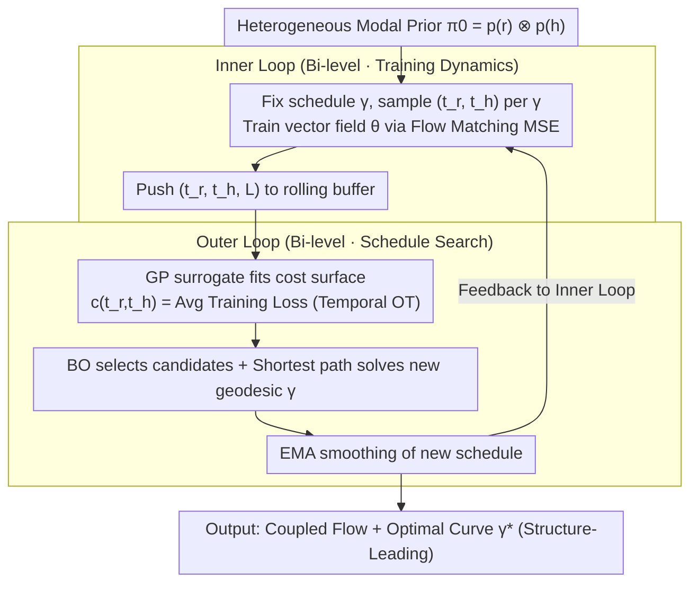

# Demystifying Multimodal Biomolecular Co-design with Intrinsic Geodesic Coupling

**Conference**: ICML 2026  
**arXiv**: [2606.01628](https://arxiv.org/abs/2606.01628)  
**Code**: To be confirmed  
**Area**: Scientific Computing / Biomolecular Co-design / Multimodal Generation / Optimal Transport  
**Keywords**: Biomolecular co-design, temporal coupling, optimal transport, Bayesian optimization, flow matching

## TL;DR
The authors re-model the co-generation of heterogeneous modalities ("sequence + 3D structure") as a **Temporal Optimal Transport (TOT)** problem. By using bi-level optimization with a Gaussian Process surrogate (GeoCoupling), the model automatically learns **non-diagonal temporal coupling curves** during training (i.e., allowing structure and sequence to denoise at their respective optimal paces). This approach outperforms "synchronous coupling" and "random coupling" baselines in both SBDD and unconditional protein co-design tasks, revealing a universal "structure-leading" generation principle where geometry precedes semantics.

## Background & Motivation
**Background**: The biological function of molecules (proteins, ligands) is determined by the coupling of sequence and 3D structure. Thus, **co-design** has become the mainstream paradigm for de novo drug and protein design. Representative methods include MultiFlow, DPLM-2, La-Proteina (proteins), as well as TargetDiff, MolCRAFT, MolPilot, and DrugFlow (SBDD). These methods essentially perform diffusion or flow matching on a **heterogeneous product manifold** $\mathbb{R}^{N\times 3} \times \mathbb{R}^{N\times K}$.

**Limitations of Prior Work**: Almost all co-design models **implicitly adopt synchronous coupling**, forcing all modalities to share the same timestep $t$ and evolve at the same rate from noise to data. This represents a strong implicit inductive bias, assuming identical denoising difficulty and convergence speeds across modalities. Some works like Campbell et al. 2024 attempt to mitigate this with **random coupling** (sampling $(t_r, t_h) \sim [0,1]^2$ independently during training), but this introduces **training-inference inconsistency** and **high-variance supervision**.

**Key Challenge**: By observing SBDD training dynamics (Fig. 1C), the authors found that under synchronous coupling, structural MSE remains high throughout most of the trajectory, dropping only very late. Switching to an asynchronous coupling allows structural error to decrease earlier, improving validity. This indicates that the **optimal generation trajectory is not the diagonal** of the product manifold, but a **geometrically curved geodesic** where modalities are allocated time budgets based on their "learning complexity."

**Goal**: Elevate "inter-modal temporal coupling" from a hard-coded design choice to a **learnable first-order design variable** with controllable computational overhead.

**Key Insight**: Treat the multimodal training loss $\mathcal{L}_\text{MSE}(\theta, \gamma)$ as the **transport cost in the temporal domain**. The total scheduling curve $\gamma:[0,1] \to [0,1]^2$ corresponds to a **coupling measure** $\pi_\gamma \in \mathcal{P}([0,1]^2)$. This translates "finding the optimal coupling" into "finding the minimum energy geodesic on the product manifold."

**Core Idea**: Employ **bi-level optimization + GP surrogate + Bayesian Optimization (BO)** to learn the geodesic $\gamma^*$ online within the training loop. The inner loop trains $\theta$ with a fixed $\gamma$, while the outer loop searches for an improved $\gamma$ on the loss surface provided by $\theta^*$. The GP surrogate amortizes the cost of retraining for every change in $\gamma$.

## Method

### Overall Architecture
GeoCoupling addresses the pacing of sequence and structure denoising. The problem is abstracted as finding a monotonic curve $\gamma$ in the 2D temporal square $[0,1]^2$ (structure time $t_r$ × sequence time $t_h$) that minimizes the transfer energy of the flow model. Synchronous coupling is a rigid diagonal choice, while the true optimum is often a curved geodesic. The method uses a nested loop: the inner loop trains the vector field with standard flow matching targets given a current schedule $\gamma$, while the outer loop feeds observed training losses into a GP surrogate to online-search for a better $\gamma$.

### Key Designs

**1. Temporal Optimal Transport: Translating "Optimal Coupling" to "Minimum Energy Geodesic"**

While traditional OT focuses on pairing $x_0, x_1$ in sample space, this work shifts the language to the temporal domain. The scheduling curve $\gamma$ is viewed as a push-forward measure $\pi_\gamma := \gamma_\# \lambda \in \mathcal{P}([0,1]^2)$. Determining the best schedule becomes equivalent to comparing transport costs $\mathcal{E}(\gamma) = \int c(t_r, t_h)\, d\pi_\gamma$, where the cost surface $c(t_r, t_h) := \mathbb{E}_x[\mathcal{L}_\text{MSE}(x, (t_r, t_h))]$ is the average training loss at that time pair. The authors prove (Prop. 3.2) that the integrated loss along $\gamma$ decomposes into:
$$\mathcal{E}(\gamma) = \int [\,\underbrace{\|v_\theta - u^\gamma\|^2}_\text{Bias} + \underbrace{\mathrm{Var}(\mathbf{u}_t^\gamma \mid \mathbf{x}_t)}_\text{Variance}\,]\, dt$$
Synchronous coupling occupies the "High Bias, Low Variance" end, while random coupling is "Low Bias, High Variance." The optimal $\gamma^*$ lies in between.

**2. Bi-level Optimization: Outer Loop Search via Training Loss Observation**

Calculating hypergradients for the entire training trajectory is neither differentiable nor computationally feasible. The authors split "finding $\gamma$" and "training $\theta$": the inner loop $\theta^* = \arg\min_\theta \mathcal{L}_\text{MSE}(\theta, \gamma)$ trains the model as usual, while the outer loop $\min_{\gamma\in\Gamma} \mathcal{J}(\gamma) = \mathbb{E}_x[\int_0^1 \mathcal{L}_{\theta^*}(x, \gamma(t))\, dt]$ searches the schedule on the surface provided by the inner loop. Prop 3.3 simplifies this: once the inner loop reduces bias, the geodesic reduces to $\gamma^* = \arg\min_\gamma \mathbb{E}_{t,x}[\mathrm{Var}(u_t^\gamma \mid \mathbf{x}_t)]$, minimizing the intrinsic supervision variance.

**3. GP Surrogate + Bayesian Optimization: Reducing Outer Loop Update from 1213.6s to 21.5s**

A brute-force grid search for $K$ modalities requires $O(N^K)$ evaluations. The authors use a GP to model the cost surface $c(\mathbf{t}) \sim \mathcal{GP}(\mu(\mathbf{t}), k(\mathbf{t},\mathbf{t}') + \sigma_n^2 \delta)$ with a rolling buffer $\mathcal{B}$ of size $N_\max = 1000$ to maintain recent observations. Every outer loop iteration uses a BO acquisition function to supplement candidates for the GP and then runs a shortest-path algorithm on the GP surface to find a new monotonic geodesic. This 56× speedup allows the outer loop to be embedded frequently into training.

### Loss & Training
The inner loop retains the native training objectives of the underlying models (Flow Matching / Diffusion MSE / BFN ELBO). The only modification is that $(t_r, t_h)$ are sampled according to the current $\gamma$. The outer loop maintains stability via the rolling buffer and EMA smoothing of the learned $\gamma$. This requires only $1\times$ the training steps of the original model.

## Key Experimental Results

### Main Results

**Structure-Based Drug Design (CrossDock, 100 pocket × 100 molecules)**:

| Category | Method | PB-Valid↑ | Vina Score↓ (avg) | Vina Dock↓ (avg) | scRMSD<2Å↑ |
| :--- | :--- | :--- | :--- | :--- | :--- |
| Reference | - | 95.0% | -6.36 | -7.45 | 34.0% |
| Synch | MolCRAFT | 84.6% | -6.55 | -7.67 | 46.8% |
| Synch | DrugFlow | 79.6% | -5.12 | -6.99 | 23.1% |
| Random | MolPilot | 95.9% | -6.88 | -7.92 | 41.1% |
| Learning | **GeoCoupling** | 94.3% | **-7.16** | **-8.32** | 43.1% |

GeoCoupling leads in binding affinity (Vina Score/Dock) while maintaining high validity.

**Unconditional Protein Co-design (Length 100-500, N=100)**:

| Method | Co-design↑ | pLDDT↑ | 1 - Pairwise TM↑ | FS Clusters↑ | Max TM↓ |
| :--- | :--- | :--- | :--- | :--- | :--- |
| MultiFlow | 0.72 | 79.39 | 0.63 | 0.56 | 0.83 |
| La-Proteina (tri) | 0.77 | 85.32 | 0.59 | 0.36 | 0.85 |
| DPLM2 | 0.31 | 83.69 | 0.63 | 0.49 | 0.96 |
| **GeoCoupling** | **0.79** | 80.15 | 0.63 | 0.48 | 0.83 |

### Ablation Study

| Configuration | Connected↑ | Vina Score↓ (mean) | Vina Min↓ (mean) | Note |
| :--- | :--- | :--- | :--- | :--- |
| Full (Ours) | **93.5%** | **-7.12** | **-7.57** | Bi-level + EMA |
| Fixed $\gamma^*$ | 91.1% | -6.97 | -7.45 | Static schedule from start |
| w/o EMA | 91.9% | -6.50 | -7.24 | No smoothing, high variance |

### Key Findings
- **Structure-leading is a universal law**: In both SBDD and protein tasks, $\gamma^*$ shows that structure $t_r$ advances early, while sequence $t_h$ denoises rapidly only after the structure stabilizes. 
- **OOD Length Advantage**: For proteins $\ge 400$, MultiFlow's co-designability drops below 0.3, while GeoCoupling maintains $> 0.6$.
- **BO is Indispensable**: GP-BO (21.5s) vs brute-force (1213.6s) enables high-frequency synchronization with the training loop.
- **Plug-and-play**: Learned $\gamma^*$ can be applied post-hoc to existing checkpoints (e.g., MultiFlow), improving FS Clusters from 0.56 to 0.73.

## Highlights & Insights
- **Learning "inter-modal temporal coupling"** is a clean and systematic contribution, explaining why synchronous and random coupling represent different ends of the Bias-Variance trade-off.
- **Unified Transport Perspective**: Maps "sample-space OT" and "time-domain OT" into a coherent framework, allowing future extensions to multi-modal (K > 2) co-design.
- **Physical Interpretability**: The automatically learned "structure-leading" coupling validates biological priors like induced fit and co-evolution—stabilizing the scaffold before determining the sequence.

## Limitations & Future Work
- GP-BO remains a noisy surrogate search and the GP suffers from dimensionality curses as $K$ increases beyond 2.
- The coupling is optimal in an **average sense** (one schedule for all samples). Future work could introduce instance-conditioned coupling $\gamma(x)$.
- Lacks wet-lab or extensive physical simulation validation beyond Vina scores.

## Related Work & Insights
- **vs MolPilot (2025)**: MolPilot performs schedule search (VOS) **after** training. GeoCoupling evolves the schedule online, achieving better results with $1\times$ the training budget compared to MolPilot's $2\times$.
- **vs MultiFlow / DPLM-2**: These use random coupling. GeoCoupling reinterprets their training-inference mismatch as "high-variance supervision" and provides a post-hoc "cure" via $\gamma^*$.
- **vs Classical OT Flow Matching**: Previous works focus on sample OT ($x_0 \to x_1$); this work addresses temporal OT ($t_r \to t_h$). These are orthogonal and can be combined.

## Rating
- Novelty: ⭐⭐⭐⭐⭐ 
- Experimental Thoroughness: ⭐⭐⭐⭐ 
- Writing Quality: ⭐⭐⭐⭐⭐ 
- Value: ⭐⭐⭐⭐⭐

## Related Papers

- [\[ICML 2026\] EvoEGF-Mol: Evolving Exponential Geodesic Flow for Structure-based Drug Design](evoegf-mol_evolving_exponential_geodesic_flow_for_structure-based_drug_design.md)
- [\[ICLR 2026\] Intrinsic Lorentz Neural Network](../../ICLR2026/computational_biology/intrinsic_lorentz_neural_network.md)
- [\[ICML 2025\] Compositional Flows for 3D Molecule and Synthesis Pathway Co-design](../../ICML2025/computational_biology/compositional_flows_for_3d_molecule_and_synthesis_pathway_co-design.md)
- [\[ICLR 2026\] A Joint Diffusion Model with Pre-Trained Priors for RNA Sequence-Structure Co-Design](../../ICLR2026/computational_biology/a_joint_diffusion_model_with_pre-trained_priors_for_rna_sequence-structure_co-de.md)
- [\[ICML 2025\] Elucidating the Design Space of Multimodal Protein Language Models](../../ICML2025/computational_biology/elucidating_the_design_space_of_multimodal_protein_language_models.md)

<!-- RELATED:END -->

<!-- RELATED:START -->

## Related Papers

- [\[ICML 2026\] EvoEGF-Mol: Evolving Exponential Geodesic Flow for Structure-based Drug Design](evoegf-mol_evolving_exponential_geodesic_flow_for_structure-based_drug_design.md)
- [\[ICML 2026\] SPATIA: Multimodal Generation and Prediction of Spatial Cell Phenotypes](spatia_multimodal_generation_and_prediction_of_spatial_cell_phenotypes.md)
- [\[ICML 2026\] Protein Language Model Embeddings Improve Generalization of Implicit Transfer Operators](protein_language_model_embeddings_improve_generalization_of_implicit_transfer_op.md)
- [\[ICML 2026\] Scalable Single-Cell Gene Expression Generation with Latent Diffusion Models](scalable_single-cell_gene_expression_generation_with_latent_diffusion_models.md)
- [\[ICML 2026\] Flow Sampling: Learning to Sample from Unnormalized Densities via Denoising Conditional Processes](flow_sampling_learning_to_sample_from_unnormalized_densities_via_denoising_condi.md)

<!-- RELATED:END -->
