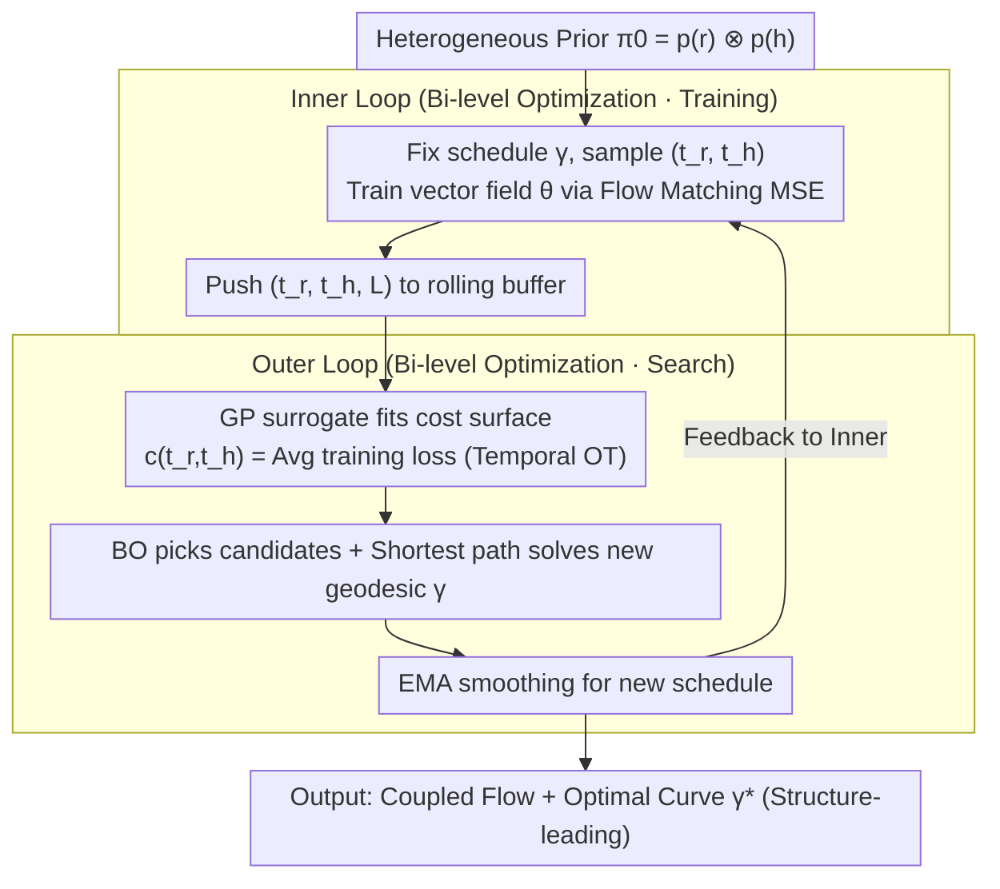

# Demystifying Multimodal Biomolecular Co-design with Intrinsic Geodesic Coupling

**Conference**: ICML 2026  
**arXiv**: [2606.01628](https://arxiv.org/abs/2606.01628)  
**Code**: TBD  
**Area**: Scientific Computing / Biomolecular Co-design / Multimodal Generation / Optimal Transport  
**Keywords**: Biomolecular co-design, temporal coupling, optimal transport, Bayesian optimization, flow matching

## TL;DR
The authors model the co-generation of heterogeneous modalities (sequence + 3D structure) as a **Temporal Optimal Transport (TOT)** problem. By using bi-level optimization with a Gaussian Process surrogate (GeoCoupling), they automatically learn **off-diagonal temporal coupling curves** during training, allowing structure and sequence to denoise at their respective optimal paces. This method outperforms "synchronous" and "random" coupling baselines in SBDD and unconditional protein co-design tasks, uncovering a universal "structure-leading" principle where geometric convergence precedes semantic determination.

## Background & Motivation
**Background**: The biological function of molecules (proteins, ligands) is determined by the coupling of sequence and 3D structure. Thus, structure + sequence **joint generation (co-design)** has become the mainstream paradigm for de novo drug and protein design. Representative methods include MultiFlow, DPLM-2, La-Proteina, TargetDiff, MolCRAFT, MolPilot, and DrugFlow, which essentially perform diffusion or flow matching on a **heterogeneous product manifold** $\mathbb{R}^{N\times 3} \times \mathbb{R}^{N\times K}$.

**Limitations of Prior Work**: Almost all co-design models implicitly adopt **synchronous coupling**, forcing all modalities to share the same timestep $t$ and evolve at the same rate. This assumes that different modalities share identical denoising difficulties and convergence speeds. While **random coupling** (e.g., Campbell et al. 2024) samples $(t_r, t_h) \sim [0,1]^2$ independently during training to alleviate this, it introduces **training-inference inconsistency** and **high-variance supervision**.

**Key Challenge**: Observations of SBDD training dynamics (Fig. 1C) reveal that under synchronous coupling, structural MSE stays high until the very end of the trajectory. Switching to asynchronous coupling allows structural errors to drop earlier, improving validity. This indicates that the optimal generation trajectory is not a diagonal line on the product manifold but a **geometric geodesic**, where time budgets should be allocated based on the "learning complexity" of each modality.

**Goal**: To elevate "inter-modal temporal coupling" from a hard-coded design choice to a **learnable first-order design variable** with controllable computational overhead.

**Key Insight**: The training loss $\mathcal{L}_\text{MSE}(\theta, \gamma)$ can be viewed as the **transport cost in the temporal domain**. The scheduling curve $\gamma:[0,1] \to [0,1]^2$ corresponds to a **coupling measure** $\pi_\gamma \in \mathcal{P}([0,1]^2)$. Finding the optimal coupling is thus equivalent to finding the minimum-energy geodesic on the product manifold.

**Core Idea**: Utilize **bi-level optimization + Gaussian Process (GP) surrogate + Bayesian Optimization (BO)** to learn the geodesic $\gamma^*$ online during the training loop. The inner loop trains $\theta$ using the current $\gamma$, while the outer loop searches for an improved $\gamma$ on the loss surface provided by $\theta^*$.

## Method

### Overall Architecture
GeoCoupling determines the denoising rhythm for sequence and structural modalities. This is abstracted as finding a monotonic curve $\gamma$ in the 2D temporal square $[0,1]^2$ ($t_r$ for structure × $t_h$ for sequence) that minimizes the transfer energy of the flow model. It employs a nested loop: the inner loop trains the vector field, and the outer loop updates the schedule based on a GP surrogate that fits the observed training cost surface.

### Key Designs

**1. Temporal Optimal Transport: Translating "Optimal Coupling" into "Minimum Energy Geodesics"**
Traditional OT views concern sample pairing between $x_0$ and $x_1$. This work shifts the perspective to the temporal domain. A scheduling curve $\gamma$ is viewed as a push-forward measure $\pi_\gamma := \gamma_\# \lambda \in \mathcal{P}([0,1]^2)$. The quality of a schedule is evaluated by the transport cost $\mathcal{E}(\gamma) = \int c(t_r, t_h)\, d\pi_\gamma$, where the cost surface $c(t_r, t_h) := \mathbb{E}_x[\mathcal{L}_\text{MSE}(x, (t_r, t_h))]$ represents the average training loss. Proposition 3.2 proves that the integrated loss along $\gamma$ decomposes into:
$$\mathcal{E}(\gamma) = \int [\,\underbrace{\|v_\theta - u^\gamma\|^2}_\text{Bias} + \underbrace{\mathrm{Var}(\mathbf{u}_t^\gamma \mid \mathbf{x}_t)}_\text{Variance}\,]\, dt$$
Synchronous coupling represents "high bias, low variance," while random coupling represents "low bias, high variance." The geometric optimal $\gamma^*$ lies between them.

**2. Bi-level Optimization: Using Training Loss as a Search Signal**
Since calculating the hypergradient for the entire training trajectory is infeasible, the authors decouple the search for $\gamma$ and the training of $\theta$. Inner loop: $\theta^* = \arg\min_\theta \mathcal{L}_\text{MSE}(\theta, \gamma)$. Outer loop: $\min_{\gamma\in\Gamma} \mathcal{J}(\gamma) = \mathbb{E}_x[\int_0^1 \mathcal{L}_{\theta^*}(x, \gamma(t))\, dt]$. Proposition 3.3 suggests that once the inner loop reduces bias, the optimal coupling reduces to minimizing the intrinsic supervision variance along the path, allowing for black-box optimization.

**3. GP Surrogate + Bayesian Optimization: Efficiency and Speedup**
A brute-force grid search for $K$ modalities would require $O(N^K)$ evaluations (~1213.6s per update). Instead, a GP fits the cost surface $c(\mathbf{t}) \sim \mathcal{GP}(\mu(\mathbf{t}), k(\mathbf{t},\mathbf{t}') + \sigma_n^2 \delta)$ using a rolling buffer $\mathcal{B}$ ($N_\max = 1000$) of recent training observations. BO selects candidate time-pairs to update the GP, and a shortest-path algorithm solves for the new geodesic. This reduces the update time to 21.5s (a 56× speedup).

### Loss & Training
The inner loop uses the native objectives of the underlying models (Flow Matching, Diffusion MSE, or BFN ELBO). The primary modification is sampling $(t_r, t_h)$ according to the current $\gamma$ instead of independent or diagonal sampling. The outer loop uses EMA to stabilize the learned $ \gamma $ before feeding it back to the inner loop.

## Key Experimental Results

### Main Results

**Structure-Based Drug Design (CrossDock, 100 test pockets × 100 molecules)**:

| Category | Method | PB-Valid↑ | Vina Score↓ (avg) | Vina Dock↓ (avg) | scRMSD<2Å↑ |
| :--- | :--- | :--- | :--- | :--- | :--- |
| Reference | - | 95.0% | -6.36 | -7.45 | 34.0% |
| Sync | MolCRAFT | 84.6% | -6.55 | -7.67 | **46.8%** |
| Sync | DrugFlow | 79.6% | -5.12 | -6.99 | 23.1% |
| Random | MolPilot | **95.9%** | -6.88 | -7.92 | 41.1% |
| Learnable | **GeoCoupling** | 94.3% | **-7.16** | **-8.32** | 43.1% |

**Unconditional Protein Co-design (Length 100-500, N=100)**:

| Method | Co-design↑ | pLDDT↑ | 1 - Pairwise TM↑ | FS Clusters↑ | Max TM↓ |
| :--- | :--- | :--- | :--- | :--- | :--- |
| MultiFlow | 0.72 | 79.39 | 0.63 | 0.56 | 0.83 |
| La-Proteina | 0.77 | **85.32** | 0.59 | 0.36 | 0.85 |
| DPLM2 | 0.31 | 83.69 | 0.63 | 0.49 | 0.96 |
| **GeoCoupling** | **0.79** | 80.15 | 0.63 | 0.48 | 0.83 |
| GeoCoupling (post-hoc) | 0.74 | 79.23 | **0.64** | **0.73** | 0.83 |

### Ablation Study

| Configuration | Connected↑ | Vina Score↓ (mean) | Vina Min↓ (mean) |
| :--- | :--- | :--- | :--- |
| Full (**Ours**) | **93.5%** | **-7.12** | **-7.57** |
| Fixed $\gamma^*$ | 91.1% | -6.97 | -7.45 |
| w/o EMA | 91.9% | -6.50 | -7.24 |

### Key Findings
*   **"Structure-leading" is a universal law**: In both SBDD and protein tasks, the learned $\gamma^*$ indicates structure $t_r$ should advance faster early on, with sequence $t_h$ denoising rapidly only after the geometry stabilizes.
*   **Advantage in OOD lengths**: For proteins with length $\ge 400$, MultiFlow co-designability drops below 0.3, while GeoCoupling maintains $> 0.6$.
*   **Plug-and-play capability**: The learned $\gamma^*$ can be applied post-hoc to existing checkpoints (e.g., MultiFlow), improving performance without retraining.

## Highlights & Insights
*   **Elevating inter-modal coupling to a learnable variable** is a significant contribution, providing a systematic explanation for the Bias-Variance trade-off between synchronous and random coupling.
*   **Unified Transport Perspective**: The framework connects "Spatial OT" (sample pairing) and "Temporal OT" (time scheduling), providing a mathematical foundation for complex multimodal co-design.
*   **Physical Interpretability**: The "structure-leading" curve validates biological priors like induced fit—establishing a skeleton before deciding the sequence.

## Limitations & Future Work
*   GP-BO remains a noisy approximation and lacks global optimality guarantees. High-dimensional modalities ($K > 2$) may suffer from the curse of dimensionality.
*   The learned coupling is an **average optimal** across the dataset; it does not yet account for sample-specific conditional coupling.
*   Evaluation relies heavily on Vina scores; further validation via wet-lab experiments or high-fidelity simulations is needed.

## Related Work & Insights
*   **vs. MolPilot**: MolPilot performs scheduling search (VOS) only **after** training. GeoCoupling evolves the schedule **during** training, achieving better results in significantly fewer training steps (1× vs 2×).
*   **vs. MultiFlow / DPLM-2**: These methods use random coupling (high-variance supervision); GeoCoupling provides a "diagnostic" to fix their training-inference gap.
*   **vs. Classical OT Flow Matching**: While previous works focus on straightening the $x_0 \to x_1$ path in sample space, this work straightens the $t_r \to t_h$ coupling in time space.

## Rating
*   Novelty: ⭐⭐⭐⭐⭐ 
*   Experimental Thoroughness: ⭐⭐⭐⭐
*   Writing Quality: ⭐⭐⭐⭐⭐
*   Value: ⭐⭐⭐⭐⭐

<!-- RELATED:START -->

- **MolPilot**: Unified multimodal sampling for co-designing molecules.
- **MultiFlow**: Multimodal Flow Matching for protein design.

<!-- RELATED:END -->

## Related Papers

- [\[ICML 2026\] EvoEGF-Mol: Evolving Exponential Geodesic Flow for Structure-based Drug Design](evoegf-mol_evolving_exponential_geodesic_flow_for_structure-based_drug_design.md)
- [\[ICLR 2026\] Intrinsic Lorentz Neural Network](../../ICLR2026/computational_biology/intrinsic_lorentz_neural_network.md)
- [\[ICML 2025\] Compositional Flows for 3D Molecule and Synthesis Pathway Co-design](../../ICML2025/computational_biology/compositional_flows_for_3d_molecule_and_synthesis_pathway_co-design.md)
- [\[ICLR 2026\] Unified Biomolecular Trajectory Generation via Pretrained Variational Bridge](../../ICLR2026/computational_biology/unified_biomolecular_trajectory_generation_via_pretrained_variational_bridge.md)
- [\[ICLR 2026\] HeurekaBench: A Benchmarking Framework for AI Co-scientist](../../ICLR2026/computational_biology/heurekabench_a_benchmarking_framework_for_ai_co-scientist.md)

<!-- RELATED:END -->
