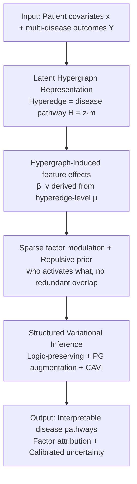

# Disentangling Latent Risk Pathways via Bayesian Hypergraph Inference

**Conference**: ICML 2026  
**arXiv**: [2606.07677](https://arxiv.org/abs/2606.07677)  
**Code**: [github.com/Naomi-Ding/BHPI](https://github.com/Naomi-Ding/BHPI)  
**Area**: Computational Biology / Bayesian Structure Learning  
**Keywords**: Bayesian Hypergraph, Multi-disease Modeling, Structured Variational Inference, Repulsive Prior, Electronic Health Records  

## TL;DR
To address the modeling challenges of "multi-disease, long-tail/rare diseases, and shared risk factors" in Electronic Health Records (EHR), the authors reformulate multi-disease risk as "risk-factor-modulated latent disease pathways." They employ a **latent hypergraph** (where hyperedges represent subsets of diseases sharing risk factors) to express high-order structures, coupled with a **repulsive prior** to ensure sparse and identifiable pathways. A **logic-preserving structured variational inference** framework is used for scalable posterior estimation with calibrated uncertainty.

## Background & Motivation

**Background**: EHRs allow for the simultaneous modeling of hundreds or thousands of disease risks at a population scale. In reality, individuals are often predisposed to multiple comorbidities. Disease prevalence ranges significantly from common chronic conditions to rare diseases, while shared pathways such as age, smoking, and social factors induce complex dependencies across diseases.

**Limitations of Prior Work**: Dependencies between diseases **are not uniform across all risk factors**—different factors organize diseases in distinct ways. For instance, age increases the risk for both cardiovascular and metabolic diseases, while smoking primarily affects respiratory and oncological conditions. These disease groupings are **overlapping, inherently uncertain, and factor-specific**. Existing methods fail to meet these requirements: independent disease-specific models (e.g., logistic regression) are transparent but treat diseases as isolated tasks, failing to leverage information for rare diseases and providing poor uncertainty calibration; multi-task/joint modeling can share information but often acts as a black box, entangling all risk factors into a single latent space and obscuring "which factor acts through which pathway"; structured disease networks/comorbidity models usually aggregate all factors into a single correlation structure, making it impossible to decouple by factor and difficult to scale to modern EHR dimensions.

**Key Challenge**: The true objective is not mere prediction, but **learning factor-specific, overlapping latent structures** that are **high-order** (grouping diseases rather than pairs), while providing **calibrated uncertainty** in long-tail, data-limited scenarios. Statistical efficiency (leveraging data for rare diseases) and structured inductive bias (interpretability and identifiability) must be achieved simultaneously.

**Goal**: To answer a core epidemiological question—through which shared disease pathways does a specific risk factor exert its influence, and how certain are we about this structure? This is decomposed into: (i) predicting risk across multiple correlated outcomes including low-prevalence diseases; (ii) recovering interpretable, overlapping latent disease pathways.

**Key Insight**: The authors' key insight is at the **representational level**—standard graphs and multi-task models only capture pairwise correlations or entangled shared effects, whereas etiological pathways are inherently high-order, involving groups of diseases. Therefore, **hyperedges of a hypergraph** should be used to represent these pathways.

**Core Idea**: Reformulate multi-disease modeling as "discovering latent, risk-factor-modulated disease pathways"—where diseases are hypergraph nodes, hyperedges are disease subsets sharing risk factor influence patterns, and risk factors **act directly on hyperedges**. This decouples factor influence from individual outcomes, naturally supporting overlapping, factor-specific disease organizations, and providing calibrated uncertainty for both structure and effect propagation within a fully Bayesian framework.

## Method

### Overall Architecture

BHPI (Bayesian Hypergraph Pathway Inference) consists of a generative Bayesian model and a scalable inference algorithm. The generative side follows a four-layer top-down structure: the observation model connects latent pathway structures to binary disease outcomes; the latent hypergraph encodes "which diseases belong to which pathway" via an incidence matrix $H$; hypergraph-induced feature effects transform hyperedge-level effects into disease-level risk factor coefficients; and sparse, repulsive-prior-modulated factor-hyperedge effects determine "which risk factor activates which pathway." The inference side utilizes **structured variational inference**: since there are hard logical dependencies between hyperedge existence, disease membership, and effects (existence → membership → effect), standard mean-field methods would break these dependencies and lead to miscalibrated uncertainty. The authors designed a variational family that preserves these couplings, combined with Pólya–Gamma augmentation and Coordinate Ascent Variational Inference (CAVI).

The input to the model consists of patient covariates $\boldsymbol{x}_i\in\mathbb{R}^P$ and multi-disease binary outcomes $Y_{i,v}$. The output consists of the disease pathway structure (hypergraph), attribution of risk factors to pathways, and posterior uncertainty for both.

### Key Designs

**1. Latent Disease Hypergraph: Representing High-order, Overlapping Pathways via Hyperedges**

Pairwise graphs and global shared representations can only express "pairwise correlations" or "entangled shared effects," whereas etiology involves groups of diseases driven by specific risk factor patterns—which is high-order. The authors use a hypergraph $\mathcal{G}=(\mathcal{V},\mathcal{E})$, where nodes $\mathcal{V}$ are diseases, and each hyperedge $e$ represents a subset of diseases with a shared response pattern to input features, encoded by an incidence matrix $H\in\{0,1\}^{V\times E}$. $H_{v,e}=1$ indicates disease $v$ belongs to pathway $e$. Hyperedges are allowed to overlap, enabling a disease to participate in multiple pathways. Disease-level feature effects are induced by hyperedge-level effects:

$$\beta_{j,v}=d_v^{-1}\cdot\sum_{e=1}^{E}H_{v,e}\,\mu_{j,e},\quad d_v=E^{1/2},$$

where $\mu_{j,e}$ is the effect of risk factor $j$ on hyperedge $e$, and the normalization constant $d_v=E^{1/2}$ stabilizes the variance of induced effects, preventing risk magnitudes from drifting as $E$ increases. The beauty of this construction is that a disease can be affected by different features through different pathways, and a feature can act on multiple disease subsets—decoupling "risk factor influence" from "individual outcomes," which is the foundation of interpretable attribution.

**2. Repulsive Prior: Enforcing Sparse, Identifiable Pathways to Prevent Latent Structure Collapse**

Without constraints, the same risk factor might be redundantly explained by multiple highly overlapping hyperedges, resulting in a structure that is neither sparse nor identifiable—this often degenerates into meaningless solutions under weak signals from rare diseases. Structurally, a hyperedge first has a binary existence indicator $z_e\sim\text{Bernoulli}(r_e)$; disease membership $m_{v,e}$ exists only if the hyperedge exists, with the incidence matrix $H_{v,e}=z_e\cdot m_{v,e}$, separating "global hyperedge discovery" from "intra-hyperedge composition." On the factor side, a spike-and-slab prior is used for hyperedge effects: $\mu_{j,e}\mid\gamma_{j,e}\sim(1-\gamma_{j,e})\delta_0+\gamma_{j,e}\mathcal{N}(0,\sigma_\mu^2)$, where the selector $\gamma_{j,e}$ determines if feature $j$ affects hyperedge $e$. The crucial repulsive prior penalizes a "single feature selecting multiple highly overlapping hyperedges":

$$\mathcal{R}_{\text{rep}}(\boldsymbol{\gamma}_j\mid H)\propto\exp\Big\{-\lambda\sum_{e_1<e_2}O(S_{e_1},S_{e_2})\cdot\gamma_{j,e_1}\gamma_{j,e_2}\Big\},$$

where $S_e=\{v:H_{v,e}=1\}$, the overlap coefficient $O(S_{e_1},S_{e_2})=\frac{|S_{e_1}\cap S_{e_2}|}{\min(|S_{e_1}|,|S_{e_2}|)}\in[0,1]$ ($1$ indicating complete overlap), and $\lambda$ controls repulsion strength. It encourages decoupling and identifiability **within a single feature's** pathways while **allowing overlap across different features**. Additional logical constraints $z_e=0\Rightarrow m_{v,e}=\gamma_{j,e}=\mu_{j,e}=0$ and $\gamma_{j,e}=0\Rightarrow\mu_{j,e}=0$ ensure factors are selected only on globally active hyperedges, maintaining structural coherence and stability.

**3. Structured Variational Inference: Preserving "Existence → Membership → Effect" Logic Dependencies**

Posterior computation is difficult due to non-conjugate logistic regression likelihoods combined with combinatorial latent hypergraphs and hard logic constraints. First, Pólya–Gamma augmentation introduces $\omega_{i,v}\sim\mathrm{PG}(1,\tilde{\eta}_{i,v})$ to turn the likelihood into conditionally Gaussian, enabling closed-form CAVI updates. The challenge is that standard mean-field (e.g., $q(z_e)\prod_v q(m_{v,e})$) would assign non-zero probability to logically impossible configurations like $\{z_e=0,m_{v,e}=1\}$, destroying calibration. Thus, the authors designed a **conditionally dependent variational family**: the posteriors for membership $m_{v,e}$ and effect selection $\gamma_{j,e}$ are **conditioned on $z_e$**, ensuring "zero-preservation"—once $q(z_e)$ shrinks to 0, the corresponding $q(m_{v,e}\mid z_e=0)$, $q(\gamma_{j,e}\mid z_e=0)$, and $q(\mu_{j,e})$ all collapse to a Dirac at 0, cleanly pruning inactive pathways. The update for $q(z_e)$ works as a "global switch," aggregating evidence from downstream disease membership and factor sparsity to prune redundant hyperedges. The per-iteration complexity is approximately $\mathcal{O}(N\cdot E\cdot(P+V))$, scaling linearly with sample size and hypergraph dimensions for large-scale EHR applications.

### Loss & Training
The inference goal is to minimize the KL divergence between the variational family and the true posterior, which is equivalent to maximizing the ELBO using Coordinate Ascent Variational Inference (CAVI). A highlight is the **repulsion-aware update**: the Bernoulli parameter $\nu_{j,e}^\ast$ for $\gamma_{j,e}$ is coupled to other hyperedges of the same feature by the repulsive prior, turning the update into a "competitive selection"—replacing combinatorial overlap with the variational expectation $\mathbb{E}_q[O(S_e,S_{e'})]$ as a penalty to suppress redundant pathways, ensuring a sparse and identifiable latent structure (see Algorithm 1 in the original paper).

## Key Experimental Results

### Main Results

Since real-world EHR data lacks ground truth for latent hypergraphs, the authors use simulated data to evaluate structure recovery and prediction, then validate on UK Biobank for real-world scenarios. Simulation settings: $V=30$ diseases, $E=5$ hyperedges, with diseases participating in multiple hyperedges; risk factor influence is sparse (the first predictor affects multiple hyperedges, while others affect single hyperedges). Non-zero effects are drawn from $\mathcal{N}(\mu,0.5^2)$ with $\mu\in\{1,1.5,2\}$; $N\in\{2000,5000\}$, 50 repetitions with a 60/20/20 split. The table below shows prediction AUC on simulated data ($\times100$, standard deviation in parentheses):

| Model | N=2000 | N=5000 |
|------|--------|--------|
| **BHPI (Ours)** | **75.00 (0.83)** | **74.63 (0.46)** |
| Optimal Logistic | 73.86 (0.83) | 74.15 (0.49) |
| LightGBM | 68.50 (0.94) | 69.68 (0.56) |
| Binary Relevance | 71.50 (0.94) | 72.61 (0.64) |
| Classifier Chain | 71.25 (1.03) | 72.63 (0.63) |
| RAkELd | 70.99 (0.95) | — |

BHPI matches or slightly outperforms Optimal Logistic regression in prediction AUC and significantly beats LightGBM and multi-label baselines, while **simultaneously** producing latent pathway structures and calibrated uncertainty—outputs that none of the baselines can provide.

### Capability Comparison

| Capability | Independent Models (LR) | Multi-task / Black-box | Comorbidity Networks | **BHPI** |
|------|------------------|------------|---------|----------|
| Leverage for Rare Diseases | ✗ | ✓ | Partial | ✓ |
| High-order (Group) Structure | ✗ | ✗ | ✗ (Pairwise) | ✓ |
| Factor-specific Pathways | ✗ | ✗ (Entangled) | ✗ (Aggregated) | ✓ |
| Calibrated Uncertainty | Poor | Limited | Limited | ✓ |

### Key Findings
- **Repulsive prior is critical for stable long-tail inference**: It prevents redundant explanation of a single factor by multiple overlapping hyperedges, mitigating latent structure collapse; without it, weak signals from rare diseases would lead to degenerate solutions.
- **Structured VI determines if uncertainty is trustworthy**: Maintaining the "existence → membership → effect" logic dependency via zero-preservation is a prerequisite for calibration; standard mean-field methods assign probability to logically impossible configurations.
- **Improved rare disease estimation without sacrificing prediction**: By leveraging the hypergraph, BHPI achieves better estimation for long-tail diseases while maintaining competitive global prediction AUC.
- **Interpretability and scalability achieved simultaneously**: The $\mathcal{O}(N\cdot E\cdot(P+V))$ linear complexity allows the framework to process large cohorts like UK Biobank to recover stable, interpretable disease pathways.

## Highlights & Insights
- **Modeling "how risk factors organize diseases" as an inferable latent hypergraph**: Hyperedge = pathway, and factors act on hyperedges. This representational choice directly decouples "which factor acts through which pathway," which is far more consistent with etiological structures than pairwise graphs or black-box multi-task models.
- **Repulsive prior + Overlap coefficient** provides a clean identifiability mechanism: Repulsion within a single feature and allowing overlap across different features prevents collapse without over-constraining the model—a concept transferable to any sparse selection problem with potential redundant activation.
- **Structured VI with "Zero-preservation" is a template for embedding hard logic constraints into approximate posteriors**: This approach is valuable for any Bayesian model with "existence → membership" hierarchical discrete structures.
- The fully Bayesian approach provides **calibrated uncertainty** on both structure and effects, which is more valuable for decision-making in precision medicine/epidemiology than point predictions.

## Limitations & Future Work
- The number of hyperedges $E$ is a pre-set upper bound. Although the existence indicator $z_e$ provides automatic pruning, the setting of the upper bound and prior hyperparameters ($\lambda$, Beta/Inv-Gamma priors) still requires tuning; automatic selection of $E$ is a natural extension.
- Quantitative evaluation of structure recovery relies on simulation (no ground truth in real EHR); the alignment between the simulation's generative process and true etiological mechanisms affects the generalizability of the findings.
- The observation model is a linear logistic function ($\tilde{\eta}_{i,v}=\alpha_v+\boldsymbol{x}_i^\top\boldsymbol{\beta}_v$), which may under-represent highly non-linear risk factor interactions; integration with neural feature extraction is a potential direction.
- Variational approximations (especially using expected overlap instead of combinatorial overlap for the repulsive term) introduce approximation errors, and the gap between this and MCMC has not been fully characterized at large scales.

## Related Work & Insights
- **vs Independent Disease Models (Penalized/Bayesian Logistic Regression)**: These are transparent but treat diseases as isolated tasks, fail to share information, and have poor uncertainty for rare diseases; BHPI shares risk factor effects via the hypergraph to benefit rare disease modeling.
- **vs Multi-task Learning / Shared Representations**: MTL uses shared latent factors/neural architectures to implicitly capture commonalities, but the representations are black-box, disease groupings are unclear, and structure uncertainty is missing; BHPI is explicit, interpretable, and provides calibrated uncertainty.
- **vs Comorbidity Networks / Multi-label Learning**: Comorbidity networks aggregate all factors into a single correlation structure without decoupling by factor; multi-label learning captures outcome dependencies but lacks factor-specific modulation; BHPI achieves factor-specific high-order decoupling.
- **vs Hypergraph Representation Learning (Hypergraph Neural Networks)**: Existing Hypergraph NNs mostly assume known hypergraph structures or infer them via heuristic similarities; BHPI treats the hypergraph topology as a **latent random variable** inferred within a fully Bayesian generative framework specifically designed to decouple risk factor modulations.

## Rating
- Novelty: ⭐⭐⭐⭐⭐ Reformulating multi-disease modeling as latent hypergraph pathway inference with a repulsive prior is a unique representational perspective.
- Experimental Thoroughness: ⭐⭐⭐⭐ Controlled simulation assessments + UK Biobank empirical evidence, though quantitative structure recovery still relies heavily on simulation.
- Writing Quality: ⭐⭐⭐⭐⭐ Clear progression from motivation to generative model and then to inference algorithms; logical constraints are well-explained.
- Value: ⭐⭐⭐⭐⭐ Combines interpretability, calibrated uncertainty, and leverage for rare diseases—highly useful for precision medicine and epidemiology.

<!-- RELATED:START -->

## Related Papers

- [\[ICML 2026\] iLoRA: Bayesian Low-Rank Adaptation with Latent Interaction Graphs for Microbiome Diagnosis](ilora_bayesian_low-rank_adaptation_with_latent_interaction_graphs_for_microbiome.md)
- [\[ICLR 2026\] Coupled Transformer Autoencoder for Disentangling Multi-Region Neural Latent Dynamics](../../ICLR2026/computational_biology/coupled_transformer_autoencoder_for_disentangling_multi-region_neural_latent_dyn.md)
- [\[ICML 2026\] Transformed Latent Variable Multi-Output Gaussian Processes](transformed_latent_variable_multi-output_gaussian_processes.md)
- [\[ICML 2026\] Towards Universal Gene Regulatory Network Inference: Unlocking Generalizable Regulatory Knowledge in Single-cell Foundation Models](towards_universal_gene_regulatory_network_inference_unlocking_generalizable_regu.md)
- [\[ICLR 2026\] Temporally Detailed Hypergraph Neural ODEs for Disease Progression Modeling](../../ICLR2026/computational_biology/temporally_detailed_hypergraph_neural_ode_for_disease_progression_modeling.md)

<!-- RELATED:END -->
