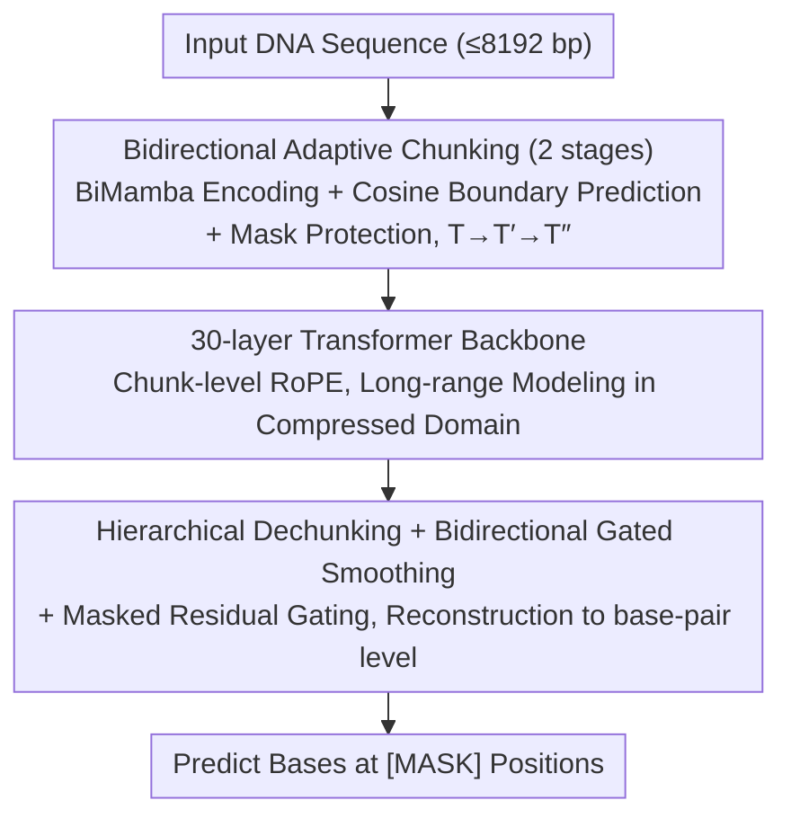

# DNAChunker: Learnable Tokenization for DNA Language Models

**Conference**: ICML2026  
**arXiv**: [2601.03019](https://arxiv.org/abs/2601.03019)  
**Code**: Not yet public  
**Area**: Scientific Computing / Genomic Language Models  
**Keywords**: DNA Language Models, Learnable Tokenization, Adaptive Chunking, Masked Language Modeling, BiMamba

## TL;DR
DNAChunker embeds an end-to-end learnable "dynamic chunker" within bidirectional masked DNA language models. It employs BiMamba encoding and cosine similarity-based boundary prediction to compress base-pair sequences into variable-length chunks. Augmented with mask protection and residual gating to prevent information leakage, the model—at 172M parameters and trained only on the human reference genome—outperforms 2.5B-scale multi-species pre-training baselines across five genomic benchmarks.

## Background & Motivation

**Background**: DNA language models (NT, DNABERT-2, HyenaDNA, Caduceus, etc.) are migrating the "tokenize-then-encode" paradigm from NLP to genomics. Prevailing tokenization schemes fall into three categories: single nucleotides, fixed-length k-mers, or BPE trained on large corpora.

**Limitations of Prior Work**: DNA sequences lack natural "word" boundaries, whereas the aforementioned schemes rely on context-independent fixed splitting. Figure 1 in the paper identifies two failure modes: (1) k-mers are extremely sensitive to small-scale perturbations; a single indel can shift the entire token sequence. (2) BPE relies on substring frequency, where high-frequency substrings are often non-functional repetitive elements, leading to the fragmentation of truly meaningful functional segments like TF-binding and cis-regulatory motifs.

**Key Challenge**: There is a structural conflict between context-independent fixed tokenization and the context-dependent nature of genomic functions.

**Goal**: Upgrade tokenization from a "preprocessing hyperparameter" to an "end-to-end learnable module" that ensures chunking results are: (i) length-adaptive to compress redundant regions; (ii) fine-grained in function-rich areas; and (iii) robust against SNVs, InDels, and structural variations.

**Key Insight**: The authors note that dynamic chunking exists in the autoregressive space (e.g., H-Net, Hwang et al., 2026). However, DNA signals are bidirectional—the semantics of promoters/enhancers depend on both upstream and downstream contexts—meaning the chunking itself must be bidirectional. Furthermore, since `[MASK]` tokens in MLM are artificial, if they participate in chunking or leak to the decoder via encoder residuals, the model may learn "mask-shaped" shortcuts that fail to generalize to mask-free downstream data.

**Core Idea**: Encode base-pair features using BiMamba $\rightarrow$ predict hard boundaries between adjacent positions via a cosine similarity routing network $\rightarrow$ merge similar adjacent positions into variable-length chunks for the Transformer backbone, while employing mask protection and residual gating to block mask information leakage paths.

## Method

### Overall Architecture
DNAChunker follows an encoder–main–decoder bidirectional MLM structure. Given a nucleotide sequence of up to 8192 bp, the goal is to predict masked bases. Instead of fixed k-mer/BPE tokenization, the sequence is "compressed twice and expanded twice" during the forward pass. The base-pair length $T$ is reduced to a chunk sequence $T''$ via two stages of learnable chunking. A 30-layer Transformer backbone performs long-range modeling at this shortest length, followed by two stages of dechunking to upsample back to base-pair resolution. Most of the computational budget for long-range attention is reserved for the main network; encoding and decoding utilize lightweight BiMamba for compression and expansion, allowing 172M parameters to rival 1.2B-scale models.

### Key Designs

**1. Bidirectional Adaptive Chunking: Transforming tokenization into learnable boundary prediction**

Fixed k-mer/BPE schemes are context-independent, whereas promoter/enhancer boundaries depend on surrounding evidence. At each chunking stage $s$, DNAChunker projects input features $\widehat{x}^{(s)}$ to query $q^{(s)}_t$ and key $k^{(s)}_t$. The boundary probability is calculated using the cosine "dissimilarity" of adjacent positions: $p^{(s)}_t = \tfrac{1}{2}\bigl(1 - \tfrac{(q^{(s)}_t)^\top k^{(s)}_{t-1}}{\|q^{(s)}_t\|\,\|k^{(s)}_{t-1}\|}\bigr)$. This is thresholded to form hard boundaries $b^{(s)}_t = \mathbf{1}(p^{(s)}_t \ge 0.5)$, aggregating base-pair representations within a segment into a single chunk embedding. The sequence length is reduced from $T$ to $T' = \sum_t b^{(0)}_t$. Because query/key pairs originate from BiMamba, boundary prediction considers both directions—a capability missing in unidirectional autoregressive schemes like H-Net or Byte Latent Transformer.

An MLM-specific anti-leakage design, the mask protection mechanism, forces a boundary before and after every `[MASK]` position, ensuring masked nucleotides always occupy their own single-token chunk to prevent the model from using mask shapes as a shortcut.

**2. 30-layer Transformer Backbone + Chunk-level RoPE: Long-range reasoning in the compressed domain**

The backbone is a standard Pre-LN Transformer (Multi-head Self-attention + GELU FFN). For positional encoding, RoPE utilizes the "center base-pair index" of each chunk as the position ID. This ensures that even with variable-length chunks, relative positions maintain physical base-pair scales. Computational efficiency is achieved by using lightweight BiMamba for the encoder/decoder and reserving the Transformer for the compressed domain.

**3. Hierarchical Dechunking + Bidirectional Gated Smoothing + Masked Residual Gating: Upsampling and blocking leakage**

The $T''$ chunk representations must be restored to base-pair resolution for prediction. Dechunking first performs piecewise-constant replication $\tilde z^{(s+1)}_t = z^{(s)}_{\sum_{k\le t} b^{(S-s)}_k}$. Subsequently, forward and backward linear recursions $\textsc{Scan}_\rightarrow, \textsc{Scan}_\leftarrow$ use the boundary probability $p$ as a gate for bidirectional smoothing: $z^{(s+1)}_t = \tfrac{1}{2}(\textsc{Scan}_\rightarrow + \textsc{Scan}_\leftarrow)$. This allows gradients to flow back to the routing network via $p$ and reinjects context into base-pair representations.

To complement mask protection, a masked residual gating mechanism is employed: encoder residuals are only applied to positions within "mask-free chunks." Chunks containing masks receive zero residuals, forcing the reconstruction of those segments to pass entirely through the main network and preventing the BiMamba encoder from leaking ground truth to the decoder.

### Loss & Training
The total loss is $\mathcal{L} = \mathcal{L}_{\text{MLM}} + \lambda\mathcal{L}^{(0)}_{\text{ratio}} + \lambda\mathcal{L}^{(1)}_{\text{ratio}}$. The MLM term follows the BERT protocol (15% selection: 80% `[MASK]`, 10% random, 10% original), with weights for repetitive regions reduced to 0.1. A compression ratio regularization is added: $\mathcal{L}^{(s)}_{\text{ratio}} = \tfrac{\bar b^{(s)}\bar p^{(s)}}{\alpha^{(s)}} + \tfrac{(1-\bar b^{(s)})(1-\bar p^{(s)})}{1-\alpha^{(s)}}$, where $\bar b^{(s)}$ and $\bar p^{(s)}$ are the mean hard boundary ratio and mean probability, respectively, and $\alpha^{(s)}$ is the target ratio. The model is pre-trained on the GRCh38/hg38 human reference genome with 8192 bp inputs.

## Key Experimental Results

### Main Results
DNAChunker was validated across five benchmarks. The model consistently outperformed larger baselines, including the 2.5B parameter NT and 1.2B GENERator, despite having only 172M parameters.

| Benchmark | Metric | DNAChunker (172M) | Strongest Baseline | Note |
|---|---|---|---|---|
| NT benchmark | Mean MCC ↑ / Mean rank ↓ | **0.772** / **1.67** | GENERator (1.2B) 0.728 / 2.06 | Won 13/18 datasets; Histone mean MCC 0.701 vs 0.625 |
| Revised NT benchmark | Mean MCC ↑ | **0.660** | PatchDNA 0.626; MxDNA 0.637 | Splice site +0.068 vs MxDNA |
| Genomic Benchmarks | Top-1 Acc ↑ / Mean rank ↓ | 0.885 / 3.29 | GENERator 0.892 / 2.89 | Comparable to GENERator with $7\times$ fewer params |
| DNALongBench | 5 Tasks (up to 1 Mb context) | All > Caduceus-PH | Caduceus-PH (LP) | Enhancer-target +0.061; txn init +0.047 |
| BEND | Mean rank ↓ | **1.9** | PatchDNA 2.1 | Variant effect (expression) AUROC 0.59 lead |

### Ablation Study
Ablations on the revised NT benchmark (2B token budget, linear probing) demonstrate the importance of each component:

| Configuration | Histone | Enhancers | Promoters | Splice | Overall MCC |
|---|---|---|---|---|---|
| 6-mer | 0.338 | 0.319 | 0.593 | 0.147 | 0.347 |
| BPE | 0.339 | 0.349 | 0.667 | 0.223 | 0.375 |
| w/o Mask Protection | 0.316 | 0.293 | 0.614 | 0.128 | 0.332 |
| w/o Residual Gating | 0.338 | 0.298 | 0.607 | 0.185 | 0.353 |
| w/o Ratio Loss | 0.341 | 0.290 | 0.635 | 0.123 | 0.348 |
| **DNAChunker (full)** | **0.344** | **0.346** | **0.673** | **0.290** | **0.390** |

### Key Findings
- **Anti-leakage mechanisms are critical**: Removing mask protection leads to significant performance degradation (overall MCC 0.390 $\rightarrow$ 0.332), confirming the existence of the "mask shape shortcut."
- **Superiority over fixed tokenization**: DNAChunker significantly outperforms BPE and 6-mer, especially in splice site detection, where the MCC improved from 0.147/0.223 to 0.290.
- **Scaling Efficiency**: A 172M parameter model trained only on GRCh38 outperformed 2.5B/1.2B multi-species models, suggesting gains come from architecture and tokenization rather than raw scale.
- **Long-range Efficiency**: Adaptive compression allowed the model to outperform task-specific experts on 1 Mb context tasks using only linear probing on a frozen backbone.

## Highlights & Insights
- Transitioning tokenization to an end-to-end learnable bidirectional module is particularly effective for DNA, which lacks natural word boundaries. BPE frequency statistics can introduce mismatched priors in genomics.
- The mask protection mechanism addresses subtle leakage issues specific to MLM that do not exist in autoregressive models.
- The "lean head, fat middle" computational allocation provides a template for other multi-modal long-sequence modeling tasks by focusing expensive attention on a compressed domain.

## Limitations & Future Work
- Pre-training was limited to the GRCh38 single species; cross-species generalization (e.g., bacteria, viruses) compared to autoregressive models like Evo2 remains unverified.
- Despite improvements, performance on splice site tasks still lags slightly behind GENERator, suggesting variable-length chunks may still have disadvantages for tasks requiring absolute single-nucleotide precision.
- The boundary criterion (thresholded cosine similarity) is relatively simple compared to entropy-based gates.

## Related Work & Insights
- **vs Caduceus / NT-v2**: Demonstrates that the limitation of traditional MLMs lies in fixed tokenization rather than the MLM objective itself.
- **vs DNABERT-2 / GROVER**: Confirms that BPE is often a mismatched prior for DNA, as it over-emphasizes non-functional repetitive sequences.
- **vs MxDNA / PatchDNA**: DNAChunker achieves higher fine-grained accuracy (e.g., splice site MCC) through bidirectional routing and mask protection.
- **vs H-Net / Byte Latent Transformer**: Adapts learnable chunking from autoregressive models to the bidirectional MLM framework.

## Rating
- Novelty: ⭐⭐⭐⭐
- Experimental Thoroughness: ⭐⭐⭐⭐⭐
- Writing Quality: ⭐⭐⭐⭐
- Value: ⭐⭐⭐⭐⭐

<!-- RELATED:START -->

<!-- RELATED:END -->

## Related Papers

- [\[ICLR 2026\] AntigenLM: Structure-Aware DNA Language Modeling for Influenza](../../ICLR2026/computational_biology/antigenlm_structure-aware_dna_language_modeling_for_influenza.md)
- [\[ICLR 2026\] Tracing Pharmacological Knowledge in Large Language Models](../../ICLR2026/computational_biology/tracing_pharmacological_knowledge_in_large_language_models.md)
- [\[ICLR 2026\] Controlling Repetition in Protein Language Models](../../ICLR2026/computational_biology/controlling_repetition_in_protein_language_models.md)
- [\[ICML 2025\] Protein Structure Tokenization: Benchmarking and New Recipe](../../ICML2025/computational_biology/protein_structure_tokenization_benchmarking_and_new_recipe.md)
- [\[ICLR 2026\] Protein Structure Tokenization via Geometric Byte Pair Encoding](../../ICLR2026/computational_biology/protein_structure_tokenization_via_geometric_byte_pair_encoding.md)

<!-- RELATED:END -->
