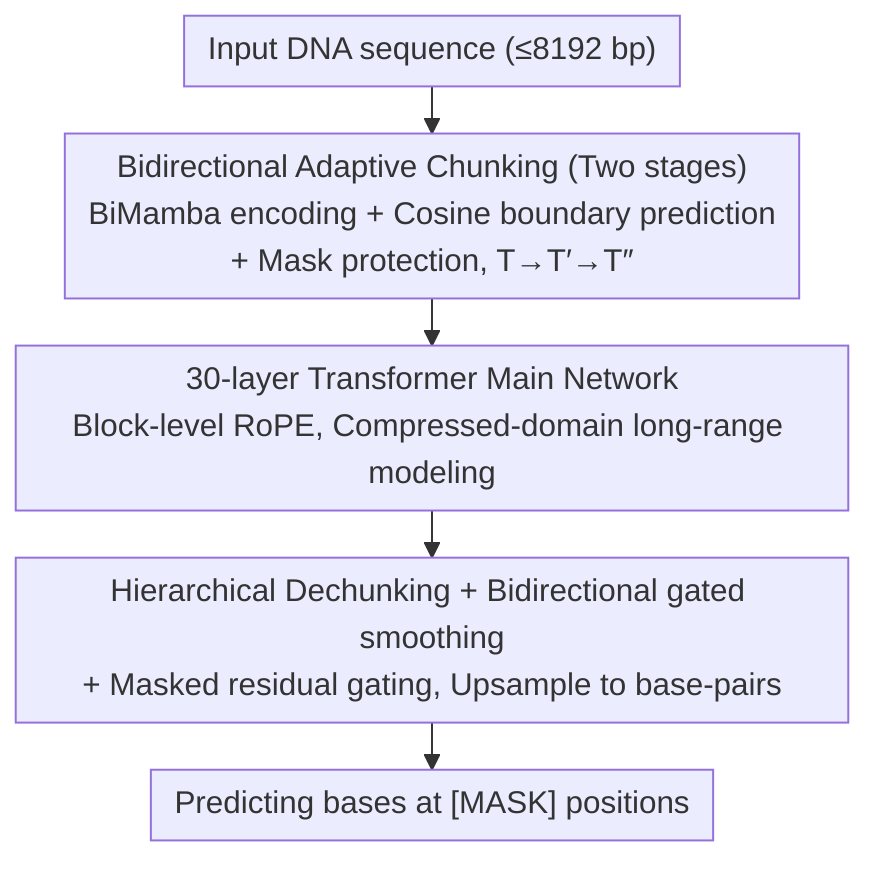

# DNAChunker: Learnable Tokenization for DNA Language Models

**Conference**: ICML2026  
**arXiv**: [2601.03019](https://arxiv.org/abs/2601.03019)  
**Code**: Not yet public  
**Area**: Scientific Computing / Genomic Language Models  
**Keywords**: DNA language models, learnable tokenization, adaptive chunking, masked language modeling, BiMamba

## TL;DR
DNAChunker embeds an end-to-end learnable "dynamic chunker" into masked DNA language models. It compresses base-pair sequences into variable-length chunks via bidirectional Mamba encoding and cosine similarity boundary prediction. Combined with mask protection and residual gating to prevent information leakage, it outperforms 2.5B-scale multi-species pre-trained baselines on five genomic benchmarks using only 172M parameters and the human reference genome.

## Background & Motivation

**Background**: DNA language models (NT, DNABERT-2, HyenaDNA, Caduceus, etc.) are porting the "tokenize-then-encode" paradigm from NLP to genomics. Prevailing tokenization schemes fall into three categories: single nucleotides, fixed-length k-mers, or BPE trained on large corpora.

**Limitations of Prior Work**: DNA sequences lack natural "word" boundaries, and existing schemes rely on context-insensitive fixed partitioning. Figure 1 of the paper highlights two failure modes: (1) k-mers are extremely sensitive to small-scale perturbations, where a single indel can shift the entire token sequence; (2) BPE relies on substring frequency, where high-frequency substrings are often non-functional repetitive elements, leading to the fragmentation of meaningful functional motifs like TF-binding or cis-regulatory motifs.

**Key Challenge**: There is a structural conflict between "context-free fixed tokenization" and the "context-dependent nature of genomic functions."

**Goal**: Upgrade tokenization from a "preprocessing hyperparameter" to an "end-to-end learnable module" so that chunking results simultaneously satisfy: (i) adaptive length to compress redundant regions; (ii) fine-granularity in function-rich regions; and (iii) robustness to SNVs, indels, and structural variations.

**Key Insight**: The authors note that while dynamic chunking exists for autoregressive models (e.g., H-Net), DNA signals are inherently bidirectional—the semantics of promoters/enhancers depend on both upstream and downstream contexts. Furthermore, the `[MASK]` token in MLM training is an artificial construct. If it participates in chunking or leaks to the decoder via encoder residuals, the model may learn shortcuts based on the mask shape, failing to generalize to unmasked downstream data.

**Core Idea**: Encode base-pair features using bidirectional Mamba → predict hard boundaries between adjacent positions using a cosine similarity routing network → merge similar adjacent positions into variable-length chunks for the Transformer backbone, using mask protection and residual gating to block mask information leakage.

## Method

### Overall Architecture
DNAChunker follows an encoder–main–decoder architecture for bidirectional MLM. It inputs a nucleotide sequence (up to 8192 bp) and predicts bases at masked positions. instead of fixed k-mer/BPE tokenization, the sequence is "compressed twice and expanded twice" during the forward pass. The base-pair length $T$ is reduced to a chunk sequence $T''$ through two stages of learnable chunking. A 30-layer Transformer backbone performs long-range modeling at this compressed length, followed by two stages of dechunking to upsample back to base-pair resolution. The design leaves the bulk of the computation for long-range attention in the main network: encoding and decoding use lightweight BiMamba for "compression" and "expansion," allowing 172M parameters to achieve modeling capabilities comparable to 1.2B-scale models.

### Key Designs

**1. Bidirectional Adaptive Chunking: Transforming "tokenization" into learnable boundary prediction**

Fixed k-mer/BPE schemes suffer from context-insensitivity, whereas promoter/enhancer boundaries depend on surrounding evidence. At each chunking stage $s$, DNAChunker projects input features $\widehat{x}^{(s)}$ to get queries $q^{(s)}_t$ and keys $k^{(s)}_t$. The cosine "dissimilarity" between adjacent positions is used as the boundary probability $p^{(s)}_t = \tfrac{1}{2}\bigl(1 - \tfrac{(q^{(s)}_t)^\top k^{(s)}_{t-1}}{\|q^{(s)}_t\|\,\|k^{(s)}_{t-1}\|}\bigr)$, which is then thresholded into hard boundaries $b^{(s)}_t = \mathbf{1}(p^{(s)}_t \ge 0.5)$. Base-pair representations within the same boundary are aggregated into a chunk embedding, reducing the sequence length from $T$ to $T' = \sum_t b^{(0)}_t$. Because queries and keys are derived from BiMamba, the boundary prediction considers both upstream and downstream contexts—a necessity for bidirectional DNA semantics that unidirectional schemes like H-Net or Byte Latent Transformer cannot provide.

An MLM-specific leakage prevention design is also included: the mask protection mechanism forces a boundary before and after every `[MASK]` position, ensuring masked nucleotides always occupy a single-token chunk. Without this, the chunking module might use "mask shapes" as a shortcut for partitioning, leading to poor generalization.

**2. 30-layer Transformer Backbone + Block-level RoPE: Long-range reasoning in the compressed space**

The main network is a standard Pre-LN Transformer (Multi-head Self-Attention + GELU FFN) containing the majority of parameters. For positional encoding, RoPE uses the "center base-pair index" of each chunk as the position ID rather than the token index. This ensures that relative positions maintain physical scales in base-pairs, preserving genomic coordinate semantics even with variable-length chunks. This "thin head, fat middle" allocation—lightweight BiMamba for encoder/decoder and Transformer for the backbone—is why 172M parameters can rival the 1.2B GENERator.

**3. Hierarchical Dechunking + Bidirectional Probability-gated Smoothing + Masked Residual Gating**

The backbone outputs chunk representations of length $T''$, which must be restored to base-pair resolution. Dechunking first uses piecewise-constant replication $\tilde z^{(s+1)}_t = z^{(s)}_{\sum_{k\le t} b^{(S-s)}_k}$ to broadcast chunk representations back to covered base-pairs. Then, a pair of forward/backward linear recursions $\textsc{Scan}_\rightarrow,\textsc{Scan}_\leftarrow$, gated by boundary probability $p$, perform bidirectional smoothing: $z^{(s+1)}_t = \tfrac{1}{2}(\textsc{Scan}_\rightarrow + \textsc{Scan}_\leftarrow)$. This allows gradients to flow back to the router via $p$ (since $b$ is non-differentiable) and re-injects bidirectional context.

Accompanying mask protection is the masked residual gating: encoder residuals are only enabled for positions where the "chunk does not contain a mask." Chunks containing a mask receive zero residuals, forcing the reconstruction of those positions to pass through the main network. Otherwise, the encoder's BiMamba might leak ground-truth neighbor information to the decoder via residuals.

### Loss & Training
The total loss is $\mathcal{L} = \mathcal{L}_{\text{MLM}} + \lambda\mathcal{L}^{(0)}_{\text{ratio}} + \lambda\mathcal{L}^{(1)}_{\text{ratio}}$. The MLM term follows the BERT protocol (15% selection: 80% `[MASK]`, 10% random, 10% original), with duplicate region weights reduced to 0.1. Each chunking stage includes a "compression ratio" regularization: $\mathcal{L}^{(s)}_{\text{ratio}} = \tfrac{\bar b^{(s)}\bar p^{(s)}}{\alpha^{(s)}} + \tfrac{(1-\bar b^{(s)})(1-\bar p^{(s)})}{1-\alpha^{(s)}}$, where $\bar b^{(s)}$ and $\bar p^{(s)}$ are the mean hard boundary ratio and probability, and $\alpha^{(s)}\in(0,1)$ is the target compression ratio. The pre-training corpus is the GRCh38/hg38 human reference genome. Downstream tasks use a linear classification head on mean-pooled tokens.

## Key Experimental Results

### Main Results
Validated across five benchmarks. DNAChunker (172M) outperforms the 2.5B multi-species NT and 1.2B GENERator.

| Benchmark | Metric | DNAChunker (172M) | Best Baseline | Remarks |
|---|---|---|---|---|
| NT benchmark | Avg MCC ↑ / Avg Rank ↓ | **0.772** / **1.67** | GENERator (1.2B) 0.728 / 2.06 | Wins 13/18 tasks; histone avg MCC 0.701 vs 0.625 |
| Revised NT benchmark | Avg MCC ↑ | **0.660** | PatchDNA 0.626; MxDNA 0.637 | splice site +0.068 vs MxDNA |
| Genomic Benchmarks | top-1 acc ↑ / Avg Rank ↓ | 0.885 / 3.29 | GENERator 0.892 / 2.89 | Comparable to GENERator with $7\times$ fewer parameters |
| DNALongBench | 5 Tasks (up to 1 Mb) | All > Caduceus-PH | Caduceus-PH (LP) | enhancer-target +0.061; txn init +0.047 |
| BEND | Avg Rank ↓ | **1.9** | PatchDNA 2.1 | Variant effect (expression) AUROC 0.59 lead |

### Ablation Study
Tested on the revised NT benchmark using 2B tokens with controlled variables (Linear Probe):

| Configuration | Histone | Enhancers | Promoters | Splice | Overall MCC |
|---|---|---|---|---|---|
| 6-mer | 0.338 | 0.319 | 0.593 | 0.147 | 0.347 |
| BPE | 0.339 | 0.349 | 0.667 | 0.223 | 0.375 |
| w/o Mask Protection | 0.316 | 0.293 | 0.614 | 0.128 | 0.332 |
| w/o Residual Gating | 0.338 | 0.298 | 0.607 | 0.185 | 0.353 |
| w/o Ratio Loss | 0.341 | 0.290 | 0.635 | 0.123 | 0.348 |
| **DNAChunker (full)** | **0.344** | **0.346** | **0.673** | **0.290** | **0.390** |

### Key Findings
- All three anti-leakage/compression mechanisms are essential: Removing mask protection causes the most significant drop (overall 0.332 vs 0.390), confirming the existence of mask-shape shortcuts.
- Direct comparison with fixed tokenization: DNAChunker's overall MCC (0.390) is significantly higher than BPE (0.375) and 6-mer (0.347), with a major leap in splice site detection.
- Scalability and Efficiency: Training on the single-species GRCh38 with 172M parameters outperforms multi-species models with billions of parameters, suggesting gains stem from the architecture and tokenization.
- Long-range Efficiency: Adaptive compression allows the model to handle 1 Mb contexts in DNALongBench, outperforming task-specific experts with just frozen backbone linear probing.

## Highlights & Insights
- Shifting tokenization from an offline hyperparameter to an end-to-end learnable module is highly effective for DNA, which has no natural dictionary.
- The mask protection mechanism is a sophisticated insight into MLM-specific vulnerabilities, blocking shortcuts that would hinder generalization.
- The "thin head, fat middle" computation strategy provides a template for other multi-modal long-sequence modeling (proteins, code, etc.) by concentrating resource-heavy attention in the compressed domain.

## Limitations & Future Work
- Pre-training was limited to the GRCh38 single species; cross-species generalization (bacteria, viruses) remains to be verified against models like Evo2.
- While it outperforms most, it still slightly trails GENERator on specific splice site tasks, as variable-length chunks may have structural disadvantages for tasks requiring absolute single-nucleotide precision.
- The boundary criterion (cosine similarity + 0.5 threshold) is relatively simple compared to entropy-based gating.

## Related Work & Insights
- **vs Caduceus / NT-v2 (Fixed Tokenization MLM)**: Proves that the limitation in prior MLMs was not the BERT framework but context-insensitive tokenization.
- **vs DNABERT-2 / GROVER (BPE)**: Demonstrates that BPE creates a mismatched prior in DNA by focusing on non-functional high-frequency repeats.
- **vs MxDNA / PatchDNA (Genomic Learnable Tokenization)**: Improves upon these by using bidirectional routing and mask protection to handle fine-grained tasks like splice sites.
- **vs H-Net / Byte Latent Transformer (AR Learnable Tokenization)**: Adapts the concept for bidirectional MLM with specific genomic anti-leakage guards.

## Rating
- Novelty: ⭐⭐⭐⭐
- Experimental Thoroughness: ⭐⭐⭐⭐⭐
- Writing Quality: ⭐⭐⭐⭐
- Value: ⭐⭐⭐⭐⭐

<!-- RELATED:START -->

## Related Papers

- [\[ICLR 2026\] AntigenLM: Structure-Aware DNA Language Modeling for Influenza](../../ICLR2026/computational_biology/antigenlm_structure-aware_dna_language_modeling_for_influenza.md)
- [\[ICLR 2026\] Tracing Pharmacological Knowledge in Large Language Models](../../ICLR2026/computational_biology/tracing_pharmacological_knowledge_in_large_language_models.md)
- [\[ICML 2026\] Insertion Based Sequence Generation with Learnable Order Dynamics](insertion_based_sequence_generation_with_learnable_order_dynamics.md)
- [\[ICLR 2026\] Controlling Repetition in Protein Language Models](../../ICLR2026/computational_biology/controlling_repetition_in_protein_language_models.md)
- [\[ICML 2026\] Circuit Tracing in Autoregressive Protein Language Models](circuit_tracing_in_autoregressive_protein_language_models.md)

<!-- RELATED:END -->
