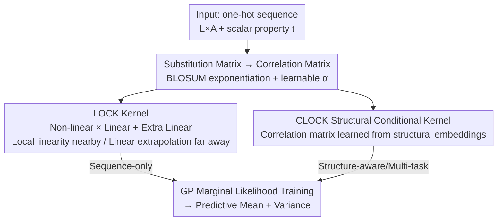

# Flexible Kernels for Protein Property Prediction

**Conference**: ICML 2026  
**arXiv**: [2606.11057](https://arxiv.org/abs/2606.11057)  
**Code**: https://github.com/generatebio/lock_gp  
**Area**: Computational Biology / Protein Property Prediction / Gaussian Processes  
**Keywords**: Gaussian Processes, Sequence Kernels, Substitution Matrices, Local Linearity, Structural Conditional Kernels  

## TL;DR
This paper designs a family of "flexible kernels" (LOCK / CLOCK) for protein sequences, directly encoding biophysical priors from evolutionary substitution matrices (BLOSUM) and the local linearity assumption of "property additivity under mutation" into Gaussian Process kernels. These kernels frequently outperform complex methods relying on large-scale model embeddings in data-scarce protein property prediction tasks and can zero-shot absorb information from structural foundation models for multi-task learning.

## Background & Motivation
**Background**: In protein design, accurately predicting properties such as binding affinity, thermal stability, and fluorescence is a core requirement. In recent years, the mainstream approach has been using Protein Language Models (PLMs) like ESM-2 as feature extractors followed by a lightweight supervised head (or full fine-tuning), or using Gaussian Process kernels like Kermut constructed from ESM-2 embeddings, structural coordinates, and ProteinMPNN inverse-folding logits.

**Limitations of Prior Work**: The "large model embedding + supervised head" pipeline comes with significant costs— numerous training hyperparameters, high computational overhead, and extreme susceptibility to overfitting on small datasets. Furthermore, many studies find that high performance on PLM pre-training tasks does not necessarily transfer to downstream supervised tasks. More practically, experimental data is often extremely sparse (a landscape often contains only dozens to thousands of labeled sequences), requiring models to be **data-efficient**, provide **high-quality uncertainty estimation**, and allow for **multi-task sharing** across related property landscapes.

**Key Challenge**: Sequence kernels must balance two extremes. The simplest linear kernel (equivalent to Bayesian linear regression) assumes properties are perfectly additive across mutations, making it "aggressive" during extrapolation—extending linearly even dozens of mutations away from training data. Conversely, multiplicative kernels like RBF decay exponentially with Hamming distance, making them "over-conservative" and regressing to the prior mean far from training data. Neither is ideal for model-driven protein design. Worse, both naive kernels are "amino acid agnostic": observing the mutation 8A→8V provides no information for inferring the effect of 8A→8I, wasting known biophysical similarities between amino acids.

**Goal**: Construct a sequence kernel that is data-efficient, provides inherent uncertainty, and supports multi-tasking by (1) utilizing amino acid similarities encoded in substitution matrices; (2) performing detailed non-linear prediction near training data while degrading smoothly to robust linear prediction far away; and (3) optionally absorbing information from structural foundation models.

**Core Idea**: Convert substitution matrices into "correlation matrices" within an anisotropic RBF kernel, using a learnable exponent to adjust similarity strength. Then, use a product of "arbitrary kernel $\times$ linear kernel" to endow the model with local linearity. The combination of these results in the LOCK kernel. By replacing the fixed substitution matrix with one learned from structural embeddings, the structural conditional kernel CLOCK is obtained.

## Method

### Overall Architecture
The objective of LOCK-GP is: given a protein property landscape ($N$ sequences, each with a scalar property $t_n$), use a Gaussian Process (GP) to predict the property of any new sequence while providing variance. The core of the method lies in **how to design the GP kernel function**. Sequences are one-hot encoded into $L \times A$ matrices ($L$ is length, $A$ is alphabet size).

The authors build this kernel in three steps: first, processing the BLOSUM evolutionary substitution matrix into a **correlation matrix** with a learnable exponent as a measure of amino acid similarity (Design 1); second, using a combination of "non-linear kernel $\times$ linear kernel + an additional linear kernel" to ensure the kernel is locally linear nearby and degrades to linear extrapolation far away, forming the LOCK kernel (Design 2); and finally, replacing fixed substitution matrices with correlation matrices learned from structural foundation model embeddings to obtain the CLOCK kernel, which is naturally suited for multi-task learning (Design 3). Beyond these steps, a set of hyperparameter priors is employed to stabilize training (Design 4).

### Key Designs

**1. Substitution Matrix Correlation Mapping + Learnable Exponent: Making the Kernel "Recognize" Biophysical Similarity**

Naive linear and RBF kernels treat the 20 amino acids as mutually orthogonal symbols; thus, observing 8A→8V teaches nothing about 8A→8I. The first step here incorporates existing BLOSUM substitution matrices. substitution matrices are originally given as log-odds scores $M_{ij}=\log(q_{ij}/p_ip_j)$. The authors take the element-wise exponential $S_{ij}=e^{M_{ij}}$ and normalize it into a correlation matrix $C_{aa'}=S_{aa'}/\sqrt{S_{aa}S_{a'a'}}$ to ensure $k(\mathbf{x},\mathbf{x})=1$. This upgrades the per-site kernel from "1 if same, 0 if different" to "scoring by amino acid similarity"—where Valine and Isoleucine are highly correlated while Tryptophan and Cysteine are dissimilar to most.

The key insight is that BLOSUM family matrices are not only positive semi-definite but also **infinitely divisible**—meaning the element-wise power $S^{\circ\alpha}$ ($(S^{\circ\alpha})_{ij}=(S_{ij})^\alpha$) remains positive semi-definite for any positive power. This allows the authors to equip the correlation matrix with a **learnable exponent** $\alpha_\ell$: $\alpha > 1$ decays off-diagonal similarity (more "selective"), while $\alpha < 1$ amplifies it (more "forgiving"). Exponents can be shared globally or vary per-site $\alpha_\ell$, adaptively tuning general evolutionary similarity to the current landscape. The anisotropic RBF kernel, written as a product of per-site covariance matrices $k_{\rm rbf}(\mathbf{x},\mathbf{y})=\prod_\ell \mathbf{x}_\ell^{\rm T}\mathbf{C}_\ell^{\alpha_\ell}\mathbf{y}_\ell$, serves as the carrier for this step.

**2. Local Linear Combination of LOCK Kernels: Detail Nearby, Robustness Far Away**

Protein properties are often "approximately additive" under single-point mutations (beyond global epistasis, pairwise effects are usually small). This prior is directly hard-coded into the kernel: any kernel of the form $k'\,k_{\rm lin}$ (arbitrary kernel multiplied by a linear kernel) corresponds to a "locally linear" function class—if a GP prior is placed on linear coefficients $\bm\beta(\mathbf{x})$ controlled by $k'$ that varies slowly in sequence space, then $f(\mathbf{x})\approx\bm\beta(\mathbf{x}_0)\cdot\mathbf{x}$ is linear in the neighborhood of $\mathbf{x}_0$.

Thus, the LOCK kernel is defined as:

$$k^{\text{LOCK}}(\mathbf{x},\mathbf{y})=\sigma_1^2\,k_{\rm nl}^{\text{LOCK}}(\mathbf{x},\mathbf{y})\,k_{\rm lin}^{\text{LOCK}}(\mathbf{x},\mathbf{y})+\sigma_2^2\,\tilde{k}_{\rm lin}^{\text{LOCK}}(\mathbf{x},\mathbf{y})$$

Where $k_{\rm lin}^{\text{LOCK}}=\sum_\ell \mathbf{x}_\ell^{\rm T}\mathbf{C}_\ell^{\alpha_\ell}\mathbf{y}_\ell$ is an additive correlation linear kernel and $k_{\rm nl}^{\text{LOCK}}=\prod_\ell \mathbf{x}_\ell^{\rm T}\mathbf{C}_\ell^{\alpha_\ell}\mathbf{y}_\ell$ is a multiplicative (generalized RBF) kernel, both built on the correlation matrices from Design 1. The product term $k_{\rm nl}^{\text{LOCK}}k_{\rm lin}^{\text{LOCK}}$ ensures local linearity; the extra linear kernel $\tilde{k}_{\rm lin}^{\text{LOCK}}$ serves as a fallback. The beauty of this combination lies in **kernel decay**: near training data where $k_{\rm nl}^{\text{LOCK}} \gg 0$, the kernel provides non-linear predictions responding to local data details; far from training data where $k_{\rm nl}^{\text{LOCK}} \approx 0$, the model does not regress to the prior mean like pure multiplicative kernels, but smoothly transitions to linear extrapolation controlled by $\tilde{k}_{\rm lin}^{\text{LOCK}}$. This avoids both "aggressive linear extrapolation" and "conservative multiplicative extrapolation"—it is detailed nearby and robust far away, constrained throughout by biophysical knowledge. The multiplicative kernel can be computed in log space ($\exp(\sum_\ell \alpha_\ell\mathbf{x}_\ell^{\rm T}\log^\circ(\mathbf{C}_\ell)\mathbf{y}_\ell)$) for numerical stability.

**3. CLOCK Structural Conditional Kernel: Zero-shot Integration of Structural Models and Multi-tasking**

While LOCK only accesses global protein information via "canned" substitution matrices, CLOCK makes this **learnable**. It takes site-specific structural embeddings $\mathbf{h}_{1:L}(\mathcal{S})$ from a pre-trained structural foundation model, uses a linear mapping $\mathbf{z}_\ell=\mathbf{W}\mathbf{h}_\ell$ to get abstract amino acid embeddings $\mathbf{z}_{\ell a}\in\mathbb{R}^{A-1}$, and constructs per-site correlation matrices based on these:

$$C_{\ell aa'}=\exp\left(-\|\mathbf{z}_{\ell a}-\mathbf{z}_{\ell a'}\|^2\right)$$

This is essentially an RBF kernel in the amino acid embedding space. This parameterization is "universal"—every $\mathbf{C}_\ell$ it generates is infinitely divisible, and all infinitely divisible correlation matrices take this form. This effectively learns a set of **structure-aware substitution matrices**: the similarity of the same amino acid substitution can vary across different structural contexts. Training only learns the linear mapping $\mathbf{W}$ (approx. 49k parameters for $A=20$ and 128-dim embeddings) by maximizing a concentrated GP objective. Because $\mathbf{W}$ is shared across related landscapes, CLOCK is particularly suited for multi-task learning—jointly training on multiple related property landscapes to generate structural conditional kernels for each site zero-shot.

**4. Hyperparameter Priors and Regularization: Preventing Overfitting in Flexible Kernels**

Flexibility implies a risk of overfitting, especially with high degrees of freedom in per-site exponents $\alpha_\ell$. LOCK-GP has at least three scalar hyperparameters (two kernel scales $\sigma_1, \sigma_2$ and noise $\sigma_n$), plus exponents for the three base kernels. The authors provide a default regularization configuration: $k_{\rm nl}^{\text{LOCK}}$ uses per-site exponents $\alpha_\ell$, while the two linear kernels use one global exponent each; $\sigma_1^2, \sigma_2^2, \sigma_n^2$ are given weak Gamma priors; global exponents receive weak priors, while local exponents receive relatively **strong** priors to suppress overfitting and ensure numerical stability. All hyperparameters are fitted via gradient methods by maximizing the GP marginal likelihood (Eqn. 2), allowing the kernel to adapt to the current landscape.

### Loss & Training
LOCK-GP training involves standard GP marginal likelihood maximization: $p(\mathbf{t}|\mathbf{X})=\mathcal{N}(\mathbf{t}|\mathbf{0},K_{\mathbf{XX}}+\sigma_n^2\mathbb{1}_N)$. Gradient optimization is performed for kernel hyperparameters (scales, noise, exponents) with the aforementioned priors. Predictions use the GP posterior mean; the complexity is cubic relative to the number of data points $N$. CLOCK additionally learns the linear mapping $\mathbf{W}$ using a concentrated GP objective across multi-task data.

## Key Experimental Results

### Main Results
The authors compiled **21 datasets** with reference structures (covering thermal stability, binding affinity, fluorescence, capsid activity, etc., including 9 from ProteinGym), each with $\geq 1800$ data points, $\geq 10$ variable sites, and high-order mutations. Evaluation spanned three regimes: i.i.d. cross-validation, Hamming distance-based extrapolation, and "unseen mutations" (test sequences containing at least one mutation not present in the training set). Metrics were averaged across 21 datasets.

| Evaluation Regime (Training Points) | Metric | LOCK-GP | Kermut-GP | Tanimoto-GP |
|---|---|---|---|---|
| Cross-validation (48) | Pearson | **0.682** | 0.639 | 0.517 |
| Cross-validation (1536) | Pearson | **0.914** | 0.888 | 0.888 |
| Unseen mutation (96) | Pearson | 0.622 | **0.632** | 0.560 |
| Extrapolation (128) | Pearson | **0.711** | 0.654 | 0.654 |
| Extrapolation (512) | Pearson | **0.807** | 0.767 | 0.769 |

Using only BLOSUM priors (pure sequence, no PLM embeddings), LOCK-GP achieved the best Pearson R in 4 out of 5 regimes, with significant advantages in extremely low-data (48 points) and extrapolation scenarios. It outperformed Kermut-GP, which utilizes ESM-2 + ProteinMPNN + structural coordinates (the top-ranked model on the ProteinGym supervised DMS substitution leaderboard as of Jan 2026).

### Ablation Study
The authors compared different model classes and prior information, highlighting that LOCK-GP "achieves more with less":

| Model | Model Class | Prior Information | Cross-val 1536 Pearson |
|---|---|---|---|
| LOCK-GP | Gaussian Process | BLOSUM | **0.914** |
| Kermut-GP | Gaussian Process | ESM-2 + ProteinMPNN | 0.888 |
| KermutSeq-GP | Gaussian Process | ESM-2 | 0.838 |
| MLP-ESM2-LastLayer | Neural Network | ESM-2 | 0.900 |
| Ridge-ESM2 | Neural Network | ESM-2 | 0.877 |
| Ridge-OH | Linear | — | 0.800 |

### Key Findings
- **Data efficiency is the primary highlight**: In extremely sparse scenarios with 48 training points, LOCK-GP's Pearson (0.682) far exceeds Tanimoto-GP (0.517), proving that embedding biophysical priors directly into the kernel yields massive returns on small data.
- **Large models are not always necessary**: The pure-sequence, BLOSUM-only LOCK-GP consistently outperforms the Kermut series which relies on million-parameter foundation model embeddings, challenging the assumption that PLM embeddings are a prerequisite.
- **Robust Extrapolation**: The design of local linearity combined with far-field linear decay allows LOCK-GP to lead in 128/512 point extrapolation regimes, validating the kernel decay design.
- LOCK-GP also demonstrated high-quality uncertainty estimation via CRPS (a proper scoring rule for both accuracy and calibration), while CLOCK significantly outperformed local supervised methods in multi-task cross-landscape learning.

## Highlights & Insights
- **Encoding domain priors into kernel structure rather than scaling data/parameters**: The "infinite divisibility" of substitution matrices is cleverly utilized—learnable Hadamard power exponents become concise knobs for adjusting biophysical similarity. This is an elegant marriage of classical bioinformatics tools and modern GPs.
- **"Best of both worlds" with local linearity and linear decay**: Using a $k'k_{\rm lin}$ product for local linearity and an extra linear kernel for extrapolation allows a single kernel to resolve both "nearby detail" and "far-field stability." This trick is transferable to any structured regression where near-additivity and robust extrapolation are required.
- **CLOCK treats foundation models as "correlation matrix generators" rather than feature concatenators**: Learning a ~49k parameter linear mapping to integrate structural embeddings into the kernel is far lighter than "embedding + supervised head" approaches and naturally supports multi-tasking.
- The most significant "Aha!" moment: In a field dominated by large models, a well-designed pure-sequence GP kernel reliably beats heavy-weaponry solutions—a reminder that inductive bias remains the "hard currency" of small-data regimes.

## Limitations & Future Work
- **Cubic complexity of GPs**: Training/inference is $\mathcal{O}(N^3)$ relative to the number of data points $N$, and the paper limits datasets to small-to-medium scales ($\approx 1800$ points). Sparse GP approximations are needed for large landscapes.
- **Dependency on sequence alignment**: The one-hot + substitution matrix framework relies on fixed-length/aligned sequences. Handling variable-length proteins requires gap tokens, and the applicability to dense indel scenarios remains to be verified.
- **CLOCK requires sufficient data**: Learning $\mathbf{W}$ (approx. 49k parameters) might be taxing for small-data single tasks; its advantage is primarily in multi-tasking. The choice of pure structural (non-language model) embeddings has also not been fully explored.
- **Limited epistasis modeling**: The kernel primarily uses local linearity and additivity as priors, which may struggle with landscapes exhibiting strong high-order epistasis.

## Related Work & Insights
- **vs. Kermut-GP**: Kermut uses ESM-2 embeddings, structural coordinates, and ProteinMPNN inverse-folding logits to construct a kernel summed over mutation pairs, leading the ProteinGym supervised leaderboards. LOCK-GP, using only BLOSUM, surpasses it in most regimes due to being lightweight, data-efficient, and having fewer hyperparameters, at the cost of global PLM semantics.
- **vs. PLM Features + Supervised Heads (Ridge-ESM2 / MLP-ESM2)**: Those models treat ESM-2 as a feature extractor, which involves many hyperparameters, risks overfitting, and suffers if PLM pre-training does not transfer well. LOCK places priors in the kernel structure, making training more stable.
- **vs. Pure Linear / RBF Kernels**: Naive kernels are amino acid agnostic and either too aggressive or too conservative in extrapolation. LOCK corrects both using correlation matrices and local linear combinations.

## Rating
- Novelty: ⭐⭐⭐⭐ Utilizing the infinite divisibility of substitution matrices and local linearity as inductive biases in GP kernels is an elegant and rare design.
- Experimental Thoroughness: ⭐⭐⭐⭐ 21 datasets × 3 regimes × 30+ baselines, covering data efficiency, extrapolation, unseen mutations, and multi-tasking. Very solid.
- Writing Quality: ⭐⭐⭐⭐ Clear logical progression from naive kernels to LOCK/CLOCK; formulas are slightly dense but manageable.
- Value: ⭐⭐⭐⭐ Provides a lightweight, interpretable, uncertainty-aware strong baseline for data-scarce protein property prediction. High practical utility.

<!-- RELATED:START -->

## Related Papers

- [\[ICML 2026\] Learning the Interaction Prior for Protein-Protein Interaction Prediction: A Model-Agnostic Approach](learning_the_interaction_prior_for_protein-protein_interaction_prediction_a_mode.md)
- [\[ICLR 2026\] Learning Molecular Chirality via Chiral Determinant Kernels](../../ICLR2026/computational_biology/learning_molecular_chirality_via_chiral_determinant_kernels.md)
- [\[ICLR 2026\] Enhancing Molecular Property Predictions by Learning from Bond Modelling and Interactions](../../ICLR2026/computational_biology/enhancing_molecular_property_predictions_by_learning_from_bond_modelling_and_int.md)
- [\[NeurIPS 2025\] Quantifying the Role of OpenFold Components in Protein Structure Prediction](../../NeurIPS2025/computational_biology/quantifying_the_role_of_openfold_components_in_protein_structure_prediction.md)
- [\[ICML 2026\] SPATIA: Multimodal Generation and Prediction of Spatial Cell Phenotypes](spatia_multimodal_generation_and_prediction_of_spatial_cell_phenotypes.md)

<!-- RELATED:END -->
