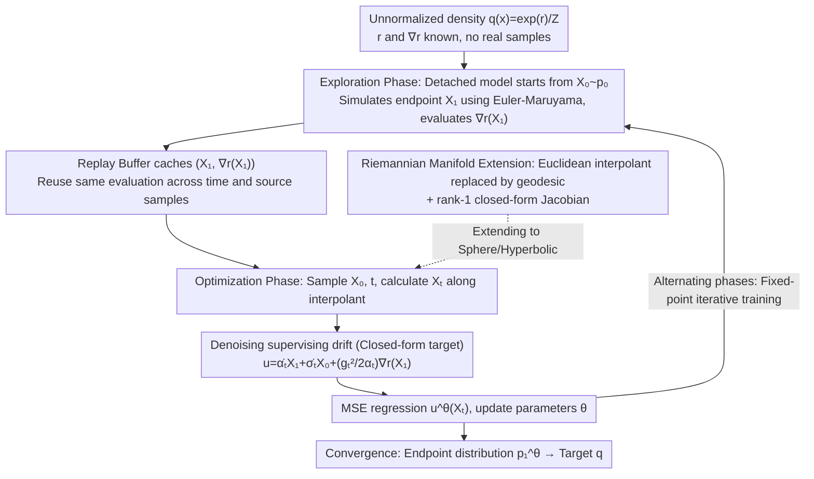

# Flow Sampling: Learning to Sample from Unnormalized Densities via Denoising Conditional Processes

**Conference**: ICML 2026 Spotlight  
**arXiv**: [2605.03984](https://arxiv.org/abs/2605.03984)  
**Code**: Not disclosed  
**Area**: Diffusion Models / Sampling / Molecular Conformation Generation  
**Keywords**: Diffusion Sampling, Flow Matching, Amortized Sampling, Riemannian Manifolds, Molecular Conformation

## TL;DR
This paper proposes Flow Sampling, which inverts the flow matching/diffusion model paradigm from "data-driven" to "noise-driven"—constructing a denoising diffusion drift conditioned on source noise samples. By using a detached model to sample $X_1$ on the interpolant and utilizing the energy gradient of $X_1$ as the regression target, it learns an efficient diffusion sampler under data-free conditions and naturally extends to constant-curvature Riemannian manifolds.

## Background & Motivation

**Background**: Many scientific computing problems (molecular dynamics, materials, chemical reaction paths) require sampling from unnormalized densities $q(x)=\exp(r(x))/Z$, where $r(x)$ and $\nabla r(x)$ are known but samples are unavailable. MCMC/Langevin are asymptotically correct but generate samples sequentially and suffer from slow mixing; recently emerged diffusion samplers are divided into two categories: (a) methods like iDEM/PIS/DDS that learn sampling dynamics through Monte Carlo corrections (importance sampling, resampling); (b) SOC/Schrödinger bridge routes (Adjoint Sampling, ASBS) that learn diffusion dynamics by optimizing path measure divergence.

**Limitations of Prior Work**: (a) Category methods require multiple energy evaluations per step to control variance, which is computationally expensive; (b) Category methods need to characterize optimal control or bridges, leading to complex training pipelines often requiring auxiliary networks. Furthermore, both categories default to Euclidean space, requiring significant redesign to extend to manifolds (spheres, hyperboloids).

**Key Challenge**: The training objectives of standard FM/diffusion models involve "constructing a noising process given a data point $x_1$, and letting the model regress to the velocity field of this process"; however, this approach fails without $x_1$—target information can only be introduced indirectly into training via the score $\nabla r$.

**Goal**: To find a "dual perspective"—constructing a denoising process given a noise point $x_0$ such that the marginals still match the target distribution; and designing an efficient training loop that reuses energy gradients to maximize NFE reduction.

**Key Insight**: The authors invert the conditioning direction of FM—FM is a push-forward of source ($p_{t|1}(x|x_1)=\tfrac{1}{\sigma_t^d}p_0(\tfrac{x-\alpha_t x_1}{\sigma_t})$, conditioned at $t=1$); Ours is a push-forward of target ($p_{t|0}(x|x_0)=\tfrac{1}{\alpha_t^d}q(\tfrac{x-\sigma_t x_0}{\alpha_t})$, conditioned at $t=0$). Both share the same marginal ($p_t$), but the former requires data samples, while the latter only requires noise samples—precisely what is required for the data-free setting.

**Core Idea**: Construct a "denoising diffusion process" conditioned on $X_0\sim p_0$. The supervising drift along the interpolant $X_t=\sigma_t X_0+\alpha_t X_1$ can be written in closed form as $u_{t|0}(X_t|X_0)=\dot\alpha_t X_1+\dot\sigma_t X_0+\tfrac{g_t^2}{2\alpha_t}\nabla r(X_1)$; sample $X_1^{\bar\theta}$ using the current detached model and cache $\nabla r(X_1^{\bar\theta})$ in a replay buffer for repeated use.

## Method

### Overall Architecture
Flow Sampling addresses the problem of training an efficient diffusion sampler when no real samples are available, and only the unnormalized density $q(x)=\exp(r(x))/Z$ and its gradient $\nabla r$ are known. It converts the problem into a self-bootstrapped regression task: first, use the current model to generate a batch of samples approximating $q$ starting from noise and cache their energy gradients; then, use these cached samples as supervision to let the model regress to a closed-form denoising drift. These two stages alternate until the model's terminal distribution converges to the target $q$.

### Key Designs

**1. Denoising supervising drift under noise conditioning: Enabling FM regression for data-free settings**

Standard Flow Matching objectives involve "constructing a noising path given data point $X_1$, and letting the model regress to the velocity field of this path," which breaks down when $X_1\sim q$ is unavailable. This paper completely inverts the conditioning direction: instead of conditioning on the data end $X_1$, it conditions on the noise end $X_0\sim p_0$, defining a push-forward of target conditional probability path $p_{t|0}(x|x_0)=\tfrac{1}{\alpha_t^d}q(\tfrac{x-\sigma_t x_0}{\alpha_t})$. This shares the same marginal ($p_t$) as FM but can be constructed using only noise samples. Along the interpolant $X_t=\sigma_t X_0+\alpha_t X_1$, Proposition 3.2 simplifies the conditional drift $u_{t|0}=v_{t|0}+\tfrac{g_t^2}{2}\nabla\log p_{t|0}$ into the closed form $u_{t|0}(X_t|x_0)=\dot\alpha_t X_1+\dot\sigma_t x_0+\tfrac{g_t^2}{2\alpha_t}\nabla r(X_1)$, which the model regresses to via MSE. The most effective aspect of this form is that $\nabla r(X_1)$ is the only term related to the target distribution, and it depends only on the endpoint $X_1$. Thus, evaluating $\nabla r$ **once** for each $X_1$ allows it to be reused across all $t\in[0,1]$ and any source sample $X_0$—since energy evaluation is the most expensive cost in scenarios like molecular dynamics, amortizing it over the time axis and source space is the core of the method's efficiency.

**2. Fixed-point iterative training of the detached model: Using self-generated endpoints to replace missing $X_1\sim q$**

The closed-form drift still requires $X_1\sim q$, which is missing in the data-free setting. This paper adopts a bootstrapping approach: replacing $X_1$ with endpoint samples $X_1^{\bar\theta}\sim p_1^{\bar\theta}$ generated by the current model (detached, no gradient backpropagation). It simulates from $X_0\sim\mathcal{N}(0,I)$ to $X_1^{\bar\theta}$ using Euler-Maruyama $X_{t+h}^{\bar\theta}=X_t^{\bar\theta}+h\,u_t^{\bar\theta}(X_t^{\bar\theta})+\sqrt{2\gamma th}\,Z_t$ and pushes the pair $(X_1^{\bar\theta},\nabla r(X_1^{\bar\theta}))$ into a replay buffer. In the optimization phase, it samples from the buffer, $X_0$, and $t\sim\text{Unif}[0,1]$, calculates the drift target according to the interpolant, and minimizes $\mathcal{L}_{FS}=\mathbb{E}\|u^\theta(X_t)-u_{t|0}(X_t|X_0)\|^2$. This is a fixed-point iteration: the theoretical optimal solution satisfies $p_1^\theta=q$, meaning the generated endpoint distribution matches the target distribution. The detachment prevents divergence in the self-referential loop, while the replay buffer stabilizes training by reusing historical samples and cached gradients even when samples are scarce.

**3. Constant-curvature Riemannian manifold extension: Pushing drift to Spherical/Hyperbolic space at near-zero extra cost**

Existing diffusion samplers almost all default to Euclidean space; applying them to directional data, robot poses, or graph embeddings that naturally reside on spherical or hyperbolic spaces would require rewriting the entire pipeline. This paper replaces the Euclidean interpolant with a geodesic interpolant $X_t=\exp_{X_1}[(1-t)\log_{X_1}(x_0)]$ and replaces Euclidean Brownian motion with $P_{X_t}^\perp\circ dB_t$ projected onto the tangent space, ensuring the diffusion stays on the manifold. The key lies in Proposition 4.1: it proves the geodesic Jacobian has a rank-1 closed-form $J_t=t\,T_{X_1\to X_t}P_{\dot X_1}+c_t\,T_{X_1\to X_t}P_{\dot X_1}^\perp$, where $c_t=\sin(t\omega_1\sqrt\kappa)/\sin(\omega_1\sqrt\kappa)$ for ($\kappa>0$) or the $\sinh$ version for ($\kappa<0$). With this closed-form Jacobian, the conditional score and drift can be calculated directly, bypassing numerical backpropagation. Consequently, extending from Euclidean to constant-curvature manifolds adds almost no cost—this is one of the most pioneering contributions of the work.

### Loss & Training
Linear scheduler $\alpha_t=t,\sigma_t=1-t,g_t^2=2\gamma t$; $\gamma$ is adaptively set as $\gamma=c/\sqrt{\mathbb{E}_{x_1\sim\mathcal{B}}[\|\nabla r(x_1)\|^2]+\varepsilon}$ to suppress scale fluctuations in energy gradients. Replay buffer capacity is 10k–60k, with 100–300 gradient updates per round and 128–2048 new samples/round.

## Key Experimental Results

### Main Results
Synthetic energy benchmarks (DW-4/LJ-13/LJ-55) + Peptides (Ala2/Ala4) + Large-scale amortized molecular conformation generation (SPICE/GEOM-DRUGS) + Spherical vMF mixtures.

| Dataset | Metric | Flow Sampling | ASBS (Prev. SOTA) | Gain |
|--------|------|------|----------|------|
| DW-4 | $\mathcal{W}_2$ ↓ | **0.36** | 0.43 | -16% |
| DW-4 | $E(\cdot)\mathcal{W}_2$ ↓ | **0.11** | 0.20 | -45% |
| LJ-13 | $E(\cdot)\mathcal{W}_2$ ↓ | **0.97** | 1.99 | -51% |
| LJ-55 | $E(\cdot)\mathcal{W}_2$ ↓ | **21.32** | 28.10 | -24% |
| Ala2 JSD (NFE=1024) | ↓ | **0.018** | 0.242 | -93% |
| Ala2 Energy $\mathcal{W}_2$ (NFE=128) | ↓ | **3.58** | $10^7$ | catastrophic |

### Ablation Study

| NFE (Train) | SPICE Recall Cov | SPICE Recall AMR |
|------|---------|------|
| 256 (Flow Sampling) | **91.89** | **0.86** |
| 128 (Flow Sampling) | 91.39 | 0.87 |
| 64 (Flow Sampling) | 90.13 | 0.87 |
| 256 (AS) | 88.60 | 0.87 |
| 128 (AS) | 77.97 | 0.98 |
| 64 (AS) | 29.13 (Collapse) | 1.43 |
| 512 (ASBS) | 89.66 | 0.86 |

### Key Findings
- Under a low budget of NFE=64, AS completely collapses (Cov 5.50), while Flow Sampling remains stable (Cov 71.14); this indicates that FS’s supervising target has much lower variance than AS’s stochastic adjoint signal, allowing stability at low NFE.
- Training costs can be reduced by 4-8x: On SPICE, performance at NFE=64 is nearly identical to NFE=256, meaning exploration phase costs can be slashed 4-fold.
- The spherical vMF mixture experiment is the first demo of diffusion sampling on curved manifolds, proving Riemannian extension is practical.
- The paper rigorously proves in Appendix D that FS and Adjoint Sampling have the same conditional expectation on Brownian bridge paths (Theorem D.1), meaning they are essentially control-variate equivalents.

## Highlights & Insights
- **The reframe of "inverting the conditioning direction" is the soul of this paper**: Data-driven FM/DM conditions on $X_1$, while data-free Flow Sampling conditions on $X_0$. This seemingly simple symmetry brings massive engineering advantages—FS reuses a single energy evaluation to cover the entire time axis and source space, minimizing expensive energy assessments.
- **The closed-form supervising target $\dot\alpha_t X_1+\dot\sigma_t x_0+\tfrac{g_t^2}{2\alpha_t}\nabla r(X_1)$** has an elegance reminiscent of score matching: minimalist, interpretable, and analyzable. This formula is the technical pivot that fuses "data-free + diffusion + replay buffer."
- **Rank-1 Jacobian on constant-curvature manifolds** (Proposition 4.1) is a mathematically beautiful result that transforms manifold sampling from a concept into an engineering algorithm. The paper provides specific closed forms for hyperspheres and hyperboloids, opening doors for diffusion sampling in directional data and hyperbolic embeddings.

## Limitations & Future Work
- Fixed-point iteration lacks global convergence guarantees, and replay buffer dynamics may be unstable on pathological energy landscapes (strong multimodality, large energy gradients).
- Riemannian generalization is currently restricted to constant curvature; for general curvature manifolds (e.g., non-Euclidean metrics in protein conformation space), numerical Jacobian inversion would be required, significantly slowing efficiency.
- Compared to SOC/Schrödinger bridge methods, FS does not guarantee optimal control, which might result in less efficient generation paths for some tasks.
- Experiments focused on molecules/spheres, lacking coverage of popular RL scenarios like image reward model fine-tuning.

## Related Work & Insights
- **vs iDEM**: iDEM estimates target scores via MC along a noising path, requiring multiple energy evaluations per step; FS requires only one energy evaluation on the denoising path and reuses it, drastically lowering NFE.
- **vs Adjoint Sampling (AS) / ASBS**: AS uses the stochastic adjoint method to backpropagate SOC gradients; ASBS adds a Schrödinger bridge corrector. FS requires no corrector and regresses directly on a closed-form target, simplifying training logic. Theorem D.1 proves they are essentially equivalent (up to a control variate).
- **vs Tilt Matching (concurrent)**: TM also follows a data-free reward-tilted approach but uses an annealed path; FS fixes a linear scheduler, offering superior simplicity.
- **Inspiration**: FS's "inverse conditioning" idea can be generalized to any scenario where "one condition is known but another must be constructed," such as inverse problems (constructing a prior sampler given observations) or retrosynthesis (predicting reactants given products).

## Rating
- Novelty: ⭐⭐⭐⭐⭐ Dual inversion from data-driven to noise-driven + closed-form drift for constant-curvature manifolds represent genuine conceptual innovation.
- Experimental Thoroughness: ⭐⭐⭐⭐ Wide coverage across DW-4/LJ-13/LJ-55 + Ala2/Ala4 + SPICE/GEOM-DRUGS + Spherical vMF; however, experiments on image/text reward fine-tuning are missing.
- Writing Quality: ⭐⭐⭐⭐⭐ Figure 2’s "conditional direction duality" diagram is highly intuitive; Algorithm 1 provides reproducible pseudocode; Proposition 3.2 is presented with concise power.
- Value: ⭐⭐⭐⭐⭐ Reducing training costs by 4-8x in molecular conformation generation + implementing manifold diffusion sampling for the first time provides immediate value to computational chemistry and directional data fields.

<!-- RELATED:START -->

## Related Papers

- [\[ICML 2026\] Temporal Score Rescaling for Temperature Sampling in Diffusion and Flow Models](temporal_score_rescaling_for_temperature_sampling_in_diffusion_and_flow_models.md)
- [\[ICML 2026\] Transformed Latent Variable Multi-Output Gaussian Processes](transformed_latent_variable_multi-output_gaussian_processes.md)
- [\[ICLR 2026\] Meta-Learning Theory-Informed Inductive Biases using Deep Kernel Gaussian Processes](../../ICLR2026/computational_biology/meta-learning_theory-informed_inductive_biases_using_deep_kernel_gaussian_proces.md)
- [\[ICML 2026\] CoSiNE: Conditional Site-Independent Neural Evolution Model for Antibody Sequences](conditionally_site-independent_neural_evolution_of_antibody_sequences.md)
- [\[ICLR 2026\] Thompson Sampling via Fine-Tuning of LLMs](../../ICLR2026/computational_biology/thompson_sampling_via_fine-tuning_of_llms.md)

<!-- RELATED:END -->
