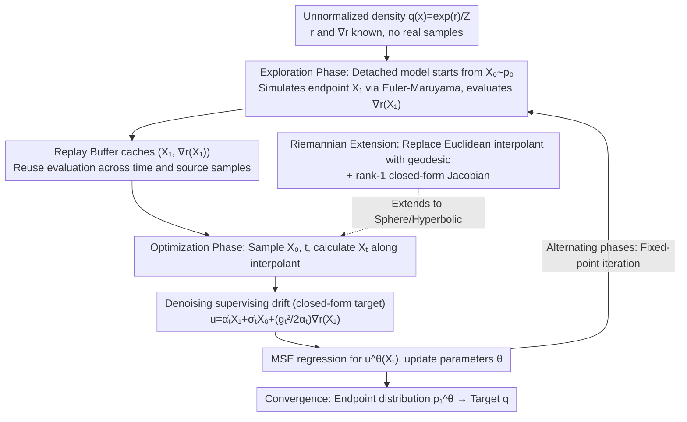

# Flow Sampling: Learning to Sample from Unnormalized Densities via Denoising Conditional Processes

**Conference**: ICML 2026 Spotlight  
**arXiv**: [2605.03984](https://arxiv.org/abs/2605.03984)  
**Code**: Not disclosed  
**Area**: Diffusion Models / Sampling / Molecular Conformation Generation  
**Keywords**: Diffusion Sampling, Flow Matching, Amortized Sampling, Riemannian Manifold, Molecular Conformation

## TL;DR
This paper proposes Flow Sampling, which inverts Flow Matching/Diffusion Models from being "data-driven" to "noise-driven"—by conditioning on source noise samples to construct a denoising diffusion drift. It uses a detached model to sample $X_1$ and its energy gradient as a regression target on an interpolant, learning an efficient data-free diffusion sampler that naturally extends to constant-curvature Riemannian manifolds.

## Background & Motivation

**Background**: Many scientific computing problems (molecular dynamics, materials, chemical reaction paths) require sampling from an unnormalized density $q(x)=\exp(r(x))/Z$, where $r(x)$ and $\nabla r(x)$ are known but samples are unavailable. MCMC/Langevin are asymptotically correct but sequential and slow-mixing; recently emerged diffusion samplers fall into two categories: (a) those learning sampling dynamics via Monte Carlo correction (iDEM/PIS/DDS) such as importance sampling and resampling; (b) those learning diffusion dynamics via optimizing path measure divergence (SOC/Schrödinger bridge routes like Adjoint Sampling and ASBS).

**Limitations of Prior Work**: (a) methods require multiple energy evaluations per step to control variance, which is computationally expensive; (b) methods need to characterize optimal control or bridges, involving complex training pipelines often requiring auxiliary networks. Furthermore, both categories default to Euclidean space, requiring complete redesigns for manifolds (spheres, hyperboloids).

**Key Challenge**: The training objective of standard FM/diffusion models is to "conditionally construct a noising process given a data point $x_1$, and have the model regress to the velocity field of this process." This path is blocked when $x_1$ is unavailable—one must indirectly introduce target information via the score $\nabla r$ during training.

**Goal**: To find a "dual perspective"—constructing a denoising process conditioned on a noise point $x_0$ such that the marginal still matches the target distribution—and design a training loop that efficiently reuses energy gradients to minimize NFE.

**Key Insight**: The authors reverse the conditional direction of FM—where FM is a push-forward of source ($p_{t|1}(x|x_1)=\tfrac{1}{\sigma_t^d}p_0(\tfrac{x-\alpha_t x_1}{\sigma_t})$, conditioned at $t=1$), this work is a push-forward of target ($p_{t|0}(x|x_0)=\tfrac{1}{\alpha_t^d}q(\tfrac{x-\sigma_t x_0}{\alpha_t})$, conditioned at $t=0$). Both share the same marginal ($p_t$), but the former requires data samples while the latter only requires noise samples—exactly what is needed for the data-free setting.

**Core Idea**: Construct a "denoising diffusion process" conditioned on $X_0\sim p_0$. The supervising drift along the interpolant $X_t=\sigma_t X_0+\alpha_t X_1$ can be written in closed-form as $u_{t|0}(X_t|X_0)=\dot\alpha_t X_1+\dot\sigma_t X_0+\tfrac{g_t^2}{2\alpha_t}\nabla r(X_1)$. A detached current model samples $X_1^{\bar\theta}$, and the resulting $\nabla r(X_1^{\bar\theta})$ is cached in a replay buffer for repeated use.

## Method

### Overall Architecture
Flow Sampling solves the problem of training an efficient diffusion sampler when no real samples exist and only the unnormalized density $q(x)=\exp(r(x))/Z$ and its gradient $\nabla r$ are known. It converts the problem into a self-bootstrapped regression task: first, the current model generates a batch of samples approximating $q$ starting from noise and caches their energy gradients; then, using these cached samples as supervision, the model regresses a closed-form denoising drift. These two stages alternate iteratively until the model's endpoint distribution converges to the target $q$.

### Key Designs

**1. Denoising supervising drift under noise conditioning: Enabling FM regression for data-free settings**

Standard Flow Matching aims to "conditionally construct a noising path given a data point $X_1$ and regress the velocity field." Without $X_1\sim q$, this fail. This paper reverses the conditioning: instead of conditioning on the data endpoint $X_1$, it conditions on the noise endpoint $X_0\sim p_0$, defining a push-forward of target conditional probability path $p_{t|0}(x|x_0)=\tfrac{1}{\alpha_t^d}q(\tfrac{x-\sigma_t x_0}{\alpha_t})$. This shares marginals with FM but only requires noise samples. Along the interpolant $X_t=\sigma_t X_0+\alpha_t X_1$, Proposition 3.2 derives the conditional drift $u_{t|0}=v_{t|0}+\tfrac{g_t^2}{2}\nabla\log p_{t|0}$ into a closed-form $u_{t|0}(X_t|x_0)=\dot\alpha_t X_1+\dot\sigma_t x_0+\tfrac{g_t^2}{2\alpha_t}\nabla r(X_1)$, which the model regresses via MSE. The efficiency lies in the fact that $\nabla r(X_1)$ is the only target-dependent term and only relies on the endpoint $X_1$; evaluating $\nabla r$ **once** per $X_1$ allows reuse across all $t\in[0,1]$ and any source $X_0$—amortizing the expensive energy evaluations typical in molecular dynamics.

**2. Fixed-point iteration with a detached model: Filling the gap for missing $X_1\sim q$**

The closed-form drift still requires $X_1\sim q$, which is missing. The paper uses self-bootstrapping: replacing $X_1$ with endpoint samples $X_1^{\bar\theta}\sim p_1^{\bar\theta}$ generated by the current model (detached to prevent gradient backpropagation). It simulates $X_{t+h}^{\bar\theta}=X_t^{\bar\theta}+h\,u_t^{\bar\theta}(X_t^{\bar\theta})+\sqrt{2\gamma th}\,Z_t$ from $X_0\sim\mathcal{N}(0,I)$ to $X_1^{\bar\theta}$ and pushes the pair $(X_1^{\bar\theta},\nabla r(X_1^{\bar\theta}))$ into a replay buffer. The optimization phase samples from the buffer, picks $t\sim\text{Unif}[0,1]$, calculates the drift target via the interpolant, and minimizes $\mathcal{L}_{FS}=\mathbb{E}\|u^\theta(X_t)-u_{t|0}(X_t|X_0)\|^2$. This is a fixed-point iteration: the theoretical optimum satisfies $p_1^\theta=q$. Detaching the gradients prevents divergence in the self-referential loop, while the replay buffer ensures stability even when samples are scarce.

**3. Constant-curvature Riemannian manifold extension: Pushing drift to Spherical/Hyperbolic space at zero extra cost**

Existing diffusion samplers mostly default to Euclidean space, requiring total pipeline rewrites for directional data or robotic poses. This paper replaces the Euclidean interpolant with a geodesic interpolant $X_t=\exp_{X_1}[(1-t)\log_{X_1}(x_0)]$ and Euclidean Brownian motion with projected motion $P_{X_t}^\perp\circ dB_t$. The breakthrough is Proposition 4.1: it proves the geodesic Jacobian has a rank-1 closed-form $J_t=t\,T_{X_1\to X_t}P_{\dot X_1}+c_t\,T_{X_1\to X_t}P_{\dot X_1}^\perp$, where $c_t=\sin(t\omega_1\sqrt\kappa)/\sin(\omega_1\sqrt\kappa)$ for $\kappa>0$ (or $\sinh$ for $\kappa<0$). This closed-form Jacobian allows direct calculation of conditional scores and drifts without numerical differentiation, making the extension from Euclidean to constant-curvature manifolds nearly cost-free.

### Loss & Training
Uses a linear scheduler $\alpha_t=t,\sigma_t=1-t,g_t^2=2\gamma t$; $\gamma$ is adaptively set as $\gamma=c/\sqrt{\mathbb{E}_{x_1\sim\mathcal{B}}[\|\nabla r(x_1)\|^2]+\varepsilon}$ to suppress fluctuations in energy gradient scales. Replay buffer capacity is 10k–60k, with 100–300 gradient updates per round and 128–2048 new samples added per round.

## Key Experimental Results

### Main Results
Substrates include synthetic energy benchmarks (DW-4/LJ-13/LJ-55), peptides (Ala2/Ala4), large-scale amortized molecular conformation generation (SPICE/GEOM-DRUGS), and spherical vMF mixtures.

| Dataset | Metric | Flow Sampling | ASBS (Prev. SOTA) | Gain |
|--------|------|------|----------|------|
| DW-4 | $\mathcal{W}_2$ ↓ | **0.36** | 0.43 | -16% |
| DW-4 | $E(\cdot)\mathcal{W}_2$ ↓ | **0.11** | 0.20 | -45% |
| LJ-13 | $E(\cdot)\mathcal{W}_2$ ↓ | **0.97** | 1.99 | -51% |
| LJ-55 | $E(\cdot)\mathcal{W}_2$ ↓ | **21.32** | 28.10 | -24% |
| Ala2 JSD (NFE=1024) | ↓ | **0.018** | 0.242 | -93% |
| Ala2 Energy $\mathcal{W}_2$ (NFE=128) | ↓ | **3.58** | $10^7$ | catastrophic |

### Ablation Study

| NFE (Train) | SPICE Recall Cov | SPICE Recall AMR |
|------|---------|------|
| 256 (Flow Sampling) | **91.89** | **0.86** |
| 128 (Flow Sampling) | 91.39 | 0.87 |
| 64 (Flow Sampling) | 90.13 | 0.87 |
| 256 (AS) | 88.60 | 0.87 |
| 128 (AS) | 77.97 | 0.98 |
| 64 (AS) | 29.13 (Collapse) | 1.43 |
| 512 (ASBS) | 89.66 | 0.86 |

### Key Findings
- Under a low budget of NFE=64, AS collapses (Cov 5.50), whereas Flow Sampling remains stable (Cov 71.14), demonstrating that FS's supervising target has much lower variance than AS's stochastic adjoint signal.
- Training costs can be reduced by 4-8x: performance on SPICE with NFE=64 is nearly identical to NFE=256, allowing the exploration phase cost to be cut drastically.
- The spherical vMF mixture experiment is the first demo of diffusion sampling on curved manifolds, proving the Riemannian extension is practical.
- Appendix D provides a rigorous proof that FS and Adjoint Sampling share the same conditional expectation on Brownian bridge paths (Theorem D.1), meaning they are essentially control-variate equivalents.

## Highlights & Insights
- **"Reversing the conditional direction" is the soul of this paper**: Data-driven FM/DM conditions on $X_1$, while data-free Flow Sampling conditions on $X_0$. This simple symmetry creates a huge engineering advantage—FS reuses a single energy gradient across the entire time axis and source space, minimizing expensive evaluations.
- **The closed-form supervising target $\dot\alpha_t X_1+\dot\sigma_t x_0+\tfrac{g_t^2}{2\alpha_t}\nabla r(X_1)$** is as elegant as score matching: simple, interpretable, and analyzable. It is the technical nexus integrating data-free learning, diffusion, and replay buffers.
- **The rank-1 Jacobian on constant-curvature manifolds** (Proposition 4.1) is a beautiful mathematical result that turns manifold sampling from a concept into an industrializable algorithm. It opens the door for diffusion sampling on directional data and hyperbolic embeddings.

## Limitations & Future Work
- Fixed-point iteration lacks global convergence guarantees, and replay buffer dynamics might become unstable on pathological energy landscapes (highly multi-modal or extreme gradients).
- Riemannian generalization is currently restricted to constant curvature; general manifolds (e.g., protein conformation space with non-Euclidean metrics) would require numerical Jacobian inversion, significantly reducing efficiency.
- Unlike SOC/Schrödinger bridge methods, FS does not guarantee optimal control, meaning generated paths might not be the most efficient in certain tasks.
- Experiments focus on molecules and spheres, excluding popular RL scenarios like image reward model fine-tuning.

## Related Work & Insights
- **vs iDEM**: iDEM estimates target scores via MC along a noising path, requiring multiple energy evaluations per step; FS requires only one evaluation per denoising path and reuses it, drastically lowering NFE.
- **vs Adjoint Sampling (AS) / ASBS**: AS uses stochastic adjoint methods to backpropagate SOC gradients; ASBS adds a Schrödinger bridge corrector. FS avoids correctors by regressing directly on a closed-form target, simplifying the training logic. Theorem D.1 proves they are fundamentally equivalent.
- **vs Tilt Matching (concurrent)**: TM also follows a data-free reward-tilted approach but uses an annealing path; FS's fixed linear scheduler is even simpler.
- **Insight**: The "reversing conditional direction" logic in FS can be generalized to any scenario where one condition is known but another must be constructed, such as inverse problems (known observation, construct prior sampling) or retrosynthesis.

## Rating
- Novelty: ⭐⭐⭐⭐⭐ Dual inversion (data-driven to noise-driven) + closed-form Riemannian drift is a true conceptual innovation.
- Experimental Thoroughness: ⭐⭐⭐⭐ Broad coverage of molecular and synthetic tasks, though missing image/text reward fine-tuning.
- Writing Quality: ⭐⭐⭐⭐⭐ Direct and intuitive; Algorithm 1 is reproducible; Proposition 3.2 is presented with power and simplicity.
- Value: ⭐⭐⭐⭐⭐ Cutting training costs by 4-8x in molecular generation + first implementation of manifold diffusion sampling has high application value for computational chemistry.

<!-- RELATED:START -->

## Related Papers

- [\[ICML 2026\] Temporal Score Rescaling for Temperature Sampling in Diffusion and Flow Models](temporal_score_rescaling_for_temperature_sampling_in_diffusion_and_flow_models.md)
- [\[CVPR 2026\] Coordinate Denoising for Non-Equilibrium Molecular Representation Learning](../../CVPR2026/computational_biology/coordinate_denoising_for_non-equilibrium_molecular_representation_learning.md)
- [\[ICML 2026\] Transformed Latent Variable Multi-Output Gaussian Processes](transformed_latent_variable_multi-output_gaussian_processes.md)
- [\[ICLR 2026\] Thompson Sampling via Fine-Tuning of LLMs](../../ICLR2026/computational_biology/thompson_sampling_via_fine-tuning_of_llms.md)
- [\[ICML 2026\] EvoEGF-Mol: Evolving Exponential Geodesic Flow for Structure-based Drug Design](evoegf-mol_evolving_exponential_geodesic_flow_for_structure-based_drug_design.md)

<!-- RELATED:END -->
