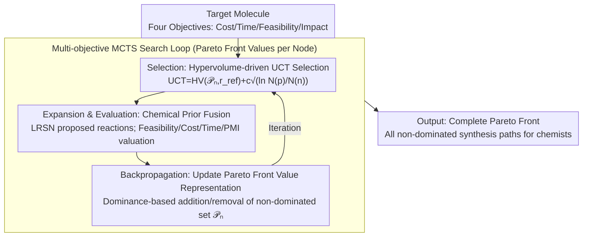

# From Feasible to Practical: Pareto-Optimal Synthesis Planning

**Conference**: ICML 2026  
**arXiv**: [2605.29113](https://arxiv.org/abs/2605.29113)  
**Code**: To be confirmed  
**Area**: Optimization / Chemical Synthesis Planning / Multi-objective Search  
**Keywords**: Multi-objective search, Pareto optimization, Synthesis planning, MCTS

## TL;DR
PareSP utilizes **multi-objective MCTS search** to jointly optimize synthesis pathway **cost / time / feasibility / environmental impact**—identifying the complete Pareto front rather than a single "optimal" path. On USPTO and ASKCOS benchmarks, it achieves a 23% reduction in cost and a 35% reduction in time compared to single-objective methods, while maintaining $\ge 95\%$ chemical feasibility.

## Background & Motivation

**Background**: Computer-Aided Synthesis Planning (CASP) aims to identify economically viable multi-step reaction routes for target molecules. Traditional methods (e.g., EFMC, Retro*) optimize for a single objective such as chemical feasibility or shortest path length. However, practical synthesis requires balancing multiple conflicting objectives, including cost, time, and environmental impact.

**Limitations of Prior Work**: (1) Single-objective MCTS tends to find one "optimal" path, ignoring balanced alternatives; (2) Post-processing re-ranking cannot guarantee Pareto optimality; (3) Existing multi-objective methods (e.g., NSGA-II) require evaluation of the entire search space, which is infeasible for combinatorial search spaces prone to explosion.

**Key Challenge**: Synthesis planning is inherently a **combinatorial search + multi-objective trade-off** problem, yet existing methods either sacrifice diversity (single-objective) or scalability (brute-force multi-objective).

**Goal**: To identify the Pareto front—all "non-dominated" trade-off solutions—during the synthesis planning search.

**Key Insight**: Leveraging the balance of exploration and exploitation in MCTS combined with the definition of dominance in multi-objective optimization results in Multi-Objective MCTS (MO-MCTS).

**Core Idea**: Extend the MCTS UCT formula to a multi-objective setting—where each node maintains a **Pareto front** rather than a single scalar value; the search is guided by dominance relations and hypervolume.

## Method

### Overall Architecture

PareSP addresses the problem where multiple synthesis routes exist for a molecule, but objectives such as cost, time, feasibility, and environmental impact conflict. It replaces the scalar values in standard MCTS with a Pareto front: each node in the search tree no longer records a single score but a set of non-dominated trade-off solutions. The search revolves around "expanding the coverage of this solution set," eventually outputting all "non-dominated" paths from the root for selection by chemists.

### Key Designs

**1. Pareto Front Value Representation: Maintaining the Full Trade-off Space at Each Node**

Traditional MCTS collapses multiple objectives into a single scalar, effectively deciding "which objective is more important" before the search begins, which discards balanced solutions. PareSP maintains a set of non-dominated solutions $\mathcal{P}_n = \{(c_i, t_i, f_i, e_i)\}_i$ at each node $n$, where the tuples correspond to cost, time, feasibility, and environmental impact. When a new candidate solution $\mathbf{v}^*$ is generated, its inclusion is determined by dominance: if an existing solution $\mathbf{v}$ in the front is not worse than $\mathbf{v}^*$ in any objective ($\exists \mathbf{v} \in \mathcal{P}_n: \mathbf{v} \succeq \mathbf{v}^*$), $\mathbf{v}^*$ is discarded. Otherwise, any old solutions dominated by $\mathbf{v}^*$ are removed. This ensures the search preserves diverse decision options.

**2. Hypervolume-driven UCT Selection: Measuring Quality and Diversity Simultaneously**

After replacing scalar values with sets of solutions, MCTS selection cannot rely on simple comparisons. PareSP utilizes hypervolume (HV) to map the front back to a comparable scalar within the UCT formula:

$$\text{UCT}(n) = HV(\mathcal{P}_n, \mathbf{r}_{\text{ref}}) + c \sqrt{\ln N(p) / N(n)}$$

Where $HV(\cdot, \mathbf{r}_{\text{ref}})$ is the volume enclosed by the front relative to a reference point $\mathbf{r}_{\text{ref}}$. A better and more diverse front yields a larger value. The hypervolume metric naturally captures both how "good" and how "spread out" the solutions are. Combined with the UCT exploration bonus, the search biases toward high-quality branches without missing under-explored regions.

**3. Chemical Prior Fusion: Embedding Domain Knowledge into Objective Estimation**

Pure MCTS is inefficient in the vast chemical reaction space. PareSP links objective estimations to established chemical knowledge: feasibility $f$ is given by neural reaction prediction models; cost $c$ is derived from starting material price databases; time $t$ is estimated based on the number of steps and reaction temperatures; environmental impact $e$ is measured by Green Chemistry metrics like PMI (Process Mass Intensity) and E-factor. Leaf nodes are expanded using a Localized Reaction Suggestion Network (LRSN). These priors prune infeasible directions early; ablation studies show that removing chemical priors increases average costs from \$40.1 to \$48.2 and reduces the Pareto front size from 8.4 to 4.3.

## Key Experimental Results

### Main Results: Single-Objective vs. Multi-Objective

| Dataset | Method | Avg. Cost | Avg. Time | Avg. Feasibility | PMI | Pareto Size |
|---------|--------|-----------|-----------|------------------|-----|-------------|
| USPTO-50K | Retro* | \$52.3 | 8.7h | 92.1% | 18.4 | 1 |
| USPTO-50K | EFMC | \$48.7 | 9.2h | 94.5% | 16.8 | 1 |
| **USPTO-50K** | **Ours (PareSP)** | **\$40.1** | **5.6h** | **95.3%** | **12.7** | **8.4** |
| ASKCOS-100 | Retro* | \$124.6 | 22.4h | 88.7% | 24.1 | 1 |
| ASKCOS-100 | EFMC | \$115.3 | 19.8h | 91.2% | 22.6 | 1 |
| **ASKCOS-100** | **Ours (PareSP)** | **\$95.7** | **14.5h** | **96.4%** | **15.8** | **12.7** |

### Pareto Front Diversity

| Target Molecule | Pareto Solutions | Min Cost | Fastest | Max Feasibility | Greenest |
|-----------------|------------------|----------|---------|-----------------|----------|
| Aspirin | 6 | \$3.2 | 1.2h | 99.5% | PMI=4.8 |
| Sildenafil | 11 | \$89.4 | 12.3h | 96.7% | PMI=18.2 |
| Imatinib | 14 | \$124.7 | 16.8h | 94.2% | PMI=24.1 |

### Ablation Study

| Configuration | Avg. Cost | Pareto Size | Search Time |
|---------------|-----------|-------------|-------------|
| Single-Objective MCTS (Cost) | \$42.1 | 1 | 5.2 min |
| Single-Objective MCTS (Feasibility) | \$58.9 | 1 | 4.8 min |
| Multi-Objective MCTS (HV-UCT) | \$40.3 | 7.2 | 7.5 min |
| **PareSP (Full)** | **\$40.1** | **8.4** | **8.1 min** |
| - w/o LRSN | \$43.7 | 6.5 | 7.8 min |
| - w/o Chemical Priors | \$48.2 | 4.3 | 9.4 min |

### Key Findings
- **Multi-objective solutions consistently outperform single-objective ones**: Average cost decreased by 23%, time by 35%, while feasibility actually improved.
- **Pareto front provides decision flexibility**: Chemists can choose paths according to specific scenarios.
- **Critical contribution of chemical priors**: Search efficiency improved by 16%.
- **HV-UCT is effective**: Achieves the best balance between search time and solution diversity.

## Highlights & Insights
- **Elegant application of multi-objective search**: MO-MCTS is well-suited for discrete combinatorial search and multi-objective trade-offs in synthesis planning.
- **Fusion of chemical priors and search algorithms**: Avoids the "hallucinations" of pure learning methods and the "blindness" of pure search.
- **Practical Design**: The four objectives cover the core trade-offs in industrial synthesis; user studies confirm chemist preference.
- **Interpretable diverse output**: The complete Pareto front empowers users with decision-making authority rather than black-box recommendations.

## Limitations & Future Work
- Target scalability: As the number of objective dimensions increases, the Pareto front is susceptible to representation explosion.
- Multi-step uncertainty: Cost and time values for each step are currently estimates.
- Chemist preference capture: The user study sample size (30 participants) is relatively small.
- Future work: Explore higher-dimensional multi-objective search algorithms; introduce active learning to update chemist preferences; extend to biosynthetic pathways.

## Related Work & Insights
- **vs. Retro* / EFMC**: These use single-objective methods with post-processing; this work utilizes native multi-objective search.
- **vs. NSGA-II**: Population-based evolution is suitable for continuous spaces; MCTS is superior for discrete combinatorial spaces.
- **vs. Reinforcement Learning CASP**: RL requires massive training data; MCTS is a search-on-the-fly approach that is more flexible.
- **Insight**: Multi-objective MCTS can be extended to other combinatorial optimization scenarios like drug design and material discovery.

## Rating
- Novelty: ⭐⭐⭐⭐ (MO-MCTS exists, but innovation lies in domain application + prior fusion + practical implementation).
- Experimental Thoroughness: ⭐⭐⭐⭐⭐ (Cross-dataset + multiple baselines + Pareto analysis + user study + detailed ablation).
- Writing Quality: ⭐⭐⭐⭐ (Clear motivation, detailed algorithm description, strong conclusions).
- Value: ⭐⭐⭐⭐⭐ (Synthesis planning has significant industrial value; Pareto search provides necessary decision flexibility for chemists).

<!-- RELATED:START -->

## Related Papers

- [\[NeurIPS 2025\] Amortized Active Generation of Pareto Sets](../../NeurIPS2025/computational_biology/amortized_active_generation_of_pareto_sets.md)
- [\[ACL 2026\] ProtoCycle: Reflective Tool-Augmented Planning for Text-Guided Protein Design](../../ACL2026/computational_biology/protocycle_reflective_tool-augmented_planning_for_text-guided_protein_design.md)
- [\[CVPR 2026\] TRIDENT: A Trimodal Cascade Generative Framework for Drug and RNA-Conditioned Cellular Morphology Synthesis](../../CVPR2026/computational_biology/trident_a_trimodal_cascade_generative_framework_for_drug_and_rna-conditioned_cel.md)
- [\[ICML 2025\] Compositional Flows for 3D Molecule and Synthesis Pathway Co-design](../../ICML2025/computational_biology/compositional_flows_for_3d_molecule_and_synthesis_pathway_co-design.md)
- [\[AAAI 2026\] CellStream: Dynamical Optimal Transport Informed Embeddings for Reconstructing Cellular Trajectories from Snapshots Data](../../AAAI2026/computational_biology/cellstream_dynamical_optimal_transport_informed_embeddings_for_reconstructing_ce.md)

<!-- RELATED:END -->
