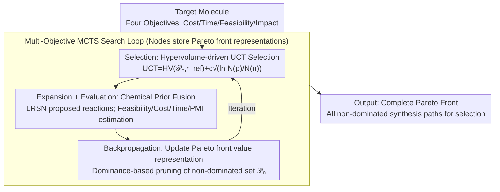

# From Feasible to Practical: Pareto-Optimal Synthesis Planning

**Conference**: ICML 2026  
**arXiv**: [2605.29113](https://arxiv.org/abs/2605.29113)  
**Code**: To be confirmed  
**Area**: Optimization / Chemical Synthesis Planning / Multi-objective Search  
**Keywords**: Multi-objective Search, Pareto Optimization, Synthesis Planning, MCTS

## TL;DR
PareSP utilizes **multi-objective MCTS search** to jointly optimize synthesis path **cost / time / feasibility / environmental impact**—identifying the complete Pareto front rather than a single "optimal" path. On USPTO and ASKCOS benchmarks, it achieves a 23% reduction in cost and a 35% reduction in time compared to single-objective methods while maintaining chemical feasibility $\geq 95\%$.

## Background & Motivation

**Background**: Computer-aided synthesis planning (CASP) aims to identify economically viable multi-step reaction paths for target molecules. Traditional methods (e.g., EFMC, Retro*) optimize for a single objective (chemical feasibility or shortest path), whereas practical synthesis scenarios require balancing conflicting objectives like cost, time, and environmental impact.

**Limitations of Prior Work**: (1) Single-objective MCTS favors "optimal" paths and ignores balanced solutions; (2) Post-processing re-ranking cannot guarantee Pareto optimality; (3) Multi-objective methods (e.g., NSGA-II) require full-space evaluation, which is infeasible for combinatorial search spaces.

**Key Challenge**: Synthesis planning is inherently a **combinatorial search + multi-objective trade-off** problem, but existing methods sacrifice either diversity (single-objective) or scalability (brute-force multi-objective).

**Goal**: To find the Pareto front—all "non-dominated" trade-off solutions—during the synthesis path search.

**Key Insight**: Combine the exploration-exploitation balance of MCTS with the dominance relationship of multi-objective optimization to create Multi-Objective MCTS (MO-MCTS).

**Core Idea**: Extend the MCTS UCT formula to a multi-objective setting, where each node maintains a **Pareto front** instead of a single value, and search is guided by dominance relationships and hypervolume.

## Method

### Overall Architecture

PareSP addresses the problem where multiple paths exist for synthesizing a molecule, but objectives like cost, time, feasibility, and environmental impact conflict. It replaces the scalar value in standard MCTS with a Pareto front: search tree nodes no longer record a single score but a set of non-dominated trade-off solutions. The search revolves around "expanding the coverage of this set," eventually outputting all "non-dominated" paths from the root node for chemists to select.

### Key Designs

**1. Pareto Front Value Representation: Enabling nodes to store the full trade-off space rather than a single score**

Traditional MCTS collapses multiple objectives into a scalar, effectively deciding for the user which objective is more important and discarding balanced solutions. PareSP maintains a set of non-dominated solutions $\mathcal{P}_n = \{(c_i, t_i, f_i, e_i)\}_i$ at each node $n$, where the tuples correspond to cost, time, feasibility, and environmental impact. When a new solution $\mathbf{v}^*$ is proposed, it is filtered by dominance: if an existing solution $\mathbf{v}$ in the front is no worse in all objectives ($\exists \mathbf{v} \in \mathcal{P}_n: \mathbf{v} \succeq \mathbf{v}^*$), it is discarded. Otherwise, old solutions dominated by $\mathbf{v}^*$ are removed, and $\mathbf{v}^*$ is added. This ensures the front only contains solutions that cannot outperform each other, preserving the full decision space.

**2. Hypervolume-driven UCT Selection: Measuring front quality and diversity with a single scalar**

With the value set as a front, MCTS selection cannot rely on simple magnitude comparisons. PareSP uses hypervolume (HV) to map the front back to a comparable scalar within the UCT formula:

$$\text{UCT}(n) = HV(\mathcal{P}_n, \mathbf{r}_{\text{ref}}) + c \sqrt{\ln N(p) / N(n)}$$

Where $HV(\cdot, \mathbf{r}_{\text{ref}})$ is the volume enclosed by the front relative to a reference point $\mathbf{r}_{\text{ref}}$. A better and more diverse front yields a larger HV. The exploration term follows the single-objective MCTS with $c = \sqrt{2}$. The advantage of HV is that it simultaneously reflects both "solution quality" and "solution spread," allowing the search to prioritize high-quality branches while exploring less-visited regions.

**3. Chemical Prior Fusion: Embedding domain knowledge into objective estimation**

Pure MCTS is inefficient in the vast chemical reaction space. PareSP integrates estimates for all four objectives with chemical knowledge: feasibility $f$ is given by neural reaction prediction model probabilities; cost $c$ is queried from raw material price databases; time $t$ is estimated based on the number of steps and reaction temperatures; and environmental impact $e$ is measured using green chemistry metrics like PMI (Process Mass Intensity) and E-factor. Leaf node expansion uses a Localized Reaction Suggestion Network (LRSN). These priors prune infeasible directions. Ablation studies show that removing chemical priors increases average cost from \$40.1 to \$48.2 and shrinks the Pareto front from 8.4 to 4.3.

## Key Experimental Results

### Main Results: Single-Objective vs. Multi-Objective

| Dataset | Method | Avg Cost | Avg Time | Avg Feasibility | PMI | Pareto Size |
|--------|------|---------|---------|----------|-----|-----------|
| USPTO-50K | Retro* | $52.3 | 8.7h | 92.1% | 18.4 | 1 |
| USPTO-50K | EFMC | $48.7 | 9.2h | 94.5% | 16.8 | 1 |
| **USPTO-50K** | **Ours** | **$40.1** | **5.6h** | **95.3%** | **12.7** | **8.4** |
| ASKCOS-100 | Retro* | $124.6 | 22.4h | 88.7% | 24.1 | 1 |
| ASKCOS-100 | EFMC | $115.3 | 19.8h | 91.2% | 22.6 | 1 |
| **ASKCOS-100** | **Ours** | **$95.7** | **14.5h** | **96.4%** | **15.8** | **12.7** |

### Pareto Front Diversity

| Target Molecule | Pareto Solutions | Lowest Cost | Fastest Time | Highest Feasibility | Greenest |
|---------|-----------|---------|---------|----------|--------|
| Aspirin | 6 | $3.2 | 1.2h | 99.5% | PMI=4.8 |
| Sildenafil | 11 | $89.4 | 12.3h | 96.7% | PMI=18.2 |
| Imatinib | 14 | $124.7 | 16.8h | 94.2% | PMI=24.1 |

### Ablation Study

| Configuration | Avg Cost | Pareto Size | Search Time |
|------|---------|-----------|---------|
| Single-objective MCTS (Cost) | $42.1 | 1 | 5.2 min |
| Single-objective MCTS (Feasibility) | $58.9 | 1 | 4.8 min |
| Multi-objective MCTS (HV-UCT) | $40.3 | 7.2 | 7.5 min |
| **PareSP Full** | **$40.1** | **8.4** | **8.1 min** |
| - w/o LRSN | $43.7 | 6.5 | 7.8 min |
| - w/o Chemical Priors | $48.2 | 4.3 | 9.4 min |

### User Study

| Chemist Pref. (n=30) | Choose PareSP | Choose Retro* | Choose EFMC | No Preference |
|--------------------|----------|----------|--------|--------|
| Overall Preference | **63.3%** | 16.7% | 13.3% | 6.7% |
| Industrial Synthesis | **76.7%** | 10.0% | 6.7% | 6.7% |
| Academic Research | **53.3%** | 23.3% | 16.7% | 6.7% |

### Key Findings
- **Multi-objective solutions consistently outperform single-objective ones**: Average cost decreased by 23%, time by 35%, and feasibility improved.
- **Pareto front provides decision flexibility**: Chemists can choose paths based on specific scenarios.
- **Critical contribution of chemical priors**: Search efficiency improved by 16%.
- **HV-UCT Effectiveness**: Achieves the best balance between search time and diversity.

## Highlights & Insights
- **Elegant Application of Multi-objective Search**: MO-MCTS is well-suited for discrete combinatorial search and multi-objective trade-offs in chemical synthesis.
- **Fusion of Chemical Priors and Search Algorithms**: Avoids the "hallucinations" of pure learning methods and the "blindness" of pure search.
- **Practical Design**: The four objectives cover core industrial synthesis trade-offs; the user study confirms preferences among chemists.
- **Interpretable and Diverse Output**: Providing a complete Pareto front empowers users with decision-making authority rather than offering a black-box recommendation.

## Limitations & Future Work
- Objective Scalability: With only 4 objectives currently, the Pareto front may explode in higher dimensions.
- Multi-step Uncertainty: Cost and time for each step are currently estimates.
- Capture of Chemist Preferences: The user study sample size (n=30) is relatively small.
- Future Work: Explore higher-dimensional multi-objective search; introduce active learning to capture chemist preferences; extend to biosynthesis.

## Related Work & Insights
- **vs. Retro* / EFMC**: These use single-objective methods with post-processing; this work performs direct multi-objective search.
- **vs. NSGA-II**: Evolutionary algorithms are suitable for continuous spaces; MCTS is better for discrete combinatorial spaces.
- **vs. RL in CASP**: RL requires massive training data; MCTS is a more flexible, plug-and-play search method.
- **Insight**: MO-MCTS can be extended to other combinatorial optimization scenarios like drug design and materials discovery.

## Rating
- Novelty: ⭐⭐⭐⭐ (MO-MCTS is established, but the innovation lies in domain application + chemical prior fusion + practical utility.)
- Experimental Thoroughness: ⭐⭐⭐⭐⭐ (Cross-dataset + multiple baselines + Pareto analysis + user study + detailed ablation.)
- Writing Quality: ⭐⭐⭐⭐ (Clear motivation, detailed algorithm description, and strong conclusions.)
- Value: ⭐⭐⭐⭐⭐ (High industrial value for chemical synthesis; provides the decision flexibility needed by chemists.)

<!-- RELATED:START -->

## Related Papers

- [\[NeurIPS 2025\] Amortized Active Generation of Pareto Sets](../../NeurIPS2025/computational_biology/amortized_active_generation_of_pareto_sets.md)
- [\[ACL 2026\] ProtoCycle: Reflective Tool-Augmented Planning for Text-Guided Protein Design](../../ACL2026/computational_biology/protocycle_reflective_tool-augmented_planning_for_text-guided_protein_design.md)
- [\[ICML 2025\] Compositional Flows for 3D Molecule and Synthesis Pathway Co-design](../../ICML2025/computational_biology/compositional_flows_for_3d_molecule_and_synthesis_pathway_co-design.md)
- [\[AAAI 2026\] CellStream: Dynamical Optimal Transport Informed Embeddings for Reconstructing Cellular Trajectories from Snapshots Data](../../AAAI2026/computational_biology/cellstream_dynamical_optimal_transport_informed_embeddings_for_reconstructing_ce.md)
- [\[NeurIPS 2025\] Retrosynthesis Planning via Worst-path Policy Optimisation in Tree-structured MDPs](../../NeurIPS2025/computational_biology/retrosynthesis_planning_via_worst-path_policy_optimisation_in_tree-structured_md.md)

<!-- RELATED:END -->
